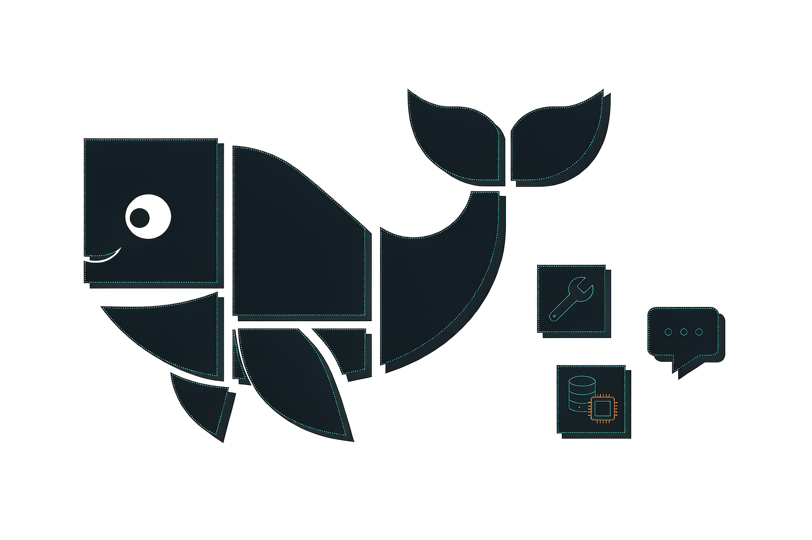
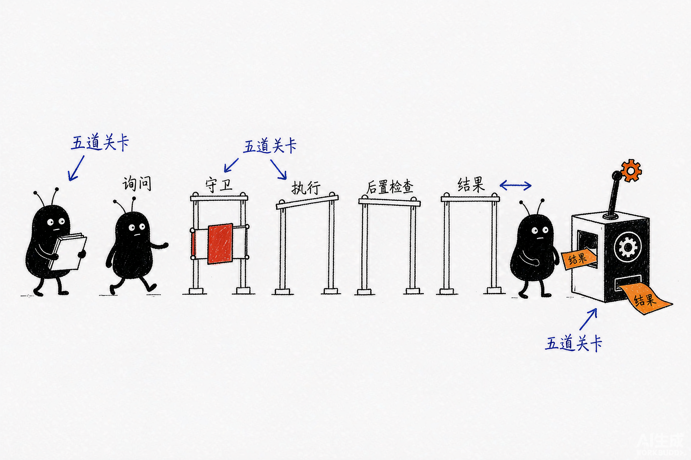
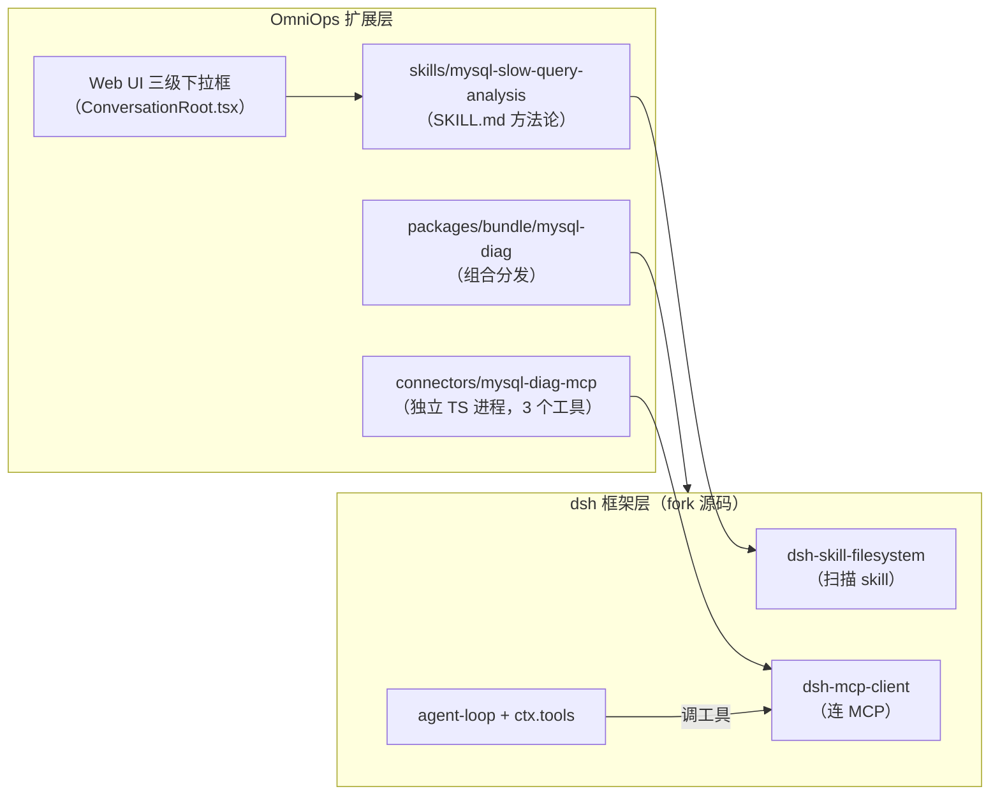
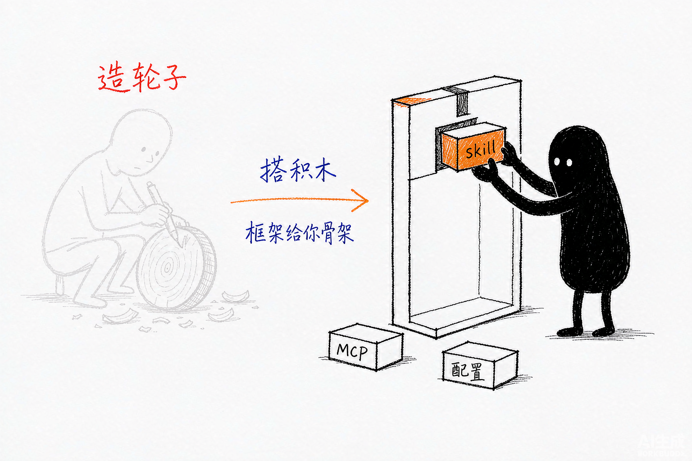

# DeepSeek Harness（dsh）从入门到精通

以 OmniOps 为案例，把「万物皆插件」的 Agent 运行时学透



**创建者**: 标叔（整理自「AI实验室的一角」实战复盘 + OmniOps 开源源码深读）
**为谁创建**: 想真正掌握 dsh 框架、能自己搭 Agent / 运维诊断平台的工程师
**基于**: DeepSeek Harness v0.1-rc（developer preview）、OmniOps（github.com/luxiu666/OmniOps）
**最后更新**: 2026-08-28
**适用场景**: 系统学习 dsh 框架内核、插件开发、skill/MCP 接入、公司级 AIOps 平台实战

> **免责声明**：dsh 处于 developer preview，官方明确后续会有破坏性变更。本书基于公开文章与 OmniOps 仓库源码（含完整 dsh 框架 fork）编写，落地前请以官方文档为准；不构成生产部署建议。

## 阅读指南

2026 年 8 月，DeepSeek 开源了 Harness（dsh）。几天冲到 12 万星。

我一开始以为它是个「套壳 Claude Code」。读完全部源码文档后，我收回这句话。dsh 最值钱的不是模型能力，是一个设计决断：**没有任何特权内核**。模型适配器、工具注册表、会话日志、agent loop 本身，全是插件。想换，拔掉换一个。

这本书不是功能清单，是一本「教学书」。目标只有一个：**你读完能独立复刻 OmniOps**——在 dsh 上搭一套 MySQL 慢查询诊断能力，并把方法论迁移到 Redis 大 Key、GPU 掉卡等任何场景。

dsh 有四种用法（详见 §01.4）：当工具用、当插件平台用、当二次开发平台用、当自进化框架用。本书主线覆盖前三种，重点在第二种——**插件平台**是大多数开发者的主战场，OmniOps 就是这个层次的完整示范。

| 分段 | 章节 | 你获得什么 |
|------|------|------------|
| Part 1 起步 | §01–03 | 跑通 dsh，写出第一个插件 |
| Part 2 框架内核 | §04–08 | 吃透插件树、事件、工具流水线、agent loop、skill 机制 |
| Part 3 OmniOps 实战 | §09–14 | 全源码走读，从 0 复刻 MySQL 慢查询诊断 |
| Part 4 扩展与素养 | §15–18 | 迁移到新场景、插件 vs MCP 对照、Harness 三选一、工程判断 |

读法建议：时间紧就先读 §02、§05、§09–§14（动手主线）；时间够就顺读。每章末尾有「本章小结」。

---

## Part 1: 起步

从零到一。先跑起来，再写第一个插件。

## §01 为什么需要一个「没有内核」的 Agent 框架

### 01.1 时间线锚点

2026 年 8 月 17 日，我第一次 `npx @deepseek-ai/dsh web`。

之前用 Claude Code，感受很矛盾：很强，但「太成品」。想换模型、加工具、改界面，只能等官方发版。我管这叫「精装交付」——装修好了，墙不能动。

### 01.2 「万物皆插件」到底什么意思

dsh 跑在 Cordis 插件系统上。运行时是一棵**插件树**，由启动时按序叠加的层组成。

有人把 Cordis 比作「乐高底板」：模型、工具、Agent Loop 都是积木，`ctx` 是统一接口，Cordis 按依赖装配、随时拆换。它本身不思考，只做三件事：共享能力、按依赖启动、管理装卸与清理。三大 Harness 的选型对比见 §16。

关键在三条设计事实：

1. 没有特权内核。要扩展，就把插件挂到别的插件旁边。
2. 插件向共享 `ctx` 贡献**服务、类型化事件、可逆副作用**。
3. 注册即副作用（Registrations are effects）：插件卸载，它注册的东西自动撤销。

> **标叔的结论**：
>
> | 对比项 | 成品 Agent | dsh |
> |--------|------------|-----|
> | 换模型 | 等官方 | 换一个适配器插件 |
> | 加工具 | 等官方 | 写个插件注册进 ctx.tools |
> | 改循环 | 不可能 | agent-loop 本身是插件 |
> | 心智模型 | 买电器 | 买乐高 |

### 01.3 一个重要的判断

很多人以为「万物皆插件」就是模块化做得好。不是。它的深层含义是**可替换性贯穿到最深处**——连「Agent 怎么思考和行动」这件事本身（agent loop）都能换。

这意味着：dsh 不是给你一个更好的 Agent，是给你一个**能长出任何 Agent 的底盘**。

### 01.4 dsh 的四种用法：对号入座

理解了 dsh 是什么、新在哪儿，下一个问题就是：它该怎么用？dsh 不是只有一种用法。我把常见的四种讲给你，你可以对号入座：

| 用法 | 干什么 | 成本 | 适合谁 |
|------|--------|------|--------|
| **① 当 Agent 工具用** | 直接跑 dsh，用官方预设（preset）组合出一套能用的 Agent，接上自己的模型，让它帮你干活 | 最低 | 「我就想先有个能跑的 Agent」 |
| **② 当插件平台用** | 安装感兴趣的插件，或在扩展点上写自己的插件——加一个工具、接一个模型，装进自己的 cordis.yml / bundle | 中 | **大多数开发者最常用的层次** |
| **③ 当二次开发平台用** | 深度融合自己的业务逻辑进 dsh | 高 | 需要对业务、需求、dsh 能力有全面深入理解的开发者 |
| **④ 当自进化基础框架用** | 利用时空组合特性与 Append-Only 日志等能力，构建能自我改进、持续进化的系统 | 最高 | 最有难度、最有野心的用法 |

这四种用法是**递进关系**，正好对上本书结构：

- 用法① → Part 1（跑起来）
- 用法② → Part 2 + Part 3 前半（插件、skill、MCP 接入——OmniOps 案例正是这个层次的完整示范）
- 用法③ → Part 3 后半 + Part 4（fork 全源码改前端、改组合层，向内核动手）
- 用法④ → 超出本书范围，是「时空组合 + Append-Only 日志」的进阶方向（Append-Only 会话日志的底子见 §07）

> **标叔的结论**：别一上来就奔着第四种去。先用①尝到甜头，用②建立插件心智，用③做过一次真业务（比如复刻 OmniOps），你才配谈④。

### 01.5 本书怎么用 OmniOps

OmniOps 是 dsh 上搭的 AIOps 平台，而且它的仓库 **fork 了整个 dsh 框架源码**（根 package.json 叫 `@deepseek-ai/dsh-root`）。这意味着我们能在同一个仓库里同时看到「框架内核」和「业务扩展」，是绝佳教学案例。

本书 Part 2 讲内核时引用 `packages/`（框架源码），Part 3 讲实战时引用 `connectors/`、`skills/`、`apps/web`（OmniOps 扩展）。

## §02 5 分钟跑通第一个 dsh

### 02.1 一条命令

环境只要 Node.js 22.19+ 或 24+：

```bash
npx @deepseek-ai/dsh web
# 看到 dsh web: http://127.0.0.1:3080 即成功
```

### 02.2 三步才能跑起来

我第一次卡了十分钟，不是因为难，是漏了一步。

**第一步，填模型密钥。** 界面填 DeepSeek API Key。密钥只存脱敏引用，落在 `$DSH_HOME/.credentials.yaml`，不回显明文，改了立即生效不用重启。

**第二步，选工作区（workspace）。** 最容易漏。不选，会话输入框用不了。把启动目录加进去选中——dsh 进程的调用目录就是默认文件系统位置。

**第三步，起会话发任务。** 比如「Summarize this repository and identify its main packages.」

### 02.3 三个常见报错

| 报错 | 原因 | 解决 |
|------|------|------|
| MISSING_CREDENTIAL | 没存 key | 界面填 key |
| UNKNOWN_MODEL | 选了没配置的模型 | 手动填模型名 |
| 模型列表 401 | 接口没提供 | 手动填模型名 |

不绑 DeepSeek 也行：内置 Anthropic、OpenAI 提供商；也能加 OpenAI 兼容端点（公司网关、llama.cpp、ollama），填 Provider ID、base URL、协议、模型。

### 02.4 CLI 还是源码

```bash
# 方式二：从源码构建（后续开发建议这条）
git clone https://github.com/deepseek-ai/deepseek-harness.git
cd deepseek-harness
pnpm install && pnpm run build
pnpm dsh web
```

> **核心建议**：想深学框架，直接 clone OmniOps（含 dsh 全源码），后面所有章节都基于它。

## §03 第一个插件：从 greet 学会「注册即副作用」

### 03.1 最简插件长什么样

插件就是导出 `apply` 函数的 TypeScript 模块。框架加载时调 `apply(ctx)`，你通过 `ctx` 注册能力：

```typescript
// src/my-plugin.ts
import type { Context } from '@deepseek-ai/cordis'
import { defineTool } from '@deepseek-ai/dsh-tools'

export const name = 'greet-tool'
export const inject = ['tools']            // 声明依赖 tools 服务

export function apply(ctx: Context) {
  ctx.tools.register(defineTool({
    name: 'greet',
    description: 'Greet someone by name.',
    parameters: {
      name: { type: 'string', required: true },
    },
    output: {
      schema: { type: 'string' },
      render: (_a, v) => [{ type: 'text', text: v }],
    },
    async execute(args) {
      return `Hello, ${args.name}!`
    },
  }))
}
```

### 03.2 三个关键点

**第一，`inject = ['tools']` 是依赖声明。** 插件声明需要的服务，Cordis 会等这些服务就绪才启动它。加载顺序不靠手动编排，靠服务依赖表达。

**第二，`register()` 返回一个 disposer。** 这就是「注册即副作用」：插件卸载时，注册的工具自动消失。你不用写清理代码。

**第三，`defineTool` 负责校验。** 它收窄参数类型、校验入参、按 `output.schema` 推导返回类型。手写 `ToolDefinition` 不校验，`defineTool` 校验。

### 03.3 挂载与验证

```yaml
# cordis.yml（路径用绝对路径）
- insert:
    - id: hello
      name: '/绝对路径/scratch-plugin/src/my-plugin.ts'
```

```bash
pnpm dsh web --patch ./scratch-plugin/cordis.yml
# 浏览器说：Use the greet tool to greet Ada → Hello, Ada!
```

### 本章小结

- dsh 运行时是插件树；插件 = `apply(ctx)` + 可选 `inject`。
- 依赖用 `inject` 声明，不手动排启动顺序。
- 注册返回 disposer，卸载自动撤销。

下一章进内核：这棵插件树是怎么「叠」出来的。

---

## Part 2: 框架内核（源码深潜）

这一段讲清楚五件事：插件树怎么组装（§04）、事件怎么流动（§05）、工具怎么被执行（§06）、agent 循环怎么转（§07）、skill 怎么被发现与调用（§08）。读完你对 dsh 的理解会超过 90% 的用户。

## §04 插件树的组装：Profile、组合包与 Patch

### 04.1 三个概念

运行中的 dsh 是一棵插件树，由**层**叠出来。三个概念要分清：

| 概念 | 是什么 | 例子 |
|------|--------|------|
| profile | Harness home 里的具名组装 | `web`、`headless` |
| 组合包 | Cordis 配置 + 挂载代码的分发格式 | dsh-base、dsh-web-app |
| patch | 按 id 定位条目替换 config，或插入新条目 | cordis.patch.yml |

`dsh-base` 是每个 profile 的第一层：模型适配器、工具、持久化、沙箱与审批、设置、凭据、遥测。`dsh-web-app` 加浏览器应用；`dsh-headless` 加一次性运行器（无服务器）。

### 04.2 叠层顺序

各层按此顺序应用在空条目列表上：

```text
空列表
  → 按 profile 列出的顺序应用每个组合包
  → profile 的 cordis.patch.yml
  → home 级 cordis patch
  → 任意 --patch overlay
```

一条 patch 按 **id** 定位条目，替换其整个 config；或者用 `insert` 插入新条目。

### 04.3 看你的机器真实启动的树

```bash
dsh --profile web --dump-config
```

它打印的任何条目，都可以被你的 patch 替换。这是排查「插件为什么没生效」的第一命令。

### 04.4 一个致命细节：别编辑 cordis.yml

profile 根下的 `cordis.yml` 每次 boot 都会被框架重写回 `[]`。**所有插件组合都写在 `cordis.patch.yml`**。这是 OmniOps 开发手册里明确警告的坑。

### 本章小结

- 插件树 = 空列表 + 组合包 + 各级 patch 依次叠加。
- patch 按 id 替换 config；insert 插新条目。
- `--dump-config` 是第一排查命令；`cordis.yml` 别碰，写 `cordis.patch.yml`。

## §05 事件系统：dsh 的神经系统

### 05.1 四种分发模式

Cordis 事件有四种分发模式，每种只能用对应方法分发：

| 模式 | await？ | 顺序 | 返回值 | 用途 |
|------|--------|------|--------|------|
| emit | 否 | 按注册顺序观察 | 无 | 通知（tools/result） |
| waterfall | 否 | 按注册顺序 | 有 | 中间件链（tools/pre-execute） |
| parallel | 是 | 并行扇出 | 无 | 多监听者并发 |
| serial | 是 | 按注册顺序 | 有 | 终局检查（agent/turn-stopping） |

分发模式是事件公开约定的一部分——你监听一个 waterfall 事件，就得遵守 waterfall 规则。

### 05.2 waterfall 语义（重点）

`ctx.waterfall` 是环绕中间件。监听器收 `(...args, next)`：

- 调 `next()` → 执行下游监听器，下游返回值经 `next()` 流回来，可包装。
- 不调 `next()` 直接返回 → **短路**。

对单决策事件，短路是设计意图。策略监听器拥有决策权时可以直接返回 deny，不委托。

写一个瀑布中间件长这样——拿到事件、做你想做的改写，最后**一定**把控制权交出去：

```typescript
// 在 agent/request 这段瀑布里注入自定义逻辑
ctx.on('agent/request', async (req, next) => {
  req.messages = injectHint(req.messages)  // 改写请求
  return next()                            // ← 忘了它，整个 agent 就卡住
})
```

> **注意：最常见的坑**。写瀑布中间件时**忘了调用 `next()`**。后果是整个 agent 静悄悄「卡住」不再推进，而且**不报错**——因为链路只是在礼貌地等你。调试半天找不到报错日志，原因往往就是它。

哪些环节是瀑布？`agent/pre-step`、`agent/request`、`llm/stream`、三段 `tools/*`——请求的改写权、工具的放行权都在这些瀑布里。唯一的例外是 `agent/turn-stopping`：它是串行（serial），**没有 next()**，所有监听者按序被通知，但只能旁观与响应，不能改写主链路。

同一份 `ctx.on` 注册，在 §03 讲过是「可逆副作用」——插件卸载时它会被 `dispose()` 精确回收。事件系统与生命周期，在这里闭环。

### 05.3 三个事件域

dsh 里流动着三类语义不同的事件。分清它们，就分清了「什么会被回放、什么转瞬即逝」：

| 事件域 | 特性 | 广播方式 | 角色 |
|--------|------|----------|------|
| 会话事件 | **持久**、写进日志 | 经 `session/event` 广播 | fork / 恢复 / 转写（transcript）的唯一来源 |
| `agent/*` 事件 | **活体**，携带当前 Agent 实例 | 实时分发 | 驱动一个 turn 的推进（inbox、步骤、请求、续跑） |
| 能力事件 | **瞬时**，不进日志 | 贴 seam | `fs/*`、`tools/*`、`telemetry/*`，描述一次能力调用 |

一条铁律统摄全局：**模型可见 ⇒ 必被记录**。`deriveMessages()` 从日志投影出模型历史，`ctx.sessions.fork(source, boundary?)` 从任意边界分叉子会话——全都基于同一份日志。没有第二份「真相」，回放与调试因此是确定的（不变量的完整展开见 §07）。

> **标叔的结论**：选对事件域是大多数改动的第一个决定。判断口诀——要持久用会话事件，要实时用 agent 事件，要贴能力用能力事件。

### 05.4 一秒判断法：这是不是瀑布？

判断一个事件能不能被拦下，只需问一句：**「监听器能不能拦下它？」**

- 能 → 瀑布（waterfall），记得 `next()`，你有改写权。
- 不能 → 串行（serial）或 emit，你只是众多旁观者之一。

这条心智模型，能帮你避开 dsh 插件开发九成的坑。

### 本章小结

- 四种分发模式，waterfall 可短路，serial 是终局检查。
- 会话事件=持久事实；agent 事件=实时协调；能力事件=贴 seam——「什么会被回放、什么转瞬即逝」由此分界。
- 瀑布中间件忘调 `next()` 会静默卡死不报错——插件开发头号坑。
- 一秒判断法：监听器能拦下的是瀑布；不能的是旁观。
- 新增模型可见输入 = 新增会话事件（见 §07 的「模型可见即已记录」）。

## §06 工具子系统：ctx.tools 的完整解剖



### 06.1 ToolDefinition 的九个字段

一个已注册工具由这些部分组成（源码 `packages/core/tools`）：

```typescript
interface ToolDefinition extends ToolSchema {
  readonly output: ToolOutputDefinition   // 必需的规范输出声明
  execute(args, exec): Promise<unknown>   // 执行函数
  finalizeContent?(exec, result)          // 可选：最后一英里的内容变换
  timeoutMs?: number                      // 协作式超时（不发给模型）
  isConcurrencySafe?(args): boolean       // 并行调度分类器（不发给模型）
  presentCall?(args)                      // UI 待执行视图
  presentResult?(args, result)            // UI 完成视图
}
```

两个安全设计值得注意：

1. **`schemas()` 白名单投影**。面向模型的 schema 只含 name/description/parameters——`execute`、`timeoutMs`、`presentCall` 等宿主元数据**绝不会泄漏进模型请求**。
2. **参数不可被改写**。参数已经过日志与展示，改了会破坏历史、审计、UI、执行的一致性。前置策略只能 allow/deny/ask。

### 06.2 执行流水线：五道关卡

`ctx.tools.execute()` 让一次调用依次经过：

```text
tools/pre-execute  →  单调 guard  →  tools/execute  →  tools/post-execute  →  finalizeContent  →  tools/result
（allow/deny/ask）    （最终预分派）   （环绕分派）      （检查/替换结果）      （工具自有变换）     （不可变最终结果）
```

- `tools/pre-execute`（waterfall）：决策 `allow | deny(reason) | ask`。ask 只有审批服务返回 allowed-once 才放行，否则拒绝。
- **ToolGuard（单调策略）**：返回 reason 只能拒绝，没有 allow 结果。所以后注册的监听器**无法把别人拒的调用翻回允许**——权限只减不增。
- `tools/execute`（waterfall）：做超时、重试、指标的环绕层。只能换 signal，不能动调用身份。
- `tools/post-execute`（waterfall）：`accept / 替换内容或值 / block(反馈)`。替换内容保留规范值；替换值重新校验；block 转为带纠正反馈的错误。
- `tools/result`（emit）：冻结的最终结果，观察者无法变换。

### 06.3 失败即结构化错误

未知工具和抛异常的工具都变成结构化错误（`UNKNOWN_TOOL` 等），调用失败但不终止轮次。模型看到错误，自己决定重试还是换路。

### 06.4 并行与独占

agent loop 按注册表的 `executionMode()` 分类待处理调用：`parallel`（可与兄弟调用重叠）加入滚动池，`exclusive`（独占屏障）。默认独占，只有 `isConcurrencySafe` 精确返回 true 才并行——fail-closed 设计。

### 本章小结

- 工具 = schema + 输出契约 + 执行 + 宿主元数据；模型只见白名单字段。
- 执行过五道关卡；guard 单调（权限只减不增）；参数不可改写。
- 并行默认关闭，`isConcurrencySafe===true` 才开——fail-closed。

## §07 Agent Loop 与会话日志：模型可见即已记录

### 07.1 轮次与步骤

一个**步骤**= 一次模型请求 + 它调用的工具。一个**轮次**= 零或多步骤，在领取首条输入前打开、不再欠工作后关闭。

完整轮次流程（摘自官方 architecture 文档）：

```text
turn/start
  claim next-step input + one queued message
  assemble prompt sections + tool schemas
  -> agent/pre-step                reject | enter(messages)
  step/start
  append entered messages as user/message
  derive model history from the log
  agent/request -> llm/stream -> assistant/chunk* -> assistant/message
  tool/call* -> tools/pre-execute -> tools/execute -> tools/post-execute -> tool/result*
  step/end
  tools owe another request, or next-step input arrived -> claim -> next step
-> agent/turn-stopping
turn/end
```

### 07.2 agent/pre-step 决定模型看到什么

监听器可以改写已领取的消息，或直接拒绝。首次领取被拒或被改写为空时，仍会关闭一个不含步骤的持久轮次——日志会记录这次尝试。

### 07.3 模型可见即已记录（最重要的不变量）

**抵达模型请求的一切，都必须能从日志重建。** 有运行时不变量断言这一点。

推论：新增一项模型可见输入，就需要新增一个会话事件（扩展 `SessionEventMap`）。fork、恢复、transcript、遥测都派生自事件流——这就是「模型可见即已记录」。

> **标叔的结论**：这条不变量解释了 OmniOps 的凭据设计（§12）。密码为什么绝不进 tool 入参？因为 tool 入参是模型可见的，而「模型可见即已记录」——密码会进 session log。

### 07.4 inject()：给模型塞上下文的正规通道

`agent.inject()` 把上下文排进下一次获准的请求。注入的上下文留在 inbox，等另一条消息唤醒。

### 本章小结

- 步骤=请求+工具；轮次=领取输入→步骤→不欠工作→关闭。
- agent/pre-step 决定模型所见；拒绝也留持久痕迹。
- 模型可见即已记录——新输入必须配新会话事件。

## §08 Skills：可发现的指令，不是会话事件

### 08.1 skill 是什么

skill 是**可选的指令**（SKILL.md 文件），不是插件、不是会话事件。体系分四个包：

| 角色 | 包 | 职责 |
|------|-----|------|
| Service Definition | dsh-skill（ctx.skills） | 注册表 |
| Service Provider | dsh-skill-filesystem | 扫描目录 |
| 可选徽章 | dsh-skill-badge | 随包 skill |
| Consumer | dsh-tool-skill | 面向模型的 skill 工具 |

### 08.2 本地发现优先级（rank 越小越优先）

| Rank | 来源 | 根目录 |
|------|------|--------|
| 100 | project-dsh | `<projectRoot>/.dsh/skills` |
| 200 | project-agents | `<projectRoot>/.agents/skills` |
| 300 | custom | `Config.customSkillDirs` |
| 400 | user-dsh | `<dshHome>/skills` |
| 500 | user-agents | `<agentsHome>/skills` |
| 600 | bundled | 配置 bundledSkillDir 时 |

项目根 = 含 `.git` 的最近祖先。这就是 OmniOps 把 skills 目录配进 `customSkillDirs`（rank 300）的原因。

### 08.3 渐进式披露：目录 → 调用 → 正文

模型看到的是**两段式**的：

1. **目录**：每个 skill 的 `name` + `description`，经 `<available_skills>` 标签注入 system-reminder。正文、路径、来源都不进目录。
2. **正文**：模型调 `skill({ name })` 工具，返回 `<skill_content>` + 资源引导。

这个设计叫 **progressive disclosure**。几十个 skill 也不会撑爆上下文——平时只占目录那几行，用到才加载正文。

### 08.4 会话目录的智能更新

dsh-tool-skill 在目录 digest 变化时通过 `agent.inject()` 追加完整替换。压缩隐藏了历史目录消息？下一份完整快照重建。视图为空且从未发布？不发任何内容。

### 08.5 调用策略

`SkillInvocationPolicy` 两个独立控制：`modelInvocable`（模型可调）、`userInvocable`（用户可调）。frontmatter 键 `disable-model-invocation`、`user-invocable`，省略默认 true。

### 本章小结

- skill = 文件（SKILL.md）+ 注册表（ctx.skills）+ 目录工具（skill）。
- 六级 rank 发现；项目 > 自定义 > 用户。
- 渐进式披露：目录常驻，正文按需；digest 变化自动替换。

---

## Part 3: OmniOps 实战（全案例拆解）

这一段是全书的高潮。我们以 OmniOps 的 MySQL 慢查询诊断为完整案例，从架构决策讲到每一行源码，走完「设计→开发→接线→验证→扩展」全程。

## §09 案例总览：OmniOps 怎么在 dsh 上搭运维大脑

### 09.1 OmniOps 是什么

公司级 AIOps 智能运维平台，专注**全技术栈问题快速诊断**。底层 dsh（fork 全源码），上层搭运维语义。

核心设计：「**技术栈 → 组件 → 诊断技能**」三级联动。

| 层级 | 含义 | 例子 |
|------|------|------|
| 技术栈 | 大的领域 | 数据库、计算(GPU)、网络、存储 |
| 组件 | 具体中间件 | MySQL、Redis、Kafka、Pod |
| 诊断技能 | 可执行诊断方法 | 慢查询分析、死锁、大 Key、GPU 掉卡 |

### 09.2 它在 dsh 上的三层结构



### 09.3 案例的三个教学价值

1. **一行插件代码都不写**。加能力 = SKILL.md + MCP server + 一段配置。这打破了「扩展=写插件」的直觉。
2. **三种接缝并用**。skill（指令）+ MCP（工具）+ 配置（组合层），是 dsh 能力扩展的标准姿势。
3. **可复制的方法论**。Redis 大 Key、PostgreSQL 死锁、Kafka lag、GPU 掉卡，都是「一个 MCP server + 一个 SKILL.md + 一段配置」的事。

### 本章小结

- OmniOps = dsh 底盘 + 三级联动运维语义。
- 加能力三件套：SKILL.md（方法论）+ MCP server（采集）+ 配置（接入）。
- 前端只是引导层，不改变 agent 行为。

## §10 架构决策：为什么拆成三块而不是一个大插件

### 10.1 先看决策表

OmniOps 的 spec（docs/specs/mysql-slow-query-analysis.md）开篇就是一张已拍板决策表：

| 项 | 决策 |
|----|------|
| MCP server 语言 | TypeScript |
| MVP 工具范围 | 3 个：慢日志→执行计划→表结构 |
| skill | 一起做 |
| bundle 打包 | 暂缓，测试完成后打包 |
| DSN 凭据 | host/port 走对话入参，password 走 env |
| 交互格式 | ip/port + 描述任务 |

### 10.2 三单元职责表（背下来）

| 单元 | 形态 | 职责 | 要写吗 |
|------|------|------|--------|
| 推理方法论 | skill（SKILL.md） | 告诉模型怎么查、按什么步骤、调哪个工具 | ✅ 一个文件 |
| 数据采集 | MCP server（独立进程） | 连 MySQL、调 pt-query-digest、暴露 3 个 tool | ✅ 一个 server |
| 接入层 | dsh-mcp-client + 配置 | 把 MCP 工具注册进 ctx.tools | ❌ 复用现成 |

### 10.3 为什么不写成一个 dsh 插件

写插件意味着：工具逻辑进 dsh 进程、生命周期绑框架、分发走 npm。而 MCP 方式：server 独立进程（跨机器部署）、协议标准（任何 MCP 客户端能连）、可以给多个 agent 框架复用。

> **标叔的结论**：方法论放 skill（改起来秒生效），脏活累活放 MCP（进程隔离），组合放配置（不写代码）。这是「关注点分离」在 Agent 工程里的标准答案。

### 本章小结

- 三单元拆分：方法论/采集/接入各归其位。
- MCP 独立进程带来部署隔离与跨框架复用。
- 决策先拍板写进 spec，再动手——工程纪律。

## §11 源码走读①：mysql-diag-mcp 服务器

### 11.1 目录与依赖

```text
connectors/mysql-diag-mcp/
├── package.json        # bin 两个入口；依赖 MCP SDK + mysql2 + zod
├── tsconfig.json       # ES2022 / NodeNext / strict
├── .env.example        # 六个环境变量模板
└── src/
    ├── index.ts        # HTTP 入口（streamable-http，无状态）
    ├── stdio.ts        # stdio 入口（给 dsh 子进程拉起）
    ├── tools.ts        # 三个工具注册（双入口共用）
    ├── db.ts           # mysql2 连接封装
    └── pt-digest.ts    # pt-query-digest 调用封装
```

依赖三个：`@modelcontextprotocol/sdk`（协议）、`mysql2`（驱动）、`zod`（schema）。注意：**这个子项目不在根 workspaces 里，要单独 pnpm install**。

### 11.2 tools.ts：三个工具

每个工具 = 注册名 + 描述 + zod inputSchema + 执行函数。三个工具各干一件事：

| 工具 | 干什么 | 数据来源 |
|------|--------|----------|
| list_slow_queries | 慢日志聚合报告（Top N） | pt-query-digest（不连库） |
| explain_query | EXPLAIN FORMAT=JSON | mysql2 直连 |
| inspect_schema | 列/索引/数据量 | information_schema |

核心源码（节选，注释照搬原仓库）：

```typescript
// src/tools.ts —— 三个诊断工具，stdio / streamable-http 双入口共用
export function registerTools(server: McpServer): void {
  // 工具 1：慢日志分析（不连库，纯文件分析）
  server.registerTool('list_slow_queries', {
    description:
      '用 pt-query-digest 分析慢日志目录，返回 Top N 慢 SQL 聚合报告（执行次数、响应时间占比、扫描行数等）。',
    inputSchema: {
      slowLogDir: z.string().optional().describe('慢日志目录绝对路径，默认取环境变量 MYSQL_SLOW_LOG_DIR'),
      ptQueryDigest: z.string().optional().describe('pt-query-digest 二进制路径，默认取 PT_QUERY_DIGEST'),
      since: z.string().optional().describe('开始时间 YYYY-MM-DD HH:mm:ss 或相对时间如 24h'),
      until: z.string().optional().describe('结束时间 YYYY-MM-DD HH:mm:ss'),
      limit: z.number().int().optional().describe('Top N 条数，默认 3'),
    },
  }, async ({ slowLogDir, ptQueryDigest, since, until, limit }) => {
    const report = await runPtQueryDigest({ slowLogDir, ptQueryDigest, since, until, limit })
    return { content: [{ type: 'text' as const, text: report }] }
  })

  // 工具 2：执行计划（连库直查）
  server.registerTool('explain_query', {
    description: '对给定 SQL 返回 EXPLAIN FORMAT=JSON 执行计划，用于判断是否走索引、是否全表扫描。',
    inputSchema: {
      connection: connectionSchema,      // 只有 host + port，没有密码！
      database: z.string().optional(),
      sql: z.string().describe('要分析的 SQL 语句'),
    },
  }, async ({ connection, database, sql }) => {
    const db = database ?? process.env.MYSQL_DATABASE  // 缺省取 env
    return withPool({ ...connection, database: db }, async (pool) => {
      const [rows] = await pool.query('EXPLAIN FORMAT=JSON ' + sql)
      return { content: [{ type: 'text', text: JSON.stringify(rows, null, 2) }] }
    })
  })

  // 工具 3：表结构 + 索引（information_schema 三连查）
  server.registerTool('inspect_schema', { /* ... */ }, async ({ connection, database, table }) => {
    // 查 COLUMNS（列定义）、STATISTICS（索引基数）、TABLES（数据量）三张系统表
    // 返回 { columns, indexes, tableInfo } 的 JSON
  })
}
```

### 11.3 db.ts：连接封装的凭据哲学

```typescript
// src/db.ts —— user/password 从 env 读，绝不进参数
export async function withPool<T>(conn, fn): Promise<T> {
  const pool = mysql.createPool({
    host: conn.host,
    port: conn.port ?? 3306,
    user: process.env.MYSQL_USER ?? '',           // ← 凭据来自启动进程的 env
    password: process.env.MYSQL_PASSWORD ?? '',
    database: conn.database ?? process.env.MYSQL_DATABASE,
    waitForConnections: true,
    connectionLimit: 2,        // 诊断工具，2 个连接足够，别占资源
    connectTimeout: 5000,
  })
  try {
    return await fn(pool)
  } finally {
    await pool.end()           // 短生命周期：用完即释放
  }
}
```

三个细节：**凭据走 env 不走参数**；**connectionLimit: 2**（诊断场景够用，不抢业务连接）；**短生命周期池**（用完即 end，不留连接）。

### 11.4 pt-digest.ts：慢日志分析的工程细节

```typescript
// src/pt-digest.ts —— 四步流程，全路径可配置
export async function runPtQueryDigest(input: SlowQueryInput): Promise<string> {
  const bin = input.ptQueryDigest ?? process.env.PT_QUERY_DIGEST ?? DEFAULT_PT_QUERY_DIGEST
  const dir = input.slowLogDir ?? process.env.MYSQL_SLOW_LOG_DIR
  if (!dir) throw new Error('未指定慢日志目录：请通过 slowLogDir 入参或 MYSQL_SLOW_LOG_DIR 环境变量提供')

  // 1) 列目录里的慢日志文件（含轮转 *.log / *slow.log*），按 mtime 降序
  const allFiles = await listSlowLogFiles(dir)

  // 2) 按时间段粗筛：mtime 早于 since 的文件不可能含该时段事件，跳过
  //    （精确过滤交给 pt-query-digest --since/--until）
  let files = allFiles
  if (input.since) { /* ... mtime 过滤 ... */ }

  // 3) 复制到临时工作目录（不在原目录分析，不动原文件）
  const workDir = await copyToWorkDir(files)

  // 4) 跑 pt-query-digest（多文件 + --since/--until 精确过滤）
  const args: string[] = []
  if (input.since) args.push('--since', input.since)
  if (input.until) args.push('--until', input.until)
  args.push('--limit', String(input.limit ?? 3))
  args.push(...files.map((f) => join(workDir, basename(f))))

  const { stdout } = await execFileAsync(bin, args, { timeout: 60_000, maxBuffer: 10 * 1024 * 1024 })
  return stdout
}
```

四个工程细节值得学：**粗筛+精筛两级过滤**（mtime 粗筛省时间，digest 精确过滤）；**复制到临时目录**（不碰生产慢日志原文件）；**60 秒超时**（防外部工具挂死）；**10MB maxBuffer**（大日志不爆内存）。

### 11.5 双入口：index.ts 与 stdio.ts

```typescript
// src/stdio.ts —— 三行，给 dsh 当子进程拉起
const server = new McpServer({ name: 'mysql-diag-mcp', version: '1.0.0' })
registerTools(server)
const transport = new StdioServerTransport()
await server.connect(transport)
```

```typescript
// src/index.ts —— HTTP 入口（无状态 streamable-http）
const server = new McpServer({ name: 'mysql-diag-mcp', version: '1.0.0' })
registerTools(server)                          // 双入口共用同一份工具注册
const PORT = Number(process.env.MCP_HTTP_PORT ?? 8080)

const httpServer = createServer((req, res) => {
  if (req.method === 'GET') { res.writeHead(405).end(/* JSON-RPC error */) ; return }
  // ...POST 转 transport，无状态：sessionIdGenerator: undefined
})
httpServer.listen(PORT, () => console.error(`mysql-diag-mcp 监听 http://127.0.0.1:${PORT}/mcp`))
```

| 入口 | 场景 | 启动者 | 凭据来源 |
|------|------|--------|----------|
| stdio | 本地开发、bundle 一键分发 | dsh 自动 spawn | dsh 进程 env 透传 |
| streamable-http | 独立常驻、跨机器 | 你手动起 | server 进程自己的 env |

**关键区别**：HTTP 方式下 server 是独立常驻进程，dsh 只连 URL，**密码不由 dsh 转发**，由「启动 server 那个进程」的环境提供。「接 MCP」和「起 server」是两个独立动作。

### 本章小结

- 三个工具 = 三步诊断法（找 Top → 看计划 → 看结构），一个文件注册、双入口共用。
- db.ts：凭据走 env、连接池小而短命。
- pt-digest.ts：粗筛+精筛、临时目录、超时+缓冲控制。
- stdio 给 dsh 拉起，HTTP 独立常驻——凭据来源不同。

## §12 源码走读②：SKILL.md 方法论与凭据安全

### 12.1 完整 SKILL.md（原文件只有 34 行）

```markdown
---
name: mysql-slow-query-analysis
description: 用于分析 MySQL 慢查询。当用户要排查慢 SQL、分析执行计划、检查表结构/索引、定位数据库性能瓶颈时使用。
---
# MySQL 慢查询分析
## 目标
帮助用户定位 MySQL 慢查询的根因并给出优化建议。
## 输入
从用户消息中提取：host（ip）、port、分析时间段（起止时间）。
user / password / 慢日志目录 / pt-query-digest 路径都从环境变量（配置）读取；库名从报告的 `# Databases` 字段读取。不要向用户索取密码。
## 排查步骤
1. 调 `list_slow_queries`（传 slowLogDir + since/until + limit）找 Top SQL；
2. 对每条候选慢 SQL 调 `explain_query` 看执行计划；
3. 调 `inspect_schema` 看表结构、索引定义与基数、数据量；
4. 归因：缺索引 / 索引失效 / 数据量大 / 锁等待 / 排序临时表；
5. 给可执行建议（加索引、改写 SQL、调参）并说明预期收益。
## 判定标准
- type=ALL → 全表扫描，通常需加索引
- key 为 NULL 且 rows 很大 → 未走索引
- rows_examined 远大于 rows_sent → 过滤性差
- Extra 含 Using filesort / Using temporary → 排序/临时表开销大
## 输出格式
1. 慢查询清单（TopN：耗时 / 次数 / 扫描行数 / SQL）
2. 根因分析（逐条说明为什么慢）
3. 优化建议（按优先级，含具体 SQL / 建索引语句）
4. 预期收益（估算）
```

### 12.2 为什么这么写（四个设计点）

**1. description 是路由器。** 模型凭 description 决定要不要 invoke（§08 渐进式披露）。所以 description 必须写清**触发场景**：「当用户要排查慢 SQL、分析执行计划……时使用」。

**2. 「不要向用户索取密码」是安全护栏。** SKILL.md 是给模型的指令。这句直接阻止模型在对话里问密码——配合凭据走 env，形成双保险。

**3. 排查步骤是可执行的。** 每一步都对应一个具体工具调用，参数怎么传都写明了（database 取报告的 `# Databases` 字段）。模型照做即可，不用自己发明流程。

**4. 判定标准是领域知识。** type=ALL、基数过低、filesort——这些是资深 DBA 的经验，写进 skill 就成了所有会话共享的判断力。

### 12.3 凭据安全全景

| 参数 | 走哪里 | 理由 |
|------|--------|------|
| host / port | 对话入参（tool 入参） | 非敏感，现场换实例方便 |
| user / password | 启动 server 的 env | 模型可见即已记录（§07），密码绝不能进 tool 入参 |
| database | 报告 `# Databases` 字段，缺省 env | 不用每次问用户 |
| 慢日志目录 / pt 路径 | env | 部署环境不同，不写死 |

> **标叔的结论**：把 §07 的「模型可见即已记录」和这张表放在一起看，你就理解了整套凭据设计不是习惯，是框架不变量倒逼的必然。

### 本章小结

- SKILL.md = frontmatter（name + description 路由）+ 方法论（步骤/判定/输出）。
- description 写触发场景；「不要索取密码」是模型级护栏。
- 凭据分层：非敏感进对话，敏感走 env，库名从报告推。

## §13 源码走读③：接线层与前端引导

### 13.1 cordis.patch.yml 两段式

```yaml
# ~/.dsh/profiles/web/cordis.patch.yml

# 1) 重启 skill-filesystem 并指向本仓库 skills 目录
- id: skill-filesystem
  disabled: false          # web-app bundle 默认禁用了它，必须显式开
  config:
    customSkillDirs:
      - /绝对路径/OmniOps/skills

# 2) 接入 MCP server（stdio：dsh 自动拉起子进程）
- insert:
    - id: mysql-diag
      name: '@deepseek-ai/dsh-mcp-client'
      config:
        serverName: mysql_diag
        transport: stdio
        command: mysql-diag-mcp-stdio    # bin 名，dsh spawn 它
        args: []
        env:                              # dsh 进程 env 透传给子进程
          MYSQL_USER: !!js process.env.MYSQL_USER ?? ''
          MYSQL_PASSWORD: !!js process.env.MYSQL_PASSWORD ?? ''
          MYSQL_DATABASE: !!js process.env.MYSQL_DATABASE ?? ''
          MYSQL_SLOW_LOG_DIR: !!js process.env.MYSQL_SLOW_LOG_DIR ?? ''
          PT_QUERY_DIGEST: !!js process.env.PT_QUERY_DIGEST ?? '/usr/local/mysql/bin/pt-query-digest'
```

三个要点：
- `disabled: false`——web profile 默认禁用 host 的 skill-filesystem，忘了这行 skill 全部不生效（最常见坑）。
- `!!js` 表达式让 loader 在激活后插值 env（§05 Loader 配置）。
- stdio 模式下 env 由 dsh 透传；HTTP 模式则不透传（§11.5）。

### 13.2 前端三级下拉框（真实源码）

OmniOps 改了 `packages/client/ui-conversation/src/client/skeleton/ConversationRoot.tsx`：

```tsx
// 三级 state：技术栈 → 组件 → 技能（原始源码节选）
const [techStackId, setTechStackId] = useState<string>(TECH_STACKS[0].id)
const [componentId, setComponentId] = useState<string>(TECH_STACKS[0].components[0].id)
const [skillId, setSkillId] = useState<string>(TECH_STACKS[0].components[0].skills[0].id)

// 派生当前选中项（状态短暂不一致时回退首项）
const techStack = TECH_STACKS.find(s => s.id === techStackId) ?? TECH_STACKS[0]
const component = techStack.components.find(c => c.id === componentId) ?? techStack.components[0]
const currentSkill = component.skills.find(s => s.id === skillId) ?? component.skills[0]

// 派生占位文案：随选中项联动，引导用户按统一格式描述任务
const heroPlaceholder =
  `【${techStack.label} / ${component.label} / ${currentSkill.label}】` +
  '请描述任务，例如「帮我分析 10.0.0.5:3306 的慢查询，时间段：2026-08-10 10:00:01 到 2026-08-10 11:00:01」'

// 切换技术栈：组件与技能级联重置
const pickTechStack = (id: string): void => {
  const stack = TECH_STACKS.find(s => s.id === id) ?? TECH_STACKS[0]
  setTechStackId(stack.id)
  setComponentId(stack.components[0].id)
  setSkillId(stack.components[0].skills[0].id)
}
```

**教学点**：这个下拉框**只改 React state，不触发任何逻辑**。真正干活的是 skill 的 description 路由——模型识别到「慢查询」任务自动 invoke。下拉框的作用是「placeholder 引导用户按统一格式说话」，让模型路由更准。

### 13.3 强联动方案（未来的路）

如果以后要「选中即执行」，spec 里写了两个方案：
- **方案 A（轻量）**：composer 提交时把选中 skill 名拼进首条消息。
- **方案 B（规范）**：写插件监听提交，`agent.inject()` 注入「当前诊断技能：慢查询分析」或直接触发 skill invoke。

OmniOps 的 MVP 选了 A 的变体（placeholder 引导），B 是规范化方向。

### 本章小结

- patch 两段：开 skill-filesystem + 插 mcp-client。
- `disabled: false` 是第一坑；`!!js` 插值 env。
- 前端是引导不是执行；强联动用 agent.inject()。

## §14 运行与验证：从 S0 到 S7 的完整流程

### 14.1 七步开发流程（spec 原表）

| 阶段 | 内容 | 验收 |
|------|------|------|
| S1 | 开发 mysql-diag-mcp：3 工具、连真实 MySQL、单测 | server 单独跑通 |
| S2 | 写 SKILL.md 方法论 | 内容评审通过 |
| S3 | cordis.patch.yml 组合接线 | 模型能调起工具 |
| S4 | 下拉框联动（placeholder 引导） | 选中即走对应诊断 |
| S5 | snapshot 测试（mock MCP server 回放） | 快照通过 |
| S6 | 双语文档 + Agent Note | 门禁通过 |
| S7 | 打包 bundle 一键分发 | 用户 mount 即得能力 |

S1/S2 可并行；S4 依赖 S2；S7 在 S5 之后。

### 14.2 S0 环境准备（动手前提）

```sql
-- MySQL 开慢日志写文件
SET GLOBAL slow_query_log = 'ON';
SET GLOBAL slow_query_log_file = '/usr/local/mysql/data/slow.log';
SET GLOBAL log_output = 'FILE';
SET GLOBAL long_query_time = 0.1;   -- 测试调小，生产建议 1~2s
```

```bash
# 验证 pt-query-digest 能出报告
/usr/local/mysql/bin/pt-query-digest --limit 5 /usr/local/mysql/data/slow.log
# 看到 Overall / Profile / Top SQL 即成功
```

### 14.3 启动两个进程

```bash
# 进程 1：MCP server（独立常驻）
cd connectors/mysql-diag-mcp
cp .env.example .env    # 填 MYSQL_USER/PASSWORD/DATABASE/SLOW_LOG_DIR/PT_QUERY_DIGEST/MCP_HTTP_PORT
pnpm install && pnpm build
pnpm start              # HTTP 方式；stdio 方式由 dsh 自动拉起
# 看到「mysql-diag-mcp 监听 http://127.0.0.1:8080/mcp」即成功
```

```bash
# 进程 2：dsh
cd /你的路径/OmniOps
pnpm dsh web
# 验证接线：能列出 mysql-diag 这一行即成功
pnpm dsh web --dump-config | grep -A5 "id: mysql-diag"
```

### 14.4 curl 验证 MCP

```bash
curl -s -X POST http://127.0.0.1:8080/mcp \
  -H 'Content-Type: application/json' \
  -d '{"jsonrpc":"2.0","id":1,"method":"initialize","params":{"protocolVersion":"2024-11-05","capabilities":{},"clientInfo":{"name":"test","version":"1"}}}'
# 返回 JSON-RPC 响应即 OK
```

### 14.5 端到端验证清单（8 条）

1. MySQL 已开慢日志写文件，慢日志有数据；
2. pt-query-digest --limit 5 能出 Top SQL 报告；
3. mysql-diag-mcp build 通过，启动后看到监听日志；
4. curl initialize 收到 JSON-RPC 响应；
5. SKILL.md 被扫描到（dump-config 可见）；
6. cordis.patch.yml 的 mysql-diag 行能 dump 出来；
7. 选中「MySQL → 慢查询分析」，输入任务，模型自动调三个工具；
8. 交互日志出现 `mcp__mysql_diag__list_slow_queries`，产出诊断报告。

### 14.6 常见坑速查（9 个）

| 坑 | 解决 |
|----|------|
| 连接被拒 ECONNREFUSED | server 没启动/没常驻；先起服务确认端口 |
| url 指向不对 | transport 的 url 要和 server 监听 host:port 一致 |
| 密码/路径不生效 | HTTP 方式 env 由启动 server 的进程提供，不是 dsh 转发 |
| pt-query-digest 找不到 | 用 PT_QUERY_DIGEST 环境变量或工具入参覆盖 |
| 慢日志读不了（EACCES） | MySQL 默认 `_mysql:640`，`sudo chmod 644` 慢日志文件 |
| 时间段查不到 | since/until 用 `YYYY-MM-DD HH:mm:ss`，且日志里有该时段数据 |
| 密码进日志 | 密码只走 env，绝不作为 tool 入参 |
| skill 不被 invoke | description 没写清触发场景；目录不在 customSkillDirs |
| dump 里 skill-filesystem 是 disabled:true | 漏了 `disabled: false` |
| 模型用 Bash 跑 mysql 还问密码 | skill/MCP 没注册，查 patch 和重启 |

### 14.7 S7 详解：packages/bundle/mysql-diag 是怎样生成的

前面 14.1 的表里，S7 只有一行「打包 bundle 一键分发」。这一节把它拆开讲透——因为这是「自用」和「分发给别人用」的分水岭。

**先想清楚 bundle 解决什么问题。** S3 那种接法，要求每个用户手动编辑 `~/.dsh/profiles/web/cordis.patch.yml` 写两段配置。用户一多，这就是灾难。bundle 把「skill 目录 + MCP 接线 + 默认配置」打成**一个 npm 包**，别人一行命令装完即用。

**第一步：建目录，抄三样东西。** 在 `packages/bundle/mysql-diag/` 下创建四个文件：

```text
packages/bundle/mysql-diag/
├── package.json          # ① npm 包声明 + dsh.bundle 字段
├── cordis.patch.yml      # ② 发布版接线（比 S3 版多了自动化）
├── skills/               # ③ 把根目录 skills/ 原样复制进来
│   └── mysql-slow-query-analysis/SKILL.md
└── README.md             # ④ 安装说明（仓库门禁要求）
```

skill 文件直接复制——仓库里 `packages/bundle/mysql-diag/skills/` 与根 `skills/` 下的 SKILL.md **逐字节一致**（md5 相同），这是有意的双份存在：根目录供开发者本机调试，bundle 供分发。

**第二步：package.json 声明 dsh.bundle。** 关键是 `dsh.bundle.patch` 指向接线文件，以及 `files` 白名单只带必要产物：

```json
{
  "name": "@luxiu666/dsh-mysql-diag",
  "version": "0.1.0",
  "type": "module",
  "publishConfig": { "access": "public" },
  "files": ["cordis.patch.yml", "skills/"],   // 只发 patch + skill，不发源码
  "peerDependencies": {
    "@deepseek-ai/dsh-mcp-client": "*"        // 宿主必有的接入层，peer 声明
  },
  "dsh": {
    "bundle": { "patch": "./cordis.patch.yml" }  // ← dsh 认 bundle 的标志
  }
}
```

`dsh` 字段是 dsh 生态的约定（§04）：`dsh.bundle` 声明这是组合包并指向 patch 文件，`dsh.profile` 声明 profile 的 bundle 列表——两种身份在安装端闭环。

**第三步：写发布版 cordis.patch.yml（与 S3 开发版的三处不同）。**

```yaml
# 1) skill-filesystem：不再用绝对路径，改用 createRequire 按包名自动定位
- id: skill-filesystem
  disabled: false
  config:
    customSkillDirs:
      - !!js >-
        (() => {
          const { createRequire } = process.getBuiltinModule('node:module')
          const path = process.getBuiltinModule('node:path')
          try {
            // 从安装位置反向解析本 bundle 的 skills 目录
            const pkg = createRequire(process.cwd() + '/package.json').resolve('@luxiu666/dsh-mysql-diag/package.json')
            return path.join(path.dirname(pkg), 'skills')
          } catch {
            return ''    // 解析失败回退为空，不炸启动
          }
        })()

# 2) mcp-client：transport 从 streamable-http 改为 stdio
- insert:
    - id: mysql-diag
      name: '@deepseek-ai/dsh-mcp-client'
      config:
        serverName: mysql_diag
        transport: stdio
        command: mysql-diag-mcp-stdio    # dsh 自动 spawn 子进程
        args: []
        env:                              # 3) 凭据从 dsh 进程 env 透传给子进程
          MYSQL_USER: !!js process.env.MYSQL_USER ?? ''
          MYSQL_PASSWORD: !!js process.env.MYSQL_PASSWORD ?? ''
          MYSQL_DATABASE: !!js process.env.MYSQL_DATABASE ?? ''
          MYSQL_SLOW_LOG_DIR: !!js process.env.MYSQL_SLOW_LOG_DIR ?? ''
          PT_QUERY_DIGEST: !!js process.env.PT_QUERY_DIGEST ?? '/usr/local/mysql/bin/pt-query-digest'
```

三处演进，各有理由：

| 变化 | S3 开发版 | bundle 发布版 | 为什么 |
|------|-----------|---------------|--------|
| skill 目录 | 写死绝对路径 | `createRequire` 按包名解析 | 用户装在任意位置都能找到 |
| transport | streamable-http | **stdio** | 免去「手动起 server」这步，dsh 拉起子进程 |
| 凭据来源 | server 进程自己的 .env | dsh 进程 env 经 `!!js` 透传 | 一处配置（启动 dsh 时），bundle 自动传给子进程 |

`!!js` 表达式是 loader 在插件激活后插值的（§05 Loader 配置），`process.env.X ?? ''` 保证未设置时是空串而不是 undefined——fail-safe 但不 fail-loud，因为凭据本就允许运行时再填。

**第四步：前置依赖要写清。** bundle 不打包 MCP server 本体（它是独立 npm 包），README 明确要求用户先装：

```bash
npm install -g mysql-diag-mcp
# 或本地：cd connectors/mysql-diag-mcp && pnpm install && pnpm build && npm link
```

**第五步：发布与安装。**

```bash
# 发布（bundle 是普通 npm 包，publishConfig.public 即可发公共包）
cd packages/bundle/mysql-diag && npm publish

# 用户安装（方式一，推荐：装到某个 profile）
dsh plugin --profile web add @luxiu666/dsh-mysql-diag

# 用户安装（方式二：手动列进 profile 的 package.json）
# "dsh": { "profile": { "bundles": ["@luxiu666/dsh-mysql-diag"] } }

# 使用：带上 env 启动即可，bundle 透传给子进程
MYSQL_USER=xxx MYSQL_PASSWORD=xxx MYSQL_DATABASE=omniops \
MYSQL_SLOW_LOG_DIR=/usr/local/mysql/data \
dsh --profile web
```

装完的用户**不需要**再写任何 cordis.patch.yml——skill 自动发现（createRequire 定位）、MCP 自动拉起（stdio spawn）、凭据自动透传（env）。这就是 §04 组合层的完整价值：**bundle 是「能力包」的分发单位，patch 是它的装配图**。

> **注意**：若安装方式（如全局 link）导致 `createRequire` 解析失败，bundle 的 README 给了兜底——在 profile 的 cordis.patch.yml 里覆盖 `skill-filesystem.config.customSkillDirs`，指向 bundle 内 `skills/` 的绝对路径。

### 本章小结

- 流程纪律：S0 准备 → S1/S2 并行开发 → S3 接线 → S4 引导 → S5 测试 → S6 文档 → S7 打包。
- 两个进程两个动作：起 server + 起 dsh，缺一不可。
- 8 条验证清单 + 10 个坑，照着过一遍。
- S7 bundle 四件套：package.json（dsh.bundle）+ 发布版 patch + 复制的 skills/ + README；三处演进（包名解析/stdio/透传）。

---

## Part 4: 扩展与素养

## §15 把方法论迁移到新场景

### 15.1 万能公式

OmniOps 作者的原话：这套方法论可以原样复制到别的诊断场景。公式：

```text
新诊断能力 = 1 个 MCP server（N 个工具）+ 1 个 SKILL.md + 1 段 cordis.patch.yml
```

### 15.2 Redis 大 Key 检测示例（作者已在写）

| 单元 | 内容 |
|------|------|
| MCP 工具 | scan_big_keys（SCAN 遍历 + OBJECT 找 size）、memory_usage（MEMORY USAGE key） |
| SKILL.md 步骤 | 扫描 → 排序 Top → 逐个看类型/TTL/大小 → 归因 → 建议拆分或改结构 |
| 凭据 | host/port 进对话，密码走 env（同 MySQL 模式） |

### 15.3 六个候选场景

| 场景 | 工具三件套 | 核心命令 |
|------|-----------|----------|
| PostgreSQL 死锁 | list_locks / explain_query / inspect_schema | pg_locks、EXPLAIN ANALYZE |
| Kafka 消费 lag | list_consumer_groups / describe_topic / tail_messages | kafka-consumer-groups |
| GPU 掉卡 | list_gpus / inspect_gpu / dmesg_scan | nvidia-smi、dmesg |
| Pod 崩溃循环 | describe_pod / get_events / logs | kubectl |
| 磁盘打满 | df_top / lsof_deleted / inode_usage | df、lsof +L1 |
| 网络丢包 | ping_mesh / ss_summary / tcphdr_stats | ping、ss -s |

写法全部一样：zod 定义入参（敏感项剔除）、env 读凭据、SKILL.md 写步骤与判定标准、patch 接线。

### 15.4 什么时候该写 dsh 插件而不是 MCP

| 情况 | 选 |
|------|-----|
| 纯工具（外部系统采集） | MCP server |
| 要监听 dsh 事件（拦截/策略） | dsh 插件 |
| 要注册 prompt 片段 | dsh 插件 |
| 只是方法论/流程指令 | skill 文件 |
| 要换模型/沙箱/UI | dsh 插件（适配器类） |

> **核心建议**：先问「这能力要不要感知 dsh 内部生命周期」。不要 → skill 或 MCP；要 → 插件。两条路线的完整对照实现见下一章 §16。

### 本章小结

- 万能公式：MCP + SKILL.md + 配置。
- 六个场景照抄结构，换命令换判定标准即可。
- 选型口诀：感知生命周期→插件；否则 skill/MCP。

## §16 插件形式实现：与 MCP 形式的对照实战

Part 3 用 MCP + skill 实现了慢查询诊断。但 §15.4 的选型表说得很清楚：**要感知 dsh 内部生命周期，就该写插件**。这一章补上另一条腿——同一个能力用**原生插件**怎么写，让你能对照着学。

先记一个比喻：**Cordis 就像一个「插件操作系统」**。它本身不提供任何业务功能，只负责管理所有插件的加载、通信和销毁——就像 Windows 管理驱动程序。LLM 适配器、工具调用、文件访问、乃至 Agent Loop，全是挂在共享 ctx 上的平等插件。

### 16.1 三种插件写法

插件是 Cordis 世界的一等公民，有三种形态：

```typescript
// 方式一：函数插件（最轻量）
export function apply(ctx: Context) {
  // 你的插件逻辑
}

// 方式二：对象插件（带名字）
export const myPlugin = {
  name: 'my-plugin',
  apply(ctx: Context) { /* 插件逻辑 */ },
}

// 方式三：类插件（Service 子类）
export class MyService extends Service {
  private count = 0
  constructor(ctx: Context) {
    super(ctx, 'counter')   // 挂载到 ctx.counter
  }
  increment() { return ++this.count }
  getValue() { return this.count }
}
// 其他插件通过 ctx.counter.increment() 使用
```

**关键区别**：Service 子类**不需要 apply 函数**。加载时执行 `new MyService(ctx)`，构造函数里的 `super(ctx, 'myService')` 就把服务挂到 ctx 上了。当插件要维护状态、被别的插件按 key 访问时，用 Service。

### 16.2 ctx：服务容器 + 生命周期 API

ctx 是框架的核心枢纽，所有服务挂在上面，同时自带生命周期 API：

```typescript
// 伪代码：ctx 里有什么
ctx = {
  // 服务挂载点（各插件提供）
  llm:      { chat(), complete() },   // LLM 服务
  tools:    { register(), execute() }, // 工具注册表
  files:    { read(), write() },      // 文件访问
  sessions: { get(), create() },      // 会话
  // 生命周期 API（框架自带）
  on(event, handler),      // 注册事件监听
  waterfall(event, data),  // 瀑布流事件
  effect(cleanup),         // 注册可逆副作用
}
```

插件之间**不互相 import**，只通过 `ctx.llm`、`ctx.tools` 这样的 key 访问服务。这是「面向接口编程」在框架层面的实现——任何服务都能被替换、升级、移除，其他插件不受影响，因为它们只依赖 key，不依赖实现。

### 16.3 完整示例：事件监听型插件

一个典型的插件——监听事件、用 LLM 生成回复：

```typescript
import { type Context } from '@deepseek-ai/cordis'

export function apply(ctx: Context) {
  // 监听消息事件
  ctx.on('message', async (payload) => {
    if (payload.text.includes('你好')) {
      // 使用 LLM 服务生成回复——不关心是 OpenAI 还是 DeepSeek
      const reply = await ctx.llm.chat('请友好地回复用户的问候')
      await ctx.sendMessage(payload.userId, reply)
    }
  })
}

// 声明依赖：我需要 LLM 服务和发送消息的能力
export const inject = ['llm', 'sendMessage']
```

它不关心 LLM 是谁提供的、消息发到微信还是 Discord——只声明「我需要这些能力」，运行时由框架注入。

### 16.4 可逆副作用：自动清理 vs 手动清理

「注册即副作用」（§03）的具体规则：

**自动清理（不用管）**：`ctx.on()` 注册的事件监听器，Cordis 自动回收。

**需要手动包（必须管）**：定时器、网络连接、子进程这些 Cordis 管不到的资源，用 `ctx.effect()` 包起来：

```typescript
export function apply(ctx: Context) {
  ctx.effect(() => {
    // ----- 加载时执行 -----
    const timer = setInterval(() => console.log('tick'), 1000)
    // ----- 返回清理函数，卸载时执行 -----
    return () => {
      clearInterval(timer)
      console.log('定时器已清理')
    }
  })
}
```

卸载或热重载时，Cordis 按**注册的逆序**调用所有清理函数，不留残留。

### 16.5 加载机制：五阶段 + fiber 状态机

插件怎么跑起来的？五个阶段：

```text
阶段一 收集    扫描目录，收集所有 apply 函数和 inject 声明
阶段二 依赖图  读每个插件的 inject，构建依赖关系图；循环依赖报错拒启
阶段三 实例化  按拓扑排序逐个调用 apply（或 new Service）
阶段四 挂载    ctx.provide('key', service) 或 super(ctx, 'key') 挂上 ctx
阶段五 副作用  记录事件监听/工具/路由；卸载时自动清理
```

依赖图示例：插件 A 提供 llm，插件 B 依赖 llm 提供 tools，插件 C 依赖 tools → 加载顺序必然 A → B → C。**你永远不需要手动编排启动顺序**。

每个插件实例还有一个 fiber（运行时句柄），经历六个状态：`PENDING`（依赖未就绪）→ `LOADING`（执行 apply）→ `ACTIVE`（正常运行）→ `UNLOADING`（执行清理）→ `DISPOSED`（完全卸载）；失败或配置校验不过则是 `FAILED`。写插件时不用关心，调试时知道有这回事会救命。

**热重载**：改了插件代码保存后，Cordis 检测变更 → 调用该插件所有清理函数 → 从 ctx 移除其服务 → 重新加载 → 重新执行 apply。**其他插件不受影响，继续运行**。你可以不重启整个应用迭代单个插件。

### 16.6 最小可跑的插件 + 启动内部过程

官方教程的最小工程（写在 `tmp/cordis-tutorial/`，被 git 忽略，不碰版本控制）：

```text
tmp/cordis-tutorial/
├── cordis.yml      # 插件配置：一行 - name: './hello.ts'
└── hello.ts        # 插件代码
```

```typescript
// hello.ts
import type { Context } from '@deepseek-ai/cordis'
export const name = 'hello-plugin'
export function apply(ctx: Context) {
  console.log('hello from my first plugin')
}
```

```bash
# 在 tmp/cordis-tutorial/ 下执行
node --import tsx ../../vendor/cordis/bin.js
# --import tsx 让 Node 直接跑 TS；bin.js 是 Cordis 单文件启动器
```

启动时内部发生的事：

```text
1. bin.js 创建 rootContext
2. 挂载 Loader 插件
3. Loader 读取当前目录 ./cordis.yml
4. 解析配置，找到 './hello.ts'
5. 读取导出（apply、name 等）
6. 检查 inject 声明，等待依赖服务就绪
7. 调用 apply(ctx)
8. 输出 "hello from my first plugin"
```

### 16.7 同一能力两条路：插件 vs MCP 全对照

现在把两条路线放在一起，这是本章的核心：

| 维度 | 插件形式（本章） | MCP 形式（Part 3） |
|------|------------------|---------------------|
| 语言/运行时 | TypeScript，跑在 dsh 进程内 | 任意语言，独立进程 |
| 注册方式 | `ctx.tools.register(defineTool(...))` | MCP server 暴露 tool，`dsh-mcp-client` 发现接入 |
| 依赖声明 | `inject = ['tools']`，框架算加载顺序 | cordis.patch.yml 里写 url/command |
| 生命周期感知 | **能**——监听 `agent/*`、`tools/*` 事件 | **不能**——只是工具提供方 |
| 凭据 | 直接读 dsh 进程 env 或用 Schemastery config | server 进程自己的 env（stdio 经 dsh 透传） |
| 配置 | `Config: Schema<Config>` 声明，fail-loud | 工具入参 + 环境变量 |
| 分发 | npm 包（dsh.bundle）或直接路径 | npm 包 + bundle（patch 指向 mcp-client） |
| 热重载 | 支持，单插件级 | 不适用（进程外） |
| 适用 | 拦截/策略/prompt/适配器 | 外部系统采集、跨框架复用 |

用插件重写慢查询工具的样子（与 §11 的 tools.ts 对照）：

```typescript
// mysql-diag-plugin.ts —— 同一个工具，插件形态
import type { Context } from '@deepseek-ai/cordis'
import Schema from '@deepseek-ai/schemastery'
import { defineTool } from '@deepseek-ai/dsh-tools'
import { runPtQueryDigest } from './pt-digest.js'   // 直接复用 MCP 版的实现

export const name = 'mysql-diag-plugin'
export const inject = ['tools']

export interface Config {
  slowLogDir: string
  ptQueryDigest: string
}

export const Config: Schema<Config> = Schema.object({
  slowLogDir: Schema.string().default('/usr/local/mysql/data'),
  ptQueryDigest: Schema.string().default('/usr/local/mysql/bin/pt-query-digest'),
})

export function apply(ctx: Context, config: Config) {
  ctx.tools.register(defineTool({
    name: 'list_slow_queries',
    description: '用 pt-query-digest 分析慢日志目录，返回 Top N 慢 SQL 聚合报告。',
    parameters: {
      since: { type: 'string', required: false },
      until: { type: 'string', required: false },
      limit: { type: 'integer', required: false },
    },
    output: {
      schema: { type: 'string' },
      render: (_a, v) => [{ type: 'text', text: v }],
    },
    async execute(args) {
      // 路径来自 Schemastery config（§04 fail-loud），不再是 env
      return runPtQueryDigest({
        slowLogDir: config.slowLogDir,
        ptQueryDigest: config.ptQueryDigest,
        ...args,
      })
    },
  }))
  // ...explain_query / inspect_schema 同理，连库逻辑复用 db.ts
}
```

注意两处差异：**凭据与路径改走 Schemastery config**（加载时校验、类型错拒载，比 env 更 fail-loud）；**实现代码原样复用**（pt-digest.ts、db.ts 不用改——这正是逻辑与接入分离的好处）。

而这个插件还能做到 MCP 做不到的事——感知生命周期，比如给慢查询调用加审计：

```typescript
  // 插件独有能力：监听工具执行事件做审计（MCP 形式做不到）
  ctx.on('tools/pre-execute', async (exec, next) => {
    if (exec.name === 'list_slow_queries') {
      ctx.logger.info('[audit] 慢查询分析被调用，agent=%s', exec.agent?.id)
    }
    return next()   // 别忘了（§05 的头号坑）
  })
```

### 16.8 怎么选：回到那张表

| 情况 | 选 |
|------|-----|
| 纯工具（外部系统采集） | MCP server |
| 要监听 dsh 事件（拦截/策略/审计） | **dsh 插件** |
| 要注册 prompt 片段 | **dsh 插件** |
| 只是方法论/流程指令 | skill 文件 |
| 要换模型/沙箱/UI | **dsh 插件**（适配器类） |

> **标叔的结论**：MCP 是「给别人用的工具」，插件是「框架的一部分」。要跨框架复用、进程隔离，走 MCP；要拦截请求、注入上下文、改框架行为，只能走插件。OmniOps 选 MCP 是对的——诊断工具不需要感知 dsh 生命周期；但你要做审批策略、用量审计时，本章就是你的路线图。

### 本章小结

- Cordis = 插件操作系统；三种插件写法（函数/对象/Service 子类）。
- ctx 是服务容器：插件不 import 彼此，只按 key 访问。
- 加载五阶段 + fiber 六状态 + 热重载；`ctx.effect()` 包住手动资源。
- 插件 vs MCP 九维对照：生命周期感知是分水岭。
- 同一能力两条路：实现可复用，接入方式看需求。

## §17 Harness 三选一：Pi、DSH、Codex 的扩展路线对比

### 17.1 为什么要看选型

前面 16 章都在 dsh 内部。这一章跳出来：把 dsh 放回「三大开源 Harness」的坐标系里，你才知道它独特在哪、什么时候不该用它。

2026 年 8 月 24 日，「AI大模型应用实践」发了一篇三大 Harness 对比文章（Pi、DSH、Codex）。三个都满足同一组入选条件：源码开放可检查、具备会话/循环/工具/上下文等可复用核心、提供**真正的扩展能力**（不只是改提示词）、提供 SDK/RPC 等多种调用方式。但它们代表三种完全不同的开放方式。

### 17.2 Pi：小内核、大扩展（改装现有工厂）

Pi（关注最上层的 Pi-Coding-Agent）是多层开源框架，核心思想是把 Agent Core 做好，再通过集中的 `ExtensionAPI` 开放一切。

它默认「克制到近乎吝啬」：没有 MCP、没有 Subagent、没有 Plan Mode、没有 Todo，工具只有 read、write 少数几个。换来的是极强扩展：

```typescript
export default function (pi: ExtensionAPI) {
  pi.registerTool(queryCustomer)     // 扩展工具
  pi.on('tool_call', auditBeforeCall) // 事件钩子
  pi.setActiveTools(activeTools)      // 控制工具启用
  pi.registerCommand(planCommand)     // 扩展命令
  pi.registerFlag(sandboxFlag)        // 扩展启动参数
}
```

扩展分三类：**能力扩展**（工具/上下文/事件）、**交互扩展**（斜杠命令/快捷键）、**界面扩展**（TUI 状态栏/对话框）。交互上提供 TUI、RPC、SDK。

**关键定位**：Pi 的 Extension 扩展的是 Pi-Coding-Agent 的**外围**——内核还是人家的。适合「先有完整 Agent，再深度改装」。

### 17.3 DSH：不是扩展，而是组装 Agent（组装模块化工厂）

这就是本书的主角。对比文章给了一个精准判断：**DSH 的插件不是扩展外围，而是共同构成 Agent 系统本身**——包括 Agent Loop。

Cordis 的角色被比作「乐高底板」：模型、工具、Agent Loop 都是积木；`ctx` 是统一接口；Cordis 按依赖装载，随时拆换。它本身不思考，只负责三件事：通过 `ctx` 共享能力（`ctx.tools`、`ctx.llm`）、按依赖关系启动插件、管理加载/卸载/清理。

文章还点出一个本书 §03 讲过的细节：dsh 插件的关键不是 `register`，而是 `inject=['tools']`——它声明依赖，只有 tools 服务可用工具才激活。依赖关系本身就是插件图。

**关键定位**：DSH 适合「高度自主、可插拔的企业级 Agent 平台」——所有部件包括 Agent Loop 都要能换、要用插件组合出不同 Agent、同一能力要在本地/容器/云端/内网切换多种实现。

### 17.4 Codex：稳定内核，按标准扩展（给成熟工厂接新能力）

OpenAI 开源的 Rust 实现 Harness。内核已处理好 Agent Loop、流式事件、上下文管理、工具编排、会话恢复、沙箱、权限与审批。

它没有 Pi 式的 `ExtensionAPI` 深度定制入口，扩展基于**标准机制**：

| 机制 | 用途 |
|------|------|
| AGENTS.md | 注入项目规则、领域知识、顶级约束 |
| Skills | 封装可复用的 SOP、知识和脚本 |
| Hooks | 工具调用、会话结束等节点执行自定义逻辑 |
| MCP | 接入企业数据、工具和业务操作 |
| Plugin | 把 Skills + MCP + Hooks 打包成分发能力包 |

交互三件套：`codex exec`（脚本/CI，对应 TUI）、Codex SDK（程序内启动/恢复）、App Server（深度嵌入 GUI/IDE/企业系统，stdio 通信）。

**关键定位**：扩展自由度不如 Pi 和 DSH，优势是强大的 Agent Core + 扩展简洁性 + 企业治理（沙箱/审批/权限）。适合「最少开发，把企业知识工具流程沉淀为标准化能力」。

### 17.5 三句话记住三条路线

- **Pi** 擅长深度改装出一个 Agent，但内核还是人家的。
- **DSH** 擅长用插件组装一个全新的 Agent 系统，包括内核。
- **Codex** 擅长在成熟 Harness 外围扩展新能力，并为我所用。

| 维度 | Pi | DSH | Codex |
|------|-----|-----|-------|
| 扩展哲学 | 改装外围 | 组装整体（含内核） | 标准化外围 |
| 定制入口 | ExtensionAPI | Cordis 插件树 | AGENTS.md/Skills/Hooks/MCP |
| 内核语言 | TS | TS（Cordis） | Rust |
| 能换 Agent Loop | 否 | **是** | 否（只能改 Rust 内核） |
| 交互方式 | TUI/RPC/SDK | WebUI/SDK/Web API/ACP | exec/SDK/App Server |
| 适合 | 深度定制专用 Agent | 高自主可插拔平台 | 快速接入+企业治理 |

### 17.6 企业落地：不必只选一个

对比文章的落地建议很务实：**不必强迫所有场景只用一个 Harness**。开发编程场景用 Pi 或 DSH；办公场景用 Codex Harness 接 MCP；更复杂的业务流程用 LangGraph 定制 Workflow、多 Agent 编排成 Graph 协同。

> **标叔的结论**：选型不是挑「最好」，是在业务需要、团队能力、开发速度之间找起点。读完这本书你已经知道 DSH 走的是「组装」路线——当你连 Agent Loop 都想换时，它几乎是你唯一的选择；而你只想加几个企业工具时，Codex 式的标准接入反而更快。

### 本章小结

- 三条路线 = 改装（Pi）/ 组装（DSH）/ 接入（Codex）。
- DSH 的独特性：插件构成 Agent 系统本身，含 Agent Loop。
- 企业可多基座并存，按场景选择。

## §18 思维转变：你搭积木，不是造轮子



### 18.1 这本书真正的转折

读完源码，我最大的感受：dsh 把「做一个 Agent」从「写框架」降维成「拼组件」。

以前做运维诊断，得自己搞会话、工具调度、上下文管理。现在框架给骨架，你填三块：**方法（skill）+ 采集（MCP）+ 接入（配置）**。

### 18.2 三个转变

| 旧心智 | 新心智 |
|--------|--------|
| 加能力 = 改主程序 | 加能力 = skill + MCP + 配置 |
| 安全靠自觉 | 安全靠框架不变量（模型可见即已记录） |
| 凭据写进代码 | 凭据走 env，fail-loud |

### 18.3 dsh 的本质

dsh 不是「更聪明的 Agent」，是「更可拆的 Agent」。聪明靠模型，可控靠插件。

它的三条工程启示值得带走：

1. **注册即副作用**——可逆性是插件系统的灵魂。
2. **模型可见即已记录**——审计和安全从不变量出发设计，不靠习惯。
3. **关注点分离**——方法论归 skill，脏活归 MCP，组合归配置。


---

## 附录

### A 核心命令速查

| 命令 | 作用 |
|------|------|
| `npx @deepseek-ai/dsh web` | 一键启动 Web UI |
| `pnpm dsh web` | 从源码仓库启动 |
| `dsh --profile web --dump-config` | 查看实际启动的插件树 |
| `dsh plugin --profile web add github:user/repo#tag` | 安装插件 |
| `pnpm dsh web --patch ./x.yml` | 临时挂载本地 patch |

### B 关键 API / 概念速查

| API / 概念 | 一句话 |
|------------|--------|
| `apply(ctx)` | 插件入口 |
| `inject = ['tools']` | 服务依赖声明 |
| `ctx.tools.register()` | 注册工具（返回 disposer） |
| `ctx.tools.execute()` | 五道关卡的执行流水线 |
| `ctx.skills.registerProvider()` | 注册 skill 提供方 |
| `agent.inject()` | 给模型塞上下文的正规通道 |
| `tools/pre-execute` | allow/deny/ask 前置决策 waterfall |
| ToolGuard | 单调守卫，权限只减不增 |
| defineTool | 带校验的工具构造器 |
| `dsh.bundle` / `dsh.profile` | 组合包 / profile 声明字段 |

### C 事件分发模式速查

| 模式 | await | 顺序 | 返回值 | 代表事件 |
|------|-------|------|--------|----------|
| emit | 否 | 注册序 | 无 | tools/result、skills/change |
| waterfall | 否 | 注册序（可短路） | 有 | tools/pre-execute、agent/request |
| parallel | 是 | 并行 | 无 | 多监听扇出 |
| serial | 是 | 注册序 | 有 | agent/turn-stopping |

### D skill 发现 rank 速查

| Rank | 来源 | 根目录 |
|------|------|--------|
| 100 | project-dsh | `<projectRoot>/.dsh/skills` |
| 200 | project-agents | `<projectRoot>/.agents/skills` |
| 300 | custom | `customSkillDirs` |
| 400 | user-dsh | `<dshHome>/skills` |
| 500 | user-agents | `<agentsHome>/skills` |
| 600 | bundled | bundledSkillDir |

### E 环境变量速查（mysql-diag-mcp）

| 变量 | 必填 | 说明 |
|------|------|------|
| MYSQL_USER | 是 | 连库用户 |
| MYSQL_PASSWORD | 是 | 连库密码 |
| MYSQL_DATABASE | 是 | 默认库（可被报告 # Databases 覆盖） |
| MYSQL_SLOW_LOG_DIR | 是 | 慢日志目录（含轮转文件） |
| PT_QUERY_DIGEST | 否 | pt-query-digest 路径 |
| MCP_HTTP_HOST / MCP_HTTP_PORT | 否 | HTTP 监听，默认 127.0.0.1:8080 |

### F 参考资料与延伸阅读

- dsh 官方架构文档（OmniOps 仓库 docs/architecture.zh.md）
- Cordis 入门与教程（docs/cordis-primer.zh.md、cordis-tutorial/）
- 工具子系统（docs/subsystems/tools.zh.md）
- Agent 生命周期（docs/agent-lifecycle.zh.md）
- Skills 子系统（docs/subsystems/skills.zh.md）
- MySQL 慢查询 spec 与操作手册（docs/specs/mysql-slow-query-analysis*.md）
- 社区插件：github.com/topics/dsh-plugin
- 实测参考：三篇「AI实验室的一角」公众号复盘（2026-08-17/18/21）
- Harness 选型对比：「AI大模型应用实践」公众号《Pi、DSH、Codex Harness 扩展能力对比与选型》（2026-08-24）
- 事件模型深读：「AI技术前沿」公众号《DeepSeek Harness 深度解读③ 事件模型：turn、step 与瀑布》（2026-08-24，全系列共 6 篇：①全景无特权内核 ②组合模型 ③事件模型 ④上下文工程·AGENTS.md 与压缩 ⑤四大预设与一核多入口 ⑥沙箱审批与可观测）
- Cordis 插件框架：「LLMDev+」公众号《DeepSeek Harness 的 Cordis 插件框架解读：从概念到运行机制》（2026-08-26，§16 插件形式章节的主要参考）

> 本文所有代码与配置均取自 github.com/luxiu666/OmniOps 与 DeepSeek Harness 公开资料，仅供学习参考。
