# DeepSeek Harness 插件开发实战课程

> 以
> `dsh-openmaic`
> 为案例，从零带你开发一个 DeepSeek Harness 插件。
> 对象：对 DeepSeek Harness 不熟、但想学会开发其插件的开发者。
> 要求：无需任何 dsh 经验，只需会一点 TypeScript / JavaScript 和命令行操作。


***

# 第 0 章 开课准备・先听懂概念

> 🖼 本章信息图（原 HTML 源文件在 `课程信息图/第0章.html`）

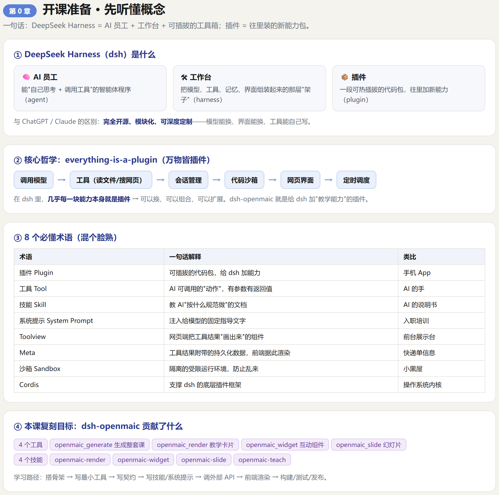


> 本章目标：在写任何代码之前，先用 30 分钟把 "DeepSeek Harness 是什么、插件是怎么回事" 这层窗户纸捅破。

## 0.1 这门课能让你学会什么

学完这门课，你将能独立完成以下事情：


1. 看懂 dsh-openmaic 这样的插件项目（代码结构、每段代码在干嘛）；

2. 从零初始化一个自己的 dsh 插件；

3. 给插件添加**工具（Tool）**—— 让 AI 多一个 "超能力"；

4. 给插件添加**技能（Skill）**—— 让 AI 知道 "按什么规范做"；

5. 让工具在**聊天界面里渲染出漂亮的卡片**（浏览器端开发）；

6. 配置**构建、测试**，把插件打包发布。

一句话目标：**让一个原本只会 "打字" 的 AI 助手，装上你的插件后学会 "做卡片、做幻灯片、做互动小游戏"。**

## 0.2 DeepSeek Harness 到底是什么

### 一个类比

想象你是老板，雇了一个能力很强但 "空手" 的 AI 员工。它很聪明，但手边没有工具。


* **DeepSeek Harness（简称 dsh）** 就是这个 AI 员工的 "工作台 + 工具箱"。

* 工作台上预装了一些基础工具（读文件、执行命令、浏览网页……）。

* 但有些专业工具工作台上没有，需要你 ** 安装插件（plugin）** 来补充。

所以：


```
DeepSeek Harness = AI 员工 + 工作台 + 可插拔的工具箱

插件（plugin）   = 装进工作台的一套"新能力包"
```

### 官方的定义

> DeepSeek Harness（
> `dsh`
> ）是 DeepSeek AI 开发的开源
> **agent harness**
> （智能体运行框架）。
> 它采用
> **"万物皆插件"（everything-is-a-plugin）**
> 架构，底层由
> **Cordis**
> 框架驱动。

拆开看三个关键词：


| 关键词     | 含义      | 大白话                      |
| ------- | ------- | ------------------------ |
| Agent   | 智能体     | 能 "自己思考 + 调用工具" 的 AI 程序  |
| Harness | 挽具 / 框架 | 把模型、工具、记忆、界面组装起来的那层 "架子" |
| Plugin  | 插件      | 一段可以热插拔的代码，往里加新能力        |

### 它和你听过的 AI 产品有什么关系

你可能用过 ChatGPT、Claude、Cursor……dsh 和它们类似，但有一个关键区别：**dsh 是完全开源的、模块化的、开发者可深度定制的**。你可以把里面的 "模型" 换成别的、"界面" 换成别的、"工具" 换成自己写的 —— 这正是它的哲学。

## 0.3 核心哲学：everything-is-a-plugin（万物皆插件）

这是理解 dsh 最重要的一个概念。意思是：

> **dsh 里几乎每一块能力，本身就是 "一个插件"。**

连这些听起来很 "基础" 的东西都是插件：


| 能力             | 在 dsh 里是 |
| -------------- | -------- |
| 调用哪个 AI 模型     | 模型插件     |
| 有哪些工具（读文件、搜网页） | 工具插件     |
| 对话会话怎么管理       | 会话插件     |
| 代码怎么在沙箱里跑      | 沙箱插件     |
| 网页界面长什么样       | UI 插件    |
| 轮询、定时任务        | 调度插件     |

这带来三个好处：


1. **可以换**：不喜欢某个模型，换一个插件就行；

2. **可以组合**：把不同插件拼在一起，得到自己的专属助手；

3. **可以扩展**：写一个新插件，就等于给 dsh 加了一项能力。

而 dsh-openmaic 就是这样一个**给 dsh 增加 "教学能力" 的插件**。

## 0.4 关键术语表（这门课会反复用到）

先混个脸熟，后面每一章都会细讲。


| 术语       | 英文            | 一句话解释                  | 类比      |
| -------- | ------------- | ---------------------- | ------- |
| 插件       | Plugin        | 一段可插拔的代码包，给 dsh 加能力    | 手机 App  |
| 工具       | Tool          | AI 可以调用的 "动作"，有参数、有返回值 | AI 的手   |
| 技能       | Skill         | 教 AI "按什么规范做" 的文档 / 手册 | AI 的说明书 |
| 系统提示     | System Prompt | 注入给模型的固定指导文字           | 员工的入职培训 |
| Toolview | Toolview      | 网页端负责把工具结果 "画出来" 的组件   | 前台展示台   |
| Meta     | Meta          | 工具结果附带的 "持久化数据"，前端据此渲染 | 快递单上的信息 |
| 沙箱       | Sandbox       | 隔离的受限运行环境，防止乱来         | 小黑屋     |
| Cordis   | Cordis        | 支撑 dsh 的底层插件框架         | 操作系统内核  |
| 上下文      | Context / ctx | 插件运行时能访问到的 "一切服务" 的入口  | 工作台插座   |

## 0.5 需要的工具链


| 工具         | 作用                   | 建议                         |
| ---------- | -------------------- | -------------------------- |
| Node.js    | dsh 是 Node 项目，运行它需要  | 用较新的 LTS 版本                |
| pnpm       | Node 的包管理器，dsh 官方用这个 | 用它（不要用 npm/yarn）           |
| git        | 拉取 dsh 源码            | 必装                         |
| TypeScript | 插件开发语言               | 会用基础即可                     |
| 一个代码编辑器    | 写代码                  | VS Code 即可                 |
| 终端         | 跑命令                  | Windows 用 PowerShell / CMD |

> ⚠️ 重要提示：dsh 目前是
> **developer preview（开发者预览版）**
> ，迭代很快，
> **会有破坏性变更**
> 。所以 "照着官方文档 + 源码" 学习是最可靠的。

## 0.6 案例全景：我们这门课要复刻什么

为了让学习有的放矢，我们全程以 **dsh-openmaic** 为活案例。先看它 "长什么样"—— 它给 dsh 贡献了：


```
dsh-openmaic 插件

│

├── 4 个工具（AI 的动作）

│   ├── openmaic_generate  生成整套在线课堂（调用外部服务）

│   ├── openmaic_render    渲染教学卡片（本地）

│   ├── openmaic_widget    渲染互动组件（本地）

│   └── openmaic_slide     渲染幻灯片（本地）

│

├── 4 个技能（AI 的说明书）

│   ├── openmaic-render

│   ├── openmaic-widget

│   ├── openmaic-slide

│   └── openmaic-teach

│

├── 4 段系统提示（教模型用工具）

│

├── Node 端代码（服务端半边，注册/执行）

├── 浏览器端代码（UI 半边，渲染卡片）

└── 构建/测试配置
```

### 我们的学习路径（为什么按这个顺序）

写插件有一个 "从内到外" 的自然顺序：


1. 先会**搭骨架**（项目怎么初始化）→ 第 2 章

2. 再写**最小的工具**（一个能跑的 hello world 工具）→ 第 4 章

3. 再写**契约与校验**（让工具更健壮）→ 第 5 章

4. 再写**技能和系统提示**（让 AI 会用它）→ 第 6、7 章

5. 再写**客户端调用外部 API**（更真实的工具）→ 第 8 章

6. 再写**浏览器端渲染**（让结果变成好看的卡片）→ 第 9 章

7. 最后是**构建、测试、发布** → 第 10、11、12 章

**每一步，我们都会对照 dsh-openmaic 的真实代码。**

### 动手练习 0-1（热身）

思考并写下来：


1. "工具" 和 "技能" 的区别，用自己的话解释一遍；

2. 如果你要做一个 "翻译插件"，它需要：几个工具？几个技能？各是什么？

3. 看看自己的电脑上有没有 Node.js 和 git（终端里执行 `node -v`、`git --version`）。

> 想不出答案也没关系，学完第 4、7 章你自然就懂了。


***

# 第 1 章 搭好开发环境

> 🖼 本章信息图（原 HTML 源文件在 `课程信息图/第1章.html`）

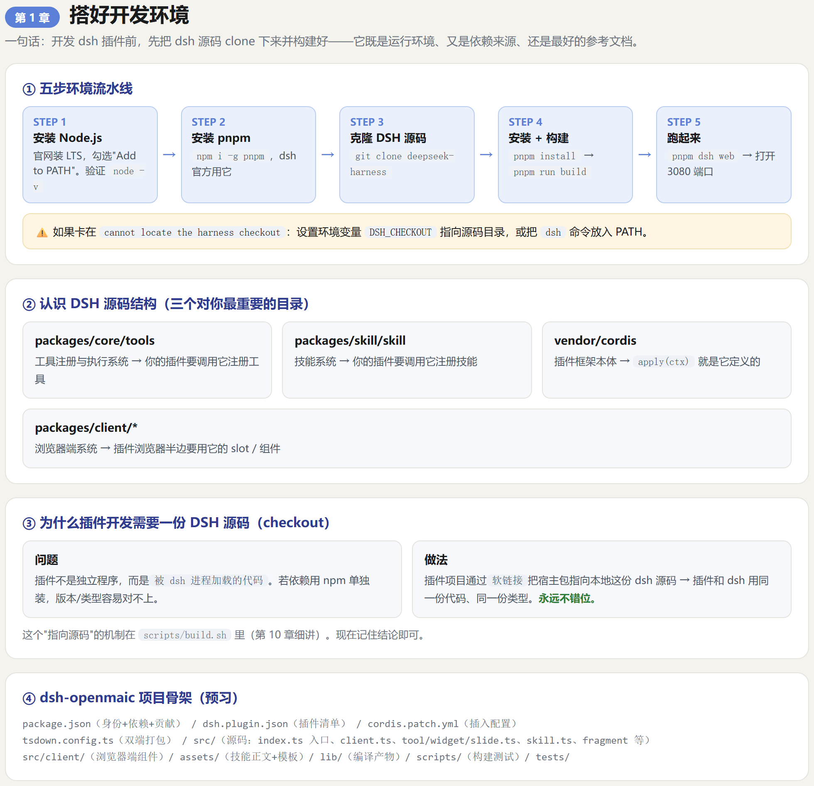


> 本章目标：把 dsh 跑起来，认识 dsh 的源码结构，并理解 "为什么插件开发需要一份 dsh 源码"。

## 1.1 安装 Node.js

dsh 是 Node.js 项目。官网下载 LTS 版本安装即可（[https://nodejs.org](https://nodejs.org)）。

装好后在终端验证：


```
node -v        # 看到 v20.x / v22.x 之类的版本号就对了

npm -v         # npm 会随 Node 一起装好
```

> Windows 提示：安装时一路 "下一步"，勾选 "Add to PATH"（加入系统路径），装完重开终端让环境变量生效。

## 1.2 安装 pnpm

dsh 官方使用 pnpm 作为包管理器。全局安装：


```
npm install -g pnpm

pnpm -v        # 验证
```

## 1.3 获取 DeepSeek Harness 源码

插件开发需要一份 dsh 的源码（官方叫 **checkout**），原因我们 1.6 会说。


```
# 找个工作目录，比如 D:\dev

cd D:\dev

git clone https://github.com/deepseek-ai/deepseek-harness.git

cd deepseek-harness

# 安装依赖（dsh 仓库很大，耐心等）

pnpm install

# 构建（把 TypeScript 编译成可运行产物）

pnpm run build
```

> ⚠️ 这一步可能耗时较长（下载大量依赖、编译很多包）。如果网络慢，可以设置镜像源。

## 1.4 运行 dsh，验证环境 OK

dsh 有两个主要入口：


```
# 方式一：从 npm 直接跑（不需要源码，但插件开发用不上这个路径）

npx @deepseek-ai/dsh web

# 方式二：从源码跑（我们开发插件要用这个）

pnpm dsh web
```

启动成功后，终端会打印：


```
http://127.0.0.1:3080
```

用浏览器打开这个地址，你会看到一个 AI 对话界面 ——**这就是 dsh 的 Web UI**。能正常对话，说明环境 OK。

> 注意：默认需要配置模型 API key 才能真对话。没配也不影响我们后面的插件开发练习。

## 1.5 认识 dsh 的源码结构

clone 下来的仓库里，几个关键目录：


```
deepseek-harness/

├── packages/          # ★ dsh 官方功能包（工具、技能、会话、界面……都在这里）

│   ├── core/          #   核心：session（会话）、tools（工具）、system-prompt……

│   ├── client/        #   浏览器端包（runtime、ui-tool、ui-slots……）

│   ├── skill/         #   技能系统

│   ├── llm/           #   模型接入

│   └── util/          #   工具包（brand 等）

├── vendor/            # ★ 第三方/底层框架（Cordis、Cosmokit、Schemastery……）

├── apps/              # dsh 主程序/CLI

├── native/            # 原生沙箱（landlock 等）

├── docs/              # 官方文档

└── package.json       # 仓库根配置
```

### 三个对你最重要的目录


| 目录                     | 内容      | 你为什么会用到它                |
| ---------------------- | ------- | ----------------------- |
| `packages/core/tools`  | 工具注册与执行 | 你的插件要调用它注册工具            |
| `packages/skill/skill` | 技能系统    | 你的插件要调用它注册技能            |
| `vendor/cordis`        | 插件框架本体  | `apply(ctx)` 就是它定义的     |
| `packages/client/*`    | 浏览器端系统  | 你的插件浏览器半边要用它的 slot / 组件 |

> 插件开发 =
> **站在这些包的肩膀上，写自己的代码**
> 。

## 1.6 为什么插件开发需要一份 dsh 源码（checkout）

这是新手最容易困惑的点，解释清楚：

dsh 插件不是 "独立运行的程序"，而是**要被 dsh 进程加载的代码**。它依赖 dsh 的很多内部包（`@deepseek-ai/cordis`、`@deepseek-ai/dsh-tools`……）。

如果这些依赖用 npm 单独装，很可能版本对不上、类型对不上，导致插件加载失败。

**所以 dsh 插件项目的做法是**：


```
插件项目自身不重复安装 dsh 的包

→ 而是通过"软链接"把它们指向本地那份 dsh 源码里的包

→ 保证插件和 dsh 用的是同一份代码、同一份类型
```

这个 "指向源码" 的机制，在 dsh-openmaic 的 `scripts/build.sh` 里能看到（我们第 10 章细讲）。现在你只需要记住一个结论：

> **开发 dsh 插件前，先把 dsh 源码 clone 下来并构建好，它既是 "运行环境"，又是 "依赖来源"，还是 "最好的参考文档"。**

## 1.7 认识 dsh-openmaic 项目骨架（预习）

现在打开我们的案例项目 `D:\dsh-openmaic-main`，先 "看图识结构"（每部分后面章节都会细讲）：


```
dsh-openmaic-main/

├── package.json            ← 插件身份 + 依赖 + 贡献清单

├── dsh.plugin.json         ← 插件清单（旧版格式，仍被读取）

├── cordis.patch.yml        ← 把插件插进 dsh 配置的"补丁"

├── tsdown.config.ts        ← 双端打包配置

├── tsconfig.json           ← Node 端 TS 配置

├── tsconfig.client.json    ← 浏览器端 TS 配置

├── src/                    ← ★ 源码

│   ├── index.ts            ← 插件入口（最重要）

│   ├── client.ts           ← HTTP 客户端（生成课堂）

│   ├── tool.ts             ← render 工具

│   ├── widget.ts           ← widget 工具

│   ├── slide.ts            ← slide 工具

│   ├── skill.ts            ← 技能提供者

│   ├── fragment.ts         ← 共享契约（render）

│   ├── slide-meta.ts       ← 共享契约（slide）

│   ├── widget-meta.ts      ← 共享契约（widget）

│   └── client/             ← 浏览器端 React 组件

├── assets/                 ← 技能正文 + 模板

├── lib/                    ← 编译产物（随插件分发）

├── scripts/                ← 构建/测试脚本

└── tests/                  ← 测试
```

### 动手练习 1-1


1. 在终端运行 `node -v`、`pnpm -v`、`git --version`，把版本号记下来；

2. 在 `D:\dev` 下 clone dsh 源码并尝试 `pnpm install`（可以先只到 clone 完成）；

3. 对照 1.7 的骨架，在 `D:\dsh-openmaic-main` 里找到 `src/index.ts`，打开看一眼 —— 没关系，暂时看不懂很正常，下一章我们就从它讲起。

> 环境搭好了，我们进入第 2 章：初始化一个插件项目。


***

# 第 2 章 初始化一个插件项目

> 🖼 本章信息图（原 HTML 源文件在 `课程信息图/第2章.html`）

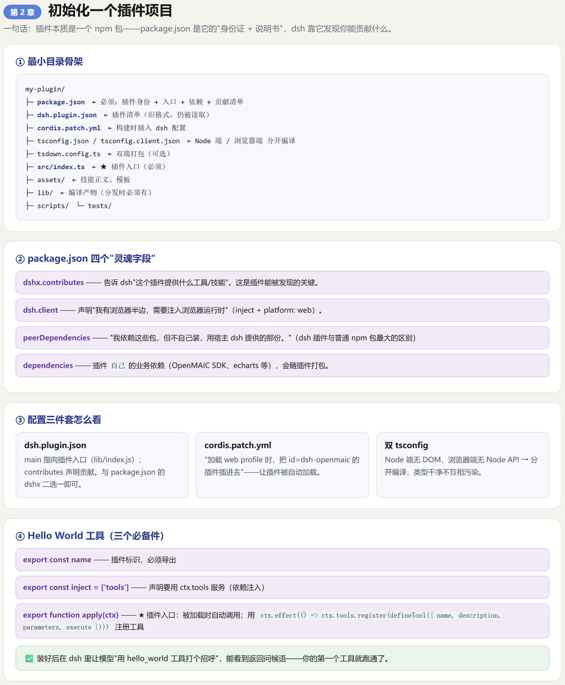


> 本章目标：逐字段看懂 dsh 插件项目的 "出生证明"（package.json 等配置文件），并写出第一个能注册工具的 Hello World 插件。

## 2.1 插件项目的最小目录骨架

一个 dsh 插件项目（对外分发版）通常长这样：


```
my-plugin/

├── package.json          ← 必须：插件身份、入口、依赖、贡献清单

├── dsh.plugin.json       ← 旧格式插件清单（可选，但 dsh-openmaic 保留了）

├── cordis.patch.yml      ← 构建时插入 dsh 配置（可选）

├── tsconfig.json         ← TS 编译配置（Node 端）

├── tsconfig.client.json  ← TS 编译配置（浏览器端，可选）

├── tsdown.config.ts      ← 打包配置（可选，若有编译产物）

├── src/                  ← 源码

│   └── index.ts          ← ★ 插件入口（必须）

├── assets/               ← 技能正文、模板等静态资源（可选）

├── lib/                  ← 编译产物（分发时必须有）

├── scripts/              ← 构建/测试脚本（推荐）

└── tests/                ← 测试（推荐）
```

对照一下 dsh-openmaic，它**几乎完全长这样**。我们逐个文件讲。

## 2.2 package.json：插件的 "身份证 + 说明书"

dsh 插件本质上是一个 **npm 包**，所以第一个文件就是 `package.json`。看 dsh-openmaic 的（精简标注版）：


```
{

  // ① 包名：@scope/name，插件的全局唯一 ID

  "name": "@openmaic/dsh-openmaic",

  // ② 一句话描述（会出现在插件列表里）

  "description": "OpenMAIC for DeepSeek Harness: ...",

  // ③ 版本号

  "version": "0.4.0",

  // ④ 模块类型：ESM

  "type": "module",

  // ⑤ 入口文件：别人 require 这个包时加载谁

  "main": "lib/index.js",

  "types": "lib/index.d.ts",

  // ⑥ 子路径导出：外部可以按路径引入不同部分

  "exports": {

    ".":                { "types": "./lib/index.d.ts", "default": "./lib/index.js" },

    "./client":         "./lib/client.js",   // 浏览器端入口

    "./cordis.patch.yml": "./cordis.patch.yml",

    "./package.json":   "./package.json"

  },

  // ⑦ 打包发布时包含哪些文件（白名单）

  "files": ["lib", "assets", "cordis.patch.yml"],

  // ⑧ 许可证

  "license": "MIT",

  // ⑨ 要求 dsh 的最低版本

  "engines": { "dsh": ">=0.0.1" },

  // ⑩ ★ 给 dsh 看的"贡献清单"：这个插件贡献了哪些工具、哪些技能

  "dshx": {

    "contributes": {

      "tools": ["openmaic_generate", "openmaic_render", "openmaic_widget", "openmaic_slide"],

      "skills": ["openmaic-render", "openmaic-widget", "openmaic-slide", "openmaic-teach"]

    }

  },

  // ⑪ ★ 构建相关：patch 文件路径 + 浏览器端注入

  "dsh": {

    "bundle": { "patch": "./cordis.patch.yml" },

    "client": {

      "inject": ["@deepseek-ai/dsh-client-runtime"],

      "platform": "web"

    }

  },

  // ⑫ 依赖：dsh 的宿主包作为 peerDependencies（不重复装，用宿主那份）

  "peerDependencies": {

    "@deepseek-ai/cordis": "^4.0.1-rc.1",

    "@deepseek-ai/dsh-llm": "*",

    "@deepseek-ai/dsh-session": "*",

    "@deepseek-ai/dsh-skill": "*",

    "@deepseek-ai/dsh-system-prompt": "*",

    "@deepseek-ai/dsh-tools": "*",

    "@deepseek-ai/schemastery": "^3.18.1-rc.1",

    "react": "^18.2.0"

  },

  // ⑬ 开发依赖

  "devDependencies": {

    "tsdown": "^0.22.2",

    "typescript": "^5.9.0"

  },

  // ⑭ 自己的业务依赖（会打进产物）

  "dependencies": {

    "@openmaic/dsl": "^0.8.0",

    "@openmaic/generation": "^0.3.0",

    "@openmaic/renderer": "^0.1.0",

    "echarts": "^6.1.0",

    "shiki": "^4.4.3"

  },

  // ⑮ 常用脚本

  "scripts": {

    "build": "bash scripts/build.sh",

    "test": "bash scripts/test.sh",

    "typecheck": "tsc -p tsconfig.json && tsc -p tsconfig.client.json"

  }

}
```

### 重点讲解 4 个字段

** 字段 ⑩ **`dshx.contributes` —— dsh 通过它知道 "这个插件提供什么"。这是插件能被发现的关键。

** 字段 ⑪ **`dsh.client` —— 声明 "我有浏览器半边，需要注入浏览器运行时"。

**字段 ⑫ **`peerDependencies`** —— 含义是：" 我依赖这些包，但不自己装**，请使用宿主（dsh）提供的那份。" 这是 dsh 插件和普通 npm 包最大的区别之一。

**字段 ⑭ **`dependencies`** —— 这些是插件自己的**业务依赖（OpenMAIC 的 SDK、图表库等），会随插件一起打包。

## 2.3 dsh.plugin.json：插件清单（旧格式，仍被读取）

dsh-openmaic 还保留了 `dsh.plugin.json`，内容和 package.json 的 `dshx.contributes` 基本重复：


```
{

  "id": "@openmaic/dsh-openmaic",

  "version": "0.4.0",

  "main": "./lib/index.js",

  "description": "OpenMAIC for DeepSeek Harness: ...",

  "engines": { "dsh": ">=0.0.1" },

  "contributes": {

    "tools": ["openmaic_generate", "openmaic_render", "openmaic_widget", "openmaic_slide"],

    "skills": ["openmaic-render", "openmaic-widget", "openmaic-slide", "openmaic-teach"]

  }

}
```

**理解：** 这是插件元信息的另一种载体。`main` 指向插件入口（`lib/index.js`），`contributes` 声明贡献。**记住核心：插件元信息要么写在 package.json 的 dshx 字段，要么写在 dsh.plugin.json，两者都行。**

## 2.4 cordis.patch.yml：把插件 "插进"dsh


```
# dsh 构建/加载时，把本插件插入到某个 profile（配置层）的插件栈里

- insert:

    - id: dsh-openmaic

      name: '@openmaic/dsh-openmaic'
```

**理解：** dsh 使用 Cordis 的 "层（layer）" 机制组合插件。这个 yml 告诉 dsh："加载 web profile 时，把 id 为 dsh-openmaic 的这个插件插进去。" 这样安装插件后它会被自动加载。

## 2.5 双 tsconfig：Node 端和浏览器端分开编译

dsh 插件有 "两副身体"（服务端 + 浏览器端），所以 dsh-openmaic 配了两份 tsconfig：

`tsconfig.json`**（Node 端）**：目标是 Node 环境，只编译服务端代码。


```
{

  "compilerOptions": {

    "target": "ES2024",

    "module": "esnext",

    "moduleResolution": "bundler",

    "lib": ["ES2024"],

    "strict": true,

    "jsx": "react-jsx",

    "types": ["node"]

  },

  "include": ["src"],

  "exclude": ["src/client"]   // ← 浏览器端代码排除在外

}
```

`tsconfig.client.json`**（浏览器端）**：目标是浏览器环境，包含 DOM 类型。


```
{

  "extends": "./tsconfig.json",

  "compilerOptions": {

    "lib": ["es2022", "dom", "dom.iterable"],  // ← 多了 DOM 类型

    "jsx": "react-jsx",

    "noEmit": true

  },

  "include": ["src/client", "src/fragment.ts", "src/widget-meta.ts"],

  "exclude": []

}
```

**为什么要分开？**


* Node 端代码用不到 `document`、`window` 这些 DOM 对象；

* 浏览器端代码用不到 Node 的 `fs`、`process`；

* 分开编译，两边的类型都干净、不会互相污染。

## 2.6 你的第一个插件：Hello World 工具

理论讲完，动手。新建一个最小插件项目 `D:\dev\my-first-plugin`：


```
mkdir my-first-plugin

cd my-first-plugin
```

**Step 1：写 package.json**（最精简版）


```
{

  "name": "my-first-plugin",

  "version": "0.1.0",

  "type": "module",

  "main": "lib/index.js",

  "types": "lib/index.d.ts",

  "license": "MIT",

  "engines": { "dsh": ">=0.0.1" },

  "dshx": {

    "contributes": {

      "tools": ["hello_world"]

    }

  },

  "peerDependencies": {

    "@deepseek-ai/cordis": "^4.0.1-rc.1",

    "@deepseek-ai/dsh-tools": "*"

  },

  "devDependencies": {

    "typescript": "^5.9.0"

  }

}
```

**Step 2：写插件入口 src/index.ts**


```
// 引入工具注册的"工具定义"辅助函数

import { defineTool } from '@deepseek-ai/dsh-tools'

// 引入 Cordis 上下文类型

import type { Context as CordisContext } from '@deepseek-ai/cordis'

// 插件的名字

export const name = 'my-first-plugin'

// 声明这个插件依赖哪些服务（后面第 3 章细讲）

export const inject = ['tools']

// 上下文类型：ctx.tools 是工具注册服务

type Context = CordisContext & { tools: any }

// ★ 插件入口函数：dsh 加载插件时调用它

export function apply(ctx: Context): void {

  // 注册一个名叫 hello_world 的工具

  ctx.effect(() => ctx.tools.register(defineTool({

    name: 'hello_world',

    description: 'Say hello. 返回一句问候。',

    parameters: {

      name: { type: 'string', description: '你的名字' },

    },

    // 模型调用这个工具时真正执行的函数

    async execute(args: any) {

      return `Hello, ${args.name ?? 'world'}! 这是你的第一个 dsh 工具。`

    },

  })), 'my-first-plugin.hello')

}
```

**Step 3：编译 + 放入 dsh 测试**


```
npx tsc        # 或用项目自己的构建脚本
```

把编译产物放到 dsh 的插件目录，或通过 `dsh plugin add` 安装（第 2.7 节）。

### 逐行解读这个 Hello World


| 代码                                      | 作用                            |
| --------------------------------------- | ----------------------------- |
| `export const name = 'my-first-plugin'` | 插件标识，必须导出                     |
| `export const inject = ['tools']`       | 声明插件要用 `ctx.tools` 这个服务（依赖注入） |
| `export function apply(ctx)`            | **插件入口**：被加载时自动调用，`ctx` 是插座   |
| `ctx.effect(() => ...)`                 | 注册副作用，插件卸载时自动清理（第 3 章细讲）      |
| `defineTool({...})`                     | 定义工具的标准 "模板"                  |
| `execute(args)`                         | 工具的核心逻辑，返回给模型的结果              |

> 装好之后，在 dsh 对话里问："用 hello_world 工具跟我打个招呼"，AI 就会调用它并显示返回值。

## 2.7 怎么把插件装进 dsh 验证

dsh 官方提供了插件安装命令（dsh-openmaic 的 README 就是这么写的）：


```
# 从 git 仓库安装（推荐：插件自带编译好的 lib/，无需构建）

dsh plugin --profile web add git+https://github.com/THU-MAIC/dsh-openmaic.git
```

开发期的快捷做法（本地调试）：


```
# 1) 用 cordis.patch.yml 把插件临时插进本地 dsh 的 web profile

pnpm dsh web --patch ./cordis.patch.yml

# 2) 或者直接把编译好的 lib/ 复制到 dsh 能找到的插件目录
```

然后重启 `dsh web`，刷新页面，看终端有没有打印插件的加载日志。

### 动手练习 2-1


1. 把 2.6 的 Hello World 插件完整写出来（package.json + src/index.ts）；

2. 在 dsh 对话里让它调用 `hello_world` 工具，确认能看到返回的问候语；

3. 试着给 `hello_world` 加第二个参数 `language`，让它可以返回中文或英文问候。


***

# 第 3 章 理解 Cordis：插件生命周期

> 🖼 本章信息图（原 HTML 源文件在 `课程信息图/第3章.html`）

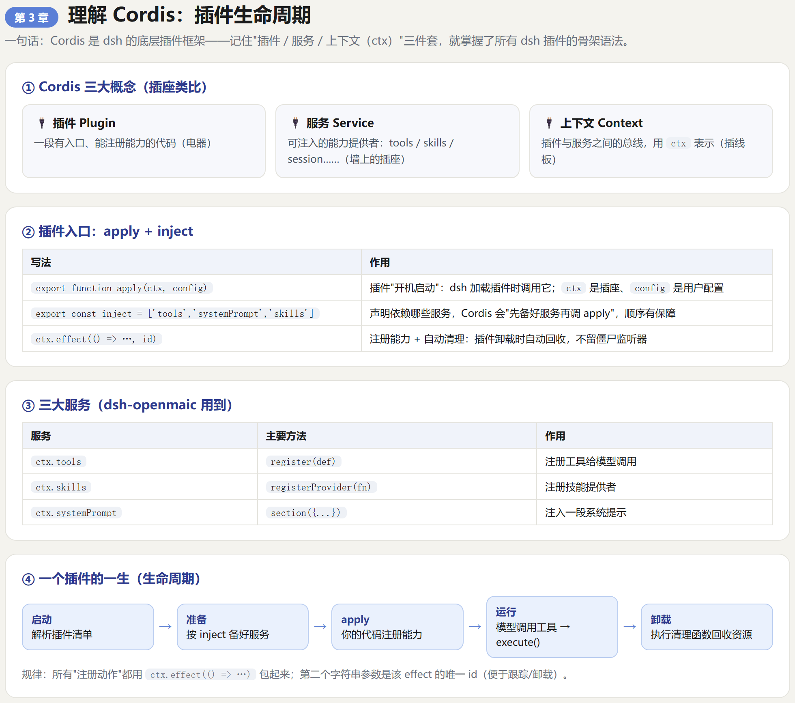


> 本章目标：看懂
> `apply`
> /
> `inject`
> /
> `ctx.effect`
> 到底在干嘛 —— 这是所有 dsh 插件的 "骨架语法"。

## 3.1 Cordis 是什么

**Cordis** 是 dsh 底层的插件框架（作者说它的设计来自论文 *A Programming Paradigm for Spatiotemporal Composability*）。我们不需要读论文，只需要理解它的三个核心概念：


```
Cordis 三大概念：

├── 插件（Plugin）   —— 一段有入口、能注册能力的代码

├── 服务（Service）  —— 一个可注入的能力提供者（tools、skills、session……都是服务）

└── 上下文（Context）—— 插件和服务之间的"总线"，用 ctx 表示
```

用插座类比：


* **服务** = 墙上的插座（提供电 / 水 / 网）

* **插件** = 电器（插上就能用某种功能）

* **ctx（上下文）** = 那个插线板，电器靠它取电

## 3.2 apply 函数：插件的 "开机启动"

每个插件都必须导出 `apply(ctx, config)`。dsh 加载插件时调用它：


```
export function apply(ctx: Context, config: Config): void {

  // 在这里注册你的工具、技能、系统提示……

}
```


| 参数       | 类型      | 作用                    |
| -------- | ------- | --------------------- |
| `ctx`    | Context | 插件访问一切服务的入口（插座）       |
| `config` | Config  | 用户在 dsh 配置里给这个插件填的配置项 |

看 dsh-openmaic 的真实入口 `src/index.ts`，它的 apply 做了 4 件事：


```
export function apply(ctx: Context, config: Config): void {

  // ① 注册 openmaic_generate 工具

  ctx.effect(() => ctx.tools.register(defineTool({ name: 'openmaic_generate', ... })), 'dsh-openmaic.generate')

  // ② 注册 openmaic_render 工具

  ctx.effect(() => ctx.tools.register(openmaicRenderTool()), 'dsh-openmaic.render')

  // ③ 注册 openmaic_widget / openmaic_slide 工具

  ctx.effect(() => ctx.tools.register(openmaicWidgetTool()), 'dsh-openmaic.widget')

  ctx.effect(() => ctx.tools.register(openmaicSlideTool()), 'dsh-openmaic.slide')

  // ④ 注册技能提供者

  ctx.effect(() => ctx.skills.registerProvider(() => openmaicSkillProvider), 'dsh-openmaic.skill')

  // ⑤ 注入 4 段系统提示

  ctx.effect(() => ctx.systemPrompt.section({ name: 'tool:dsh-openmaic', order: 117, text: GENERATE_PROMPT_TEXT }), 'dsh-openmaic.generate-prompt')

  // ... 还有 3 段

}
```

**规律：所有 "注册动作" 都用 **`ctx.effect(() => ...)`** 包起来。**

## 3.3 ctx.effect 和 inject：注册 + 依赖声明

### `ctx.effect(fn, id)` —— 注册并自动清理


```
ctx.effect(() => {

  // 在这里注册工具/技能/监听器

  return () => {

    // （可选）返回一个"清理函数"，插件卸载时执行

  }

}, 'my-plugin.some-effect')   // 第二个参数是这个 effect 的唯一 id
```

**为什么用它？** 插件可能会被动态加载 / 卸载（热更新、关闭会话）。`ctx.effect` 保证：


* 插件加载时注册能力；

* 插件卸载时**自动回收**，不会留下 "僵尸监听器"。

### `inject` —— 声明你要用哪些服务


```
// 插件顶部声明：我需要 tools、systemPrompt、skills 这三个服务

export const inject = ['tools', 'systemPrompt', 'skills']
```

**为什么声明？** 服务之间有依赖关系（比如系统提示服务可能依赖其他服务）。`inject` 告诉 Cordis："先把我依赖的服务准备好，再调用我的 apply。" 顺序有保障，不会出现 "服务还没就绪就使用" 的崩溃。

## 3.4 三大服务：tools /skills/systemPrompt

这是 dsh-openmaic 用到的三个核心服务（在 `ctx` 上）：


| 服务                 | 类型           | 主要方法                   | 作用        |
| ------------------ | ------------ | ---------------------- | --------- |
| `ctx.tools`        | ToolRegistry | `register(def)`        | 注册工具给模型调用 |
| `ctx.skills`       | SkillService | `registerProvider(fn)` | 注册技能提供者   |
| `ctx.systemPrompt` | SystemPrompt | `section({...})`       | 注入一段系统提示  |

> 还有更多服务（session 会话、llm 模型、scope 作用域……），用到再学即可。
> **先掌握这三个，已经能写大部分插件。**

## 3.5 生命周期全景

一个 dsh 插件的完整一生：


```
dsh 启动

  │

  ▼

解析插件清单（package.json / dsh.plugin.json）

  │

  ▼

按 inject 顺序准备好依赖服务

  │

  ▼

调用 apply(ctx, config)        ← 你的代码在这里注册能力

  │

  ▼

插件的工具/技能/系统提示对模型可见

  │

  ▼

（运行期）模型调用工具 → 执行 execute()

  │

  ▼

dsh 关闭 / 插件被卸载

  │

  ▼

执行 ctx.effect 返回的清理函数，回收资源
```

### 动手练习 3-1


1. 打开 `D:\dsh-openmaic-main\src\index.ts`，把 `apply` 里的每一行注释上 "它在做什么"；

2. 数一数这个插件注册了几个工具、几个技能、几段系统提示；

3. 用一句话回答：`ctx.effect` 的第二个字符串参数（如 `'dsh-openmaic.render'`）是用来干什么的？

> 现在你有了 "骨架语法"，第 4 章我们进入重头戏：完整开发一个工具。


***

# 第 4 章 开发第一个工具：openmaic_render

> 🖼 本章信息图（原 HTML 源文件在 `课程信息图/第4章.html`）

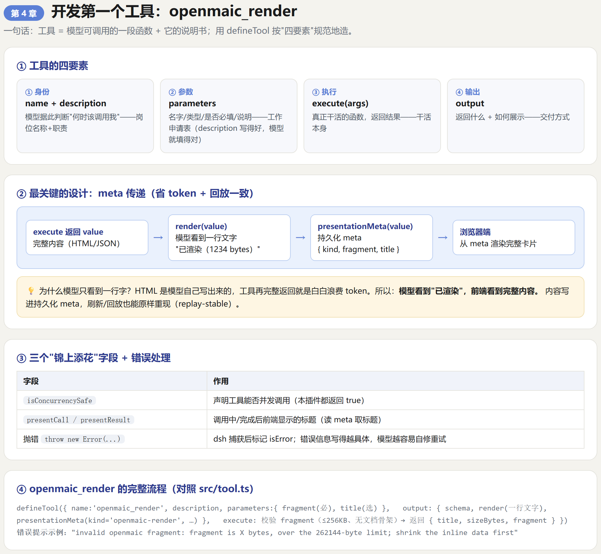


> 本章目标：彻底搞懂 dsh 工具（Tool）的四个要素，并对照 dsh-openmaic 的
> `src/tool.ts`
> 逐行学会怎么写一个 "能渲染卡片" 的工具。

## 4.1 一个工具由哪四样东西组成

在 dsh 里，一个工具（Tool）就是 "模型可以调用的一段函数 + 它的说明书"。它由**四要素**组成：


```
┌─────────────────────────────────────────────┐

│                  一个工具                     │

├──────────────┬──────────────────────────────┤

│ ① 身份        │ name（唯一名字）+ description（描述） │

│ ② 参数        │ parameters（模型该怎么填参数）      │

│ ③ 执行体      │ execute(args)（真正干活的函数）     │

│ ④ 输出        │ output（返回什么 + 如何展示）       │

└──────────────┴──────────────────────────────┘
```


| 要素                   | 作用                 | 类比          |
| -------------------- | ------------------ | ----------- |
| ① name / description | 模型据此判断 "什么时候该调用我"  | 岗位名称 + 岗位职责 |
| ② parameters         | 定义入参的名字、类型、是否必填、说明 | 工作申请表       |
| ③ execute            | 真正执行的逻辑，返回结果       | 干活本身        |
| ④ output             | 结果怎么格式化、怎么传给前端展示   | 交付方式        |

## 4.2 defineTool：工具的 "模板"

dsh 提供了 `defineTool({...})` 帮我们规范地构造一个工具。它返回一个 **ToolDefinition**（工具定义对象）。


```
import { defineTool } from '@deepseek-ai/dsh-tools'

const myTool = defineTool({

  name: 'my_tool',

  description: '...',

  parameters: { ... },

  output: { ... },

  execute: async (args) => { ... },

})
```

### 为什么用 defineTool 而不是手写对象？


1. 有类型检查（写错字段编译期就报错）；

2. 有默认行为（presentCall /presentResult 等有合理的默认值）；

3. 它是 dsh 工具系统的 "官方入口"，后续版本兼容有保障。

## 4.3 参数（parameters）：告诉模型怎么填

看 dsh-openmaic 的 `openmaic_render` 工具参数：


```
parameters: {

  fragment: {

    type: 'string',

    required: true,      // 必填

    description: 'The inline HTML fragment to render ...',

  },

  title: {

    type: 'string',      // 选填

    description: 'Concise card title. Defaults to "OpenMAIC 课堂".',

  },

}
```

**要点：**


* `type`: 参数类型（`string` / `boolean` / `number` / `object` / `array`…）；

* `required`: 是否必填；

* `description`: **非常重要**，模型靠这段文字理解该填什么；

* `enum`: 可选值列表（比如 `openmaic_generate` 的 `language` 参数就限制为 `['zh-CN','en-US']`）。

**经验：description 写得好，模型就能填得对。** 这是 "教模型用工具" 的第一步。

## 4.4 输出（output）：结果如何返回给模型

输出有两种作用：**给模型看的文字** 和 **给前端看的持久化数据**。

dsh-openmaic 里有个巧妙设计（`TEXT_OUTPUT`）：


```
const TEXT_OUTPUT = {

  schema: { type: 'string' as const },

  render: (_args: unknown, value: unknown) => [{ type: 'text' as const, text: String(value) }],

}
```


* `schema`: 声明返回值的类型；

* `render`: 把返回值转成**模型能看到的一行文字**。

对于 `openmaic_render` 工具，它的 output 更精细：


```
output: {

  schema: {

    type: 'object',

    additionalProperties: false,

    properties: {

      title: { type: 'string', required: true },

      sizeBytes: { type: 'integer', required: true },

      fragment: { type: 'string', required: true },

    },

  },

  // 模型看到的只是"一行确认"，不把整段 HTML 回灌给模型（省 token）

  render: (_args, value) => [{

    type: 'text',

    text: `Rendered "${value.title}" inline (${value.sizeBytes} bytes). The user sees the interactive card in the conversation.`,

  }],

  // 前端要用的完整数据，写进 presentationMeta（见 4.5）

  presentationMeta: (_args, value) => ({

    kind: 'openmaic-render',

    fragment: value.fragment,

    title: value.title,

  }),

}
```

**这里有一个非常重要的设计思想，一定要理解：**


```
execute 返回的 value

   │

   ├──→ render(value)  →  模型看到的一行文字（短！省 token！）

   │

   └──→ presentationMeta(value)  →  持久化 meta，前端据此渲染完整卡片
```

**为什么不让模型看到完整 HTML？** 因为 HTML 是模型自己写出来的，本来就在模型的输出里；如果工具再把它完整返回，上下文就被白白撑大、浪费 token。所以：**模型看到 "已渲染" 三个字，前端看到完整内容。**

## 4.5 presentationMeta：把内容交给前端的 "暗号"

`presentationMeta` 是工具结果里的一块**持久化数据**，会随工具调用一起被记录（写进 `tool/result` 的 meta）。

前端（浏览器端）通过读 meta 来渲染卡片。看 dsh-openmaic：


```
presentationMeta: (_args, value) => ({

  kind: 'openmaic-render',   // 一种"类型标签"，前端靠它识别这是哪种卡片

  fragment: value.fragment,  // 完整 HTML 片段

  title: value.title,

})
```

**为什么这样设计？** 因为对话可以被**回放**（刷新页面、查看历史）。如果前端只靠 "当时的返回值" 渲染，回放时就拿不到内容了。**内容写进 meta，回放时就能原样重现**—— 这正是 "replay-stable（回放稳定）" 的关键。

## 4.6 另外三个可选字段

dsh 工具还有几个 "锦上添花" 的字段，dsh-openmaic 都用到了：


| 字段                  | 作用                              | dsh-openmaic 的用法                                        |
| ------------------- | ------------------------------- | ------------------------------------------------------- |
| `isConcurrencySafe` | 声明 "我这个工具能不能并发调用"（返回 true 表示可以） | 全部工具都返回 `() => true`                                    |
| `presentCall`       | 工具**调用中**时，前端显示什么               | `{ card: 'generic', title: 'OpenMAIC', kind: 'other' }` |
| `presentResult`     | 工具**完成后**，前端显示什么（读 meta 取标题）    | 读 `openmaicMetaFrom(result.meta)` 得到标题                  |


```
// 工具完成后，从持久化 meta 里取出标题来展示

presentResult(_args, result) {

  if (result.isError) return undefined          // 出错就用默认展示

  const meta = openmaicMetaFrom(result.meta)   // 收窄 meta

  if (meta === undefined) return undefined

  return { card: 'generic', title: `OpenMAIC · ${meta.title}` }

}
```

## 4.7 错误处理：让工具 "优雅地失败"

工具在执行中发现问题，应该**抛出错误**（`throw new Error(...)`）。dsh 会捕获它，标记 `result.isError = true`，并把错误信息展示给模型和用户。

dsh-openmaic 的 `execute`：


```
async execute(args) {

  // 校验片段，不合规直接抛错

  const sizeBytes = validateFragment(args.fragment, MAX_FRAGMENT_BYTES)

  const title = args.title?.trim() || 'OpenMAIC 课堂'

  return { title, sizeBytes, fragment: args.fragment }

}
```

而 `validateFragment`（第 5 章细讲）会抛出类似：


```
throw new Error('invalid openmaic fragment: the fragment is empty')

throw new Error(`invalid openmaic fragment: fragment is ${sizeBytes} bytes, over the ${maxBytes}-byte limit; ...`)

throw new Error('invalid openmaic fragment: fragment contains a document-skeleton tag (...); ...')
```

**错误信息写得越具体，模型越容易自己修正后重试。** 这是提升插件体验的关键技巧。

## 4.8 完整对照：dsh-openmaic 的 openmaic_render

现在把 `src/tool.ts` 从头到尾 "翻译" 一遍（加注释版）：


```
// ① 引入工具定义函数

import { defineTool, type ToolDefinition } from '@deepseek-ai/dsh-tools'

// ② 引入"共享契约"（校验 + meta 收窄），见第 5 章

import { openmaicMetaFrom, validateFragment, OPENMAIC_RENDER_TOOL_NAME } from './fragment.ts'

// ③ 一个片段的大小上限：256KB

export const MAX_FRAGMENT_BYTES = 256 * 1024

// ④ 工具的"岗位描述"

const DESCRIPTION =

  'Show the user an interactive OpenMAIC teaching card ... ' +

  'Pass the markup in `fragment`: literal inline HTML only, no document skeleton.'

// ⑤ 构建工具定义

export function openmaicRenderTool(): ToolDefinition {

  return defineTool({

    name: OPENMAIC_RENDER_TOOL_NAME,          // 'openmaic_render'

    description: DESCRIPTION,

    parameters: {

      fragment: { type: 'string', required: true, description: '...' },

      title:    { type: 'string', description: '...' },

    },

    output: {

      schema: { ... },                        // 返回值结构

      render: (_args, value) => [...],        // 给模型看的一行文字

      presentationMeta: (_args, value) => ({  // 给前端看的完整 meta

        kind: 'openmaic-render', fragment: value.fragment, title: value.title,

      }),

    },

    isConcurrencySafe: () => true,            // 纯校验，可并发

    async execute(args) {                     // 真正执行：校验 + 组装

      const sizeBytes = validateFragment(args.fragment, MAX_FRAGMENT_BYTES)

      const title = args.title?.trim() || 'OpenMAIC 课堂'

      return { title, sizeBytes, fragment: args.fragment }

    },

    presentCall: () => ({ card: 'generic', title: 'OpenMAIC', kind: 'other' }),

    presentResult(_args, result) { ... },     // 读 meta 展示标题

  })

}
```

### 动手练习 4-1


1. 写一个工具 `text_counter`：参数是 `text`（必填），返回它的字符数和单词数；

2. 给这个工具加上 `description` 和参数 `description`，让模型能正确填写；

3. 让 execute 在 text 为空时抛出错误信息（模仿 validateFragment 的写法）。


***

# 第 5 章 共享契约模块：纯函数设计 + TDD

> 🖼 本章信息图（原 HTML 源文件在 `课程信息图/第5章.html`）

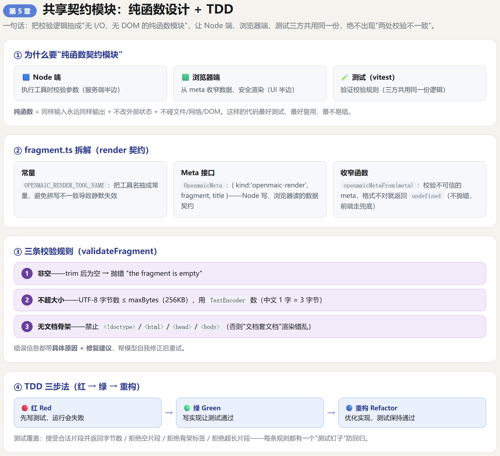


> 本章目标：理解 dsh 插件里 "共享契约模块" 的设计哲学（为什么要是纯函数），并学会用测试驱动的方式写它。

## 5.1 什么是 "共享契约模块"，为什么需要它

先看 dsh-openmaic 里的三个文件：


```
src/fragment.ts     ← openmaic_render 的契约

src/slide-meta.ts   ← openmaic_slide 的契约

src/widget-meta.ts  ← openmaic_widget 的契约
```

它们有一个共同特点（源码注释原话）：**"No I/O and no DOM, so the node half, the browser half, and vitest all load it unchanged."**

翻译：**不做任何输入输出、不碰浏览器 DOM，所以 Node 端、浏览器端、测试代码三方都能原样加载它。**

### 为什么要这样设计？

回顾架构：dsh 插件有**两个半边**——


```
Node 端（服务端）    → 校验参数、执行工具

浏览器端（客户端）    → 渲染卡片

测试（vitest）       → 验证逻辑
```

如果校验逻辑写在 Node 端文件里，浏览器端就用不了；写在浏览器端，Node 端又用不了。**把共享逻辑抽成 "纯函数模块"，三方共用一份，绝不重复实现、绝不出现 "两处校验不一致"。**

**纯函数** = 同样的输入永远得到同样的输出 + 不修改外部状态 + 不碰文件 / 网络 / DOM。这样的代码最好测试、最好复用、最不容易出错。

## 5.2 fragment.ts 逐行拆解

打开 `src/fragment.ts`，逐段看：

### ① 常量：工具名


```
/** Wire name of the tool, the keyed toolview, and the streaming-preview match. */

export const OPENMAIC_RENDER_TOOL_NAME = 'openmaic_render'
```

**为什么把工具名单独抽出来？** 因为很多地方要用这个名字（工具注册、浏览器端 toolview 匹配、流式预览匹配），抽成常量**避免拼写不一致**。一个字符串错一个字母，整个功能就静默失效，抽常量是最低成本的高保障。

### ② meta 接口：前端和 Node 端共同的数据结构


```
export interface OpenmaicMeta {

  kind: 'openmaic-render'   // 类型标签

  fragment: string          // 完整 HTML 片段

  title: string             // 标题

}
```

**这是 Node 端写进去、浏览器端读出来的 "数据契约"。** 两边都靠 TypeScript 类型保证格式一致。

### ③ 校验规则：禁止文档骨架


```
const SKELETON_TAG = /<!doctype\b|<\s*(?:html|head|body)\b/iu
```

**为什么禁止 **`<!doctype>`**/**`<html>`**/**`<head>`**/**`<body>`**？** 因为卡片渲染时，前端会自己提供一个完整的 HTML 文档骨架（包含 CSP 安全策略）。如果 AI 写的片段里也带了骨架，就会 "文档套文档"，渲染错乱。所以**宁可拒绝，也不要渲染出一个坏掉的页面**。

### ④ 字节数计算


```
export function byteLength(text: string): number {

  return new TextEncoder().encode(text).length

}
```

用 `TextEncoder` 把字符串转成 UTF-8 字节，数出字节数（注意：中文一个字符是 3 字节，不能直接数 `.length`）。

### ⑤ 核心校验函数 validateFragment


```
export function validateFragment(fragment: string, maxBytes: number): number {

  // 规则 1：非空

  if (fragment.trim().length === 0) {

    throw new Error('invalid openmaic fragment: the fragment is empty')

  }

  // 规则 2：不超大小上限

  const sizeBytes = byteLength(fragment)

  if (sizeBytes > maxBytes) {

    throw new Error(`invalid openmaic fragment: fragment is ${sizeBytes} bytes, over the ${maxBytes}-byte limit; shrink the inline data first`)

  }

  // 规则 3：不含文档骨架

  const skeleton = SKELETON_TAG.exec(fragment)

  if (skeleton) {

    throw new Error(`invalid openmaic fragment: fragment contains a document-skeleton tag (${JSON.stringify(skeleton[0])}); write only the inline body`)

  }

  return sizeBytes

}
```

**设计要点：**


* 三条规则 "一票否决"：任何一条不满足就抛错；

* 错误信息**包含具体原因和修复建议**（"shrink the inline data first"），帮助模型自我修正；

* 成功时返回字节数（调用方可能要用）。

### ⑥ meta 收窄函数 openmaicMetaFrom


```
export function openmaicMetaFrom(meta: unknown): OpenmaicMeta | undefined {

  if (typeof meta !== 'object' || meta === null) return undefined

  const m = meta as { kind?: unknown; fragment?: unknown; title?: unknown }

  if (m.kind !== 'openmaic-render') return undefined

  if (typeof m.fragment !== 'string' || typeof m.title !== 'string') return undefined

  return { kind: 'openmaic-render', fragment: m.fragment, title: m.title }

}
```

**为什么需要它？** 前端拿到的 `meta` 是 "不可信的原始数据"（可能缺失、可能类型不对、可能是别的插件的 meta）。这个函数负责**收窄**：只有格式完全正确才返回对象，否则返回 `undefined`，调用方据此走兜底展示。

**关键：返回 **`undefined`** 而不是抛错。** 因为前端渲染是 "尽力而为"——meta 不对就显示简单文字，而不是让整个界面崩溃。

## 5.3 其他两个契约模块（slide /widget）异同


| 模块               | 契约类型                                                         | 特有内容                                                                                    |
| ---------------- | ------------------------------------------------------------ | --------------------------------------------------------------------------------------- |
| `slide-meta.ts`  | SlideMeta（kind: 'openmaic-slide', slide, title）              | 校验 slide 必须是**非数组对象**                                                                   |
| `widget-meta.ts` | WidgetMeta（kind: 'openmaic-widget', html, title, widgetType） | 校验 widgetType 必须是 `simulation/game/code` 之一；** 还提供流式解析函数 **`extractStreamingWidget` |

`extractStreamingWidget` 是 widget 模块的亮点：它从**不完整的 JSON 前缀**里把 `html` 字段 "边写边解析" 出来，供浏览器端实时预览代码（第 9 章细讲）。

## 5.4 测试驱动开发（TDD）：先写测试，再写实现

共享契约模块是 "纯函数"，最适合**测试先行**。看 dsh-openmaic 的 `tests/fragment.spec.ts`，它验证了所有规则：


```
describe('validateFragment', () => {

  it('accepts a plain inline fragment and returns its UTF-8 byte size', () => {

    expect(validateFragment('<div class="card">hi</div>', 1024)).toBeGreaterThan(0)

  })

  it('rejects an empty fragment', () => {

    expect(() => validateFragment('   ', 1024)).toThrow(/empty/)

  })

  it('rejects a document-skeleton tag', () => {

    expect(() => validateFragment('<!doctype html><p>x</p>', 1024)).toThrow(/document-skeleton/)

    expect(() => validateFragment('<html></html>', 1024)).toThrow(/document-skeleton/)

    expect(() => validateFragment('<body>hi</body>', 1024)).toThrow(/document-skeleton/)

  })

  it('rejects an oversized fragment', () => {

    expect(() => validateFragment('x'.repeat(300), 100)).toThrow(/bytes/)

  })

})
```

**TDD 三步法：**


1. **红（Red）**：先写测试，运行会失败（因为实现还没写）；

2. **绿（Green）**：写实现，让测试通过；

3. **重构（Refactor）**：优化实现，保持测试通过。

### 动手练习 5-1

给你的 `text_counter` 工具写一个共享契约模块 `src/counter-meta.ts`：


1. 定义 `validateText(text, maxBytes)`：非空 + 大小上限校验；

2. 定义 `CounterMeta` 接口和 `counterMetaFrom(meta)` 收窄函数；

3. 先写测试（tests/counter.spec.ts），再写实现，用 TDD 流程完成；

4. 验证：`''` 报错、超长报错、合法返回字节数。

> 契约写好了，第 6 章我们让模型 "学会" 用这些工具。


***

# 第 6 章 系统提示注入：教模型用你的工具

> 🖼 本章信息图（原 HTML 源文件在 `课程信息图/第6章.html`）

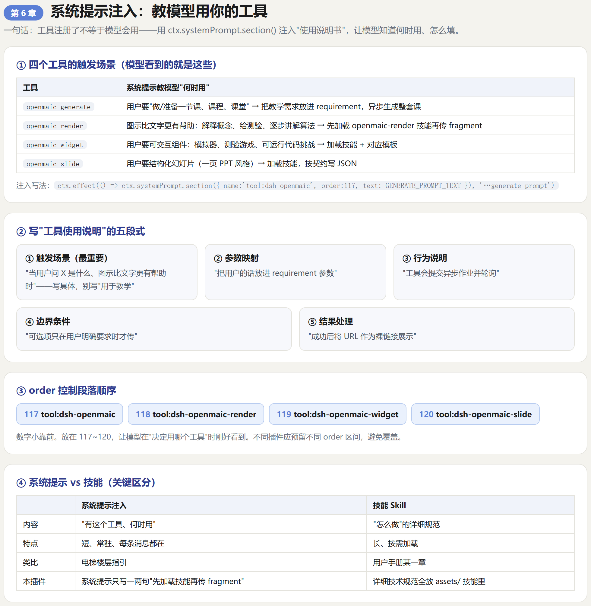


> 本章目标：理解 dsh 的 "系统提示（System Prompt）" 机制，学会像 dsh-openmaic 一样，把 "工具使用说明书" 注入给模型。

## 6.1 为什么工具需要 "被教"

你已经注册了工具，但模型**不会自动知道**：


* 这个工具是干嘛的？

* 什么时候该用它？

* 参数怎么填？

模型就像一个新员工，**工具是办公桌上的新设备，但没人告诉他这台设备什么时候用、怎么用**。所以我们需要 "入职培训"—— 把使用说明注入到模型的系统提示里。

dsh 的机制是：插件可以通过 `ctx.systemPrompt.section(...)` 往系统提示里**追加一段固定文字**。每次对话，模型都会带着这段文字思考，从而知道 "有这些工具可用、该怎么用"。

## 6.2 ctx.systemPrompt.section 的用法

看 dsh-openmaic 的 `src/index.ts`：


```
ctx.effect(() => ctx.systemPrompt.section({

  name: 'tool:dsh-openmaic',      // 这段提示的"身份证"

  order: 117,                     // 排序权重（越小越靠前）

  text: GENERATE_PROMPT_TEXT,     // 正文

}), 'dsh-openmaic.generate-prompt')
```

它注入了 4 段（对应 4 个工具）：


```
// 教模型用 openmaic_generate

const GENERATE_PROMPT_TEXT = `## Generate OpenMAIC classroom (openmaic_generate)

Use openmaic_generate when the user asks you to create or prepare a lesson, course, or classroom

(for example "帮我做一节 XX 课" or "make a lesson about X"). Put the teaching requirement in `requirement`.

The tool submits an async job to open.maic.chat, waits for it, and returns a playable classroom URL.

Only pass the optional flags (language, enableWebSearch, ...) when the user actually asked for them.

On success, show the returned Classroom URL to the user as a bare link they can open.`

// 教模型用 openmaic_render

const RENDER_PROMPT_TEXT = `## Render OpenMAIC teaching card (openmaic_render)

Use openmaic_render when a visual helps more than text: explaining a concept, giving a quiz,

walking through an algorithm or a multi-step process, or showing a slide. ...`

// 教模型用 openmaic_widget

const WIDGET_PROMPT_TEXT = `## Render OpenMAIC interactive widget (openmaic_widget)

Use openmaic_widget when the user wants an interactive teaching widget: a simulation, a quiz

or puzzle game, or a runnable code challenge. ...`

// 教模型用 openmaic_slide

const SLIDE_PROMPT_TEXT = `## Render OpenMAIC slide (openmaic_slide)

Use openmaic_slide when the user wants a structured slide (a single PPT-style page) rendered inline. ...`
```

## 6.3 写好一段 "工具使用说明" 的方法论

对比 dsh-openmaic 的四段提示，它们都遵循同样的结构：


```
## 工具名（工具名）

Use <工具名> when <什么场景该用它>                    ← ① 触发场景（最重要）

Put <关键内容> in `参数名`。                           ← ② 参数怎么填

The tool <它会做什么/流程如何>。                       ← ③ 行为说明

Only pass <可选参数> when <用户确实要求>。              ← ④ 边界条件

On success, <怎么向用户展示结果>。                     ← ⑤ 结果处理
```

**编写要点（都是 dsh-openmaic 的真实写法）：**


1. **触发场景写具体**：不要写 "用于教学卡片"，要写 "当用户问 'X 是什么 ' 且图示比文字更有帮助时"；

2. **参数映射写明确**：明确告诉模型 " 把用户的话放进 `requirement` 参数 "；

3. **可选项默认别传**：比如 `language`、`enableWebSearch` 只有在用户明确要求时才传，避免模型自作主张；

4. **结果处理写清楚**：生成成功后 "show the returned URL to the user as a bare link"。

## 6.4 order 数字：控制段落顺序


```
order: 117   ← tool:dsh-openmaic

order: 118   ← tool:dsh-openmaic-render

order: 119   ← tool:dsh-openmaic-widget

order: 120   ← tool:dsh-openmaic-slide
```

**order 的作用：** 系统提示由很多段落组成（dsh 自己有很多段）。`order` 决定这些段落拼接时的先后。数字小靠前，数字大靠后。dsh-openmaic 把工具说明放在 117~120，是为了排在系统其它说明之后、靠近工具列表，让模型在 "决定用哪个工具" 的时候刚好看到。

**经验：** 给不同插件的段落预留不同的 order 区间，避免互相覆盖或顺序混乱。

## 6.5 什么时候注入 vs 什么时候用技能

这里有一个**重要区分**，很多新手会混淆：


| 机制            | 作用               | 特点                   | 用在哪        |
| ------------- | ---------------- | -------------------- | ---------- |
| **系统提示注入**    | 告诉模型 "有这个工具、何时用" | 短、常驻、每条消息都在          | 工具触发的 "指南" |
| **技能（Skill）** | 告诉模型 "怎么做" 的详细规范 | 长、按需加载（模型第一次调用工具前才读） | 创作契约、模板    |

**类比：**


* 系统提示 = 电梯里的 "楼层指引"（简短，随时可见）；

* 技能 = 用户手册的某一章（详细，需要时才翻开）。

dsh-openmaic 的分工非常清晰：


* 系统提示只写**一两句话**："用 openmaic_render 当图示更有帮助时，先加载 openmaic-render 技能，再传 fragment"；

* 真正详细的技术规范（怎么写 HTML、有哪些样式类、模板长什么样）全部放在**技能**里，按需加载。

### 动手练习 6-1


1. 给你第 4 章的 `text_counter` 工具写一段系统提示（模仿 dsh-openmaic 的结构：触发场景 + 参数映射 + 边界 + 结果处理）；

2. 思考：什么内容适合放系统提示，什么内容适合放技能？各举一个例子。


***

# 第 7 章 技能（Skill）开发：写 "给 AI 的说明书"

> 🖼 本章信息图（原 HTML 源文件在 `课程信息图/第7章.html`）


> 本章目标：学会注册技能提供者，学会写一份 "创作契约" 文档，并理解 dsh-openmaic 的模板系统。

## 7.1 技能和工具的分工（再强调）


```
工具（Tool）   = AI 的"手"  —— 执行动作

技能（Skill）  = AI 的"脑内说明书" —— 按什么规范做
```

**技能不是代码逻辑，而是 "一段给模型读的文档"**（markdown）。模型在需要时会加载它，照着写。

dsh 的技能系统有一个关键特性：**技能可以打包进插件里（bundled），也可以从外部加载。**

## 7.2 三个核心类型：SkillCandidate / SkillProvider / SkillDefinition

打开 `src/skill.ts`，这是 dsh-openmaic 的技能提供者。它定义了三样东西：

### ① SkillCandidate —— 候选技能（目录项）


```
const CANDIDATES: SkillCandidate[] = [

  {

    name: 'openmaic-render',

    description: 'Authoring contract for the openmaic_render tool, ...',

    invocation: { modelInvocable: true, userInvocable: true },  // 模型和用户都能调用

    provider: 'dsh-openmaic',          // 由哪个提供者提供

    source: 'bundled',                 // 打包在插件内

    resourceBase: RESOURCE_BASE,       // 资源目录（assets/）

    rank: BUNDLED_SKILL_RANK,          // 排序

    locator: new URL('../assets/openmaic-render.md', import.meta.url),  // 正文文件位置

  },

  // ... 还有 openmaic-widget / openmaic-slide / openmaic-teach

]
```

**理解：Candidate 是 "目录页"，告诉系统 "有这个技能、在哪能找到它的正文"。**

### ② SkillProvider —— 提供者（把目录和正文接起来）


```
export const openmaicSkillProvider: SkillProvider = {

  name: 'dsh-openmaic',

  // 列出所有候选

  list: () => Promise.resolve(CANDIDATES),

  // 按候选返回完整技能定义（读取正文文件）

  async get(candidate): Promise<SkillDefinition> {

    const match = CANDIDATES.find(c => c.name === candidate.name) ?? CANDIDATES[0]!

    return {

      name: match.name,

      description: match.description,

      invocation: match.invocation,

      provider: match.provider,

      source: match.source,

      resourceBase: RESOURCE_BASE,

      content: await readFile(match.locator as URL, 'utf8'),  // ★ 把 markdown 正文读出来

    }

  },

}
```

**关键：**`content`** 就是技能真正的 "正文"，模型加载技能时读到的就是这段 markdown。**

### ③ 资源定位


```
const RESOURCE_BASE = {

  kind: 'directory',

  path: fileURLToPath(new URL('../assets/', import.meta.url)),

} as const
```

`assets/` 是技能正文和模板的家。用 `new URL('../assets/xxx.md', import.meta.url)` 定位文件，路径跟编译产物（lib/）是相对关系，打包后依然有效。

## 7.3 注册技能：和工具一样在 apply 里

在 `src/index.ts` 里：


```
ctx.effect(() => ctx.skills.registerProvider(() => openmaicSkillProvider), 'dsh-openmaic.skill')
```

`registerProvider(() => openmaicSkillProvider)` 注意这里传的是一个 "返回提供者的函数"，这是 dsh 技能系统的约定（延迟求值）。

## 7.4 写一份好的 "创作契约"：拆解 openmaic-render.md

技能正文就是 `assets/openmaic-render.md`。看它怎么教模型的：


```
# openmaic_render authoring contract      ← 标题：这是什么规范

You are a teaching agent. When the user wants to see ... write an HTML fragment

and hand it to the openmaic_render tool.   ← 角色 + 触发场景

## Fragment contract                        ← 硬性规则

Write ONLY the inline body: markup, a <style> block, and optionally a <script>.

Do not include <!doctype>, <html>, <head>, or <body>; ...

Rules:

- Inline all data. The frame blocks fetch/XHR/WebSocket, ...

- Keep it small. The tool rejects fragments over 256 KB.

- Use the base classes below (card, btn, viz-grid, ...)

- Self-grading quizzes: implement grading in a <script> ...

## When to call                            ← 何时调用

- The user asks a "what is X / how does X work" question and a diagram ... would help.

- The user asks for practice questions or a quiz.

- ...

## Minimal example                          ← 最小示例（手把手）

<div class="card">...</div>
```

**一份好契约的 5 个要素：**


1. **角色设定**："You are a teaching agent"—— 让模型进入状态；

2. **触发场景**：什么时候该写这种内容；

3. **硬性规则**：必须遵守的约束（禁什么、限多大）；

4. **最佳实践**：推荐的样式类、做法；

5. **示例**：一个最小可用的例子（最有教学效果）。

## 7.5 模板系统：把 "长规范" 拆到单独文件

widget 和 slide 的技能正文很短，真正的大头在**模板**里：


```
assets/

├── openmaic-widget.md          ← 短入口：说明 3 种类型 + 硬性要求

└── widget-templates/

├── simulation.md           ← ★ 长模板：模拟器怎么写（各种坑）

├── game.md                 ← ★ 长模板：游戏怎么写

└── code.md                 ← ★ 长模板：代码练习怎么写

assets/

├── openmaic-slide.md           ← 短入口：说明画布 + 输出结构

└── slide-template/

├── system.md               ← ★ 长契约：幻灯片元素规范（30KB）

└── user.md                 ← 填表模板
```

**设计思想：** 技能正文保持短小（快速决定要不要用），详细规范放模板（需要时才加载完整细节）。这样既不给模型增加负担，又能保证质量。

**看 simulation.md 教模型什么（都是 "血的教训"）：**


* 必须有 `postMessage` 监听器（响应 `SET_WIDGET_STATE` 等指令）；

* 元素命名规范：`{变量}-slider`、`{动作}-btn`、`{变量}-display`；

* 重置按钮**必须真的重置所有状态**（常见 bug）；

* 模拟器必须有**肉眼可见的动画**（不是只变数字）；

* 移动端布局不能重叠、触控目标 ≥ 44px；

* 输出**恰好一个** HTML 文档，禁止重复。

**这些内容不是随便写的，而是从真实 bug 里总结的 "避坑手册"。** 写技能的最高境界，就是把你踩过的坑变成模型不会踩的坑。

### 动手练习 7-1


1. 给你的插件加一个技能 `text-counter-guide`：内容教模型 "怎么用 text_counter 工具"，包含触发场景、规则、一个示例；

2. 在 apply 里注册这个技能的 provider（模仿 skill.ts）；

3. 让模型在 dsh 里调用它，观察它是否先加载技能再写参数。

> 技能教会了模型 "怎么做"，第 8 章我们写一个真正调用外部 API 的工具。


***

# 第 8 章 HTTP 客户端工具：openmaic_generate

> 🖼 本章信息图（原 HTML 源文件在 `课程信息图/第8章.html`）

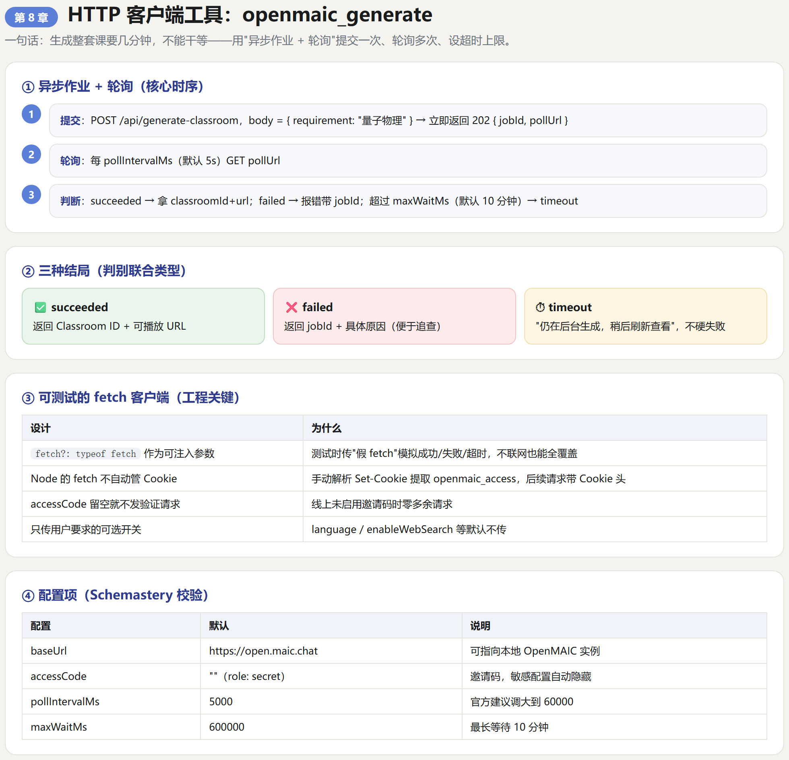


> 本章目标：学会写 "调用外部服务" 的工具 —— 用 "异步作业 + 轮询" 模式，并掌握可测试的 fetch 客户端设计。

## 8.1 问题：生成一个课堂很慢，怎么办？

`openmaic_generate` 要做的事：把教学需求发给 open.maic.chat，等它生成一整套课堂，然后返回链接。

但问题来了：**生成一整套课堂可能要几分钟**。不可能让工具调用 "干等几分钟"，那模型会超时。

**解决方案：异步作业（async job）+ 轮询（polling）。**

模型调用 openmaic_generate

│

▼

① POST /api/generate-classroom  {requirement: "量子物理"}

◄── 立即返回 {jobId: "job-123", pollUrl: ".../api/jobs/job-123"}

│

▼

② 循环轮询 pollUrl（每隔几秒一次）

├─ status = "processing" → 继续等

├─ status = "succeeded"  → 拿到 classroomId + url，返回成功

├─ status = "failed"     → 返回失败原因

└─ 超过 maxWaitMs        → 返回 "还在后台生成"

**核心思想：** 提交请求只花一次 HTTP；"等待结果" 用轮询来完成，并且**设上限**（`maxWaitMs`），避免无限等待。

## 8.2 可测试的 fetch 客户端：把 fetch 变成 "可注入参数"

这是本段最重要的工程技巧。看 `src/client.ts` 的设计：


```
export interface GenerateClassroomOptions {

  baseUrl: string

  accessCode: string

  pollIntervalMs: number

  maxWaitMs: number

  requirement: string

  language?: string

  enableWebSearch?: boolean

  ...

  fetch?: typeof fetch   // ★ 关键：可注入的 fetch

}
```

**为什么把 **`fetch`** 也作为一个参数？** 因为单元测试时，我们不想真的联网请求 open.maic.chat。把 fetch 变成可注入参数，测试就能传入一个 "假 fetch"，模拟各种返回（成功 / 失败 / 超时）。


```
export async function generateClassroom(options: GenerateClassroomOptions): Promise<GenerateOutcome> {

  const doFetch = options.fetch ?? fetch   // 用注入的 fetch，没有就用全局的

  ...

}
```

测试里的用法（`tests/client.spec.ts`）：


```
const fakeFetch = (async (url: unknown, init?: RequestInit) => {

  if (String(url).endsWith('/api/generate-classroom')) {

    return jsonResponse({ jobId: 'job-1', pollUrl: '...' }, 202)

  }

  return jsonResponse({ status: 'succeeded', result: { classroomId: 'class-1', url: '...' } })

}) as typeof fetch

await generateClassroom({ ...baseOptions(), fetch: fakeFetch })
```

**这样设计的好处：** 客户端逻辑（提交、轮询、状态判断、超时）全部被测试覆盖，不需要真实网络。

## 8.3 Cookie 处理：Node 的 fetch 不自动管 Cookie

浏览器里 fetch 会自动管理 Cookie，但 **Node 的 fetch 不会**。所以 dsh-openmaic 手动处理：


```
// ① 从 Set-Cookie 响应头里提取 openmaic_access 的值

export function extractAccessCookie(setCookie: string | null): string | undefined {

  if (!setCookie) return undefined

  const match = /(?:^|[;,\s])openmaic_access=([^;,\s]+)/.exec(setCookie)

  return match?.[1]

}
```


```
// ② 后续请求手动带上 Cookie 头

let cookie = ''

if (options.accessCode !== '') {

  const verifyRes = await doFetch(`${baseUrl}/api/access-code/verify`, { method: 'POST', ... })

  const value = extractAccessCookie(verifyRes.headers.get('set-cookie'))

  if (value !== undefined) cookie = `openmaic_access=${value}`

}

const cookieHeader: Record<string, string> = cookie === '' ? {} : { cookie }
```

**注意点：**


* 只有配置了 `accessCode` 才走验证流程（线上未启用时留空，就不发这个请求）；

* `Set-Cookie` 是 `openmaic_access=xxx; Path=/; HttpOnly` 这种格式，要正确解析出值。

## 8.4 状态机：三种终态 + 清晰错误

`GenerateOutcome` 被设计成**联合类型**（判别联合），明确区分三种结局：


```
export type GenerateOutcome =

  | { status: 'succeeded'; classroomId: string; url: string }

  | { status: 'failed'; jobId: string | undefined; error: string }

  | { status: 'timeout'; jobId: string | undefined; error: string }
```

**为什么用联合类型？** 调用方（index.ts 里的工具 execute）可以精确判断每一种情况：


```
if (outcome.status === 'succeeded') {

  return `Classroom ID: ${outcome.classroomId}\nClassroom URL:\n${outcome.url}`

}

throw new Error(outcome.error)   // failed / timeout 都当错误抛出
```

轮询循环的关键代码：


```
const deadline = Date.now() + options.maxWaitMs

for (;;) {

  const poll = await readJson(await doFetch(pollUrl, { headers: cookieHeader }), 'poll')

  const status = typeof poll.status === 'string' ? poll.status : ''

  if (status === 'succeeded') { ... return succeeded }

  if (status === 'failed')    { ... return failed }

  if (Date.now() >= deadline) { ... return timeout }   // 超时兜底

  await sleep(options.pollIntervalMs)                  // 没到点，睡一会儿再轮询

}
```

**错误信息的质量：**


* 失败时带 `jobId`，方便用户向服务商查问题；

* 超时时明确说 "仍在后台生成，稍后回来查看"，不是硬邦邦的 "失败"。

## 8.5 配置项：工具行为可调节

`openmaic_generate` 的行为由插件配置控制（`src/index.ts` 的 Config）：


```
export const Config = z.object({

  baseUrl: z.string().default('https://open.maic.chat')

    .description('OpenMAIC API base URL. ...'),

  accessCode: z.string().role('secret').default('')

    .description('Invite code ...'),

  pollIntervalMs: z.number().step(1).min(1_000).default(5_000)

    .description('Polling interval in milliseconds. ...'),

  maxWaitMs: z.number().step(1).min(1_000).default(600_000)

    .description('How long to poll one job before giving up, ...'),

})
```

**两个细节：**


1. 用的是 **Schemastery**（`z.object`）做配置校验，`.min()`、`.default()` 自动处理边界；

2. `accessCode` 标了 `.role('secret')`——**敏感配置自动隐藏**，不会泄露在界面 / 日志里。

工具执行时把这些配置解析成最终值（`resolved`），传给客户端：


```
const resolved = {

  baseUrl: config.baseUrl ?? 'https://open.maic.chat',

  ...

}
```

### 动手练习 8-1


1. 写一个客户端 `src/summon.ts`：调用某个公开 API（比如一个返回 "今日金句" 的接口），用 "可注入 fetch" 模式；

2. 给它加配置 `apiUrl`、`timeoutMs`；

3. 写两个测试：一个模拟成功返回，一个模拟接口报错。


***

# 第 9 章 浏览器端渲染：Toolview / 沙箱 / 流式预览

> 🖼 本章信息图（原 HTML 源文件在 `课程信息图/第9章.html`）

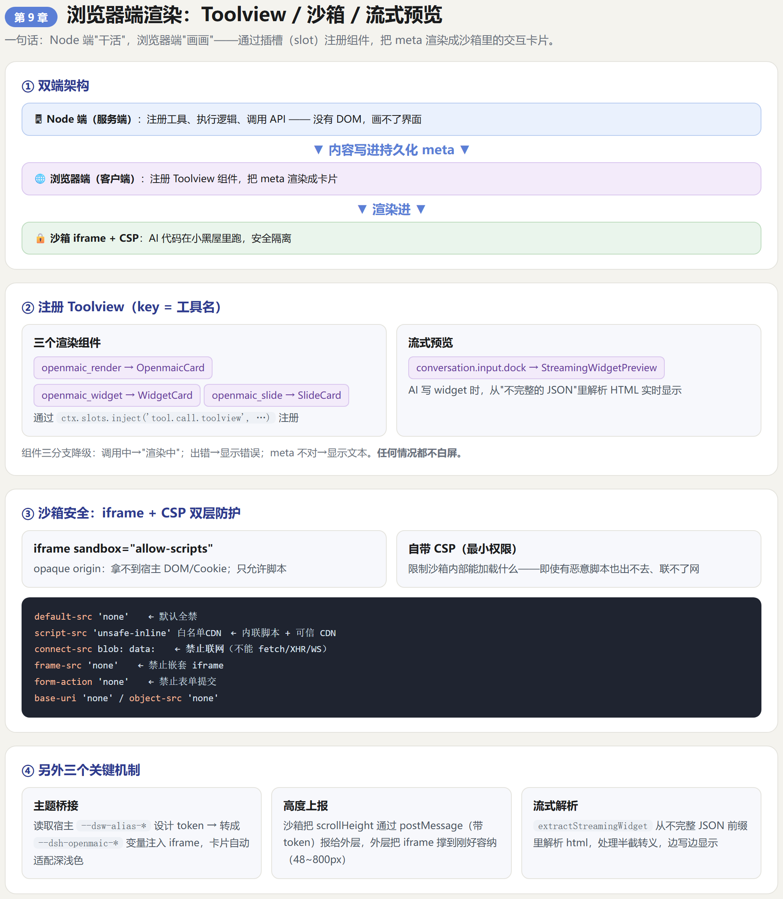


> 本章目标：理解 dsh 插件的 "浏览器半边"—— 它怎么把工具结果渲染成好看的交互卡片，以及沙箱安全是怎么做的。

## 9.1 为什么要分 "浏览器半边"？

还记得第 2 章吗？dsh 插件有两副身体：


```
Node 端（服务端）   → 注册工具、执行逻辑、调用 API     ← 跑在 Node 进程里

浏览器端（客户端）   → 把结果渲染成界面                  ← 跑在浏览器里
```

**为什么渲染要在浏览器端做？** 因为：


1. Node 端没有 DOM，画不了界面；

2. 渲染 AI 生成的内容有安全风险，需要用浏览器的沙箱机制隔离；

3. 交互（点击、拖拽、动画）只能发生在浏览器里。

dsh 提供了一套 "插槽（slot）" 机制，让插件在浏览器端注册自己的组件。

## 9.2 浏览器端入口：注册 Toolview

看 `src/client/index.tsx`：


```
export const name = 'dsh-openmaic'

export const inject = ['slots']   // 浏览器端依赖"插槽"服务

export function apply(ctx: ClientContext): void {

  // 把 openmaic_render 工具的结果，交给 OpenmaicCard 组件渲染

  ctx.slots.inject('tool.call.toolview', () => ctx.slots.register(

    { name: 'tool.call.toolview', key: 'openmaic_render' },  // key = 工具名

    OpenmaicCard,

  ))

  // 同理注册 widget / slide 的组件

  ctx.slots.inject('tool.call.toolview', () => ctx.slots.register(

    { name: 'tool.call.toolview', key: 'openmaic_widget' }, WidgetCard))

  ctx.slots.inject('tool.call.toolview', () => ctx.slots.register(

    { name: 'tool.call.toolview', key: 'openmaic_slide' }, SlideCard))

  // 再注册一个"输入框下方的流式预览"插槽

  ctx.slots.inject('conversation.input.dock', () => ctx.slots.register(

    { name: 'conversation.input.dock', id: 'openmaic-widget-stream', order: 30 },

    StreamingWidgetPreview,

  ))

}
```

**理解：**


* `tool.call.toolview` 是一个 "插槽"，专门用来承接 "某个工具的结果展示"；

* `key: 'openmaic_render'` 表示 "只处理 openmaic_render 这个工具的结果"；

* 组件拿到工具的 `block`（调用信息），从中读取持久化 meta 并渲染。

**为什么用 **`ctx.slots.inject(... => ctx.slots.register(...))`** 这种嵌套写法？** 这是 dsh 浏览器端的约定：先等插槽的声明就绪，再注册，避免启动时竞争（源码注释：*"a direct register racing the declaration fails boot"*）。

## 9.3 React 组件怎么读数据渲染

看 `OpenmaicCard.tsx` 的核心逻辑：


```
export function OpenmaicCard({ callId, block }: ToolCallViewProps) {

  // ① 调用还没结束（没有结果）→ 显示"渲染中"

  if (!('kind' in block)) {

    return <div style={headerStyle}>OpenMAIC · rendering…</div>

  }

  // ② 工具报错 → 显示错误第一行

  if (block.isError) {

    return <div style={headerStyle}>OpenMAIC · {firstResultLine(block.content)}</div>

  }

  // ③ 从持久化 meta 里取出片段（第 5 章的收窄函数）

  const meta = openmaicMetaFrom(block.meta)

  if (meta === undefined) {

    return <div style={headerStyle}>{firstResultLine(block.content)}</div>

  }

  // ④ 正常 → 渲染完整的卡片框架（iframe 沙箱）

  return <Frame meta={meta} callId={callId} />

}
```

**三个分支的降级设计：** 调用中显示 "渲染中"、出错显示错误、meta 不对显示文本 ——**任何情况下都不会白屏**。这是前端健壮性的关键。

`Frame` 组件把片段包进沙箱 iframe：


```
<iframe

  sandbox="allow-scripts"              // ★ 只允许脚本，其余全部禁止

  referrerPolicy="no-referrer"

  title={meta.title}

  srcDoc={doc}                          // ★ 用 srcdoc 注入文档内容

  style={{ ...frameStyle, height }}     // 高度由内容自适应

/>
```

## 9.4 沙箱文档的组装：shell.ts

`src/client/shell.ts` 负责把 "AI 写的片段" 组装成一个**带安全策略的完整 HTML 文档**：


```
export function buildFrameDoc(options: FrameDocOptions): string {

  return `<!doctype html>

<html lang="zh-CN">

<head>

<meta charset="utf-8">

<meta name="referrer" content="no-referrer">

<meta http-equiv="Content-Security-Policy" content="${FRAME_CSP}">  <!-- ★ CSP -->

<title>${escapeHtml(options.title)}</title>

<style>${FRAME_CSS} ...</style>

</head>

<body>

${options.fragment}                       <!-- ★ AI 写的片段嵌在这里 -->

<script>${heightReporter(options.reportToken)}</script>  <!-- ★ 高度上报 -->

</body>

</html>`

}
```

**要点：**


1. **CSP 由插件自己提供**——AI 的片段只是 "内容"，文档骨架和策略都是插件的；

2. `escapeHtml(title)` 防止标题注入；

3. `heightReporter` 让沙箱页面把自己的高度 "上报" 给外层，外层据此把 iframe 撑到刚好容纳内容。

## 9.5 CSP：安全的核心

`FRAME_CSP` 是安全最关键的一行配置：


```
export const FRAME_CSP = [

  "default-src 'none'",                                    // 默认全部禁止

  `script-src 'unsafe-inline' 'unsafe-eval' 'wasm-unsafe-eval' ${RESOURCE_SOURCES}`,  // 只允许内联脚本 + 白名单 CDN

  `style-src 'unsafe-inline' ${RESOURCE_SOURCES}`,         // 样式同上

  `img-src ${RESOURCE_SOURCES}`,                           // 图片白名单

  `font-src ${RESOURCE_SOURCES}`,                          // 字体白名单

  `media-src ${RESOURCE_SOURCES}`,                         // 媒体白名单

  "worker-src blob:",                                      // Worker 只允许 blob

  'connect-src blob: data:',                               // ★ 禁止联网！不能 fetch/XHR/WebSocket

  "frame-src 'none'",                                      // 禁止嵌套 iframe

  "object-src 'none'",                                     // 禁止 object/embed

  "base-uri 'none'",                                       // 禁止篡改 base

  "form-action 'none'",                                    // 禁止表单提交

].join('; ')
```

**逐条翻译成人话：**


| 配置                                   | 效果                                   |
| ------------------------------------ | ------------------------------------ |
| `default-src 'none'`                 | 默认什么都禁止（最小权限原则）                      |
| `connect-src blob: data:`            | **沙箱里的代码不能访问网络**，数据只能通过 blob/data 传递 |
| `frame-src 'none'`                   | 不能嵌套 iframe（防 "套娃钓鱼"）                |
| `form-action 'none'`                 | 不能提交表单（防钓鱼）                          |
| `script-src 'unsafe-inline' ... 白名单` | 允许内联脚本运行（AI 的交互代码需要），但外部脚本只能来自可信 CDN |

**配合 **`<iframe sandbox="allow-scripts">`**：**


* `sandbox` 让 iframe 是 **opaque origin**（拿不到宿主页面的 DOM/Cookie）；

* CSP 限制**沙箱内部**能加载什么；

* 双层防护：即使 AI 写了一段恶意脚本，它既出不去（opaque origin）、又联不了网（CSP）。

## 9.6 主题桥接：让卡片跟宿主界面 "长一个样"

沙箱 iframe 是隔离的，那它怎么知道宿主是浅色还是深色主题？dsh-openmaic 用 `theme.ts` 做 "主题桥接"：


```
// 宿主的 design token → 沙箱里的 CSS 变量

const TOKEN_BRIDGE = [

  ['foreground', '--dsw-alias-label-primary'],

  ['card',       '--dsw-alias-bg-layer-1'],

  ['muted-foreground', '--dsw-alias-label-caption'],

  ['border',     '--dsw-alias-border-l2'],

  ['primary',    '--dsw-alias-brand-primary-new-colorprimary-new-color'],

  ...

]

export function resolveTheme(): ResolvedTheme {

  const computed = getComputedStyle(document.body)

  const themeVars = {}

  for (const [frameName, hostToken] of TOKEN_BRIDGE) {

    themeVars[frameName] = computed.getPropertyValue(hostToken)  // 读取宿主的实际配色

  }

  // 判断宿主是深色还是浅色

  ...

  return { themeVars, colorScheme }

}
```

**流程：** 宿主主题色 → 读取计算样式 → 写成 `--dsh-openmaic-*` 变量 → 注入 iframe 的 `:root` → 沙箱里的卡片用这些变量上色。这样卡片**自动适配** dsh 的浅色 / 深色主题，浑然一体。

## 9.7 高度上报：让 iframe 刚刚好

沙箱 iframe 里内容高度不固定（卡片可长可短），外层怎么知道该把 iframe 设多高？

dsh-openmaic 的方案：**沙箱页面把自己的 scrollHeight 通过 **`postMessage`** 上报给外层**：


```
// shell.ts 里注入的高度上报脚本（简化）

function heightReporter(reportToken: string): string {

  return `

  (function () {

    var post = function () {

      parent.postMessage({

        type: ${JSON.stringify('dsh-openmaic:height')},

        token: ${JSON.stringify(reportToken)},

        height: document.documentElement.scrollHeight,

      }, '*');

    };

    new ResizeObserver(post).observe(document.documentElement);

    addEventListener('load', post);

    post();

  })();

  `

}
```

外层组件监听这个消息，更新 iframe 高度（并限制在合理范围内，如 48~800px）：


```
useEffect(() => {

  const onMessage = (event: MessageEvent) => {

    const report = event.data

    if (report.type !== 'dsh-openmaic:height' || report.token !== callId) return

    if (typeof report.height !== 'number') return

    setHeight(Math.max(MIN_HEIGHT, Math.min(Math.ceil(report.height), HEIGHT_CAP)))

  }

  addEventListener('message', onMessage)

  return () => removeEventListener('message', onMessage)

}, [callId])
```

**关键：**`token`**（这里是 callId）用来识别 "是哪次调用上报的高度"，防止消息串台。**

## 9.8 流式预览：边写代码边实时显示

widget 工具有个很酷的功能：AI 还在生成 HTML 时，输入框下方就实时显示代码。实现它需要两个部件：

**① 流式解析 **`extractStreamingWidget`**（widget-meta.ts）**

模型调用工具时，参数是以 JSON 流式生成的（可能还没写完整）。这个函数从 "不完整的 JSON 前缀" 里把 `html` 值解析出来：


```
export function extractStreamingWidget(argsRaw: string): string | undefined {

  const opener = /"html"\s*:\s*"/u.exec(argsRaw)   // 找到 "html": " 开头

  if (!opener) return undefined                     // 还没写到 html 字段

  let out = ''

  for (let i = opener.index + opener[0].length; i < argsRaw.length; i++) {

    const ch = argsRaw[i]!

    if (ch === '"') return out                      // 遇到结尾引号 → 完整了

    if (ch !== '\\\\\\\\\') { out += ch; continue }

    // 处理转义字符（\n \" \\ \uXXXX 等）

    ...

  }

  return out                                        // 没遇到结尾引号 → 返回已解析的部分

}
```

**注意处理 "半截转义"**：如果流式数据恰好停在 `\u` 中间，就返回已安全解析的部分，而不是猜一个错误的字符。

**② 预览组件 StreamingWidgetPreview**


```
export function StreamingWidgetPreview({ session }: PropsRuntime<'conversation.input.dock'>) {

  const blocks = session?.partial?.blocks   // 模型正在流式生成的工具调用块

  if (blocks === undefined) return null

  let argsRaw

  for (const block of blocks) {

    if (block.kind === 'tool-call' && block.name === 'openmaic_widget') argsRaw = block.argsRaw

  }

  if (argsRaw === undefined) return null

  const html = extractStreamingWidget(argsRaw)   // 边写边解析

  if (html === undefined || html.trim() === '') return null

  return <Preview html={html} />                 // 展示成代码框

}
```

**这样用户就能看到 AI 正在 "打字" 写模拟器的全过程，体验非常流畅。**

### 动手练习 9-1


1. 给你的 `text_counter` 工具注册一个浏览器端 toolview 组件，把结果渲染成一个带标题的卡片；

2. 在组件里处理三种情况：调用中 / 出错 / 正常结果；

3. 思考：如果 AI 返回的内容要安全渲染，你会怎么设计 CSP？（参考 9.5 的最小权限原则）

> 前端能渲染了，第 10 章解决 "怎么打包" 这个关键技术难题。


***

# 第 10 章 构建与打包：tsdown 双端

> 🖼 本章信息图（原 HTML 源文件在 `课程信息图/第10章.html`）

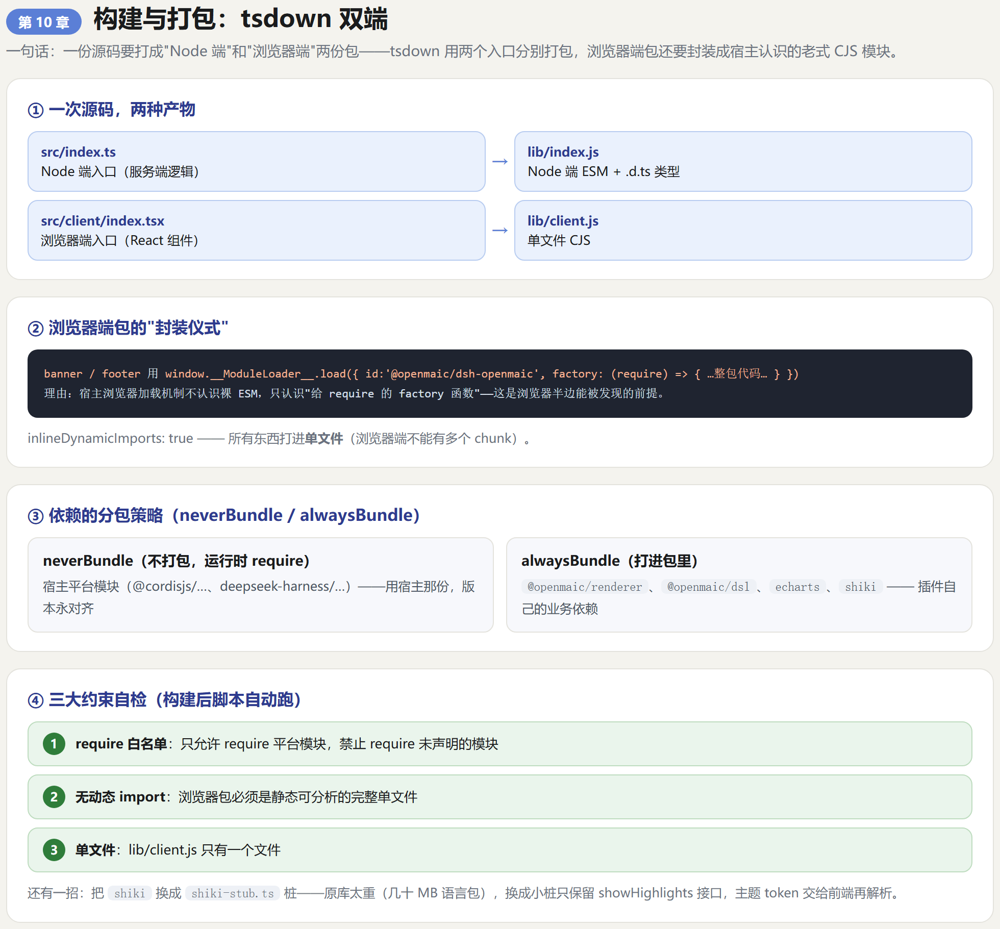


> 本章目标：理解 dsh 插件 "一个项目、两份产物" 的打包方式，学会读 tsdown.config.ts 和 build.sh。

## 10.1 为什么需要 "双端打包"

还记得插件有两副身体吗？它们要打包成**两份不同的产物**：


| 产物              | 内容                  | 格式         | 运行环境    |
| --------------- | ------------------- | ---------- | ------- |
| `lib/index.js`  | Node 端（工具注册、客户端逻辑）  | ESM        | Node 进程 |
| `lib/client.js` | 浏览器端（React 组件、沙箱渲染） | CJS + 特殊包装 | 浏览器     |

dsh-openmaic 用 **tsdown** 一次配置、两份打包。

## 10.2 tsdown.config.ts 逐段拆解


```
import { fileURLToPath } from 'node:url'

import type { UserConfig } from 'tsdown'

const PLUGIN_ID = '@openmaic/dsh-openmaic'   // 插件 ID

// 浏览器端"平台模块"：这些由 dsh 的模块表提供，不打包进产物

const PLATFORM_MODULES = [

  'react', 'react/jsx-runtime', 'react-dom', 'react-dom/client',

  '@deepseek-ai/cordis',

  '@deepseek-ai/dsh-client-ui-slots',

  '@deepseek-ai/dsh-client-web-react',

  ...

] as const

// 浏览器端需要保持"外部"的模块（运行时由 dsh 提供）

const CLIENT_EXTERNALS = [...PLATFORM_MODULES, '@deepseek-ai/dsh-client-runtime/client']

// shiki 代码高亮库：既不能外部化也不能打包，所以用一个本地桩替代（见 10.4）

const SHIKI_STUB = fileURLToPath(new URL('./src/client/shiki-stub.ts', import.meta.url))

export default [

  // ============ 产物一：Node 端 ============

  {

    entry: { index: 'src/index.ts' },

    outDir: 'lib',

    format: ['esm'],

    platform: 'node',

    target: 'es2024',

    fixedExtension: false,

    dts: true,                 // 生成 .d.ts 类型声明

    clean: true,               // 打包前清空 lib/

    deps: {

      // schemastery/cordis 不打包：dsh 的 Loader 要用自己的实例校验 Config

      neverBundle: ['@deepseek-ai/schemastery', '@deepseek-ai/cordis'],

    },

  },

  // ============ 产物二：浏览器端 ============

  {

    entry: { client: 'src/client/index.tsx' },

    outDir: 'lib',

    format: 'cjs',

    platform: 'browser',

    dts: false,

    clean: false,

    deps: {

      // 平台模块保持外部（运行时由 dsh 的模块表提供）

      neverBundle: [...CLIENT_EXTERNALS],

      // OpenMAIC 渲染器等重依赖必须打进去（模块表答不了它们）

      alwaysBundle: [/@openmaic\/(renderer|dsl)/, /^echarts($|\/)/, /^shiki($|\/)/],

    },

    alias: { shiki: SHIKI_STUB },              // shiki → 本地桩

    define: { 'process.env.NODE_ENV': JSON.stringify('production') },

    outputOptions: {

      entryFileNames: 'client.js',

      inlineDynamicImports: true,              // ★ 动态 import 内联成单文件

      banner: `window.__ModuleLoader__.load({ id: ${JSON.stringify(PLUGIN_ID)}, factory: (require) => {`,

      footer: `return module.exports; } });`,

      intro: 'var module = { exports: {} }; var exports = module.exports;',

    },

  },

] satisfies UserConfig[]
```

**逐段理解：**


1. `neverBundle`** vs **`alwaysBundle`：

* `neverBundle`（保持外部）= 运行时由别人提供（dsh 的平台模块表）；

* `alwaysBundle`（强制打包）= 模块表答不了它们，必须打进产物。

1. `inlineDynamicImports: true`：dsh 浏览器加载器**只加载一个经典脚本文件**，如果打包器把代码拆成多个 chunk，加载器根本不会去拉。所以必须把所有动态 import 内联成一个文件。

2. **banner/footer/intro**：浏览器产物不是普通 JS，而是用 dsh 的模块加载器包装：


```
// 产物大致形状

window.__ModuleLoader__.load({

  id: '@openmaic/dsh-openmaic',

  factory: (require) => {

    var module = { exports: {} };

    // ...你的组件代码...

    return module.exports;

  }

});
```

## 10.3 浏览器产物三大硬约束

这是 dsh 插件浏览器打包**最容易踩的坑**，build.sh 里专门有自检：


```
# ① require 白名单：产物里 require() 的模块必须都在允许列表内

ALLOWED_CLIENT_REQUIRES="react

react/jsx-runtime

...

@deepseek-ai/dsh-client-runtime/client"

# 逐个检查 lib/client.js 里的 require(...)

# 发现白名单外的 → 报错退出

# ② 不允许残留动态 import()（浏览器解析不了）

DYNAMIC=$(grep -o 'import("[^"]*")' lib/client.js ...)

if [ -n "$DYNAMIC" ]; then 报错; fi

# ③ 不允许拆分成多个 chunk

CHUNKS=$(find lib -name '*.cjs' ...)

if [ -n "$CHUNKS" ]; then 报错; fi
```

**三条规则的本质：** 浏览器加载器只能回答 "它自己提供的模块表" 里的 require，并且只能拉取 "单个文件"。所以产物必须：require 全在白名单、无动态 import、单文件。

## 10.4 shiki-stub：处理 "既不能打包也不能外部" 的依赖

`shiki` 是代码高亮库，但它在 dsh 浏览器插件里**两头都不行**：


| 方案                   | 问题                                     |
| -------------------- | -------------------------------------- |
| 保持外部（import "shiki"） | 浏览器解析不了裸的 import，运行时报错                 |
| 打包进来                 | 会把所有 TextMate 语法拆成几十 MB 的 chunk，加载器拉不了 |

**解决方案：用一个 "桩（stub）" 替代它**（`src/client/shiki-stub.ts`）：


```
// shiki-stub.ts：假装自己是 shiki

export function createHighlighter() {

  return Promise.resolve({

    getLoadedLanguages: () => [],

    codeToHtml: () => { throw new Error('dsh-openmaic: shiki is not bundled ...') },

  })

}
```

然后配置里 `alias: { shiki: SHIKI_STUB }`—— 打包时把 `shiki` 替换成这个桩。

**为什么能这样做？** 因为 `@openmaic/renderer` 在调用高亮时**已经用 try/catch 包好了**，高亮失败就回退成纯文本。所以：


```
真实 shiki 不可用 → 桩抛错 → 渲染器 catch → 降级为纯文本代码块
```

**教学重点：这是 "优雅降级"（graceful degradation）的典范 —— 依赖可以失败，但功能不能白屏。** 遇到类似 "又重又难打包" 的依赖，可以用桩 + 降级方案，而不是硬扛。

## 10.5 build.sh：链接宿主依赖

最后看 `scripts/build.sh` 里最特别的一步 ——**软链接宿主依赖**：


```
# 定位 dsh checkout（从 PATH 的 dsh 反推，或用 DSH_CHECKOUT 指定）

CHECKOUT="${DSH_CHECKOUT:-}"

...

# 把 dsh 源码里的包，软链接进本项目 node_modules

link_pkg() {

  local target="$CHECKOUT/$2"

  ln -sfn "$target" "node_modules/$1"

}

link_pkg @deepseek-ai/cordis          vendor/cordis

link_pkg @deepseek-ai/dsh-tools       packages/core/tools

link_pkg @deepseek-ai/dsh-skill       packages/skill/skill

link_pkg @deepseek-ai/dsh-llm         packages/llm/llm

...
```

**为什么这么做（回顾 1.6）：** 这样 TypeScript 编译器看到的 `@deepseek-ai/*` 就是**正在运行的 dsh 的那一份代码**，类型完全一致，永远不会出现 "插件用的类型和 dsh 实际的不一样" 这种鬼问题。

**build.sh 的完整流水线：**


```
定位 checkout → 软链接宿主依赖 → tsdown 打包两份产物 → 自检浏览器产物三大约束 → 完成
```

### 动手练习 10-1


1. 运行 `./scripts/build.sh`，观察 lib/ 里生成了什么；

2. 用编辑器打开 `lib/client.js` 开头，找到 `window.__ModuleLoader__.load(...)` 的包装；

3. 回答：为什么 `inlineDynamicImports` 必须为 true？


***

# 第 11 章 测试：从纯函数到集成

> 🖼 本章信息图（原 HTML 源文件在 `课程信息图/第11章.html`）

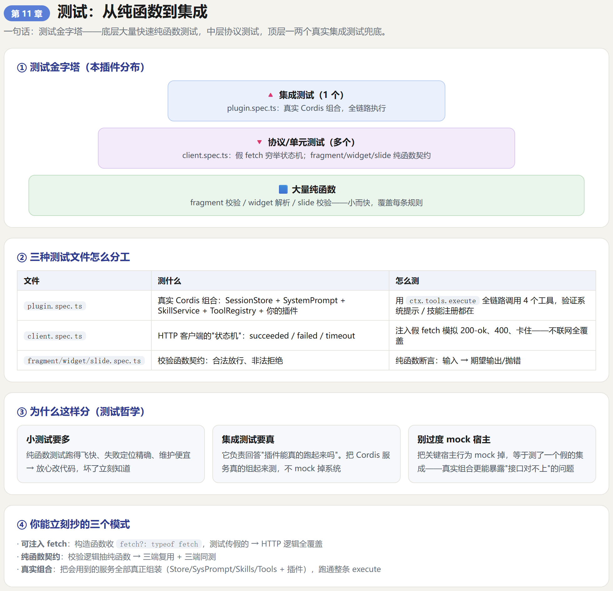


> 本章目标：学会 dsh 插件的测试体系 —— 纯函数测试、客户端测试、真实 Cordis 集成测试。

## 11.1 测试金字塔（dsh 插件版）

dsh-openmaic 的测试遵循 "金字塔" 结构：


```
         ┌───────────┐

         │ 集成测试    │  ← 少而精：真实 Cordis 组合，验证"插件能装、能注册"

         ├───────────┤

         │ 客户端测试  │  ← 中：HTTP 客户端逻辑（用假 fetch）

         ├───────────┤

         │ 纯函数测试  │  ← 多而快：契约校验、meta 收窄

         └───────────┘
```


| 层   | 文件                                 | 测什么                        | 速度 |
| --- | ---------------------------------- | -------------------------- | -- |
| 纯函数 | fragment / widget / slide .spec.ts | 校验规则、meta 收窄、流式解析          | 飞快 |
| 客户端 | client.spec.ts                     | 提交 / 轮询 / 失败 / 超时 / Cookie | 快  |
| 集成  | plugin.spec.ts                     | 插件注册、系统提示、技能目录             | 较慢 |

## 11.2 纯函数测试：把 "规则" 钉死

这是最容易也最该写全的一层。`tests/fragment.spec.ts` 把所有校验规则都测了一遍（第 5 章已见过）。

**测试的价值：** 每条规则都有一个测试 "钉子"，将来有人改坏规则，测试立刻变红，**防止回归**。

## 11.3 客户端测试：用假 fetch 模拟所有结局

`tests/client.spec.ts` 展示了如何不联网测 HTTP 逻辑：


```
function jsonResponse(payload, status = 200, headers?) {

  return new Response(JSON.stringify(payload), { status, headers })

}

// 测：提交 → 轮询 → 成功

it('submits, polls, and returns a classroom URL', async () => {

  const fakeFetch = (async (url, init) => {

    if (String(url).endsWith('/api/generate-classroom')) {

      return jsonResponse({ jobId: 'job-1', pollUrl: '.../api/jobs/job-1' }, 202)

    }

    return jsonResponse({ status: 'succeeded', result: { classroomId: 'class-1', url: '...' } })

  }) as typeof fetch

  const outcome = await generateClassroom({ ...baseOptions(), fetch: fakeFetch })

  expect(outcome).toEqual({ status: 'succeeded', classroomId: 'class-1', url: '...' })

})
```

**覆盖的场景（都是真实边界）：**


* 提交 + 轮询 + 成功返回 URL；

* 只传用户要求的可选参数（其他不传）；

* 带 accessCode 时先验证、再带上 Cookie；

* 作业失败 → 返回带 jobId 的错误；

* 超过 maxWaitMs → 返回 timeout；

* 提交接口报 400 → 抛错；

* 响应没有 pollUrl → 抛错；

* 结果没有 url → 用 classroomId 拼 URL。

**这就是 "穷举状态机" 式测试**—— 把客户端所有分支都走一遍。

## 11.4 集成测试：真实 Cordis 组合

`tests/plugin.spec.ts` 是最接近真实环境的测试 —— 它**真的把插件装进一个 Cordis 上下文**：


```
async function setup(config = {}) {

  const ctx = new Context()

  await ctx.plugin(SessionStore)     // 装上会话服务

  await ctx.plugin(SystemPrompt)     // 装上系统提示服务

  await ctx.plugin(SkillService)     // 装上技能服务

  await ctx.plugin(ToolRegistry)     // 装上工具服务

  await ctx.plugin(DshOpenmaic, config)  // ★ 装上我们的插件

  return ctx

}
```

然后通过**工具注册表**真实地执行工具（模拟模型调用）：


```
it('registers and answers through the registry with a bare classroom URL', async () => {

  const captured = stubGenerate()               // 全局 fetch 被替换成假实现

  const ctx = await setup()

  const result = await ctx.tools.execute({

    name: 'openmaic_generate',

    arguments: { requirement: 'quantum physics for beginners' },

    callId: CallId('call-1'),

    signal: new AbortController().signal,

    agent: {...},

  })

  expect(text(result)).toBe(

    'Classroom ID: class-1\nClassroom URL:\nhttps://open.maic.chat/classroom/class-1',

  )

})
```

**它验证的是 "整条链路"**：插件能不能装上、工具能不能注册、模型调用能不能走通、返回格式对不对、系统提示段落有没有注入、技能目录里有没有技能。

> 用
> `vi.stubGlobal('fetch', ...)`
> 可以在集成测试里也替换全局 fetch，模拟外部服务。

## 11.5 跑测试


```
./scripts/test.sh     # 或 npm test
```

脚本同样会先软链接宿主依赖，然后跑 vitest。

### 动手练习 11-1


1. 为你的 `text_counter` 写纯函数测试（空值、超长、正常）；

2. 为它写一个集成测试：装上 Cordis + 工具服务 + 你的插件，执行工具，断言返回格式；

3. 故意改坏一个规则，跑测试，观察它是怎么 "变红" 的，然后再改回来。


***

# 第 12 章 调试、常见坑与发布

> 🖼 本章信息图（原 HTML 源文件在 `课程信息图/第12章.html`）

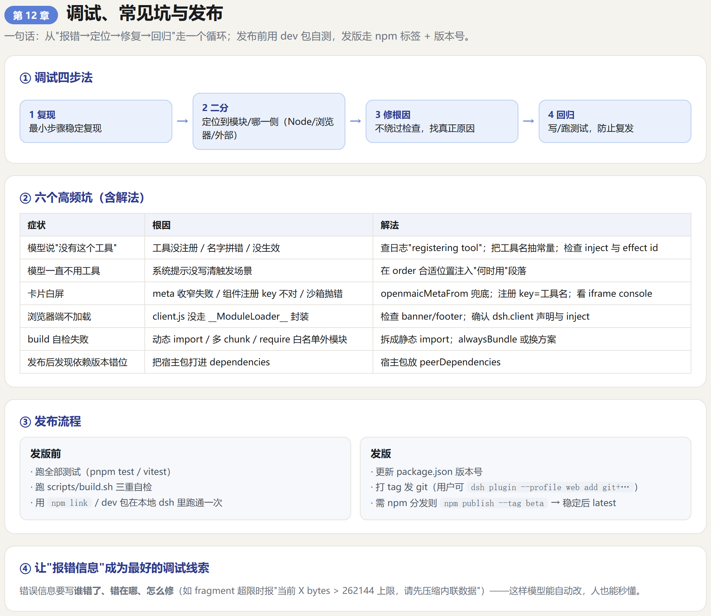


> 本章目标：掌握 dsh 插件开发最常见的坑和调试方法，并学会把插件打包发布。

## 12.1 常见报错与解决（对照表）


| 报错                                                                     | 原因                    | 解决办法                                           |
| ---------------------------------------------------------------------- | --------------------- | ---------------------------------------------- |
| `cannot locate the harness checkout`                                   | 脚本找不到 dsh 源码          | 设置 `DSH_CHECKOUT` 环境变量，或把 `dsh` 命令放进 PATH      |
| `lib/client.js requires modules the loader module table cannot answer` | 浏览器端引入了不该引入的 Node 端模块 | 把共享逻辑抽进纯模块（fragment.ts 那种），浏览器端只 import 纯模块    |
| `kept dynamic imports the browser cannot resolve`                      | 浏览器产物残留动态 `import()`  | 用 `inlineDynamicImports: true` 内联，或用 alias 换成桩 |
| `browser bundle split into chunks`                                     | 打包拆成多文件               | 同上，确保单文件                                       |
| 工具注册了但模型 "不调用"                                                         | 系统提示没写好               | 检查注入的 description /systemPrompt 段落是否说清了触发场景    |
| 渲染的卡片一片空白                                                              | meta 没对上 / 组件没注册      | 检查 `presentationMeta` 的 `kind` 是否和组件读取的一致      |
| 卡片能显示但样式错乱                                                             | 主题桥接失效                | 检查 `--dsw-alias-*` token 是否拼写正确                |

## 12.2 调试技巧

### ① 用系统提示段落的测试验证 "模型会不会用"

dsh-openmaic 的测试里专门断言了系统提示注入：


```
it('contributes a system-prompt section teaching the model when to call it', async () => {

  const assembly = await ctx.systemPrompt.assemble({ cwd: '/work' } as never)

  const section = assembly.sections.find(s => s.name === 'tool:dsh-openmaic')

  expect(section).toBeDefined()

  expect(String(section!.text)).toMatch(/openmaic_generate/)

})
```

**这是 "测试驱动的提示词调试"**：不用真对话，先验证提示段落确实注入了。

### ② 观察终端日志

dsh 启动时终端会打印插件加载日志。确认看到类似：


```
[my-plugin] plugin loaded!
```

### ③ 用 --patch 快速加载本地插件

开发期不用发布，直接本地加载：


```
pnpm dsh web --patch ./cordis.patch.yml
```

### ④ 缩小问题范围

插件不工作，按这个顺序排查：


1. **能加载吗？**（看终端日志）

2. **能注册吗？**（测试里 `ctx.tools.get('openmaic_x')` 是否存在）

3. **能执行吗？**（集成测试调 execute）

4. **前端能渲染吗？**（浏览器 DevTools 看 console）

## 12.3 打包与发布

### 对外发布的三件事


1. **确保 **`lib/`** 已构建**：插件分发**自带编译产物**，用户 git 安装后无需构建（dsh-openmaic 就是如此）。

2. **确保 **`files`** 白名单完整**：`lib`、`assets`、`cordis.patch.yml` 都要在 package.json 的 `files` 里，否则发布后缺文件。

3. **README 写清楚安装命令**：


```
dsh plugin --profile web add git+https://github.com/你的仓库/你的插件.git
```

### 发布到 npm（可选）


```
pnpm publish
```

## 12.4 结业：你现在会了什么，还能做什么

### 你已经掌握的技能

✅ 理解 DeepSeek Harness 和 "万物皆插件" 架构

✅ 看懂 dsh 源码结构、配置一个插件项目

✅ 写工具（Tool）：参数、执行、输出、meta

✅ 写共享契约模块（纯函数）

✅ 注入系统提示，教模型用工具

✅ 写技能（Skill）和创作契约 / 模板

✅ 写 HTTP 客户端工具（异步作业 + 轮询 + 可测试 fetch）

✅ 写浏览器端组件（Toolview /iframe 沙箱 / CSP / 主题桥接 / 流式预览）

✅ 配置双端打包、测试、调试、发布

### 你可以继续做的方向


1. **给 dsh-openmaic 补功能**（它的 Roadmap）：

* 接线剩余组件类型（diagram /visualization3d /procedural-skill）；

* 实现 "教学代理" 对组件的 highlight /annotate/reveal 驱动（组件里已预留 postMessage 监听器）。

1. **做自己的插件**：

* 一个 "PPT 生成插件"；

* 一个 "数据可视化插件"（把数据渲染成图表卡片）；

* 一个 "代码沙箱插件"（安全运行用户代码）。

1. **深入学习**：

* 读 dsh 官方文档（docs/ 目录）；

* 读更多官方插件源码（它们是 "最好的教科书"）；

* 关注 dsh 的更新（开发者预览阶段变更快）。

### 最后一课的金句

> **读源码是学习 dsh 插件开发最好的方式。**
> dsh-openmaic 这个项目本身就是一份极佳的 "活教材"—— 每一处设计（纯函数契约、meta 传递、沙箱 CSP、优雅降级、可注入 fetch）都值得你反复咀嚼。

# 第 13 章 实战案例集：四个工具 + 四个技能，逐个上手

> 🖼 本章信息图（原 HTML 源文件在 `课程信息图/第13章.html`）

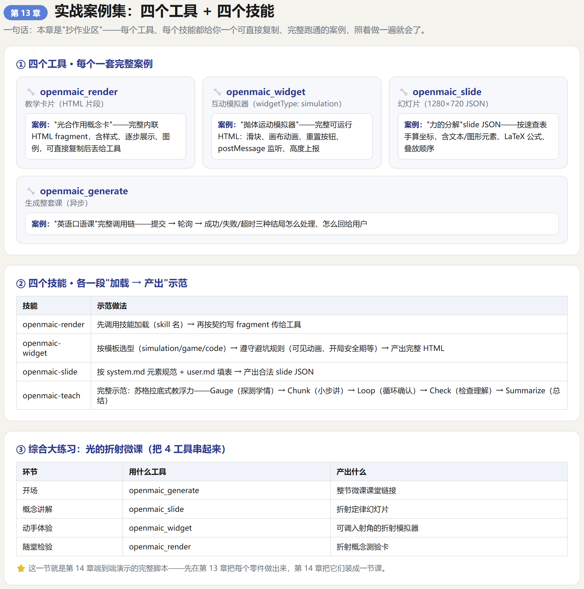


> 本章目标：前面的章节教你 "机制"，这一章给你 "成品"。我们给 4 个工具各做 1 个
> **能直接照抄运行的完整案例**
> ，给 4 个技能各做 1 段 **"加载 → 产出" 的完整示范 **。学完这一章，你就能照着做出自己的版本。

## 13.1 这一章怎么用


* 每个案例都标注了**它对应的契约**（assets 里的技能 / 模板），建议边看案例边对照契约；

* 案例代码**可以直接复制**：在 dsh 对话里让模型 "调用对应工具，参数如下"，或直接把内容喂给工具；

* 看完每个案例后，做它后面的 **"改造练习"**—— 改一个参数、换一个主题，真正变成自己的。


***

## 13.2 工具实战 ① openmaic_render：一张 "光合作用概念卡 + 自评测验"

**场景：** 用户在学 "光合作用"，希望有一个直观的小卡片 + 一个自评测验。

**对应契约：** `assets/openmaic-render.md`。契约要求：只写内联片段（不能有 `<!doctype>`/`<html>`/`<body>`）、数据全部内联、≤256KB、用基础样式类、判分在本地 `<script>` 完成。

### 成品 fragment（模型按契约产出的 "完整可渲染内容"）


```
<div class="card">

  <h3>光合作用 · 概念卡</h3>

  <p>绿色植物利用<b>光能</b>，把<b>二氧化碳</b>和<b>水</b>转化为<b>有机物</b>，并释放<b>氧气</b>。</p>

  <div class="viz-row">

    <span class="viz-stat">6CO₂ + 6H₂O</span>

    <span class="viz-arrow">──光能──▶</span>

    <span class="viz-stat">C₆H₁₂O₆ + 6O₂</span>

  </div>

  <p class="viz-note">反应场所：叶绿体 · 光照阶段与暗反应阶段</p>

  <hr style="border:none;border-top:1px solid var(--border);margin:12px 0">

  <h4>自评测验（本地判分，答案不回传）</h4>

  <ol style="font-size:14px">

    <li>光合作用把光能转变成什么形式的能量？</li>

    <li>氧气是在哪个阶段释放的？</li>

  </ol>

  <button class="btn" onclick="checkQuiz()">检查我的答案</button>

  <div id="quiz-fb" class="viz-stat" style="margin-top:8px"></div>

</div>

<script>

  // 判分逻辑完全在本地完成，不向模型回传答题结果

  function checkQuiz() {

    var fb = document.getElementById('quiz-fb')

    if (!fb) return

    fb.textContent = '参考：① 化学能（储存在有机物中）；② 光照阶段（水的光解）。答对了吗？'

  }

</script>
```

### 对应的工具调用（模型视角）


```
工具：openmaic_render

参数：

  fragment: "<上面那段 HTML>"

  title: "光合作用"
```

### 用户在界面上看到什么

一个带主题配色的卡片，顶部是概念 + 反应式，中间是分隔线，下方是一个可点击的自评测验按钮，点击后**在卡片内**显示参考答案（不弹窗、不回传模型）。

### 改造练习 13-1

把上面的案例改成 "牛顿第一定律" 概念卡：换内容、换一个自评问题。注意保持契约的 4 条硬规则（内联、无骨架、≤256KB、本地判分）。


***

## 13.3 工具实战 ② openmaic_widget：一个 "抛体运动模拟器"（simulation 完整案例）

**场景：** 用户在学抛体运动，想要一个能拖参数、能看到轨迹的交互模拟器。

**对应契约：** `assets/openmaic-widget.md` + `assets/widget-templates/simulation.md`。契约的硬要求：**恰好一个完整 HTML 文档**、带 `widget-config` JSON、带 `postMessage` 监听器、元素命名 `{var}-slider`/`{action}-btn`/`{var}-display`、重置按钮真重置、**启动后有肉眼可见的动画**、移动端不重叠。

### 成品 HTML（完整可运行版，契约要点全部命中）


```
<!doctype html>

<html lang="zh-CN">

<head>

<meta charset="utf-8">

<meta name="viewport" content="width=device-width, initial-scale=1">

<style>

  body { font-family: system-ui,'PingFang SC',sans-serif; margin:0; background:#fafafa; color:#222; }

  .app { display:flex; flex-direction:column; gap:10px; padding:12px; max-width:560px; margin:0 auto; box-sizing:border-box; }

  h3 { margin:0 0 2px; font-size:16px; }

  .controls { display:flex; flex-direction:column; gap:8px; background:#fff; border:1px solid #eee; border-radius:10px; padding:10px; }

  .row { display:flex; align-items:center; gap:8px; flex-wrap:wrap; }

  .row label { font-size:13px; min-width:80px; }

  input[type=range] { flex:1; min-width:110px; }

  .val { font-family:monospace; font-size:13px; min-width:56px; text-align:right; }

  .btns { display:flex; gap:8px; }

  button { flex:1; min-height:44px; font-size:15px; border:none; border-radius:8px; background:#5b9bd5; color:#fff; cursor:pointer; touch-action:manipulation; }

  #canvas { width:100%; height:280px; background:#fff; border:1px solid #eee; border-radius:10px; display:block; box-sizing:border-box; }

  #status { font-size:13px; color:#666; }

</style>

</head>

<body>

<div class="app">

  <h3>抛体运动模拟器</h3>

  <div class="controls">

    <div class="row">

      <label for="angle-slider">发射角度</label>

      <input type="range" id="angle-slider" min="0" max="90" value="45" step="1">

      <span class="val" id="angle-display">45°</span>

    </div>

    <div class="row">

      <label for="speed-slider">初速度</label>

      <input type="range" id="speed-slider" min="5" max="60" value="30" step="1">

      <span class="val" id="speed-display">30 m/s</span>

    </div>

    <div class="btns">

      <button id="start-btn" onclick="handleMainButton()">启动</button>

      <button id="reset-btn" onclick="resetSimulation()">重置</button>

    </div>

  </div>

  <canvas id="canvas"></canvas>

  <div id="status">调整角度和速度，点击"启动"观察抛体轨迹。</div>

</div>

<!-- ① 契约要求：嵌入式组件配置 -->

<script type="application/json" id="widget-config">

{

  "type": "simulation",

  "concept": "projectile_motion",

  "description": "调节发射角度与初速度，观察抛体运动轨迹与射程",

  "variables": [

    { "name": "angle", "label": "发射角度", "min": 0, "max": 90, "default": 45, "unit": "°" },

    { "name": "speed", "label": "初速度", "min": 5, "max": 60, "default": 30, "unit": "m/s" }

  ],

  "presets": [

    { "name": "45° 最远射程", "variables": { "angle": 45, "speed": 40 } },

    { "name": "高抛物线", "variables": { "angle": 75, "speed": 35 } }

  ]

}

</script>

<script>

  // ② 契约要求：状态机 running / paused / ended

  var cv = document.getElementById('canvas'), ctx = cv.getContext('2d')

  var angleEl = document.getElementById('angle-slider'), angleD = document.getElementById('angle-display')

  var speedEl = document.getElementById('speed-slider'), speedD = document.getElementById('speed-display')

  var statusEl = document.getElementById('status')

  var state = { running:false, ended:false, t:0, pts:[] }

  var GRAV = 9.8, SCALE = 4, last = 0, raf = 0

  function resize() { cv.width = cv.clientWidth; cv.height = cv.clientHeight; draw() }

  function draw() {

    var w = cv.width, h = cv.height, ground = h - 20

    ctx.clearRect(0, 0, w, h)

    // 地面

    ctx.strokeStyle = '#ccc'; ctx.beginPath(); ctx.moveTo(0, ground); ctx.lineTo(w, ground); ctx.stroke()

    // 发射点

    ctx.fillStyle = '#5b9bd5'; ctx.beginPath(); ctx.arc(20, ground, 6, 0, Math.PI * 2); ctx.fill()

    // 轨迹（③ 契约要求：肉眼可见的动画，小球沿轨迹移动）

    ctx.strokeStyle = '#e06c4f'; ctx.lineWidth = 2; ctx.beginPath()

    for (var i = 0; i < state.pts.length; i++) {

      var sx = 20 + state.pts[i][0], sy = ground - state.pts[i][1]

      i === 0 ? ctx.moveTo(sx, sy) : ctx.lineTo(sx, sy)

    }

    ctx.stroke()

    if (state.pts.length) {

      var p = state.pts[state.pts.length - 1]

      ctx.fillStyle = '#222'; ctx.beginPath(); ctx.arc(20 + p[0], ground - p[1], 5, 0, Math.PI * 2); ctx.fill()

    }

  }

  // ④ 契约要求：重置按钮必须真的重置所有状态

  function resetSimulation() {

    state.running = false; state.ended = false; state.t = 0; state.pts = []

    document.getElementById('start-btn').innerText = '启动'

    statusEl.textContent = '已重置，点击"启动"开始。'

    cancelAnimationFrame(raf); draw()

  }

  function startSimulation() {

    state.running = true; state.ended = false; state.t = 0; state.pts = []

    document.getElementById('start-btn').innerText = '暂停'

    last = performance.now(); raf = requestAnimationFrame(loop)

  }

  function pauseSimulation() {

    state.running = false; cancelAnimationFrame(raf)

    document.getElementById('start-btn').innerText = '继续'

  }

  function handleMainButton() {

    if (state.ended) resetSimulation()

    else if (state.running) pauseSimulation()

    else startSimulation()

  }

  function loop(now) {

    if (!state.running) return

    var dt = Math.min((now - last) / 1000, 0.05); last = now; state.t += dt

    var a = angleEl.value * Math.PI / 180, v = Number(speedEl.value)

    var x = v * Math.cos(a) * state.t

    var y = v * Math.sin(a) * state.t - 0.5 * GRAV * state.t * state.t

    state.pts.push([x * SCALE, y * SCALE])

    if (y < 0) { // 落地

      state.running = false; state.ended = true

      document.getElementById('start-btn').innerText = '重新开始'

      statusEl.textContent = '落地！射程约 ' + Math.round(x) + ' 米。'

      cancelAnimationFrame(raf)

    }

    draw()

    if (state.running) raf = requestAnimationFrame(loop)

  }

  angleEl.addEventListener('input', function () { angleD.textContent = angleEl.value + '°'; if (!state.running) draw() })

  speedEl.addEventListener('input', function () { speedD.textContent = speedEl.value + ' m/s'; if (!state.running) draw() })

  window.addEventListener('resize', resize); resize()

  // ⑤ 契约要求：postMessage 监听器，让"教学代理"将来能驱动它

  window.addEventListener('message', function (event) {

    var d = event.data || {}

    if (d.type === 'SET_WIDGET_STATE' && d.state) {

      Object.keys(d.state).forEach(function (k) {

        var el = document.getElementById(k + '-slider')

        if (el) { el.value = d.state[k]; el.dispatchEvent(new Event('input', { bubbles: true })) }

      })

    }

  })

</script>

</body>

</html>
```

### 对应工具调用


```
工具：openmaic_widget

参数：

  html: "<上面整个 HTML 文档>"

  widgetType: "simulation"

  title: "抛体运动模拟器"
```

### 用户体验到的东西


* 拖动 "角度 / 速度" 滑块实时显示数值；点 "启动" 后**小球真的沿抛物线飞出去**（不是只变数字）；

* 落回地面后按钮变成 "重新开始"，点击回到初始状态；

* 缩放窗口画布自适应；手机上控件不遮挡画布。

### game /code 两种类型速览（同样对照模板）


| 类型     | 主题建议          | 契约要点（区别于 simulation）                                                                                                               |
| ------ | ------------- | ---------------------------------------------------------------------------------------------------------------------------------- |
| `game` | "星际着陆" 游戏     | 必须是 "游戏不是测验"（玩家操控推力、速度计反馈）；**开局 3~5 秒不能失败**；开始按钮用**内联 onclick**；自绘 CSS 优先于 Tailwind `@layer`                                      |
| `code` | "实现一个平方函数" 练习 | Pyodide 跑 Python 时 ** 必须 `import sys` 和 **`import io`、用 `runPythonAsync()`；跑题按钮 `id="run-btn"`、输出 `id="output"`；用例显示 pass/fail |

### 改造练习 13-2

把模拟器改成 **"弹簧摆"**：把变量换成 `springLen` 和 `damping`，画一个来回摆动的弹簧。要求保留 widget-config、postMessage、状态机、可见动画 4 个契约要点。


***

## 13.4 工具实战 ③ openmaic_slide：一页 "力的分解" 幻灯片

**场景：** 用户在学斜面受力，需要一页结构化的幻灯片（定义 + 示意图 + 公式）。

**对应契约：** `assets/openmaic-slide.md` + `assets/slide-template/system.md`。要点：画布固定 **1280×720**、边距≥50、文本高度必须查 "高度速查表"、**LaTeX 只能放 LatexElement（严禁放进 text）**、Line 的 `width` 是**描边粗细**不是长度（≤6）。

### 成品 slide JSON（坐标已按契约计算）


```
{

  "background": { "type": "solid", "color": "#ffffff" },

  "elements": [

    { "id": "title", "type": "text",

      "left": 60, "top": 80, "width": 880, "height": 64,

      "content": "<p style=\"font-size: 28px;\">力的分解 · 斜面上的物体</p>",

      "defaultFontName": "", "defaultColor": "#333333" },

    { "id": "subtitle", "type": "text",

      "left": 60, "top": 144, "width": 900, "height": 46,

      "content": "<p style=\"font-size: 16px;\">重力 G 沿斜面方向和平行于斜面方向分解为两个分力</p>",

      "defaultFontName": "", "defaultColor": "#666666" },

    { "id": "title_underline", "type": "shape",

      "left": 70, "top": 168, "width": 860, "height": 3,

      "path": "M 0 0 L 1 0 L 1 1 L 0 1 Z", "viewBox": [1, 1],

      "fill": "#5b9bd5", "fixedRatio": false },

    { "id": "plane", "type": "shape",

      "left": 150, "top": 170, "width": 350, "height": 350,

      "path": "M 0 0 L 350 350 L 0 350 Z", "viewBox": [350, 350],

      "fill": "#e8f4fd", "fixedRatio": false },

    { "id": "block", "type": "shape",

      "left": 222, "top": 222, "width": 76, "height": 76,

      "path": "M 0 0 L 1 0 L 1 1 L 0 1 Z", "viewBox": [1, 1],

      "fill": "#5b9bd5", "fixedRatio": false },

    { "id": "gravity", "type": "line",

      "left": 260, "top": 260, "width": 4,

      "start": [0, 0], "end": [0, 150], "style": "solid",

      "color": "#e06c4f", "points": ["", "arrow"] },

    { "id": "normal", "type": "line",

      "left": 260, "top": 260, "width": 4,

      "start": [0, 0], "end": [100, -100], "style": "solid",

      "color": "#5b9bd5", "points": ["", "arrow"] },

    { "id": "parallel", "type": "line",

      "left": 260, "top": 260, "width": 4,

      "start": [0, 0], "end": [80, 80], "style": "solid",

      "color": "#5b9bd5", "points": ["", "arrow"] },

    { "id": "label_g", "type": "text",

      "left": 268, "top": 420, "width": 200, "height": 46,

      "content": "<p style=\"font-size: 16px; color: #e06c4f;\">重力 G（竖直向下）</p>",

      "defaultFontName": "", "defaultColor": "#e06c4f" },

    { "id": "formula_parallel", "type": "latex",

      "left": 700, "top": 300, "width": 460, "height": 100,

      "latex": "G_{\\\\\\\\\parallel} = mg\\\\\\\\\sin\\\\\\\\\theta", "color": "#000000", "align": "center" },

    { "id": "formula_perp", "type": "latex",

      "left": 700, "top": 410, "width": 460, "height": 100,

      "latex": "G_{\\\\\\\\\perp} = mg\\\\\\\\\cos\\\\\\\\\theta", "color": "#000000", "align": "center" },

    { "id": "takeaway", "type": "text",

      "left": 700, "top": 540, "width": 460, "height": 49,

      "content": "<p style=\"font-size: 18px;\">斜面越陡（θ 越大），沿斜面分力越大</p>",

      "defaultFontName": "", "defaultColor": "#333333" }

  ]

}
```

### 为什么这些坐标是对的（按契约自检）


* **边距**：所有元素 left ≥ 50、top ≥ 50、右侧不超 1230、底部不超 670 ✓；

* **文本高度查表**：28px 1 行 = 64 ✓；16px 1 行 = 46 ✓；18px 1 行 = 49 ✓（不能拍脑袋填 50/80/90）；

* **LaTeX 用 LatexElement**：公式全部放 `latex` 元素，text 里没有任何 `\frac`/`\sin` ✓；

* **Line 的 width 是描边**：三条力箭头 `width: 4`（粗细），长度由 `start/end` 决定 ✓；

* **元素顺序**：先画背景形状（斜面），再画线，最后画文字（按数组顺序叠放）✓。

### 对应工具调用


```
工具：openmaic_slide

参数：

  slide: { "background": {...}, "elements": [ ... ] }

  title: "力的分解"
```

工具会自动把画布固定为 1280×720，用 OpenMAIC 官方渲染器渲染出这页幻灯片（斜面示意图 + 三个力箭头 + 两个公式）。

### 改造练习 13-3

把案例改成 "单摆"：标题、一个摆球（shape 圆形 path）、摆线（line）、一个 `T = 2π√(L/g)` 的 LaTeX 公式。用 system.md 的 "文本高度速查表" 确定所有 text 高度。


***

## 13.5 工具实战 ④ openmaic_generate：生成一套 "英语口语课"

**场景：** 用户说 "帮我做一节英语日常口语课"，希望得到一整套能点开上的在线课堂。

**对应机制：** `src/client.ts`（异步作业 + 轮询）+ 配置（baseUrl /pollIntervalMs/maxWaitMs）。

### 完整调用链（从用户请求到课堂链接）


```
用户：帮我做一节英语日常口语课

  │

  ▼

模型判断：这是"整套课"，该用 openmaic_generate

  │

  ▼

工具调用：

  name: openmaic_generate

  arguments: { "requirement": "英语日常口语课：问路、点餐、打招呼" }

  （用户没要求联网/配图/视频/语音，所以可选开关都不传）

  │

  ▼

Node 端 execute（简化）：

  client.generateClassroom({

    baseUrl: config.baseUrl,          // https://open.maic.chat

    accessCode: config.accessCode,    // 默认 ""

    pollIntervalMs: config.pollIntervalMs,  // 5000

    maxWaitMs: config.maxWaitMs,            // 600000

    requirement: args.requirement,

  })

  │

  ├─ POST /api/generate-classroom → 202 { jobId: "job-7f3a", pollUrl: ".../api/jobs/job-7f3a" }

  ├─ 轮询 ...（每 5 秒）→ processing

  ├─ 轮询 ...→ processing

  └─ 轮询 ...→ succeeded { classroomId: "class-9c21", url: "https://open.maic.chat/classroom/class-9c21" }

  │

  ▼

execute 返回给模型：

  Classroom ID: class-9c21

  Classroom URL:

  https://open.maic.chat/classroom/class-9c21

  │

  ▼

模型把链接"裸链接"展示给用户：

  你的英语口语课已经生成好了，点开即可上课：

  https://open.maic.chat/classroom/class-9c21
```

### 三种结局的处理（模型会看到什么）


| 结局               | 模型展示            | 原因                |
| ---------------- | --------------- | ----------------- |
| succeeded        | 直接给课堂链接         | 正常                |
| failed           | 说明失败原因（含 jobId） | 比如 requirement 违规 |
| timeout（超 10 分钟） | "仍在后台生成，稍后刷新查看" | 生成很慢，不硬失败         |

### 配置建议（生产环境）


```
dsh-openmaic:

  baseUrl: https://open.maic.chat

  pollIntervalMs: 60000    # 官方建议调大：生成慢，60 秒轮询一次即可

  maxWaitMs: 1200000       # 最长等 20 分钟
```

### 改造练习 13-4

把 "英语口语课" 换成 "初中数学：一元二次方程"，写出：模型应该传的 `requirement`、可选开关哪些该传、以及三种结局各展示什么。


***

## 13.6 技能实战：四个技能怎么被 "加载并使用"

技能不是被用户直接 "点开" 的，而是**模型在动手前自动加载的规范**。下面演示 "加载 → 产出" 的完整链条。

### 13.6.1 openmaic-render：先读契约，再写卡片


```
模型内心（可见系统提示指引）：

  "这个场景适合用教学卡片 → 先加载 openmaic-render 技能"

  │

  ▼ 加载 assets/openmaic-render.md，读到规则：

   · 只写内联片段，禁止文档骨架

   · 数据内联（沙箱断网）

   · 用 card / btn / viz-* 样式类

   · 判分在本地 <script>

  │

  ▼ 按契约产出 → 传给 openmaic_render

  产出 = 13.2 节那张"光合作用卡片"
```

### 13.6.2 openmaic-widget：先读契约 + 对应模板，再写组件


```
模型内心：

  "用户要一个交互模拟器 → 加载 openmaic-widget 技能"

  │

  ▼ 技能指向模板：widget-templates/simulation.md

   · 恰好一个完整 HTML 文档

   · widget-config JSON + postMessage 监听器

   · {var}-slider / {action}-btn / {var}-display 命名

   · 重置真重置、启动后有可见动画

  │

  ▼ 按模板产出 → 传给 openmaic_widget

  产出 = 13.3 节那个"抛体运动模拟器"
```

### 13.6.3 openmaic-slide：先读契约（system.md），再写 JSON


```
模型内心：

  "用户要一页结构化幻灯片 → 加载 openmaic-slide 技能"

  │

  ▼ 技能指向契约：slide-template/system.md（元素类型 / 高度速查表 / 设计规则）

   · 画布 1280×720，边距 ≥ 50

   · 文本高度查表

   · 公式放 LatexElement

  │

  ▼ 按契约产出 → 传给 openmaic_slide

  产出 = 13.4 节那页"力的分解"
```

### 13.6.4 openmaic-teach：一次完整的苏格拉底教学（重点补讲）

这是四个技能里最 "交互" 的一个 —— 它不只是写内容，而是**把整段对话变成一步步引导的教学**。看 `assets/openmaic-teach.md` 的教学循环：


```
1. Gauge  摸底：先问学生会什么

2. Chunk  切块：拆成 3-6 个小步骤

3. Loop   每步：提问 → 等学生尝试 → 卡住给提示 → 确认/纠正 → 用视觉辅助"确认"

4. Check  小测验

5. Summarize  用学生自己的话总结
```

#### 完整示范：教 "浮力"（3 步苏格拉底对话）

> **模型**
> （摸底）：今天我们聊 "浮力"。先问你一个问题：把一块木头和一块同体积的铁放进水里，哪个会沉？为什么？
> **学生**
> ：铁会沉，因为它更重。
> **模型**
> （最小提示，不直接纠正）："更重" 这个说法很接近了。那你想：一块很薄的铁皮和一团同重量的铁块，都放进水里 —— 它们会一样吗？
> **学生**
> ：呃…… 薄铁皮可能不会沉？
> **模型**
> （确认正确思路，然后揭示概念）：对！关键不是 "重量"，而是 "密度" 和 "排开水的体积"。浮力来自物体排开的水的浮托力。既然你已经 "摸到" 这个概念了，我用一页幻灯片帮你固定下来 ——


```
调用 openmaic_slide（一页"阿基米德原理"：F浮 = ρ液 g V排，配一个木头vs铁对比表）
```

> **学生**
> ：哦，所以浮力跟排开水的体积有关！
> **模型**
> （下一步提问，继续循环）：很好。那我再问：一艘空船和装满货的船，为什么空船浮得高？—— 想清楚这个，你就把浮力彻底弄懂了。
> **学生**
> ：因为…… 空船排开的水少？
> **模型**
> （确认 + 小测验收尾）：正是！装货后船下沉、排开更多水、浮力更大。最后来个自评小测验，看看你掌握没有 ——


```
调用 openmaic_render（一张"浮力自评测验"卡片，本地判分）
```

> **学生**
> （做测验，全部答对）
> **模型**
> （总结，用学生自己的话）：我们今天的收获是：浮力大小看 "排开水的体积"，船装货变沉就是为了多排开水。你能用自己的话把 "空船浮得高" 解释一遍吗？

**这个例子里技能是怎么起作用的：**


* **先问后展示**：幻灯片是在学生 "思考过之后" 用来**确认**的，不是一开始就 "剧透" 答案；

* **一次一步**：每步只问一个问题、只给最小提示；

* **视觉辅助克制**：第 1 步用 slide（结构性概念），第 2 步用 render（小测验），没有滥用。

### 改造练习 13-5

模仿上面的示范，写一段教 "电路串联 vs 并联" 的苏格拉底对话：要求包含 1 次摸底、2 步提问、1 次用 `openmaic_widget` 的辅助（比如 "点亮灯泡" 的小模拟）、1 次总结。


***

## 13.7 综合大练习：把四件套串成一个 "微课"

现在把 4 个工具 + 4 个技能全部用上，做一个 "光的折射" 微课。

**要求（对照检查清单）：**


| 环节                                             | 用哪个工具    | 检查点                                  |
| ---------------------------------------------- | -------- | ------------------------------------ |
| 1. 用户要整套课 → 先 `openmaic_generate` 生成课堂         | generate | requirement 写清楚；可选开关不滥用              |
| 2. 对话中解释 "折射定律" → `openmaic_slide`             | slide    | 用 LatexElement 放 `n₁sinθ₁ = n₂sinθ₂` |
| 3. 让学生 "玩" 折射率 → `openmaic_widget`（simulation） | widget   | 滑块命名 `{var}-slider`；有可见动画            |
| 4. 概念卡 + 小测验 → `openmaic_render`               | render   | 本地判分；不传文档骨架                          |
| 5. 全程按 "苏格拉底式" 引导 → `openmaic-teach` 规范        | teach    | 先问后展示；一次一步                           |

**完成标准：** 你写出的对话 / 内容，能让模型在 "一节课" 里自然地把 4 个工具各用一次，且每次使用都符合对应技能契约。

**检验方法：** 在 dsh 里实际跑一遍，看：


1. 模型是否**先加载技能**再写内容（可用系统提示段落测试验证）；

2. 每个工具的 `presentationMeta` 是否被前端正确渲染成卡片；

3. 沙箱里是否正常（无白屏、无报错）。

> 恭喜完成第 13 章！你现在不只会 "造工具"，还会 "用技能把工具串成真正的教学体验" 了。


***

# 第 14 章 端到端全流程演示：一次 "光的折射" 微课，从头走到尾

> 🖼 本章信息图（原 HTML 源文件在 `课程信息图/第14章.html`）

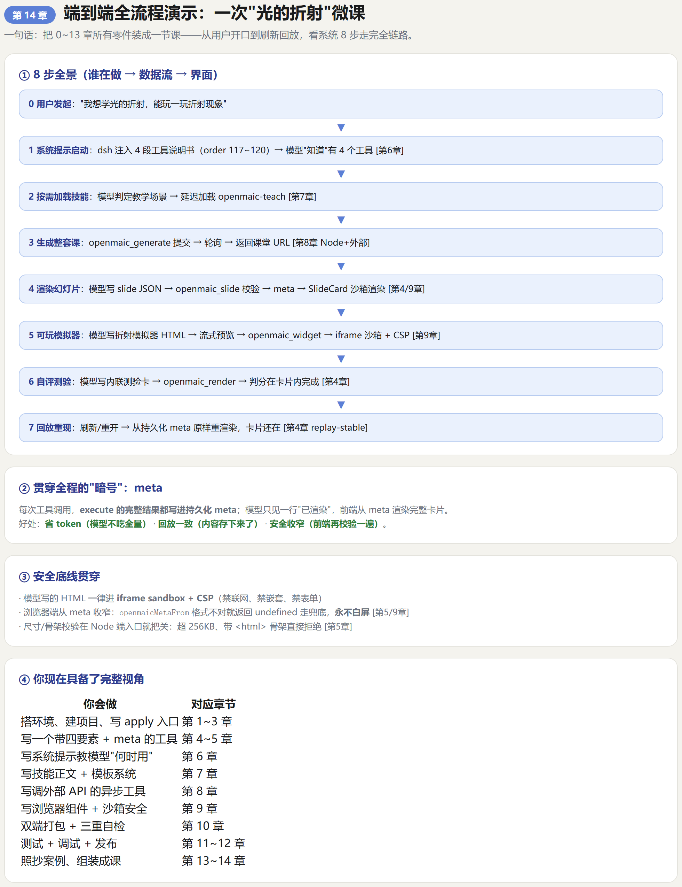


> 本章目标：前面每一章都在讲 "零件"，这一章我们把零件装成一台机器，
> **跟着一次真实的教学请求，从用户开口到卡片渲染，一步步走完整条链路**
> 。看完本章，你会真正理解 dsh-openmaic 这台机器是怎么运转的。

## 14.1 这一章要展示什么

我们用一个贯穿案例 ——**"光的折射" 微课**。从用户敲下第一句话开始，我们会看到：


```
用户开口

  → dsh 启动"系统提示"（模型知道有哪些工具）

  → 模型按场景选择工具、按需加载技能

  → 工具在 Node 端执行（含调用外部服务）

  → 结果写进持久化 meta

  → 浏览器端把 meta 渲染成沙箱卡片

  → 用户交互 → 刷新页面，卡片原样重现（回放）
```

每一站我们都会标注：**谁在做**（模型 / Node 端 / 浏览器端 / 外部服务）、**数据往哪走**、**界面看到什么**，以及**用到了第几章的机制**。

## 14.2 全景路线图（先看全貌）


| 步 | 谁在做             | 做什么                       | 数据流          | 界面看到  | 对应章节    |
| - | --------------- | ------------------------- | ------------ | ----- | ------- |
| 0 | 用户              | 提出需求                      | —            | 一句话   | —       |
| 1 | dsh + 模型        | 加载系统提示，模型 "知道" 工具库        | 系统提示注入       | 对话开始  | 第 6 章   |
| 2 | 模型              | 按场景判断该用什么，加载技能            | 技能正文         | （静默）  | 第 7 章   |
| 3 | Node 端 + 外部服务   | `openmaic_generate` 生成整套课 | 提交→轮询→返回 URL | 课堂链接  | 第 8 章   |
| 4 | 模型 + Node + 浏览器 | 苏格拉底对话中 `openmaic_slide`  | meta 传递      | 幻灯片   | 第 4/9 章 |
| 5 | 模型 + Node + 浏览器 | `openmaic_widget` 折射模拟器   | 流式预览 + meta  | 可玩模拟器 | 第 9 章   |
| 6 | 模型 + 浏览器        | `openmaic_render` 自评测验    | meta 传递      | 测验卡片  | 第 4/9 章 |
| 7 | 浏览器             | 回放：刷新页面卡片重现               | 从持久化 meta 读取 | 原样卡片  | 第 4 章   |


***

## 14.3 第 0 步：用户发起

用户在 dsh 对话里输入：

> **"我想学光的折射，帮我上一节微课，最好能玩一玩折射现象。"**

这一刻，dsh 把这句话（连同系统提示、会话历史）一起发给模型。**用户的一句话，是整个流程的发令枪。**

## 14.4 第 1 步：dsh 启动系统提示，模型 "知道" 工具有哪些

模型真正看到的内容远不止用户那句话 ——**每次对话，dsh 都会把插件注入的系统提示段落拼进模型输入**。

模型 "脑海里"（简化展示）现在有这些 "工具说明书"：


```
## Generate OpenMAIC classroom (openmaic_generate)

Use openmaic_generate when the user asks you to create or prepare a lesson,

course, or classroom ... Put the teaching requirement in `requirement`.

## Render OpenMAIC interactive widget (openmaic_widget)

Use openmaic_widget when the user wants an interactive teaching widget:

a simulation, a quiz or puzzle game, or a runnable code challenge. ...

## Render OpenMAIC teaching card (openmaic_render)

Use openmaic_render when a visual helps more than text: explaining a concept,

giving a quiz, walking through a multi-step process ... First load the

openmaic-render skill, then pass the fragment.

## Render OpenMAIC slide (openmaic_slide)

Use openmaic_slide when the user wants a structured slide ... First load the

openmaic-slide skill.
```

> 🔑
> **关键机制（第 6 章）**
> ：这些段落是插件通过
> `ctx.systemPrompt.section({ order: 117~120 })`
> 注入的。模型据此判断 "用户要整套课 → 用 generate；要可玩模拟器 → 用 widget"。

**模型读完系统提示后的判断：**


* 用户要 "上一节微课" → 命中 `openmaic_generate` 的触发场景（生成整套课）；

* 用户要 "玩一玩折射" → 之后可以用 `openmaic_widget` 做一个模拟器。

## 14.5 第 2 步：模型按需加载技能（此时用户看不到）

模型决定先走 "苏格拉底式教学" 路线（因为这是个教学场景），于是**按需加载技能**：


```
模型：这是一次教学 → 加载 openmaic-teach 技能（得到"先问后展示、一次一步"的教学循环）

     又因为要生成整套课 → 加载/确认 openmaic_generate 的用法
```

> 🔑
> **关键机制（第 7 章）**
> ：技能是
> **延迟加载**
> 的 —— 模型只有在需要时才读取对应技能正文（assets/ 里的 markdown）。系统提示保持简短，详细规范按需取用。

**注意：** 这一步用户**看不到任何界面变化**。它发生在模型 "思考" 的过程中，但决定了后面每一步怎么走。

## 14.6 第 3 步：openmaic_generate —— 先给用户一套完整的课

### 3.1 模型发起工具调用

模型按 openmaic_generate 的说明书，构造调用：


```
{

  "name": "openmaic_generate",

  "arguments": {

    "requirement": "光的折射微课：折射定律、全反射、生活中折射现象，配可交互演示",

    "language": "zh-CN"

  }

}
```

> 用户没有要求联网 / 配图 / 视频 / 语音，所以那些可选开关
> **都不传**
> （第 6 章教模型的规则）。

### 3.2 Node 端执行：提交 + 轮询

这个调用由 **Node 端**（插件的 `client.ts` + `index.ts` 里的 execute）接手：


```
Node 端 execute

  │

  ├─ POST https://open.maic.chat/api/generate-classroom

  │     body: { requirement: "光的折射微课：..." }

  │     ← 202 { jobId: "job-8e21", pollUrl: "…/api/jobs/job-8e21" }

  │

  ├─ 轮询 pollUrl（每 5 秒，最多 10 分钟）

  │     ← processing …

  │     ← processing …

  │     ← succeeded { classroomId: "class-c301", url: "https://open.maic.chat/classroom/class-c301" }

  │

  ▼

execute 返回（模型看到的一行文字）：

  "Classroom ID: class-c301

   Classroom URL:

   https://open.maic.chat/classroom/class-c301"
```

> 🔑
> **关键机制（第 8 章）**
> ：异步作业 + 轮询。execute 不会干等几分钟，而是 "提交 → 轮询 → 拿到结果"，并且有超时兜底。

### 3.3 模型把链接展示给用户

模型按说明书 "On success, show the returned URL as a bare link"：

> 你的 "光的折射" 微课已经生成好了，点开即可上课 👇
> [https://open.maic.chat/classroom/class-c301](https://open.maic.chat/classroom/class-c301)

**界面效果：** 用户看到一行课堂链接。同时**工具调用的卡片**（标题 "OpenMAIC・光的折射微课"）会出现在对话里 —— 那是 `presentCall` / `presentResult` 根据 meta 渲染的（第 4.6 节）。

## 14.7 第 4 步：苏格拉底对话中调用 openmaic_slide

整套课是 "大餐"，现在模型切换回**苏格拉底式教学**（受 openmaic-teach 技能约束），带着用户一步步理解折射。

### 4.1 先问，不急着给答案

> 模型：学折射之前，我先问你：把一根筷子斜着放进水杯，你看到的筷子是 "折断" 的。你觉得这是为什么？
> 学生：因为…… 光在水里走得慢了？
> 模型：方向对了一半 —— 光从空气进到水里确实会
> **变慢**
> ，但 "变慢" 本身不会让筷子看起来折断。真正的原因是光
> **变慢了、方向也偏了**
> 。你已经碰到 "折射" 的门槛了，我用一页幻灯片帮你把这个概念固定下来 ——

### 4.2 模型按 openmaic-slide 技能写一页幻灯片 JSON 并调用

模型加载 `openmaic-slide` 技能 → 读取 slide-template/system.md → 按契约写 JSON（1280×720、文本高度查表、公式放 LatexElement）→ 调用工具：


```
工具：openmaic_slide

参数：slide = { "background": {...}, "elements": [ 标题, 示意图(筷子/水面), latex: "n₁·sinθ₁ = n₂·sinθ₂", 关键点 ] }

      title = "折射定律"
```

### 4.3 Node 端校验 + 写 meta


```
Node 端 execute：

  - normalizeSlide：画布固定 1280×720、补全元素 id、默认主题

  - 校验：elements 非空、文本高度合法…

  - 返回 { title, slide } 给模型（一行文字）

  - presentationMeta 写入：{ kind: 'openmaic-slide', slide, title }  →  持久化
```

### 4.4 浏览器端渲染成幻灯片

浏览器端的 `SlideCard` 组件（keyed toolview `openmaic_slide`）监听到这次调用：


```
SlideCard 读取 block.meta → openmaicMetaFrom 收窄 → 得到 slide JSON

  → 用 @openmaic/renderer 的 SlideCanvas 渲染

  → 包进沙箱 iframe 就地展示

  → 高度上报，撑到刚好容纳幻灯片
```

**界面效果：** 聊天框里出现一页正式幻灯片 —— 标题、筷子入水的示意图、"折射定律" 公式、关键要点，配色自动适配当前主题。

> 🔑
> **关键机制（第 4 章 meta 传递 / 第 9 章 Toolview + 沙箱）**
> ：模型只看到一行 "已渲染" 文字；完整 slide 走
> `presentationMeta`
> 持久化，浏览器端从 meta 还原渲染。省 token、回放一致、沙箱隔离。

## 14.8 第 5 步：openmaic_widget —— 让学生 "玩" 折射

### 5.1 对话推进到 "动手" 环节

> 模型：理论看过了。现在你来
> **亲手玩**
> —— 改变入射角，看折射角怎么变。我做一个折射模拟器给你。
> （模型开始写代码，用户能看到……）

### 5.2 流式预览：边写边显示

模型调用 `openmaic_widget` 时，参数是以 JSON 流式生成的。浏览器端的 **StreamingWidgetPreview**（插槽 `conversation.input.dock`）实时截取不完整的 `argsRaw`，用 `extractStreamingWidget` 解析出正在写的 HTML：


```
模型写到一半：

  {"name":"openmaic_widget","arguments":{"html":"<!doctype html><html>…

                                   ↑ 这里被实时解析

界面：输入框下方实时滚动显示正在生成的模拟器代码
```

**界面效果：** 用户看着代码 "一行一行长出来"。

### 5.3 完整调用 + Node 端处理


```
工具：openmaic_widget

参数：html = <完整折射模拟器 HTML>（含 widget-config + postMessage 监听器 + {var}-slider 命名 + 可见动画）

      widgetType = "simulation"

      title = "折射模拟器"

Node 端：

  - postProcessInteractiveHtml：把 LaTeX 后处理成 KaTeX 可渲染格式

  - 校验、写 meta：{ kind: 'openmaic-widget', html, title, widgetType }  →  持久化
```

### 5.4 浏览器端渲染成可玩模拟器

**WidgetCard** 把 HTML 包进沙箱 iframe（`sandbox="allow-scripts"` + CSP）：


```
iframe srcDoc = 插件自己拼的文档骨架 + CSP 头 + AI 的模拟器 HTML + 高度上报脚本

用户拖动"入射角滑块"（id="angle-slider"）→ 折射角实时变化 → 轨迹/光束可见地动起来
```

**界面效果：** 一个可交互的折射模拟器出现在对话里。用户可以拖角度、看光线偏折、观察全反射临界角。

> 🔑
> **关键机制（第 9 章 沙箱 + CSP）**
> ：这个模拟器是 AI 生成的代码，但在
> **隔离的小黑屋里**
> 跑 —— 拿不到宿主页面、联不了网、弹不了窗，随便玩都安全。

## 14.9 第 6 步：openmaic_render —— 用自评测验收尾

### 6.1 教学循环的最后一步：Check

> 模型：玩也玩过了，最后来个小测验，确认你真的懂了 —— 不用交给我，卡片会自己判分。
> 模型加载 openmaic-render 技能 → 按契约写内联片段 → 调用：


```
工具：openmaic_render

参数：fragment = <折射概念卡 + 2 道自评测验，判分逻辑在本地 <script>>

      title = "折射自评测验"
```

### 6.2 渲染

**OpenmaicCard** 把片段包进沙箱 iframe，用户点击 "检查答案"，判分**在卡片内部完成**—— 结果不回传给模型。

**界面效果：** 一张带主题配色的测验卡片，点击后显示参考答案。

> 🔑
> **关键机制（第 4 章）**
> ：判分在本地完成，避免把用户答题过程灌回模型上下文（省 token、也保护用户隐私）。

## 14.10 第 7 步：回放 —— 刷新页面，卡片原样重现

现在用户**刷新页面 / 重新打开会话**。神奇的事发生了：


```
之前的卡片全都还在，而且和刚才一模一样。
```

为什么？因为所有卡片内容（slide、widget、render 片段）都写进了**持久化的 tool/result meta**。回放时：


```
读取历史对话记录

  → 每个工具调用都带着自己的 meta

  → 浏览器端 Toolview 从 meta 重新渲染

  → 卡片逐字节重现（replay-stable）
```

**界面效果：** 刷新后，幻灯片、模拟器、测验卡片依然完好，可以继续玩、继续答。

> 🔑
> **关键机制（第 4 章 replay-stable）**
> ：这正是 "把内容写进 meta 而不是只靠返回值" 的根本原因 —— 对话会回放，但内容不能丢。


***

## 14.11 全景数据流（一次看清所有 "暗号" 怎么传）


```
用户                                   模型                Node 端              外部服务

 │                                      │                    │                    │

 ├─ 说出需求 ──────────────────────────► │                    │                    │

 │                                       │ 读系统提示(6)       │                    │

 │                                       │ 加载技能(7)         │                    │

 │                                       ├─ generate ───────► │─HTTP─► open.maic.chat

 │ ◄── 课堂链接 ───────────────────────── │ ◄── URL ─────────── │ ◄──轮询──── ────── │

 │                                       │ 写 meta ──────────► │                    │

 │ ◄── 幻灯片卡片 ── SlideCard(9) ◄─ meta ┤                    │                    │

 │ ◄── 模拟器卡片 ── WidgetCard(9) ◄─ meta┤                    │                    │

 │ ◄── 测验卡片 ──── OpenmaicCard(9)◄─ meta┤                    │                    │

 │ 刷新页面 ──► 从持久化 meta 重渲染(4)    │                    │                    │
```

**一句话总结整条链路：**

> 模型照着
> **系统提示**
> 决定用哪个工具，照着
> **技能**
> 决定怎么写；工具在
> **Node 端**
> 执行（含调外部服务）；结果写进
> **持久化 meta**
> ；
> **浏览器端**
> 从 meta 把内容渲染成
> **沙箱卡片**
> ；刷新页面还能
> **原样重现**
> 。

## 14.12 为什么这套设计 "能跑"（关键机制回顾）


| 设计               | 作用            | 没有它会怎样              |
| ---------------- | ------------- | ------------------- |
| 系统提示注入（6）        | 模型知道何时用哪个工具   | 模型完全不知道该调用插件        |
| 技能延迟加载（7）        | 详细规范按需取用      | 每次对话塞大量规范，浪费 token  |
| meta 传递 + 短返回（4） | 省 token、回放一致  | 整段 HTML 反复灌模型，上下文爆炸 |
| 双端分离（9）          | Node 干活、浏览器画画 | 渲染逻辑和业务逻辑纠缠         |
| 沙箱 + CSP（9）      | AI 代码随便写也安全   | 恶意 / 出错 HTML 直接污染页面 |
| 异步作业 + 轮询（8）     | 慢任务不阻塞        | 模型干等几分钟超时           |

### 动手练习 14-1（最后一课）

不看本章，凭记忆画一张 "用户说『做个光合作用互动模拟』之后，系统怎么走" 的 6 步流程，标注：每一步谁在做、数据往哪走、界面看到什么。画完和 14.2 的表对照检查。

> 恭喜你走完全程。从 "一句话" 到 "一整套可玩可回放的教学体验"—— 这就是 dsh-openmaic 这台机器的完整运转方式。

# 第 15 章 四种插件开发方法：学会 "选型" 再动手

> 🖼 本章信息图（原 HTML 源文件在 `课程信息图/第15章.html`）

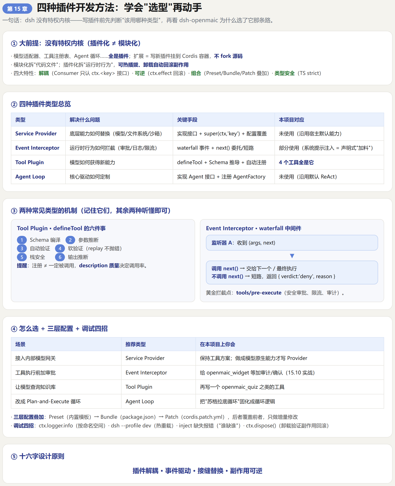


> 本章目标：前 14 章我们一直围着 dsh-openmaic 这一个项目转。这一章把视角拉高 —— 参考业界一份《从零给 DeepSeek Harness 写插件》实战教程，系统讲清楚 
>
> **dsh 插件的四种开发方法**
>
> 。你将学会：写一个插件之前，先判断 "我该用哪种类型"，然后理解 dsh-openmaic 为什么选了它那条路。这一章不需要新装任何东西，只需要你带着前 14 章的知识回来做 "选型"。


***

## 15.1 一个大前提：dsh 没有 "特权内核"

先记住一句话：**在 dsh 里，模型适配器是插件，工具注册表是插件，Agent 循环也是插件 —— 没有一样东西是被锁死在 "核心引擎" 里的。**

回想传统框架的痛点：


* 想换一套 LLM 适配器？去找 `ChatModel` 抽象类，看看预留接口够不够表达你的需求；

* 想加一道工具执行前的审批？去翻 `ToolExecutor` 的源码，看有没有 Hook 可以挂；

* 最头疼的是 —— 想改 Agent 的决策循环？基本只能 fork 整个项目。

而 dsh 的做法完全不同：**扩展 = 写一个新插件，挂载到 Cordis 容器**，不需要 fork 一行源码。你写的插件和 dsh 内置插件享有完全平等的待遇。

### 一个关键澄清：插件化 ≠ 模块化

很多人听到 "插件化" 以为就是 "把代码拆成几个文件"。其实两者层次完全不同：


|        | 模块化  | 插件化               |
| ------ | ---- | ----------------- |
| 拆的是什么  | 代码文件 | 运行时行为             |
| 解决什么问题 | 代码好读 | 行为好换              |
| 能不能热插拔 | 不能   | 能（独立加载 / 卸载 / 替换） |
| 卸载副作用  | 无法回滚 | 自动回滚              |

dsh 的插件不仅能在运行时独立加载、卸载、替换，而且**卸载时自动回滚所有副作用**—— 这是模块化远远做不到的。你回看第 3 章的 `ctx.effect()`：所有注册动作都包在 `effect` 里，插件被卸载时注册的东西自动撤销，这就是 "副作用可逆" 的具体实现。

dsh 插件设计遵循四大特性：


1. **解耦**：Consumer 依赖抽象的 `ctx.<key>`，不依赖具体实现 —— 所以换实现时，消费方代码一行不用改；

2. **可逆**：所有注册通过 `ctx.effect()` 完成，卸载自动回滚；

3. **组合**：Profile + Bundle + `cordis.patch.yml` 按层叠加，无需改源码；

4. **类型安全**：TypeScript strict 模式，事件名和参数类型通过 declaration merging 声明。

> **对照 dsh-openmaic**
>
> ：前 14 章你做的所有 "注册" 动作 ——
>
> `ctx.tools.register`
>
> （第 4 章）、
>
> `ctx.systemPrompt.section`
>
> （第 6 章）、
>
> `ctx.skills.registerProvider`
>
> （第 7 章）、
>
> `ctx.slots.inject`
>
> （第 9 章）—— 本质上都是 "插件化的挂载"，全程没有碰 dsh 内核一行。你已经不知不觉在用这套哲学了。


***

## 15.2 四种插件类型总览（先看全景）

dsh 的插件生态不是一锅粥，而是有清晰分工的四种类型。写插件前，先判断自己要做的事属于哪一类 —— 选错类型就像拿螺丝刀当锤子，不是不能用，是效率低。


| 类型                    | 解决什么问题                   | 关键手段                               | 本项目对应                   |
| --------------------- | ------------------------ | ---------------------------------- | ----------------------- |
| **Service Provider**  | 底层能力如何替换（模型 / 文件系统 / 沙箱） | 实现接口 + `super(ctx,'key')` + 配置覆盖   | 未使用（沿用宿主默认能力）           |
| **Event Interceptor** | 运行时行为如何拦截（审批 / 日志 / 限流）  | waterfall 事件 + `next()` 委托 / 短路    | 部分使用（系统提示注入 = 声明式 "加料"） |
| **Tool Plugin**       | 模型如何获得新能力                | `defineTool` + Schema 推导 + 自动注册    | **4 个工具全部是它**           |
| **Agent Loop**        | 核心驱动如何定制                 | 实现 `Agent` 接口 + 注册到 `AgentFactory` | 未使用（沿用默认 ReAct）         |

下面四节逐个拆开讲，每节都带一个教程原文的例子，再对照回 dsh-openmaic。


***

## 15.3 ① Service Provider：给系统 "换驱动"

### 干什么用的

当你**想替换 dsh 的某个底层能力实现**时 —— 换模型、换文件系统、换沙箱、接自研搜索服务 —— 写 **Service Provider** 插件。

dsh 通过 **Capability Seam（能力接缝）模式**把接口声明和实现分离：`ctx.llm`、`ctx.fs`、`ctx.shell` 等都是 "接缝"。框架内置了一些 Provider（如 `llm-deepseek`、`fs-local`），但你可以**完全替换**它们。

### 教程例子：接入一个内部模型网关

假设你的团队有一个内部模型网关，接口格式和 DeepSeek 类似，但认证方式是自定义的 `X-Internal-Token` 头。你需要写一个 `llm-internal` 插件：


```
// src/index.ts

import { Context, Service } from 'cordis'

import { LLMService, ChatRequest, ChatStreamChunk } from 'dsh-llm'

class InternalLLMService extends Service implements LLMService {

  static inject = ['config'] as const

  constructor(ctx: Context, config: InternalLLMConfig) {

    super(ctx, 'llm')          // ① 挂到 ctx.llm 这个 key 上，覆盖默认 Provider

    this.config = config

  }

  async *chat(request: ChatRequest): AsyncGenerator<ChatStreamChunk> {

    const response = await fetch(this.config.gatewayUrl, {

      method: 'POST',

      headers: {

        'Content-Type': 'application/json',

        'X-Internal-Token': this.config.token,   // 自定义认证

      },

      body: JSON.stringify(this.transformRequest(request)),

    })

    for await (const chunk of this.parseStream(response.body!)) {

      yield chunk

    }

  }

  private transformRequest(req: ChatRequest): object { /* 请求格式转换 */ }

  private async *parseStream(body: ReadableStream): AsyncGenerator<ChatStreamChunk> { /* SSE 解析 */ }

}

export interface InternalLLMConfig {

  gatewayUrl: string

  token: string

}

export function apply(ctx: Context, config: InternalLLMConfig) {

  ctx.plugin(InternalLLMService, config)

}
```

然后创建 `cordis.patch.yml` 覆盖默认插件：


```
plugins:

  llm-deepseek:

    disabled: true                    # 禁用默认 Provider

  llm-internal:

    gatewayUrl: 'https://gateway.mycompany.com/v1/chat'

    token: ${INTERNAL_TOKEN}
```

### 三个关键设计点


1. **继承 **`Service`：通过 `super(ctx, 'llm')` 把自己挂到 `ctx.llm`，覆盖之前的 Provider；

2. `static inject`：声明依赖 `config`，Cordis 会确保配置服务先就绪，再启动你的插件；

3. **声明式卸载**：`Service` 基类已经帮你处理了卸载逻辑 —— 插件被移除时，`ctx.llm` 自动回滚到之前的状态。

### 一个易误解的点

> 我把默认插件 
>
> `disabled`
>
>  了，其他依赖 
>
> `ctx.llm`
>
>  的插件会不会崩？

**不会。** 因为 `llm-internal` 也注册到了 `ctx.llm` 这个 key 上，Consumer 代码只认 `ctx.llm` 这个接口，不认背后是谁提供的。换驱动不影响坐车的人。

### 对照 dsh-openmaic：我们为什么没写 Provider

dsh-openmaic **没有替换任何底层能力**—— 它用的 `ctx.tools`、`ctx.skills`、`ctx.systemPrompt` 都是宿主自带的。所以它不是 Provider 插件。

那什么时候你会需要呢？举个例子：假设你的团队想把 OpenMAIC 的生成能力做成 "模型网关层"（让模型天然就能产出 OpenMAIC 内容，而不是靠工具调用），那就要写一个 Provider 来替换 `ctx.llm` 的请求格式。**但注意**—— 那是大改，而且会牺牲 "按需调用" 的灵活性（第 6 章讲过为什么用工具而不是硬塞给模型）。所以 dsh-openmaic 的路线选择是合理的。

> **动手验证 15-1**
>
> ：假装你是架构师，在 
>
> `dsh-openmaic`
>
>  的基础上设计一个 "接入公司内部模型网关" 的方案。回答三个问题：① 你要实现哪个接口？② 你在 
>
> `super(ctx, '哪个key')`
>
> ？③ 你在 
>
> `cordis.patch.yml`
>
>  里 disabled 哪个插件？把答案写下来，对照 15.3 的代码检查。


***

## 15.4 ② Event Interceptor：在关键路径上 "加料"

### 干什么用的

当你**想在 Agent 运行的关键路径上 "加料"**—— 比如审批、日志、限流、改写请求 —— 写 **Event Interceptor** 插件，挂载到 waterfall 事件上。

dsh 的核心事件全部是 **waterfall 类型**。waterfall 的语义是 **around - 中间件**：每个监听器收到 `(args, next)`，调用 `next()` 把控制权交给下一个，**不调用 **`next()`** 就短路整个链条**。

### 最常用的五个拦截点


| 事件                   | 拦截时机        | 典型用途                     |
| -------------------- | ----------- | ------------------------ |
| `agent/pre-step`     | 每步开始前       | 改写系统提示词、注入上下文            |
| `agent/request`      | LLM 请求发送前   | 限流、记录请求日志、修改参数           |
| `tools/pre-execute`  | 工具执行前       | **安全审批、权限检查、返回 deny 短路** |
| `tools/post-execute` | 工具执行后       | 结果脱敏、添加审计日志、替换返回值        |
| `llm/stream`         | 流式响应逐 chunk | 实时过滤敏感内容、统计 token        |

其中 `tools/pre-execute`** 是阻断式拦截的黄金挂载点**—— 返回 `{ verdict: 'deny', reason: '...' }` 即可阻止工具执行，模型会收到一个 error 类型的结果。

### 教程例子：给 "文件写操作" 加审批

假设你需要在工具执行前加一道审批：所有涉及文件写入的操作必须经过用户确认。


```
// src/index.ts

import { Context } from 'cordis'

export const name = 'tool-approval'

export const inject = ['tools'] as const

export function apply(ctx: Context) {

  ctx.on('tools/pre-execute', async (call, next) => {

    // 只对写操作进行拦截

    if (!isWriteOperation(call.tool.name)) {

      return next()          // 放行，不拦截

    }

    const approved = await requestUserApproval({

      tool: call.tool.name,

      args: call.args,

      reason: '该操作将修改文件系统',

    })

    if (!approved) {

      return {               // 不调用 next()，直接短路

        verdict: 'deny' as const,

        reason: '用户拒绝了该操作',

      }

    }

    return next()            // 用户同意，继续执行链

  })

}

function isWriteOperation(toolName: string): boolean {

  return ['write_file', 'edit_file', 'bash', 'shell'].includes(toolName)

}

async function requestUserApproval(details: object): Promise<boolean> {

  // 你的审批逻辑：弹窗、发 Slack、写数据库……

  return true

}
```

### waterfall 的三个理解要点


1. **调用 **`next()`：把控制权交给下一个监听器，最终到达工具执行；

2. **不调用 **`next()`：短路整个链条，你的返回值就是最终结果；

3. **修改参数后调用 **`next()`：类似 Koa 中间件，可以改写请求再继续。

多个插件都监听 `pre-execute` 时，**Cordis 按注册顺序调用**—— 先注册的先收到事件，第一个 `deny` 了，后面的就不会执行。这就是 waterfall"瀑布" 语义：水从上往下流，遇到堤坝就停。

### 对照 dsh-openmaic：两个 "隐形拦截" 其实都是它

dsh-openmaic 虽然没写 `ctx.on('tools/pre-execute')`，但它用了两个和 Interceptor 同源的设计：

**① 系统提示注入（第 6 章）= "每步开始前加料" 的声明式版本。**

Interceptor 的做法是监听 `agent/pre-step` 去改系统提示词；dsh-openmaic 用的是 dsh 提供的更高层入口 `ctx.systemPrompt.section(...)`，效果一样（在每一步开始前给模型注入工具说明书），但更声明式、更好维护。**你已经在用 Interceptor 思想了，只是换了个更舒服的姿势。**

**② 参数校验（第 5 章契约）= "执行前拦截" 的工具内版本。**

`execute` 里 `validateFragment` 抛错，本质上就是在工具执行前拦截非法输入。区别在于位置：Interceptor 在**工具外部统一拦截**（对所有工具生效），参数校验在**工具内部**（只对这个工具生效）。所以：

> 如果你要给 "所有 AI 生成的 HTML 工具" 加一道统一审批 / 审计，正确姿势是写 Interceptor 插件，而不是在 4 个工具里各写一遍。这就是 "接缝替换"—— 在公共接缝上做，不做重复劳动。
> **动手验证 15-2**
>
> ：模拟一个 
>
> `tools/pre-execute`
>
>  监听器，当 
>
> `call.tool.name === 'openmaic_widget'`
>
>  时，打印一条审计日志（
>
> `callId`
>
> 、
>
> `args.requirement`
>
>  的前 30 字），然后放行。对照 15.4 的代码，你只需要改 
>
> `isWriteOperation`
>
>  的名单和回调内容。


***

## 15.5 ③ Tool Plugin：最常见的类型（dsh-openmaic 的主干）

### 干什么用的

当你想**让模型拥有某个新能力**—— 查询数据库、调用内部 API、操作某个软件 —— 写 **Tool Plugin**，用 `defineTool` 定义工具。**这是最常见的插件类型**，本质上就是给模型 "教" 一个新函数。

### defineTool 自动替你做的六件事


| 能力        | 含义                                                |
| --------- | ------------------------------------------------- |
| Schema 编译 | 友好的 DSL 自动转成 JSON Schema                          |
| 参数推断      | `args.query` 自动推断为 string，`args.topK` 推断为 number  |
| 自动验证      | execute 执行前参数自动校验，类型不匹配直接抛错                       |
| 软验证       | `presentCall`/`presentResult` 在 replay 时软验证，失败不抛错 |
| 栈安全       | Schema 编译是迭代的，不担心循环引用爆栈                           |
| 输出推断      | 返回值类型从 output schema 自动推断，类型安全贯穿始终                |

### 教程例子：让模型查询公司内部知识库


```
// src/index.ts

import { Context } from 'cordis'

import { defineTool } from 'dsh-tools'

export const name = 'knowledge-base'

export const inject = ['llm'] as const

const searchKB = defineTool({

  name: 'search_knowledge_base',

  description: '查询公司内部知识库，返回与问题相关的文档片段',

  parameters: {

    query: { type: 'string', description: '搜索关键词或问题', required: true },

    topK: { type: 'number', description: '返回结果数量', default: 5 },

  },

  output: {

    type: 'object',

    properties: {

      results: {

        type: 'array',

        items: {

          type: 'object',

          properties: {

            title: { type: 'string' },

            snippet: { type: 'string' },

            source: { type: 'string' },

          },

        },

      },

    },

  },

  async execute(args) {

    // args.query 类型是 string（required）

    // args.topK 类型是 number（有默认值）

    const response = await fetch('https://kb.internal.com/api/search', {

      method: 'POST',

      headers: { 'Authorization': `Bearer ${process.env.KB_TOKEN}` },

      body: JSON.stringify({ q: args.query, limit: args.topK }),

    })

    const data = await response.json()

    return { results: data.hits }

  },

})

export function apply(ctx: Context) {

  ctx.tools.register(searchKB)

}
```

### 对照 dsh-openmaic：你的 4 个工具全是它

看到这个例子是不是很眼熟？**dsh-openmaic 的 **`openmaic_render`**、**`openmaic_widget`**、**`openmaic_slide`**、**`openmaic_generate`** 全部都是 Tool Plugin**—— 你在第 4 章 4.2 和第 8 章 8.2 已经亲手见过它们的写法，结构和上面的 `searchKB` 一模一样（`name` + `description` + `parameters` + `output` + `execute`）。

回看这 4 个工具的 `description` 和 `parameters`，它们就是 "模型该在什么场景调用、传什么参数" 的唯一依据。

### 一个易误解的点

> 我注册了工具，模型就一定会用吗？

**不一定。** 模型是否调用工具取决于 `description` 的质量 —— 它是模型判断 "什么时候该用" 的唯一依据。写描述要像写给另一个工程师看的文档：说清楚什么场景该用、输入是什么、输出是什么。第 6 章我们反复打磨的那四段系统提示，本质就是在给模型 "讲清楚这 4 个工具什么时候用"。


***

## 15.6 ④ Agent Loop：最高阶（本课程不实现，但要懂）

### 干什么用的

当你**对默认的 ReAct 循环不满意**—— 比如想换成 Plan-and-Execute、Multi-Agent 协作、或者带反思的循环 —— 写 **Agent Loop** 插件，实现 `Agent` 接口。

这是最高阶的插件类型。默认的 `ReactLoopAgent` 只是 `dsh-agent-loop` 这个插件提供的实现，你可以完全替换它：


```
class MyCustomAgent implements Agent {

  readonly inbox: Inbox

  readonly scope: Scope

  readonly ctx: Context

  followup(input: UserMessage): void { /* 你的实现 */ }

  steer(input: UserMessage): void { /* 你的实现 */ }

  inject(input: UserMessage): void { /* 你的实现 */ }

}
```

然后注册到 `ctx.agents` 的 `AgentFactory` 中。Consumer 代码（如 `ctx.agents.create()`）**完全不需要改动**—— 因为消费方只依赖 `Agent` 接口，不依赖具体实现。

### 对照 dsh-openmaic：我们不替换它

dsh-openmaic **没有替换 Agent 循环**，用的是默认 ReAct。这里要澄清一个容易混淆的点：

> 第 14 章演示的 "苏格拉底教学循环" 是不是替换了 Agent Loop？

**不是。** 那个 "先问、再引导、最后给答案" 的节奏，是通过**提示词（系统提示 + 技能契约）引导模型走出来的，属于 ReAct 循环内部**的推理策略；而 Agent Loop 插件是替换 ReAct 循环**本身**（比如改成 "先规划三步再执行"）。一个是 "在循环里怎么思考"，一个是 "换一套循环"。dsh-openmaic 只需要前者就够了。

什么时候你会考虑写 Agent Loop？—— 当默认循环满足不了你的场景：需要先规划再执行（Plan-and-Execute）、多个 Agent 协作（Multi-Agent）、每步都带自我反思（Reflection）等。


***

## 15.7 怎么选：一张决策表

把教程里的选型表搬过来，再加上一列 "如果你在 dsh-openmaic 上做这个"：


| 场景                     | 推荐插件类型            | 原因                                  | 在 dsh-openmaic 上你会怎么做                  |
| ---------------------- | ----------------- | ----------------------------------- | -------------------------------------- |
| 接入内部模型网关               | Service Provider  | 替换 `ctx.llm` 实现，零 Consumer 改动       | 保持工具方案；若要做成模型原生能力才写 Provider           |
| 工具执行前加审批               | Event Interceptor | `tools/pre-execute` 是最自然的拦截点        | 给 `openmaic_widget` 等加审计 / 确认（见 15.10） |
| 让模型查询知识库               | Tool Plugin       | `defineTool` 自动处理 Schema 和类型安全      | 再写一个 `openmaic_quiz` 之类的工具             |
| 改成 Plan-and-Execute 循环 | Agent Loop        | 替换 `ReactLoopAgent`，重写 turn/step 逻辑 | 把 "苏格拉底循环" 真正固化成循环逻辑                   |
| 需要同时替换模型和审批策略          | 组合                | Provider + Interceptor 独立开发，无耦合     | 两个插件各自独立，互相不感知                         |

**记住一句话**：Service Provider 是给操作系统换驱动（影响整个底层行为），Tool Plugin 是给应用程序装一个新软件（影响模型可见的工具集）。两者作用域和抽象层次完全不同。


***

## 15.8 配置三层叠加：Preset → Bundle → Patch

dsh 的插件配置**不是单文件**，而是三层叠加：


| 层级         | 文件 / 来源                   | 作用             |
| ---------- | ------------------------- | -------------- |
| **Preset** | `web`、`headless` 等内置模板    | 提供基础插件组合       |
| **Bundle** | 项目的 `package.json` + 插件依赖 | 安装第三方插件        |
| **Patch**  | `cordis.patch.yml`        | 覆盖配置、禁用插件、添加参数 |

**加载顺序是 Preset → Bundle → Patch，后面的覆盖前面的。** 这意味着你可以在 `cordis.patch.yml` 里只做 "增量修改"，不需要复制整个配置文件。

### 对照 dsh-openmaic：你已经用过了

第 2 章 2.4 的 `cordis.patch.yml` 就是 **Patch 层**—— 它只是增量为项目注册插件、挂配置；`package.json` 里的依赖是 **Bundle 层**；dsh 运行时自带的 `web`/`headless` 模板是 **Preset 层**。你的每次改动都是 "增量"，这正是三层叠加的威力：**改多改少都不需要碰别人的配置。**


***

## 15.9 调试插件的四个实用技巧

教程给了四个调试技巧，你其实已经在前几章用过了，这里系统串一遍：


| 技巧       | 做法                                         | 对应本课程的章节         |
| -------- | ------------------------------------------ | ---------------- |
| **日志输出** | `ctx.logger.info('...')`，日志按 Cordis 命名空间组织 | 第 12 章 12.2 调试技巧 |
| **热重载**  | 开发时用 `dsh --profile dev`，改源码自动重载           | 第 1 章 1.4 运行 dsh |
| **依赖检查** | 启动时若 `inject` 依赖缺失，控制台打印 "哪个插件缺哪个服务"       | 第 3 章 3.3 inject |
| **卸载测试** | 单元测试里主动 `ctx.dispose()`，验证副作用是否被正确回滚       | 第 11 章 11.4 集成测试 |

特别是最后一条 ——`ctx.dispose()` 就是你在 `plugin.spec.ts` 的 `afterEach` 里清理插件用的那个 API。**每次测试结束主动卸载插件，正是为了验证 "副作用可逆" 这条设计原则。**


***

## 15.10 综合实战：给 dsh-openmaic 加一个 "工具审批" 拦截器

把四种方法融会贯通的最好方式，是**亲手写一个 Interceptor 插件**。下面这个场景很贴合本项目：

> 公司的安全合规要求：
>
> `openmaic_widget`
>
>  这类会渲染 "AI 生成的可执行 HTML" 的工具，每次执行前必须留下审计记录（谁、什么时候、生成什么主题），以防有人让 AI 生成恶意页面。

实现一个 `dsh-openmaic-audit` 插件（模拟代码）：


```
// src/index.ts —— 一个 Event Interceptor 插件

import { Context } from 'cordis'

export const name = 'dsh-openmaic-audit'

export const inject = ['tools'] as const

export function apply(ctx: Context) {

  // 挂在“工具执行前”这个 waterfall 事件上

  ctx.on('tools/pre-execute', async (call, next) => {

    // 只审计 dsh-openmaic 家族的四个工具

    if (!call.tool.name.startsWith('openmaic_')) {

      return next()          // 不是我们的工具，直接放行

    }

    // 记录审计日志（生产环境会写库 / 发消息）

    ctx.logger.info(

      '[audit] tool=%s callId=%s requirement=%s',

      call.tool.name,

      call.callId,

      String(call.args.requirement ?? '').slice(0, 40),

    )

    // 这里也可以做“安全审批”：比如检测到“恶意关键词”就返回 deny

    const requirement = String(call.args.requirement ?? '')

    if (/\b(shell_exec|document\.cookie)\b/i.test(requirement)) {

      return {

        verdict: 'deny' as const,

        reason: '检测到疑似危险内容，已拦截 AI 生成请求',

      }

    }

    return next()            // 安全，继续执行

  })

}
```

对照 15.4 的 `tool-approval`，你会发现它就是那个例子的 "本项目版"：把 `isWriteOperation` 换成了 `name.startsWith('openmaic_')`，把 `requestUserApproval` 换成了 "日志 + 关键词检测"。**这就是把方法论落到自己项目里的过程 —— 套模板，改名单，改回调。**

> **动手练习 15-3**
>
> ：在上面代码基础上改造：① 把 "关键词检测" 改成 "用户手动确认"（弹窗 / 发消息，返回 
>
> `{ verdict: 'deny' }`
>
> ）；② 再加一个 
>
> `tools/post-execute`
>
>  监听，把 
>
> `openmaic_render`
>
>  返回的 HTML 长度记进日志（脱敏：只记前 100 字符的哈希）。做完对照 15.4 的 waterfall 三个要点检查你的 
>
> `next()`
>
>  调用是否正确。


***

## 15.11 本章小结

整套 dsh 插件开发的设计原则，可以概括为十六个字：

> **插件解耦，事件驱动，接缝替换，副作用可逆。**


* **插件解耦**：Consumer 依赖抽象接口，不依赖具体实现；

* **事件驱动**：运行时行为通过 waterfall 事件组合，而不是改源码；

* **接缝替换**：在公共接缝（`ctx.llm`、`tools/pre-execute`…）上做扩展，不做重复劳动；

* **副作用可逆**：所有注册走 `ctx.effect()`，卸载自动回滚。

放到 dsh-openmaic 身上，它的全景定位是：


| 维度   | dsh-openmaic 的选择                                  |
| ---- | ------------------------------------------------- |
| 插件类型 | **Tool Plugin 为主**（4 个 defineTool 工具）+ 技能提供者      |
| 拦截方式 | 系统提示注入（Interceptor 思想的声明式变体）+ 工具内参数校验             |
| 驱动循环 | 默认 ReAct，用提示词引导教学节奏（不替换 Agent Loop）               |
| 配置方式 | Bundle（package.json）+ Patch（cordis.patch.yml）增量叠加 |
| 设计保证 | 纯函数契约 + TDD（第 5/11 章）+ 双端打包（第 10 章）+ 沙箱安全（第 9 章）  |

最后送教程里的一句话作为本章结语：**插件化不是目的，目的是让你的创新不被框架的边界所限制。** 理解了这一点，你就真正掌握了 dsh 插件开发的精髓 —— 也就能独立判断：下次要加新能力时，该写哪种插件。

> **课程进度提示**
>
> ：第 15 章是 "方法论" 章。学完它，你不仅会 "照着 dsh-openmaic 做"，还会 "判断该怎么做"。下一章进入完整实战案例集时，请带着这份选型眼光去复看第 13 章，你会发现每个工具背后的 "为什么" 都更清楚了。


***


***

## 附录：课程速查卡


| 你想做什么                | 用哪一章   |
| -------------------- | ------ |
| 搞懂概念                 | 第 0 章  |
| 搭环境                  | 第 1 章  |
| 初始化项目                | 第 2 章  |
| 理解 apply/inject      | 第 3 章  |
| 写工具                  | 第 4 章  |
| 写契约 / 校验             | 第 5 章  |
| 教模型用工具               | 第 6 章  |
| 写技能 / 模板             | 第 7 章  |
| 调外部 API              | 第 8 章  |
| 前端渲染                 | 第 9 章  |
| 打包                   | 第 10 章 |
| 测试                   | 第 11 章 |
| 调试发布                 | 第 12 章 |
| 看 4 工具 / 4 技能的完整实战案例 | 第 13 章 |
| 看系统端到端如何运转（完整流程演示）   | 第 14 章 |
| 学四种插件开发方法（选型、对照本项目）  | 第 15 章 |


## 附录 A：说明书精华 · 参数与配置速查

> 本附录把《dsh-openmaic 使用说明书》里最实用的"速查型"内容并入课程，方便你对外只发这一份文档。开发细节见对应章节，这里只给"直接用"的清单。

### A.1 项目信息卡（一眼认清这个项目）

| 项目 | 内容 |
| --- | --- |
| 包名 | `@openmaic/dsh-openmaic` |
| 当前版本 | 0.4.0 |
| 许可证 | MIT |
| 入口文件 | `lib/index.js`（编译产物，随插件分发） |
| 源码位置 | `src/`（TypeScript 编写） |
| 技术底座 | DeepSeek Harness（dsh）+ Cordis 插件框架 |
| 官方安装源 | `git+https://github.com/THU-MAIC/dsh-openmaic.git` |

### A.2 安装与启用（一分钟装好）

在 dsh 环境里执行：

```
dsh plugin --profile web add git+https://github.com/THU-MAIC/dsh-openmaic.git
```

然后重启 `dsh web` 并刷新页面。**注意**：插件自带编译好的 `lib/` 目录，通过 git 安装**不需要再构建**，装上就能用。

### A.3 配置项速查表

| 配置项 | 默认值 | 说明 |
| --- | --- | --- |
| `baseUrl` | `https://open.maic.chat` | OpenMAIC API 地址；对接自部署实例可改成 `http://localhost:3000` |
| `accessCode` | `""` | 邀请码；线上尚未启用，留空即可 |
| `pollIntervalMs` | `5000` | 课堂生成作业的轮询间隔（毫秒）。生成很慢，**建议调到 60000** |
| `maxWaitMs` | `600000` | 单个作业最长等待时间（毫秒），默认 10 分钟 |

对应章节：第 8 章 8.5 详细讲了 `Config` 是怎么定义的、校验怎么写。

### A.4 四个工具参数速查表（完整版）

**`openmaic_generate` —— 生成整套在线课堂**（唯一调用外部服务的工具）

| 参数 | 必填 | 类型 | 说明 |
| --- | --- | --- | --- |
| `requirement` | ✅ | string | 要教什么，自然语言描述，如 "量子物理入门课" |
| `language` | 否 | enum | 生成语言：`zh-CN` 或 `en-US` |
| `enableWebSearch` | 否 | boolean | 是否允许生成管线联网搜索最新资料 |
| `enableImageGeneration` | 否 | boolean | 是否生成配图 |
| `enableVideoGeneration` | 否 | boolean | 是否生成视频 |
| `enableTTS` | 否 | boolean | 是否启用课堂 Agent 的语音朗读 |
| `agentMode` | 否 | enum | 生成模式：`default` 或 `generate` |

**注意**：只提交用户**确实要求**的可选开关，默认只传 `requirement`。

**`openmaic_render` —— 渲染教学卡片**

| 参数 | 必填 | 类型 | 说明 |
| --- | --- | --- | --- |
| `fragment` | ✅ | string | 内联 HTML 片段（标签 + `<style>` + 可选 `<script>`；**禁止** `<!doctype>`/`<html>`/`<head>`/`<body>`） |
| `title` | 否 | string | 卡片标题，默认 "OpenMAIC 课堂" |

**`openmaic_widget` —— 渲染互动组件**

| 参数 | 必填 | 类型 | 说明 |
| --- | --- | --- | --- |
| `html` | ✅ | string | 完整 HTML 文档（`<!doctype html>` 到 `</html>`） |
| `widgetType` | 否 | enum | `simulation`（模拟器，默认）/ `game`（游戏）/ `code`（代码练习） |
| `title` | 否 | string | 组件标题，默认 "OpenMAIC 课堂" |

**`openmaic_slide` —— 渲染幻灯片**

| 参数 | 必填 | 类型 | 说明 |
| --- | --- | --- | --- |
| `slide` | ✅ | object | 幻灯片 JSON：必须有非空 `elements` 数组，`background` 可选 |
| `title` | 否 | string | 标题，默认 "OpenMAIC 幻灯片" |

对应章节：第 4 章（工具四要素 + meta）、第 8 章（generate 的异步作业 + 轮询）。

### A.5 四个技能规范速查 + widget 模板与常见坑

**`openmaic-render`（教学卡片写作规范）**
- 只写"内联片段"（不要文档骨架，沙箱会提供）；
- 数据必须内联（沙箱断网）；
- 大小上限 256KB；
- 推荐内置样式类 `card` / `btn` / `viz-grid` / `viz-row` / `viz-stat` 等；
- 带判分的小测验在本地 `<script>` 完成，**不回传模型**。

**`openmaic-widget`（互动组件写作规范）**
- 3 种组件类型：`simulation`（模拟器）/ `game`（游戏）/ `code`（代码练习），对应模板在 `assets/widget-templates/simulation.md`、`game.md`、`code.md`；
- 硬性要求：恰好一个完整 HTML 文档（不许套 markdown 代码块）；嵌入 `<script type="application/json" id="widget-config">` 描述组件；**必须**包含 `postMessage` 监听器（`SET_WIDGET_STATE` / `HIGHLIGHT_ELEMENT` / `ANNOTATE_ELEMENT` / `REVEAL_ELEMENT`）；元素命名规范 `{变量}-slider` / `{动作}-btn` / `{变量}-display`；移动端适配、触控目标 ≥ 44px、有明确的运行/结束状态。

**模板里的"常见坑"（写组件前必看）：**
| 坑 | 正确做法 |
| --- | --- |
| 重置按钮没真重置 | 重置必须还原**所有**状态（值、动画、消息、可交互性） |
| 模拟器只变数字 | 必须有**肉眼可见的动画**（不是只改个数值） |
| 游戏开局就输 | 前 3~5 秒设**安全期** + 合理初值，别让玩家一进来就失败 |
| Pyodide 抓不到输出 | 必须 `import sys` **和** `import io`，并用 `runPythonAsync` |
| 开始按钮时灵时不灵 | 用**内联 onclick**（比 `addEventListener` 可靠） |
| Tailwind 报编译错 | 不要用 Tailwind CDN 的 `@layer utilities`（可能编译失败） |

**`openmaic-slide`（幻灯片写作规范）**
- 画布固定 **1280 × 720**，边距 ≥ 50；
- 输出结构 `{ "background": {...}, "elements": [...] }`，`elements` 必填且非空；
- 文本高度查"高度速查表"、宽度按公式校验、居中要对齐到 <2px；
- 幻灯片是**视觉辅助不是讲稿**：禁止把"老师说的话"写上去。

**`openmaic-teach`（苏格拉底式教学）五步法**
1. **摸底**：先问用户对这个主题了解多少，据此调整起点；
2. **切块**：把主题拆成 3~6 个小步骤；
3. **每步循环**：先提问 → 等用户尝试 → 卡住就给提示/更小的子问题 → 确认或纠正 → 等用户真正接触概念后再用一张视觉辅助"确认"；
4. **小测验**：一个简短的自判小测验确认理解；
5. **总结**：用用户自己的话复述思路链。

### A.6 openmaic-teach 的"辅助工具选择原则"

概念不同，用的工具也不同——这是决定"该渲染什么"的关键决策表：

| 概念类型 | 用什么工具 | 例子 |
| --- | --- | --- |
| **事实 / 结构**型（定义、公式、标注图、对比） | `openmaic_slide` | 力的分解示意图、概念对比 |
| **动态 / 过程**型（模拟、机制、可运行示例） | `openmaic_widget` | 抛体运动、电路演示 |
| 只需小视觉（概念卡、小测验） | `openmaic_render` | 光合作用概念卡 |
| 用户明确要整套课 | `openmaic_generate` | "帮我做一节量子物理课" |

**铁律：先问后展示。** 辅助图是在学习者"思考过之后"用来确认的，不是用来提前泄题的。

---

## 附录 B：说明书精华 · 常见问题 FAQ（8 问）

**Q1：装上插件后为什么 AI 会"突然"开始做卡片 / 幻灯片？**
A：正常。插件给 dsh 注入了 4 段系统提示（第 6 章），教会模型"什么场景该用哪个工具"；模型判断可视化更有帮助时就会自动调用。

**Q2：`openmaic_generate` 生成课堂要等多久？**
A：异步作业 + 轮询（第 8 章），默认最长等 10 分钟（`maxWaitMs`），轮询间隔默认 5 秒。官方建议把 `pollIntervalMs` 调到 60000，更省资源。

**Q3：AI 生成的 HTML 安全吗？会不会偷我的数据？**
A：渲染在 `<iframe sandbox="allow-scripts">` + 强 CSP 的沙箱里（第 9 章），opaque origin、不能联网、不能访问宿主页面。见附录 C。

**Q4：为什么我的 `openmaic_render` 调用报 "document-skeleton" 错误？**
A：你把 `<!doctype>` / `<html>` / `<head>` / `<body>` 写进 `fragment` 了。卡片自己会提供文档骨架，你只需要写正文片段（标签 + 样式 + 可选脚本）。校验规则见第 5 章。

**Q5：组件里的代码为什么没有语法高亮？**
A：shiki 在浏览器端插件环境里无法打包，项目用 stub 降级为纯文本渲染（有代码框、行号、内容，只是没有配色）。这是刻意取舍，见第 10 章 10.4。

**Q6：我想对接自己部署的 OpenMAIC，怎么改？**
A：把配置 `baseUrl` 指向你的实例（如 `http://localhost:3000`）即可，其余流程不变。见附录 A.3。

**Q7：改完源码怎么让改动生效？**
A：运行 `./scripts/build.sh` 重新打包到 `lib/`，然后重启 `dsh web`。注意需要能定位到 harness checkout。见第 10 章。

**Q8：这个插件能离线使用吗？**
A：部分可以。`openmaic_render` / `openmaic_widget` / `openmaic_slide` 全部本地渲染、无需联网（沙箱本身也禁止联网）；只有 `openmaic_generate` 需要访问 open.maic.chat 服务。

---

## 附录 C：说明书精华 · 安全、已知限制与 Roadmap

### C.0 沙箱防护速查（AI 代码怎么被"关进小黑屋"）

所有由 AI 生成的内容（卡片、组件、幻灯片）都在受限沙箱里渲染，三层防护：

1. **iframe 沙箱**：`<iframe sandbox="allow-scripts">`，只允许脚本运行；iframe 是 **opaque origin**（与宿主页面完全隔离），里面的脚本**无法访问** dsh 页面本身（拿不到 DOM / Cookie / localStorage）。
2. **自带强 CSP（内容安全策略）**，每个卡片文档都带：
   - 只允许**内联脚本 / 样式** + **白名单 CDN**：`cdnjs`、`jsdelivr`、`esm.sh`、`unpkg`、Google Fonts 等；
   - **禁止网络请求**（`connect-src` 只允许 `blob:` / `data:`，不能 fetch / XHR / WebSocket）；
   - **禁止嵌套 iframe**、**禁止表单提交**、**禁止 `<base>` 标签篡改**、**禁止 `<object>`**。
3. **主题桥接只读**：宿主把配色设计 token 以 CSS 变量形式传入 iframe，**不回传任何数据**。

效果：即使 AI 生成的 HTML 夹带恶意脚本，也拿不到宿主数据、无法联网外传、无法弹窗/表单。一句话：**AI 可以随便写，但只能在自己的"小黑屋"里跑。** 对应课程第 9 章的深入讲解。

### C.1 当前限制

- 项目处于 **developer preview** 阶段，dsh 本身也在快速迭代，**会有破坏性变更**；
- 组件类型目前只接 **3 种**：`simulation`、`game`、`code`；
- `openmaic_render` / `openmaic_widget` / `openmaic_slide` 三个渲染工具**不做服务端生成**，只渲染 AI 按契约手写的内容；
- 代码高亮（shiki）在浏览器端**不可用**，代码块以纯文本渲染——刻意取舍，见 `shiki-stub.ts`。

### C.2 Roadmap（项目计划）

- 接线剩余组件类型：`diagram`（图表）、`visualization3d`（3D 可视化）、`procedural-skill`（程序化技能）；
- **动作回环到模型**：让"教学代理"能对组件做 `highlight`（高亮）/ `annotate`（标注）/ `reveal`（揭示）等驱动动作——组件里已预留好 `postMessage` 监听器（第 13 章讲过这些监听器，它们就是为这条 Roadmap 准备的）。

---

## 附录 D：说明书 → 课程内容对照表

如果你以前是读《说明书》上手的，下面这张表告诉你：说明书里每块内容，现在都能在课程（实战课程.md）的哪一章找到，**你只需要保留这一份文档**。

| 说明书章节 | 对应课程位置 |
| --- | --- |
| 一、这个项目是什么 | 第 0 章 + 附录 A.1 |
| 二、30 秒速览（4 工具 / 4 技能） | 第 0 章 0.6 + 第 4/7 章 + 附录 A.4/A.5 |
| 三、整体架构（双端 + meta） | 第 3 章 + 第 9 章 |
| 四、四个工具详解 | 第 4 章 + 第 8 章 + 附录 A.4 |
| 五、四个技能详解 | 第 7 章 + 第 13 章 + 附录 A.5/A.6 |
| 六、安装与配置 | 第 1~2 章 + 附录 A.2/A.3 |
| 七、安全性（沙箱） | 第 9 章 + 附录 C.1 |
| 八、代码结构导读 | 第 2 章 2.1 + 第 10 章 |
| 九、开发与测试 | 第 10~11 章 |
| 十、已知限制与规划 | 附录 C |
| 十一、常见问题 FAQ | 附录 B |

***

*课程完。恭喜你，你已经具备独立开发 DeepSeek Harness 插件的能力。*