# 数据分析助手-最佳实践

# Data Analysis Assistant: From Zero to Hero


**创建者**: 标叔
**为谁创建**: 想让 AI 自己写代码、调工具、上网查，却卡在"怎么搭"的开发者
**基于**: Geek04 项目 1 · CodeAct + Smolagents · 2026
**最后更新**: 2026-08-07
**适用场景**: 从零搭一个"会写代码"的智能体，一路进阶到多智能体编排

---

## 阅读指南

| 时间 | 章节 | 目标 |
|------|------|------|
| Day 1 | §01-§03 | 手搓一个能跑的 CodeAct |
| Day 2 | §04-§07 | 用 smolagents 把能力分层 |
| Day 3 | §08-§10 | 走到多智能体编排 |

---

## Part 1: 起步

从零到一。读完你能让模型自己写代码、自己跑、自己改错。

## §01 为什么你需要一个"会写代码的智能体"

### 01.1 时间线锚点

我用过很多"智能体"。最难受的是一类：它能说，不能做。

你问它"帮我分析这只股票"。它给你一段话。数据呢？没有。它算了吗？没算。它只是"猜"。

2026 年我拆 Geek04 项目 1 的时候，看到 `02 codeact/agent.py`。3845 字节。就这么点东西，干了一件关键的事——**让模型自己写 Python，自己执行，自己看结果**。

这一步跨过去，性质就变了。它从"嘴"变成"手"。

> **标叔的经验**：CodeAct 不是某个框架
>
> 我最早以为 CodeAct 是 smolagents 的功能。错。CodeAct 是一种范式：智能体用"生成并执行代码"来和世界交互。`02 codeact` 用 OpenAI SDK 手搓了一个。这告诉我——范式比框架值钱。

### 01.2 它到底比传统工具调用强在哪

传统 tool-calling：你预先定义 N 个工具。模型只能在 N 个里选。遇到没定义的需求，它卡住。

CodeAct：模型自己写代码。理论上能干任何 Python 能干的事。

| 维度 | 纯 tool-calling | CodeAct |
|------|----------------|---------|
| 能力边界 | 你定义多少，它做多少 | Python 能做的，它都能试 |
| 灵活性 | 低，工具是固定的 | 高，临时写代码 |
| 安全控制 | 强，白名单工具 | 弱，要管 exec |
| 实现成本 | 要逐个写工具 | 一个 execute_python 搞定 |
| 标叔的结论 | 稳定场景用它 | 探索性任务用它 |

> **重点看**：最后一列。没有谁更好。是分工。

### 01.3 这本书要带你走到哪

读完，你能回答三个问题：

1. 一个"自己写代码并执行"的智能体，核心循环长什么样？
2. 拿现成框架 smolagents 重做，要分几层？
3. 什么时候该单兵，什么时候该上多智能体？

### 01.4 适合谁

- 写过 Python，没碰过 Agent 的人
- 用过 LangChain，没自己搓过循环的人
- 想搞数据分析自动化、又嫌工具不够用的人

不适合谁：只想要一个聊天机器人的人。这本书全是"动手"。

装好了认知，下一章我们动手搓循环。

---

## §02 手搓一个 CodeAct：20 行核心循环

### 02.1 先看全貌

`02 codeact/agent.py` 的骨架，我剥到最简：

```python
from openai import OpenAI

client = OpenAI(api_key=..., base_url="https://api.minimaxi.com/v1")

TOOLS = [{"type": "function", "function": {
    "name": "execute_python",
    "description": "使用该工具执行Python代码",
    "parameters": {"type": "object",
        "properties": {"code": {"type": "string"}},
        "required": ["code"]}}}]

def execute_python(code: str) -> str:
    local_vars = {}
    exec(code, {}, local_vars)          # 关键：动态执行
    return str(local_vars.get('result', '执行成功'))

def agent_loop(messages):
    while True:
        resp = client.chat.completions.create(
            model="MiniMax-M2.7", messages=messages,
            tools=TOOLS, tool_choice="auto")
        msg = resp.choices[0].message
        if msg.tool_calls:              # 关键：模型要调工具
            messages.append(msg)
            for tc in msg.tool_calls:
                r = execute_python(json.loads(tc.function.arguments)["code"])
                messages.append({"role": "tool", "content": r,
                                 "tool_call_id": tc.id})
        else:
            break                       # 不再调工具，结束
```

就这些。一个能"写代码→执行→回看→再改"的循环。

### 02.2 这循环里最关键的三个点

**第一，exec。** `exec(code, {}, local_vars)` 把模型生成的字符串当代码跑。这是 CodeAct 的心脏。也是它最危险的地方。

**第二，result 约定。** 系统提示里要求模型把最终答案存进 `result` 变量。`execute_python` 读 `local_vars['result']`。这是个弱约定，但够用。

```python
result = local_vars.get('result', '执行成功')   # 关键：取结果
```

**第三，回灌。** 工具结果以 `role: tool` 塞回 messages。下一轮模型能看到自己代码跑出了什么。没这一步，它就是瞎写。

### 02.3 它会自己改错

这是最让我意外的地方。

模型写了代码，exec 报错。`execute_python` 把异常字符串返回去。下一轮，模型看到报错，自己改代码再跑。

`agent_loop` 里 `max_rounds = 20`。给它 20 次机会试错。我实测，多数任务 3-5 轮就收敛。

> **标叔的经验**：把错误也喂回去
>
> 我最早把异常吞了，只返回"执行失败"。结果模型疯狂重试一样的代码。后来把完整 traceback 返回，它立刻知道自己错在哪。**错误信息是它最好的老师。**

### 02.4 终端美化是顺带的

`utils.py` 里 `framed_print` 给思考过程和答案画了个框，带 ANSI 颜色。用 `wcwidth` 处理中文字宽。

这跟智能体逻辑没关系。但它让调试体验好太多。你看得见它在想什么。

```python
if msg.reasoning_details[0]['text'] != "":
    framed_print("Thinking", msg.reasoning_details[0]['text'], "info")
```

> **核心建议**：开发期把思考过程打出来
>
> 调试智能体最痛苦的是"它为什么这么干"。把 reasoning 显式打印，你能少花一半排查时间。

循环跑通了。下一章，给它一个真实任务。

---

## §03 让它分析一只股票：akshare + exec

### 03.1 我们要做成什么

给它燕京啤酒（000729）的日 K 线数据，让它算均线、画图、出结论。

数据从哪来？`stock_yanjing.py` 用 akshare 拉：

```python
import akshare as ak
df = ak.stock_zh_a_hist(symbol="000729", period="daily",
    start_date=start_date, end_date=end_date, adjust="qfq")  # 前复权
df.to_csv(csv_filename, index=False, encoding="utf-8-sig")
```

拉下来存成 CSV。这步是"喂数据"。

### 03.2 把数据丢给智能体

启动 `agent.py`，在 `user >>` 里输入：

> 读取 yanjing_beer_daily_k_*.csv，算 5/10/20/60 日均线，画一张带均线的 K 线图存成 PNG，再告诉我当前价相对均线偏离多少。

模型会自己写一段 pandas 代码，调 `execute_python` 跑，看到结果，再写画图代码，再跑。

我在项目里看到三个产物，全是它跑出来的：

| 产物 | 大小 | 说明 |
|------|------|------|
| yanjing_ma.png | 229 KB | 均线图 |
| yanjing_beer_ma.html | 4.9 MB | 交互式均线图 |
| yanjing_beer_kline_with_ma.html | 4.9 MB | 交互式 K 线+均线 |

> **标叔的结论**：一个 execute_python，换回三件交付物。这就是 CodeAct 的杠杆。

### 03.3 踩坑记录

**坑一：路径。** 系统提示里写死了 `你是一个在 {os.getcwd()} 目录下的`。它是个 f-string？不，它没被 f-string 化——`{os.getcwd()}` 原样进了字符串。这是个 bug。模型不知道真实工作目录。

修法：

```python
SYSTEM_MESSAGE = f"""你是一个在 {os.getcwd()} 目录下..."""   # 关键：加 f
```

**坑二：exec 的作用域。** `exec(code, {}, local_vars)` 传了空 globals。意味着标准库能 import，但跨轮的状态不保留。每轮都是干净的。这其实是对的——状态隔离。但你要让多步共享变量，得自己加状态层。

**坑三：安全。** exec 跑任意代码。模型要写 `os.system("rm -rf /")` 也拦不住。本地玩没事。上生产必须上沙箱。

> **注意**：exec 是把刀
>
> 这章的代码只能在你自己机器、自己信任的输入上跑。给别人用前，换成 Docker 或受限解释器。`02 codeact` 没做任何沙箱——它就是个教学样本。

手搓的循环，能跑了。下一章，换个轮子。

---

## Part 2: 核心能力

深入 smolagents。把"写代码"和"调工具"分层。

## §04 换个轮子：smolagents 的 CodeAgent

### 04.1 为什么要换

手搓的循环有个上限：状态管理、错误恢复、多步规划，全得自己写。

HuggingFace 的 smolagents 把这些封装好了。Geek04 的 `03-04 Smolagents` 就是用它重做。

### 04.2 最简形态：一行跑代码

`test1/agent.py`：

```python
from smolagents import CodeAgent, OpenAIModel

model = OpenAIModel(model_id="qwen3.7-max", api_key=..., api_base=...)
agent = CodeAgent(tools=[], model=model, stream_outputs=False)
agent.run("计算1+2+3...+100的和")     # 关键：CodeAgent 直接写代码算
```

注意 `tools=[]`。一个工具都不给。它照样能算——因为 CodeAgent 自带 Python 解释器，模型直接写代码跑。

这跟 `02 codeact` 的本质一样：**模型生成代码并执行**。区别是 smolagents 替你管了执行环境、错误重试、状态。

### 04.3 CodeAgent vs ToolCallingAgent

smolagents 给了两种 agent：

| 维度 | CodeAgent | ToolCallingAgent |
|------|-----------|------------------|
| 怎么干 | 写 Python 代码跑 | 调预定义工具 |
| 灵活度 | 高 | 受限于工具集 |
| 适合 | 探索、计算、数据处理 | 明确动作、外部调用 |
| 项目里谁在用 | 主智能体（test1/2/3/5） | 联网子智能体（test4/5） |
| 标叔的结论 | 当"大脑" | 当"手脚" |

> **标叔的经验**：分工要按能力分
>
> 我一开始让 CodeAgent 自己联网搜索。它能写 requests 代码，但不稳。换成"CodeAgent 当经理，ToolCallingAgent 当联网专员"后，成功率明显上去。**让代码型干计算，让工具型干调用。**

### 04.4 OpenAIModel 接的是国产模型

```python
model = OpenAIModel(
    model_id="qwen3.7-max",
    api_base="https://dashscope.aliyuncs.com/compatible-mode/v1")
```

通义千问。`enable_thinking=False` 在 ToolCallingAgent 上关掉思考，省钱提速。

> **核心建议**：先关 thinking 跑通
>
> 调试阶段开思考会慢、会贵。先关掉把流程跑通，最后再开。test4 里就是这么干的。

CodeAgent 会跑代码了。但它还没有"手"。下一章给它工具。

---

## §05 自定义工具：读 CSV、写 MD

### 05.1 为什么不直接让它写代码读文件

能。但每次都重写一遍 pandas 读 CSV 的样板，浪费且不稳。

工具化的好处：把"读 CSV"变成一个稳定、可复用的能力。模型一调就行。

### 05.2 smolagents 的 Tool 怎么写

`test5/tools.py` 里 `ReadCSVTool`：

```python
from smolagents import Tool

class ReadCSVTool(Tool):
    name = "read_csv"
    description = "用于读取指定的 csv 文件"
    inputs = {"file_path": {"type": "string", "description": "csv 文件的路径"}}
    output_type = "any"

    def forward(self, file_path: str):           # 关键：执行逻辑在这
        path = Path(file_path)
        with path.open("r", encoding="utf-8-sig", newline="") as f:
            return [row for row in csv.DictReader(f)]
```

四个要素：name、description、inputs、output_type，加一个 forward。模型靠 description 决定调不调。

`WriteMDTool` 同理，多了个 content 参数，还自动建父目录。

### 05.3 挂上去

```python
agent = CodeAgent(tools=[ReadCSVTool(), WriteMDTool()], model=model)
```

`test2` 就这么干：让它分析 CSV、写 report.md。它先用 read_csv 拿数据，再写 pandas 代码算指标，最后用 write_md 落盘。

> **标叔的经验**：description 决定一切
>
> 工具写成什么样，模型不一定用。description 写清楚，它才用对。我把"读取 csv"写成"用于读取指定的 csv 文件"，它每次都对路。**模型读的是说明书，不是代码。**

### 05.4 工具和代码可以共存

这是 smolagents 的妙处：CodeAgent 既有预定义工具，又能临时写代码。

它可能先 `read_csv` 拿数据，再写一段 matplotlib 代码画图。工具负责稳的，代码负责活的。

> **核心建议**：稳的做工具，活的交代码
>
> 读文件、写文件、调 API——封装成工具。算指标、画图、临时统计——交给它的代码本能。别把所有事都塞进工具，也别全靠 exec。

工具挂上了。下一章，把工具搬出进程。

---

## §06 接上 MCP：工具变成独立服务

### 06.1 这一步想解决什么

工具写死在 agent 进程里，有个问题：换一个 agent，得重写一遍工具。

MCP（Model Context Protocol）把工具变成一个**独立服务**。任何 agent 连上就能用。

### 06.2 项目里怎么做的

`test3/tools.py` 是个 MCP server：

```python
from mcp.server.fastmcp import FastMCP

mcp = FastMCP("mcp common server", host="0.0.0.0", port=38000)

@mcp.tool()
def read_csv(file_path: str) -> list[dict]:
    """读取指定CSV文件的内容，返回包含字典的列表。"""
    ...

if __name__ == "__main__":
    mcp.run(transport="streamable-http")       # 关键：HTTP 起 服务
```

注意：函数还是那个函数。只是用 `@mcp.tool()` 暴露成网络工具。跑起来是个 38000 端口的 HTTP 服务。

### 06.3 agent 怎么连

`test3/agent.py`：

```python
from smolagents import MCPClient

with MCPClient({"url": "http://127.0.0.1:38000/mcp",
                "transport": "streamable-http"}) as tools:
    agent = CodeAgent(tools=tools, model=model)   # 关键：远程工具当本地用
    agent.run("分析 CSV，写 report.md")
```

对 agent 来说，远程工具和本地工具没区别。`tools=tools` 一塞就完事。

| 维度 | 本地工具（test2） | MCP 工具（test3） |
|------|------------------|-------------------|
| 部署 | 同进程 | 独立服务 |
| 复用 | 换 agent 要重写 | 多 agent 共用 |
| 通信 | 函数调用 | HTTP |
| 标叔的结论 | 原型快 | 要共享就上 MCP |

> **标叔的经验**：MCP 的杠杆在复用
>
> 我给三个不同 agent 都要"读 CSV"。本地写三遍。改成 MCP server 后，三个 agent 连同一个。**工具从"私产"变成"公共服务"。**

MCP 把工具搬出去了。下一章，给 agent 一种"不写代码"的能力。

---

## §07 ToolCallingAgent：不写代码，只调工具

### 07.1 为什么需要它

有些任务，写代码是杀鸡用牛刀。

比如"联网搜索燕京啤酒的新闻"。你不需要它算什么。你需要它调一个搜索 API，把结果拿回来。

这种场景，ToolCallingAgent 更合适——它不 exec 代码，只调工具。安全、快、省 token。

### 07.2 项目里的联网子智能体

`test5/subAgent.py`：

```python
web_search_agent = ToolCallingAgent(
    name="web_search_agent",
    description="可以根据用户的问题，进行联网搜索，返回搜索结果",
    tools=[BoChaWebSearch()],
    model=model,
    max_steps=10)                              # 关键：最多 10 步
```

它只有一个工具：`BoChaWebSearch`，调博查搜索 API：

```python
class BoChaWebSearch(Tool):
    def forward(self, query: str) -> str:
        data = {"query": query, "summary": True, "count": 10, "page": 1}
        resp = requests.post("https://api.bochaai.com/v1/web-search",
            headers={"Authorization": f"Bearer {API_KEY}"}, ...)
        return [{"title":..., "summary":..., "url":...} for ...]
```

返回标题、摘要、链接的列表。

### 07.3 max_steps 是保险

`max_steps=10`。防止它绕圈调工具烧钱。CodeAgent 那边 `max_rounds=20` 是同理——都要设上限。

> **注意**：一定要设步数上限
>
> 没上限的 agent，遇到死循环会把 API 额度跑光。我吃过亏。10 步够干大多数事了。

手脚齐了。下一章，让大脑指挥手脚。

---

## Part 3: 进阶实战

从单兵走向团队。这是质的跳跃。

## §08 多智能体编排：经理 + 联网子智能体

### 08.1 这一章是全书的高潮

`test5/agent.py` 把前面所有东西拼到了一起：

```python
agent = CodeAgent(
    tools=[ReadCSVTool(), WriteMDTool()],     # 自己的手：读写文件
    model=model,
    managed_agents=[web_search_agent]          # 关键：管一个子智能体
)

agent.run(prompt)   # 分析燕京啤酒，出 Markdown 报告
```

一个 CodeAgent，当经理。它管一个 ToolCallingAgent——联网专员。

### 08.2 它怎么协作

prompt 要求：读本地 K 线 → 搜最新资讯 → 结合 → 出报告。

我推断的流程：

1. 经理用 `read_csv` 读燕京 K 线。
2. 经理写 pandas 代码算均线、涨跌、波动。
3. 经理把"搜燕京啤酒近期新闻"这个子任务，**委派**给 `web_search_agent`。
4. 子智能体调博查搜索，返回新闻摘要。
5. 经理把技术面数据 + 基本面资讯结合，写报告。
6. 经理用 `write_md` 落盘成 report.md。

产物就是 `03-04 Smolagents/report.md`。一份结构完整的燕京啤酒投资分析——基本面、技术面、机构评级、风险提示，全有。

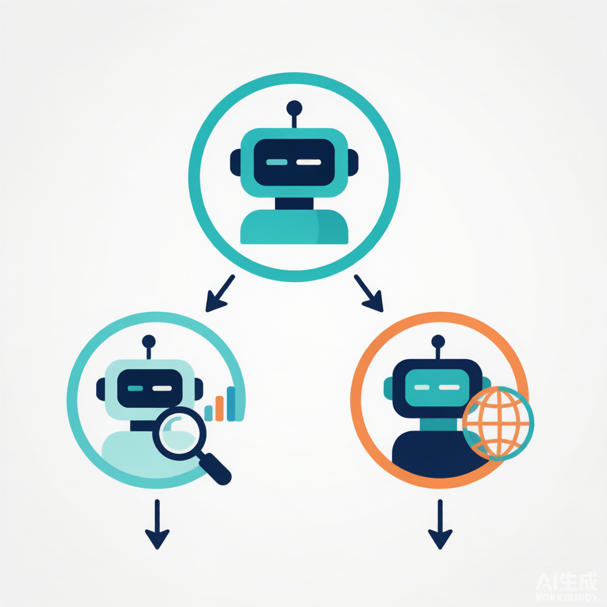

### 08.3 managed_agents 的本质

`managed_agents` 不是"再开一个 agent 窗口"。是**委派**。

经理把活分下去，子智能体干完，结果回到经理手里。经理决定怎么用。子智能体不直接面对用户。

> **标叔的经验**：委派比并行更稳
>
> 我试过让两个 agent 同时跑再合并。结果对不上。改成"经理委派→回收→统一"后，报告一致性立刻上来。**多智能体的关键不是多，是有一个主。**

### 08.4 这就是数据分析助手

到这一步，"数据分析助手"成型了：

- 会读数据（工具）
- 会算会画（代码本能）
- 会联网（子智能体）
- 会统筹出报告（经理）

从 `02 codeact` 的 3845 字节，到 `test5` 的多智能体，这条路走完了。

> **一句话总结**：
>
> | 阶段 | 干什么 | 谁干 |
> |------|--------|------|
> | 手搓 | exec 跑代码 | 一个循环 |
> | 单兵 | 工具+代码 | 一个 CodeAgent |
> | 联网 | 子智能体 | ToolCallingAgent |
> | 团队 | 经理统筹 | managed_agents |

下一章复盘这条线。

---

## §09 复盘：从单兵到团队，那条分界线在哪

### 09.1 五个测试是一条进化线

| 测试 | 形态 | 关键代码 | 学到啥 |
|------|------|----------|--------|
| test1 | CodeAgent 空工具 | `agent.run("算1..100")` | CodeAgent 自带解释器 |
| test2 | +自定义工具 | `tools=[ReadCSVTool, WriteMDTool]` | 稳的封装成工具 |
| test3 | +MCP | `MCPClient({url})` | 工具变服务可复用 |
| test4 | ToolCallingAgent | `tools=[]` 跑搜索 | 不写代码更安全 |
| test5 | +managed_agents | `managed_agents=[web_search_agent]` | 经理委派子智能体 |

> **重点看**：每一格只多一个能力。这就是好的教学顺序。

### 09.2 什么时候该加层

我的判断标准：

- 需要稳定复用 → 封装成工具
- 需要多 agent 共用 → 上 MCP
- 需要隔离风险 → 换 ToolCallingAgent
- 需要统筹多源 → 上 managed_agents

不要一上来就上全套。test1 能跑通的，别急着 test5。

### 09.3 单兵的上限

单兵 CodeAgent 能干很多事。但有两个天花板：

1. **上下文爆炸。** 数据、搜索结果、代码全堆在一个 agent 的记忆里，撑不住。
2. **职责混乱。** 又算数又搜索又写报告，容易顾此失彼。

到了这两点，就该分家。

> **核心建议**：先单兵跑通，再拆团队
>
> 别一上来就多智能体。先让一个 agent 把全流程跑通，哪怕糙。跑通了，你才知道哪里该拆、怎么拆。

分界线讲清了。最后一章，换个脑子。

---

## §10 思维转变：不要教模型答案，要给它手脚

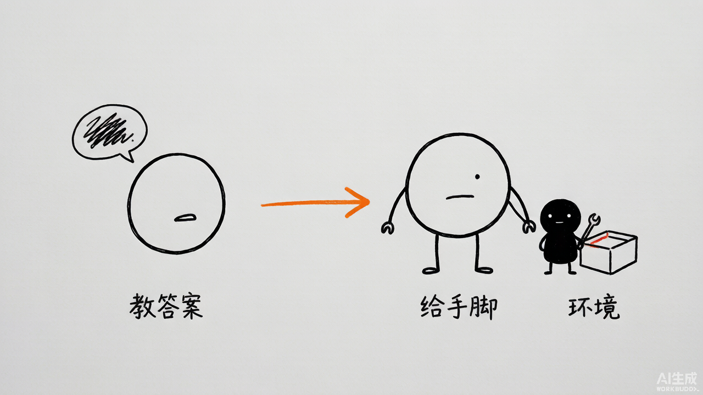

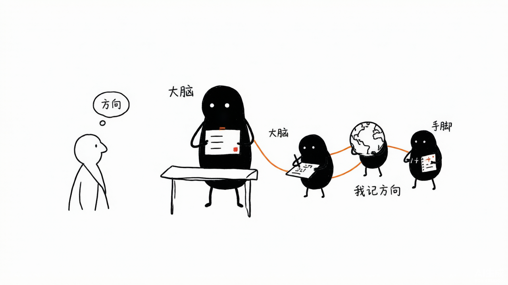

### 10.1 这本书真正的转折点

很多人用 AI 的方式是"教它答案"：把资料喂进去，让它复述。

CodeAct 这套，思路反过来——**不给答案，给手脚**。

你不告诉它均线怎么算。你给它一个能跑代码的环境。它自己会。

### 10.2 三个转变

**转变一：从"提示词"到"环境"。**
与其打磨一句话，不如搭好工具和沙箱。环境对了，模型自然对。

**转变二：从"我写"到"它写"。**
你不再写业务代码。你写工具。模型写胶水代码。

**转变三：从"一个能干的"到"一群各司其职的"。**
单兵有上限。学会拆——大脑一个，手脚若干。

### 10.3 真正省的不是时间，是注意力

用这套之后，我省掉的不是写代码的时间。是"记着所有细节"的注意力。

模型记数据。子智能体记新闻。我记方向。

> **标叔的经验**：最高级的自动化是分工
>
> 我以为自动化是"让机器替我干活"。其实更准的说法是"让机器各自干活、我居中调度"。项目 1 这五个测试，把这层窗户纸捅破了。

思维变了，剩下的就是练。

---

## 附录

### A 核心 API 速查

| 框架 | 类/函数 | 作用 |
|------|---------|------|
| openai | `client.chat.completions.create(tools=, tool_choice=)` | 带工具的对话 |
| openai | `exec(code, {}, local_vars)` | 动态执行代码 |
| smolagents | `CodeAgent(tools=, model=, managed_agents=)` | 代码型智能体 |
| smolagents | `ToolCallingAgent(tools=, model=, max_steps=)` | 工具型智能体 |
| smolagents | `Tool` 子类（name/description/inputs/forward） | 自定义工具 |
| smolagents | `MCPClient({url, transport})` | 连 MCP 服务 |
| FastMCP | `@mcp.tool()` + `mcp.run(transport=)` | 起 MCP 服务 |
| akshare | `ak.stock_zh_a_hist(symbol, period, adjust)` | 拉 A 股 K 线 |

### B 这本书没讲但你应该继续看的

- smolagents 的 `planning_step`：让 agent 先列计划再执行。
- 沙箱执行：用 Docker 或 E2B 替换裸 exec。
- 记忆与状态：跨会话怎么保留上下文。

> ⚠️ 免责声明：本书基于 Geek04 开源代码解读，代码样本仅作教学。投资分析示例不构成任何投资建议。


---

## 附录 C：DeepWiki 官方架构图 / 流程图 / 设计图（深度解读补充）

> 以下内容来自 DeepWiki 对 `xingyunyang01/Geek04` 的自动深度解读（Mermaid 源码），作为本书架构与流程的权威参考补充。在支持 Mermaid 的 Markdown 阅读器（GitHub / Obsidian / VS Code + Mermaid 插件）中会自动渲染为图。

### C.1 [全局] Core Agent Framework Mapping

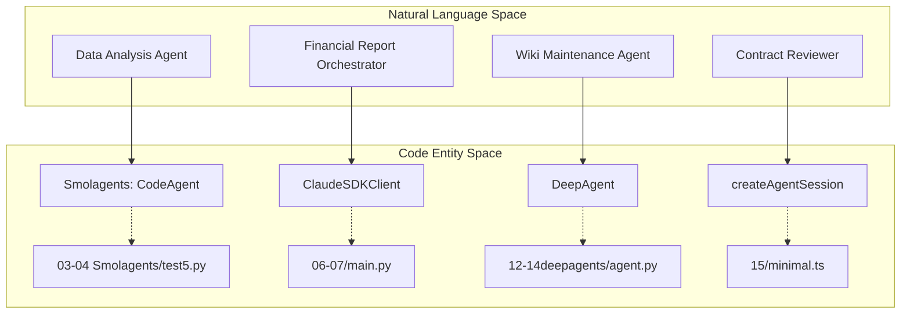

### C.2 [全局] Shared Infrastructure & Tooling

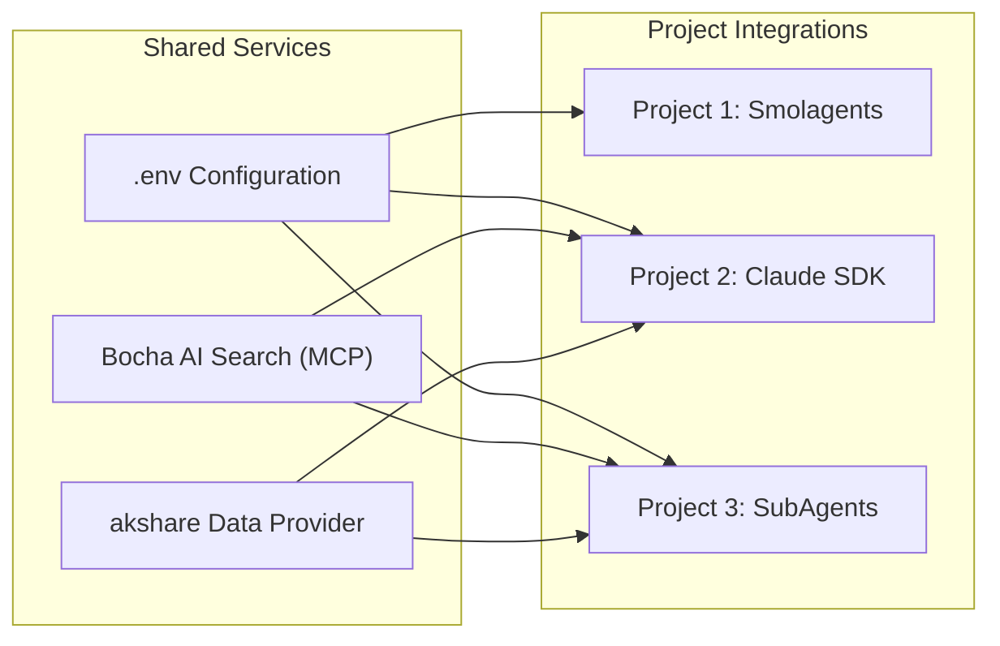

### C.3 [全局] The CodeAct Execution Pattern

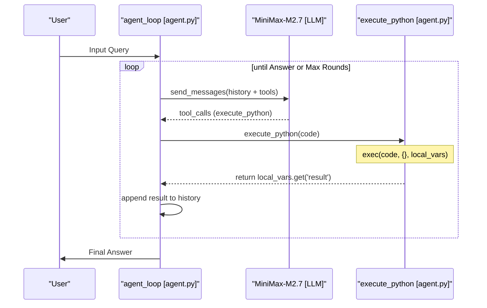

### C.4 [全局] Model Configuration Mapping

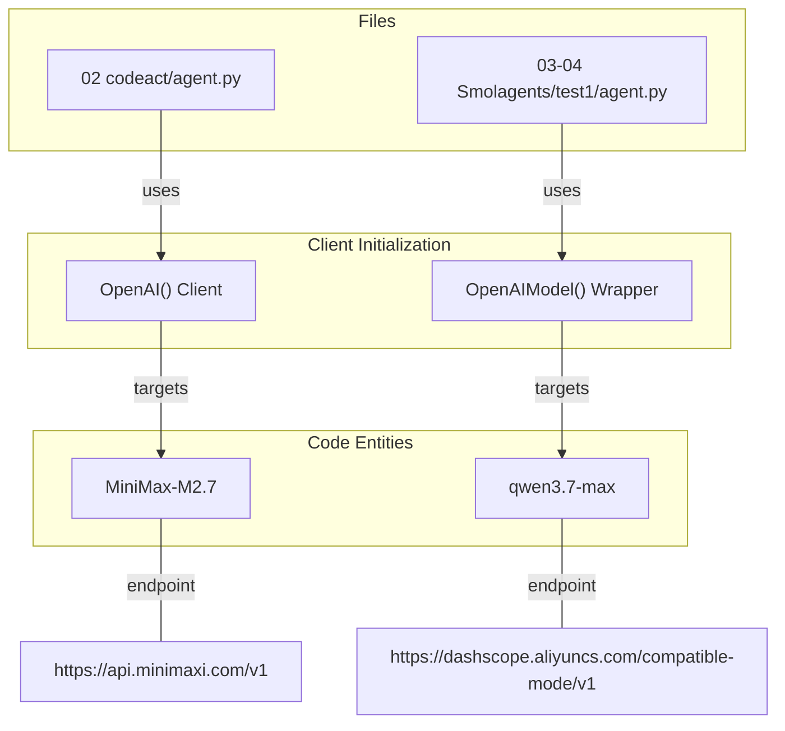

### C.5 System Evolution Diagram

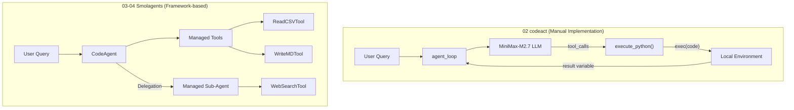

### C.6 Data Flow: Natural Language to Code Execution

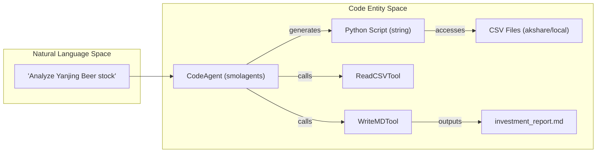

### C.7 Core Components and Data Flow

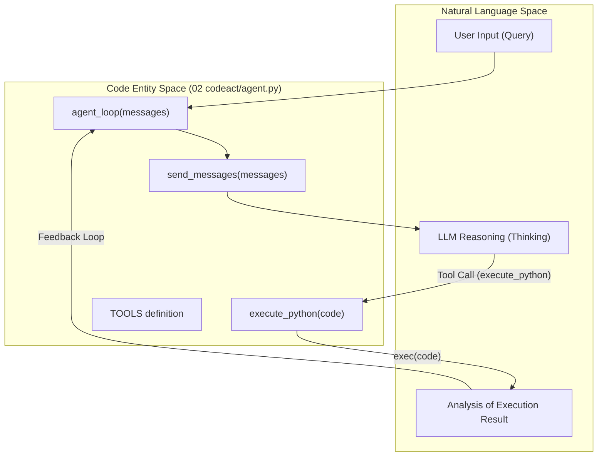

### C.8 Visualization and Outputs

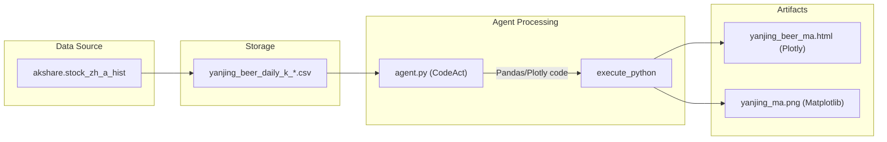

### C.9 Entity Mapping: Natural Language to Code

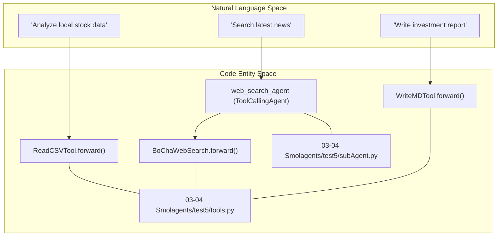

### C.10 Multi-Agent Data Flow

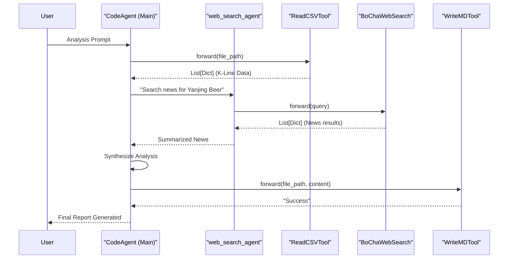

