# 金融研报生成助手-最佳实践

# Financial Research Report Assistant: From Zero to Hero


**创建者**: 标叔
**为谁创建**: 想让 AI 自己出研报、却不知怎么把"流程"喂给模型的金融/开发同学
**基于**: Geek04 项目 2 · claude_agent_sdk + Skills · 2026
**最后更新**: 2026-08-07
**适用场景**: 用 skill 把金融分析能力模块化，搭一个会出研报的"项目经理"

---

## 阅读指南

| 时间 | 章节 | 目标 |
|------|------|------|
| Day 1 | §01-§03 | 跑通最小 agent，拉到一张财报 |
| Day 2 | §04-§07 | 理解 skill 体系和状态管理 |
| Day 3 | §08-§10 | 串成流水线，看到真实研报 |

---

## Part 1: 起步

从零到一。读完你能让一个 agent 调你写的工具。

## §01 为什么研报生成要做成"助手"

### 01.1 时间线锚点

我看过太多"AI 写研报"的演示。给个公司名，吐一段话。看着像，一查数全是编的。

2026 年我拆 Geek04 项目 2。它不玩虚的。`06-07/main.py` 里有一段系统提示，把出研报拆成**四个阶段**，让 agent 按阶段调 skill。每个 skill 都有真脚本，真去 akshare 拉数据、真算 DCF。

它出的研报，每个数字后面都跟着"数据来源：东方财富-年报季报"。

> **标叔的经验**：研报的命门是数据可溯
>
> AI 写研报最大的坑不是写得不像，是数字编的。这项目的解法：不让模型自由发挥，让它调脚本、留产物、标来源。**可信度是管出来的，不是写出来的。**

### 01.2 它跟项目 1 的差别

项目 1 是"一个智能体自己写代码干活"。项目 2 是"一个项目经理，调度一堆预制的技能"。

| 维度 | 项目 1 (CodeAct) | 项目 2 (Skills) |
|------|------------------|------------------|
| 干活方式 | agent 临时写代码 | agent 调预制 skill 脚本 |
| 能力在哪 | 模型脑子里 | skill 文件里（可审计） |
| 复现性 | 低，每次重写 | 高，脚本固定 |
| 适合 | 探索性分析 | 标准化流程 |
| 标叔的结论 | 出原型 | 出产品 |

> **重点看**：最后一列。研报要反复出、要稳定，所以走 skill 这条路。

### 01.3 这本书带你走到哪

读完你能回答：

1. claude_agent_sdk 的最小 agent 长什么样？
2. 一个 skill 怎么定义、怎么被 agent 调起来？
3. 七个 skill 怎么串成一条出研报的流水线？

认知装好。下一章动手。

---

## §02 claude_agent_sdk 的最小可用：一个工具一个智能体

### 02.1 先看最简形态

`05/test2/main.py`，剥到骨架：

```python
from claude_agent_sdk import ClaudeSDKClient, ClaudeAgentOptions, tool, create_sdk_mcp_server
import anyio

async def main():
    @tool("getbalance",
          "获取沪深A股公司的资产负债表...参数stock_code,year",
          {"stock_code": str, "year": str})
    async def get_balance_sheet_A(stock_code="SH600600", year="2025"):
        df = ak.stock_balance_sheet_by_yearly_em(symbol=stock_code)   # 关键：akshare 拉数
        df = df[df['REPORT_DATE'] == f'{year}-12-31 00:00:00']         # 关键：只取年报
        filepath = os.path.join(os.getcwd(), "data", "financial_statements",
                                f"{stock_code}_{year}_资产负债表.csv")
        df.to_csv(filepath, index=False, encoding='utf-8-sig')        # 关键：落盘
        return {"content": [{"type": "text", "text": f"已保存: {filepath}"}]}

    server = create_sdk_mcp_server(name="my-tools", version="1.0.0",
                                   tools=[get_balance_sheet_A])
    options = ClaudeAgentOptions(
        mcp_servers={"tools": server},
        allowed_tools=["mcp__tools__getbalance"])                     # 关键：预授权
    async with ClaudeSDKClient(options=options) as client:
        await client.query("获取 SH600600 的2025年度资产负债表")
        async for msg in client.receive_response():
            print(msg)

anyio.run(main)
```

就这些。一个会拉资产负债表的 agent。

### 02.2 四个关键点

**第一，@tool 装饰器。** 把一个 Python 函数变成 agent 可调的工具。名字、描述、参数类型，三件套。模型靠描述决定调不调。

**第二，create_sdk_mcp_server。** 把工具打包成一个 MCP server，喂给 agent。这跟项目 1 的 smolagents MCPClient 是一回事——工具服务化。

**第三，allowed_tools 预授权。** `["mcp__tools__getbalance"]`。意思：这个工具不用问用户，直接放行。这控制的是"要不要弹确认"，不是"能不能用"。

**第四，receive_response 是流。** `async for msg in client.receive_response()`。agent 的输出是流式的，边想边吐。

### 02.3 模型走的是"Anthropic 兼容"通道

```python
os.environ.setdefault("ANTHROPIC_BASE_URL", "https://dashscope.aliyuncs.com/apps/anthropic")
os.environ.setdefault("ANTHROPIC_MODEL", "qwen3.7-max")
os.environ.setdefault("ANTHROPIC_AUTH_TOKEN", os.getenv("ALI_API_KEY"))
```

通义千问，但走 Anthropic 协议。说明 claude_agent_sdk 不绑死 Anthropic 模型。换 MiniMax 也行（项目 2 的 `06-07` 就是 MiniMax-M3）。

> **标叔的经验**：协议比模型重要
>
> 我最早纠结"必须用 Claude 吗"。不用。sdk 说的是协议。任何兼容 Anthropic API 的模型都能接。**选你能控制成本的那家。**

### 02.4 它真落盘了

工具不只是返回文本。它把数据写进 CSV。`data/financial_statements/600600_2025_资产负债表.csv`。

这是项目 2 的核心设计：**产物留文件**。下一章讲它为什么重要。

> **核心建议**：工具要有"副作用"
>
> 别只让工具 return 字符串。让它写文件、存库。落盘的产物，是后面所有 skill 的输入。**流水的 agent，铁打的文件。**

最小 agent 会调工具了。下一章，跑通第一次。

---

## §03 第一次跑通：拉一张资产负债表

### 03.1 你需要什么

- Python 3.9+，装好 claude_agent_sdk、akshare、pandas
- 一个能用的 API key（通义或 MiniMax）
- `05/test2/main.py`

### 03.2 我们最终做成什么

输入一句话："获取 SH600600 的2025年度资产负债表"。

agent 自己判断要调 getbalance，传 stock_code=SH600600、year=2025。akshare 拉数，过滤 2025-12-31 年报行，存成 CSV，告诉你路径。

### 03.3 踩坑记录

**坑一：代码硬编码。** `get_balance_sheet_A` 里 `symbol="SH600600"` 写死在 akshare 调用里，但函数签名参数是 stock_code。模型传别的公司，代码还是拉 600600。这是 bug，该用 `symbol=stock_code`。

```python
df = ak.stock_balance_sheet_by_yearly_em(symbol=stock_code)   # 关键：用参数，别写死
```

**坑二：报告日期格式。** akshare 返回的 REPORT_DATE 是 `2025-12-31 00:00:00`，带时分秒。过滤得带全。项目 2 的 collect_financial_data.py 同时试两种格式，更稳。

**坑三：港股不支持。** akshare 的这个接口对港股有限。`competitor_research` skill 里明确标注"港股仅做行业对标，不纳入财务对比"。诚实标注，不硬撑。

> **注意**：工具的边界要写清
>
> 别让 agent 以为工具万能。在 SKILL.md 里写明"港股暂不支持"。agent 看了就会换策略。**边界信息也是给 agent 的指令。**

单工具跑通了。下一章，进入 skill 体系。

---

## Part 2: 核心能力

把零散工具，组织成 skill 体系。

## §04 把能力装进 skill：SKILL.md 是什么

### 04.1 skill 不是代码，是"说明书+脚本"

项目 2 的 `06-07/.claude/skills/` 下有七个文件夹。每个长这样：

```
financial_data_collection/
├── SKILL.md            # 说明书：何时用、怎么调、产物是什么
├── requirements.txt
└── scripts/
    ├── collect_financial_data.py
    └── akshare_tools.py
```

**SKILL.md 是给 agent 读的。** 它告诉 agent：这个 skill 干什么、什么场景该调、要传什么参数、会产出什么。

### 04.2 一份 SKILL.md 的骨架

拿 `financial_data_collection/SKILL.md` 看：

```yaml
---
name: financial-data-collection
description: |
  采集中国A股和港股上市公司的财务数据...
  当用户提到财务数据、财报、三大报表...务必使用此 skill。
compatibility: |
  - Python 3.9+, 依赖 akshare/pandas
  - 默认输出目录：/workspace/data/financial_statements
---
```

正文里写清楚：输入参数表、输出产物清单、数据标准化规则、常见错误处理。

agent 读到这段，就知道"要拉财报，调 collect_financial_data.py，传 --code --name --market --years"。

### 04.3 为什么这个设计好

| 维度 | 传统写法 | skill 写法 |
|------|----------|------------|
| 能力承载 | 写进 prompt | 写进文件 |
| 可审计 | 难，prompt 黑盒 | 易，文件可读 |
| 可复用 | 复制 prompt | 复用文件夹 |
| 可演化 | 改 prompt 风险大 | 改脚本可控 |
| 标叔的结论 | 原型可用 | 工程可用 |

> **标叔的经验**：SKILL.md 是契约
>
> 我把它当"agent 和开发者之间的接口契约"。开发者保证脚本按 SKILL.md 的约定产出。agent 按 SKILL.md 的约定调用。**对齐了，就稳了。**

### 04.4 skills="all" 一键全开

```python
options = ClaudeAgentOptions(
    system_prompt=SYSTEM_PROMPT,
    mcp_servers={"tools": websearch_server},
    skills="all",                              # 关键：所有 skill 自动加载
    allowed_tools=["Read", "Write", "Bash", "Glob", "mcp__tools__bochasearch"])
```

`skills="all"` 让 agent 自动发现所有 skill。它什么时候用哪个？靠读每个 SKILL.md 的 description。所以 description 写得准，调度就准。

> **核心建议**：description 要写触发条件
>
> "当用户提到财报、三大报表、akshare...务必使用此 skill"。这种触发词列表，比"用于采集财务数据"有效十倍。**给 agent 一把判断的尺子。**

skill 是什么，讲清了。下一章，看七个 skill 怎么分工。

---

## §05 七个 skill 怎么分工

### 05.1 一张分工表

| skill | 职责 | 核心脚本 | 产物 |
|------|------|----------|------|
| competitor_research | 找对手、梳行业 | parse_competitors.py | competitors.json |
| financial_data_collection | 拉三大报表+指标 | collect_financial_data.py | *_资产负债表.csv 等 |
| financial_ratio_calculation | 算财务比率 | calculate_ratios.py | *_财务计算结果.csv |
| financial_visualization | 画趋势图+对比图 | chart_generator.py | *_趋势分析.png |
| valuation_modeling | DCF+相对估值 | build_valuation.py | 估值与预测模型.md |
| report_writing | 写作规范模板 | (references) | 写作标准 |
| report_assembly | 组装最终研报 | assemble_report.py | 财务研报汇总.md |


### 05.2 它们是上下游关系

report_writing 的 SKILL.md 末尾写明了协作：

```
上游：financial_visualization 提供图表
上游：valuation_modeling 提供估值数据
上游：competitor_research 提供行业信息
下游：report_assembly 汇总各章节
```

每个 skill 都声明自己吃谁的产物、喂给谁。这就是流水线的接口。

### 05.3 两种 skill

注意 report_writing 没有脚本。它只有 references（report_template.md、writing_style_guide.md）。

它是"规范型 skill"——不给 agent 工具，给它**写作标准**。agent 写章节时"隐式遵循"。

> **标叔的经验**：skill 有两种，别混
>
> 一种是"工具型"，给脚本给产物。一种是"规范型"，给标准给模板。研报既要算得对，也要写得对。**算用工具型，写用规范型。**

### 05.4 数据标准化的细节

financial_data_collection 有七条规则，我挑三条关键的：

- 只保留年报：过滤 REPORT_DATE 是 `{year}-12-31`。
- 编码统一：utf-8-sig，Excel 能直接开。
- 表头保留中文：下游 calculate_ratios 依赖中文列名。

这些规则保证了"上一步产物，下一步能直接吃"。没有它，每步都要人工清洗。

> **核心建议**：定死上下游的数据格式
>
> 七条标准化规则，本质是"接口契约"。CSV 用什么编码、列名叫什么、过滤什么日期，全定死。**契约越死，流水线越顺。**

七个 skill 分工讲清了。下一章，讲状态怎么管。

---

## §06 用文件系统当状态机

### 06.1 这是最被低估的设计

agent 是无状态的。每轮它都"失忆"。那它怎么知道上一步干完没？

项目 2 的答案：**靠文件系统**。

系统提示里写：

> 所有中间产物都保存在文件系统中，你通过 read/glob 工具检查产物是否存在。如果某个 skill 失败，记录警告并尝试继续。

### 06.2 它怎么工作

agent 想算比率。它先 `Glob` 看 `data/financial_statements/` 下有没有 `600600_2025_资产负债表.csv`。

- 有 → 直接进下一步。
- 没有 → 先调 financial_data_collection 去拉。

`collection_summary.json` 是关键。它记录"这次采集成功哪些、失败哪些"。agent 读它，知道数据齐不齐。

### 06.3 为什么不用数据库

| 维度 | 文件系统 | 数据库 |
|------|----------|--------|
| 可见性 | 高，人能直接看 | 低，要查 |
| 可调试 | 强，改文件即改状态 | 弱 |
| 并发 | 弱 | 强 |
| 适合 | 单 agent 串行 | 多 agent 并行 |
| 标叔的结论 | 这场景够用 | 量大再上 |

> **标叔的经验**：调试友好的就是好状态
>
> 出问题时，我能直接打开文件夹看哪步产物缺了。数据库做不到。**开发期，可见性 > 性能。**

### 06.4 失败不中断

financial_data_collection 的规则第六条："失败不中断——若某年度某张表缺失，记录错误并继续"。

意思是：2023 年现金流量表拉不到？记一笔，继续拉别的。下游 calculate_ratios 要能处理缺失。

这是为流水线韧性设计的。一个点挂了，整条线不塌。

> **注意**：流水线要能容忍残缺
>
> 别假设每步都成功。让每个 skill 写 summary、让下游能读 summary 决定跳过。**韧性来自显式的状态检查，不是来自祈祷。**

状态管理讲清了。下一章，讲工具和权限。

---

## §07 MCP 工具 + allowed_tools 权限

### 07.1 一个联网工具

`06-07/main.py` 里除了 skill，还挂了个 websearch：

```python
@tool("bochasearch", "使用 Bocha AI 进行网络搜索", {"query": str})
async def bochasearch(args):
    resp = requests.post("https://api.bochaai.com/v1/web-search",
        headers={"Authorization": f"Bearer {bochakey}"}, ...)
    return {"content": [{"type": "text", "text": f"result: {data}"}]}

websearch_server = create_sdk_mcp_server(name="websearch", version="1.0.0",
                                         tools=[bochasearch])
```

跟项目 1 的 BoChaWebSearch 一个东西，换了个 sdk 包装。给 agent 联网查资讯的能力。

### 07.2 allowed_tools 是权限白名单

```python
allowed_tools=["Read", "Write", "Bash", "Glob", "mcp__tools__bochasearch"]
```

这五项放行。注意有 `Bash`——这是危险的。agent 能跑命令。但项目 2 的 Bash 主要用来跑 skill 的 python 脚本。

| 工具 | 干什么 | 风险 |
|------|--------|------|
| Read | 读文件/产物 | 低 |
| Glob | 找文件 | 低 |
| Write | 写研报 | 中 |
| Bash | 跑 skill 脚本 | 高 |
| bochasearch | 联网 | 低 |

> **标叔的经验**：Bash 是双刃
>
> 没 Bash，skill 脚本跑不起来。有 Bash，agent 理论上能干任何事。项目 3 的 hook 就是来管这个的。**先跑通，再上锁。**

### 07.3 工具和 skill 的区别

容易混。说清：

- **工具（tool）**：一个函数，agent 直接调。如 bochasearch。
- **skill**：一个能力包，含说明书+脚本。agent 读说明书，决定用 Bash 跑脚本。

工具是"即时动作"，skill 是"预制流程"。

> **核心建议**：动作做工具，流程做 skill
>
> 一次联网、一次查询——封装成 tool。多步数据采集、计算、画图——封装成 skill。**粒度对了，调度才不乱。**

权限讲清了。下一章，串成流水线。

---

## Part 3: 进阶实战

把七个 skill 串成一条出研报的流水线。

## §08 串成四阶段流水线：从股票代码到完整研报

### 08.1 系统提示就是 SOP

`06-07/main.py` 的 SYSTEM_PROMPT，是整本书的精华：

```text
你是一位金融研报项目协调员。用户会提供股票代码、公司名称、市场和分析年份。

阶段 1: 数据采集
- 调 competitor_research skill 研究竞争对手和行业
- 调 financial_data_collection skill 采集所有公司的财务报表

阶段 2: 指标计算
- 调 financial_ratio_calculation skill 计算所有公司的财务比率

阶段 3: 分析与可视化
- 调 financial_visualization skill 生成趋势图和对比图
- 调 valuation_modeling skill 生成估值报告

阶段 4: 报告撰写
- 调 report_writing skill（隐式遵循其写作规范）
- 调 report_assembly skill 组装最终研报

状态管理：所有中间产物都保存在文件系统中，通过 read/glob 检查产物是否存在。
如果某个 skill 失败，记录警告并尝试继续。
```


### 08.2 一句话触发整条线

```python
await client.query("生成青岛啤酒SH600600的2025年金融研报")
```

agent 收到这句，按 SOP 往下走。它自己决定每步调哪个 skill、传什么参数。

### 08.3 它怎么知道每步的参数

靠读 skill 的 SKILL.md。比如它要采数据，会读 financial_data_collection 的 SKILL.md，看到要传 `--code 600600 --name 青岛啤酒 --market A股 --years 2021 2022 2023 2024 2025`，然后调 Bash 跑。

agent 不是猜的。是读说明书调的。这就是 skill 体系的红利。

### 08.4 失败容忍在起作用

competitor_research 发现华润、百威是港股，采集脚本不支持。它怎么处理？

competitors.json 里标注："港股仅做行业对标参考，不纳入同口径财务对比"。然后只对 A 股的燕京、重庆做财务对比。

agent 读了 SKILL.md 的边界说明，自己做了这个判断。**边界信息在 SKILL.md 里，agent 真的会读、会用。**

> **标叔的经验**：把异常路径也写进 SOP
>
> "如果某 skill 失败，记录警告并尝试继续。"这句让 agent 不卡死。我加这句之前，一个采集失败整条线就停。加了之后，它跳过继续。**SOP 要写异常分支，不只写 happy path。**

SOP 讲清了。下一章，看真实产物。

---

## §09 真实产物长什么样：青岛啤酒 2025

### 09.1 这一章全是真东西

项目 2 真跑过一次，产物在 `06-07/data/final_output/`。我带你过一遍。

### 09.2 数据层产物

`data/financial_statements/` 下，三家公司各五年：

```
600600_2021_资产负债表.csv   600600_2021_利润表.csv
600600_2021_现金流量表.csv   600600_2021_财务指标.csv
...（一直到 2025）
000729_（燕京）...
600132_（重庆啤酒）...
```

每公司每年四张表。五家公司 × 五年 × 四表 = 一堆 CSV。全部 utf-8-sig，Excel 能开。

`financial_ratios/` 下是算好的比率：

```
600600_2021年度财务计算结果.csv
...
600600_2025年度财务计算结果.csv
```

### 09.3 图表层产物

`final_output/images/` 八张图：

| 图 | 类型 |
|------|------|
| 青岛啤酒盈利能力指标趋势分析.png | 趋势 |
| 青岛啤酒偿债能力指标趋势分析.png | 趋势 |
| 青岛啤酒运营能力指标趋势分析.png | 趋势 |
| 青岛啤酒现金流能力指标趋势分析.png | 趋势 |
| 盈利能力对比分析.png | 对比 |
| 偿债能力对比分析.png | 对比 |
| 运营能力对比分析.png | 对比 |
| 现金流能力对比分析.png | 对比 |

四张看自己趋势（青岛啤酒自身 2021–2025），四张跟对手比（燕京、重庆啤酒）。下面把八张真实产物原样嵌进来——这就是 agent 跑出来的东西，不是我画的示意图：

**趋势组（看自己）：**

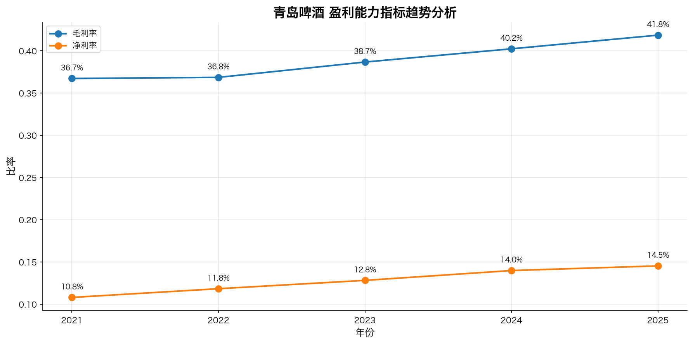

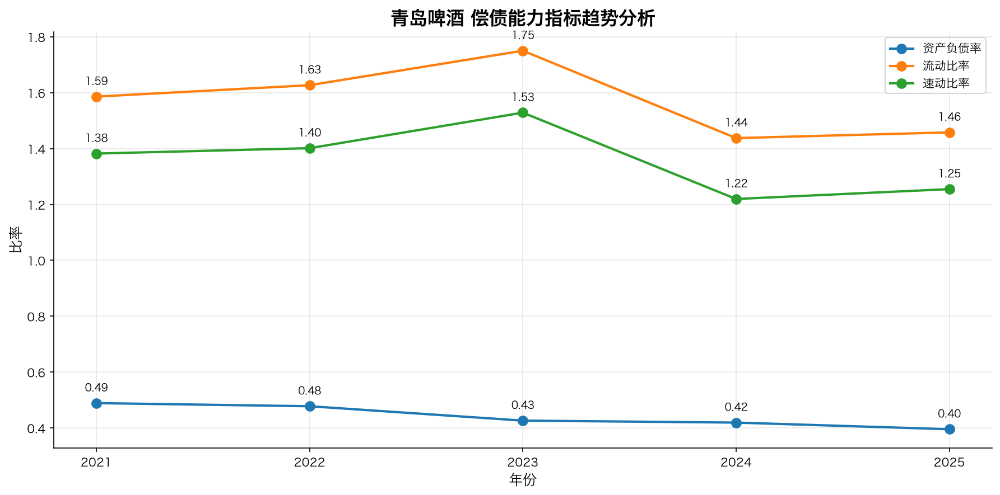

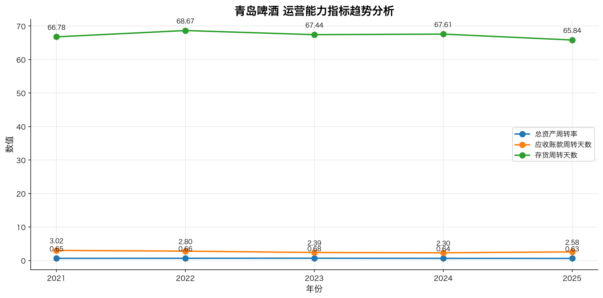

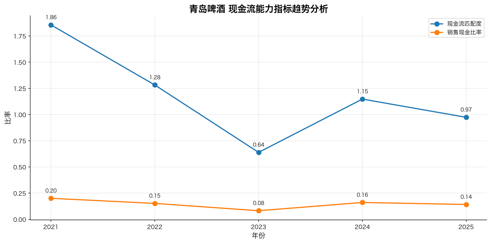

**对比组（跟对手比）：**

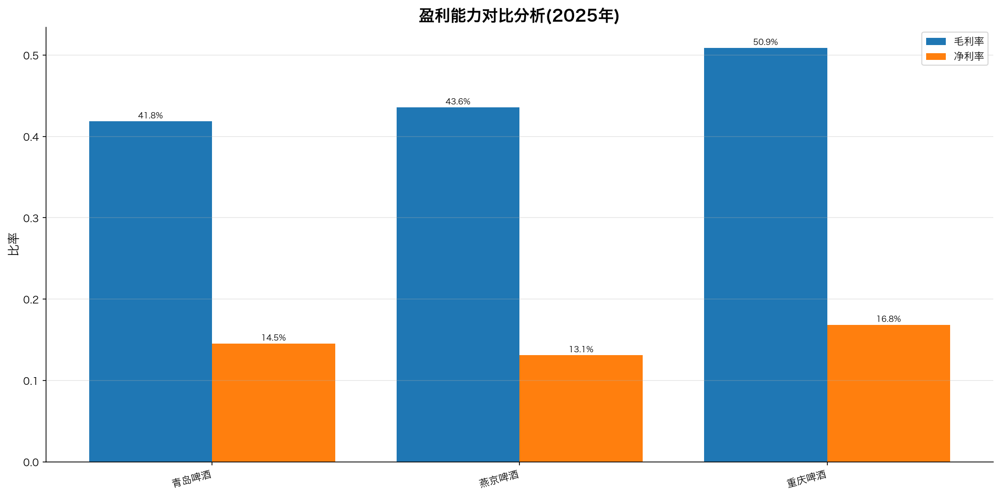

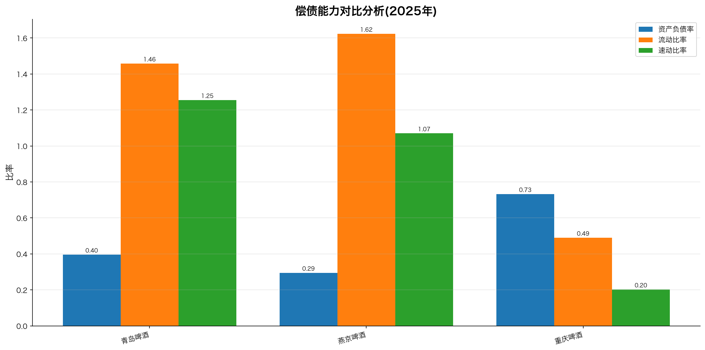

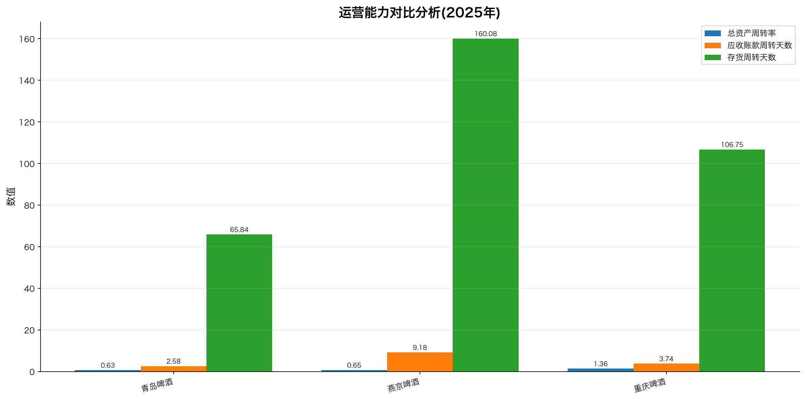

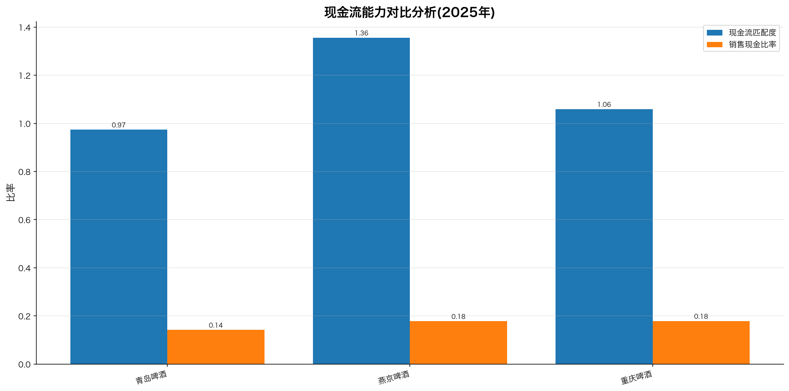

### 09.4 估值产物

`估值与预测模型.md` 里有完整 DCF：

| 假设项 | 数值 |
|------|------|
| 未来5年收入增长率 | 5.00% |
| WACC | 9.00% |
| 永续增长率 | 2.50% |
| 预测年数 | 5年 |

DCF 企业价值 **806 亿元**，区间 725-886 亿。还附了 WACC×永续增长率的敏感性矩阵——5×5 网格。

相对估值跟燕京、重庆比，PE 20-30x，行业 25-35x，结论"处于行业合理区间"。

### 09.5 最终研报

`财务研报汇总_20260625_213710.md`。六个大章节：

一、公司基础信息（成立1903、A+H上市、总股本13.64亿）
二、股权信息（青啤集团32.51%控股、实控人青岛市国资委）
三、行业与竞争对手（CR5寡头、华润/百威/燕京/重庆）
四、财务分析与对比（引用上面八张图）
五、估值与预测（DCF+相对估值+敏感性）
六、数据来源与免责声明

每个数字后面跟来源。每段不超 5-8 行。结构、口径、可溯，全齐。

> **一句话总结**：
>
> | 产物层 | 内容 | 数量级 |
> |--------|------|--------|
> | 原始数据 | 三大报表+指标 CSV | ~80 个 |
> | 计算结果 | 财务比率 CSV | ~15 个 |
> | 可视化 | 趋势+对比图 | 8 张 |
> | 分析结论 | 估值报告 | 1 份 |
> | 最终交付 | 汇总研报 | 1 份 |

这就是从一句"生成研报"到一沓产物的全过程。下一章，换个脑子。

---

## §10 思维转变：你写 SOP，agent 执行 SOP


### 10.1 这本书真正的转折

很多人以为 AI agent 是"更聪明的聊天"。项目 2 戳破了这层。

它的核心不是模型多强。是**把流程显式化**：四阶段、七个 skill、文件状态、失败容忍。模型只是执行器。

### 10.2 三个转变

**转变一：从"写代码"到"写 SOP"。**
你的产出从 .py 变成 SKILL.md + SYSTEM_PROMPT。你写的是流程说明书。

**转变二：从"信任模型"到"约束模型"。**
allowed_tools 限权、SKILL.md 定边界、文件留痕审计。你不假设它对，你设计让它想错都难。

**转变三：从"一次性脚本"到"可复用能力"。**
每个 skill 是独立能力包。这次出青岛啤酒研报，下次出燕京，复用同一套。

### 10.3 研报助手的本质

它不是"一个会写研报的 AI"。它是"一套出研报的流水线，配一个会调度的 agent"。

流水线是你建的。agent 是流水线上的工人。你定 SOP、定 skill、定边界。worker 按图索骥。

> **标叔的经验**：工程化才能稳定出活
>
> 我用项目 1 的方式出过研报。一次惊艳，三次翻车——每次数字不一样。换成项目 2 的 skill 流水线后，可复现了。**惊艳靠模型，稳定靠工程。**

思维变了。剩下的，就是把你自己的业务拆成 skill。

---

## 附录

### A 核心 API 速查

| 来源 | 类/函数 | 作用 |
|------|---------|------|
| claude_agent_sdk | `ClaudeSDKClient(options)` | 起 agent |
| claude_agent_sdk | `ClaudeAgentOptions(system_prompt, mcp_servers, skills, allowed_tools)` | 配置 |
| claude_agent_sdk | `@tool(name, desc, params)` | 定义工具 |
| claude_agent_sdk | `create_sdk_mcp_server(name, version, tools)` | 打包成 MCP |
| claude_agent_sdk | `client.query(...)` / `receive_response()` | 发问/收流 |
| akshare | `stock_balance_sheet_by_yearly_em` | 拉资产负债表 |

### B 这本书没讲但你应该继续看的

- skill 的版本管理：SKILL.md 怎么迭代不破坏下游。
- 多公司并行：怎么同时拉几家，而不是串行。
- 估值假设的可解释性：WACC 9% 凭什么，怎么让 agent 标来源。

> ⚠️ 免责声明：本书基于 Geek04 开源代码与真实产物解读。估值与研报示例仅作技术演示，不构成任何投资建议。


---

## 附录 C：DeepWiki 官方架构图 / 流程图 / 设计图（深度解读补充）

> 以下内容来自 DeepWiki 对 `xingyunyang01/Geek04` 的自动深度解读（Mermaid 源码），作为本书架构与流程的权威参考补充。在支持 Mermaid 的 Markdown 阅读器（GitHub / Obsidian / VS Code + Mermaid 插件）中会自动渲染为图。

### C.1 Diagram 2: Skill-Based Report Generation (Project 2)

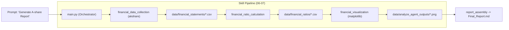

### C.2 Component Mapping

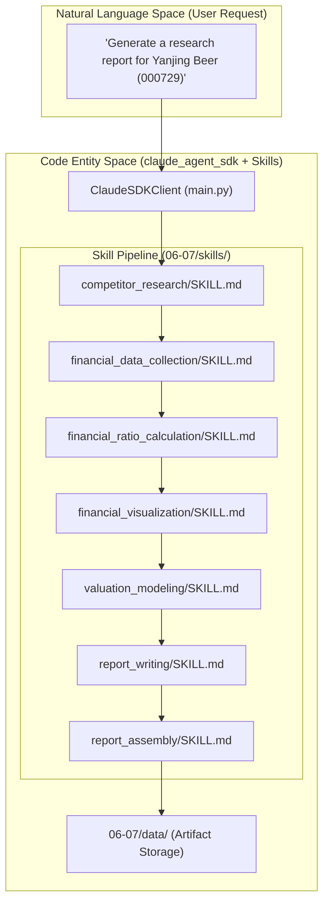

### C.3 Data Flow and Artifacts

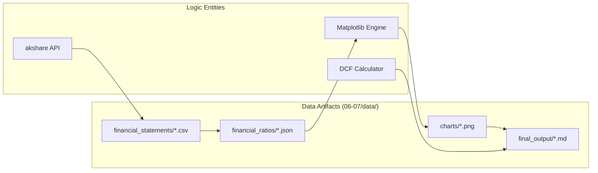

### C.4 Logic Flow: Natural Language to Code Execution

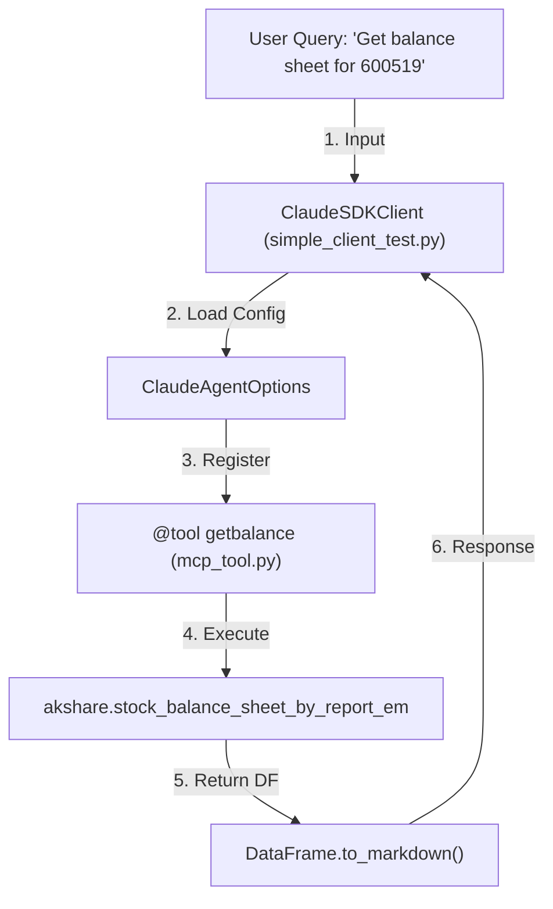

### C.5 SDK Component Interaction

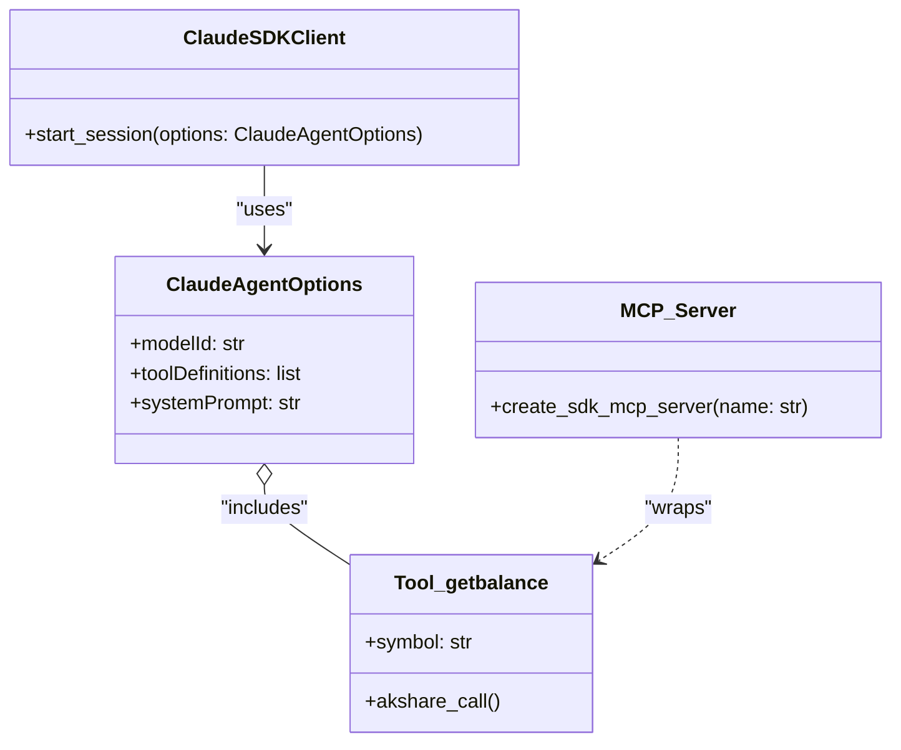

### C.6 System Architecture and Entity Mapping

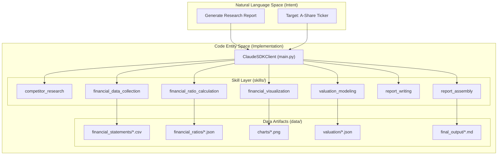

### C.7 Data Flow and Artifacts

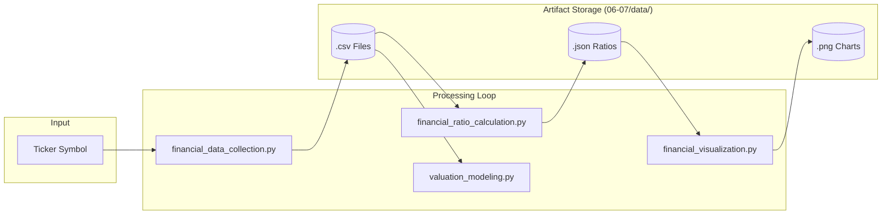

### C.8 Natural Language to Code Entity Mapping

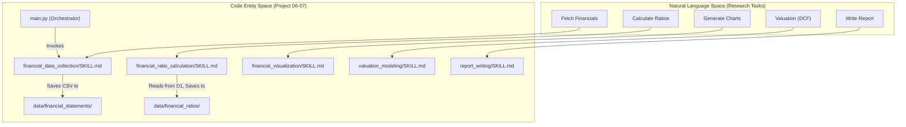

### C.9 Inter-Skill Dependencies & Data Flow

```mermaid
graph LR
    subgraph "Data Acquisition"
        "financial_data_collection"
    end

    subgraph "Analysis & Modeling"
        "financial_ratio_calculation"
        "valuation_modeling"
    end

    subgraph "Presentation"
        "financial_visualization"
        "report_writing"
        "report_assembly"
    end

    "financial_data_collection" --> "financial_ratio_calculation"
    "financial_data_collection" --> "valuation_modeling"
    "financial_ratio_calculation" --> "financial_visualization"
    "financial_ratio_calculation" --> "report_writing"
    "valuation_modeling" --> "report_writing"
    "financial_visualization" --> "report_assembly"
    "report_writing" --> "report_assembly"
```

### C.10 Artifact Pipeline Diagram

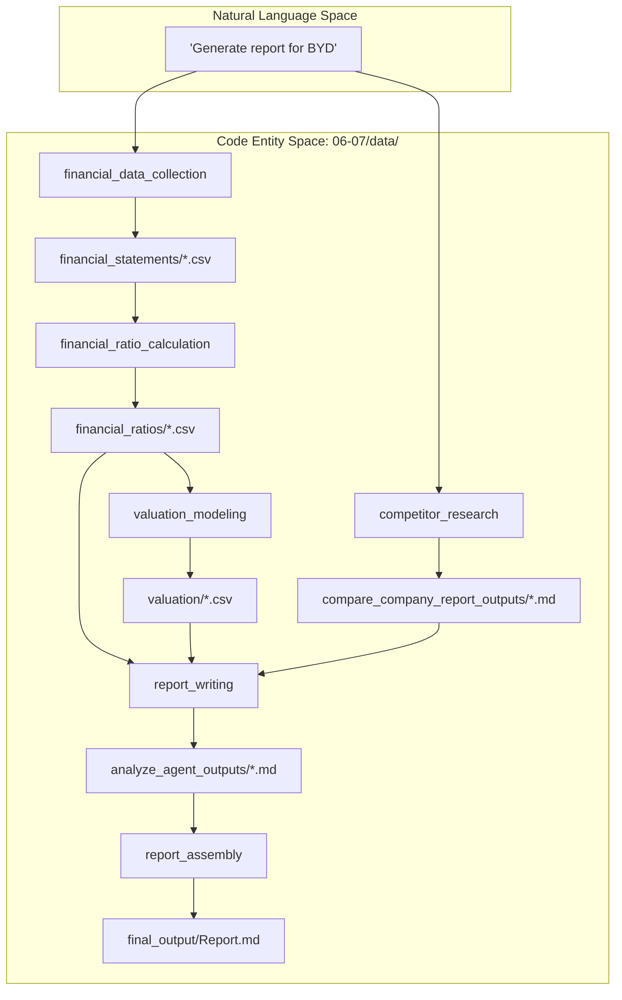

### C.11 Artifact Integrity

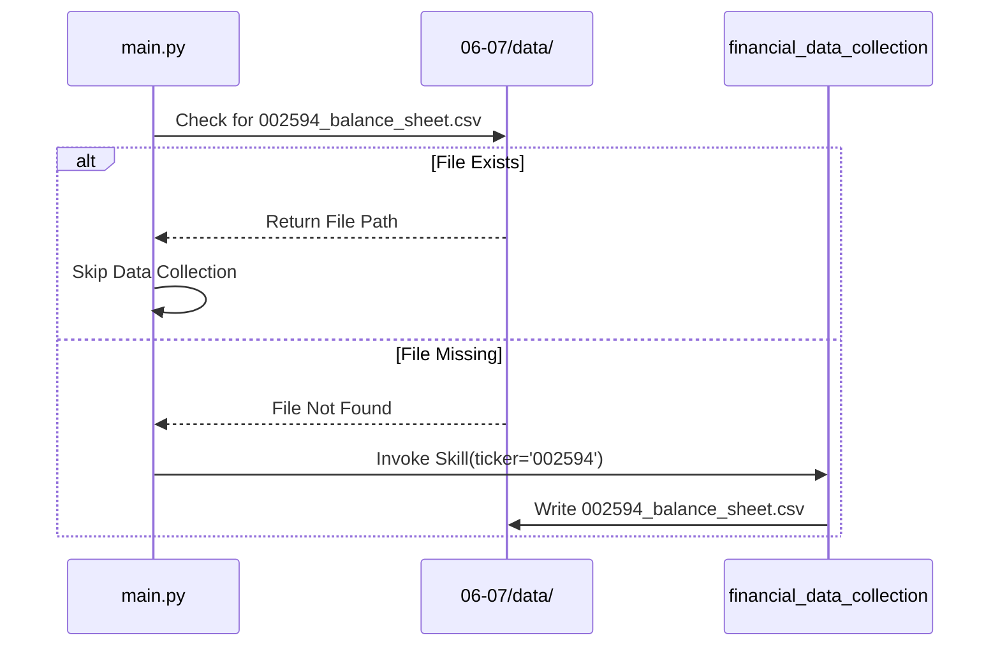

