# 金融平台-最佳实践

# Financial Platform: From Zero to Hero

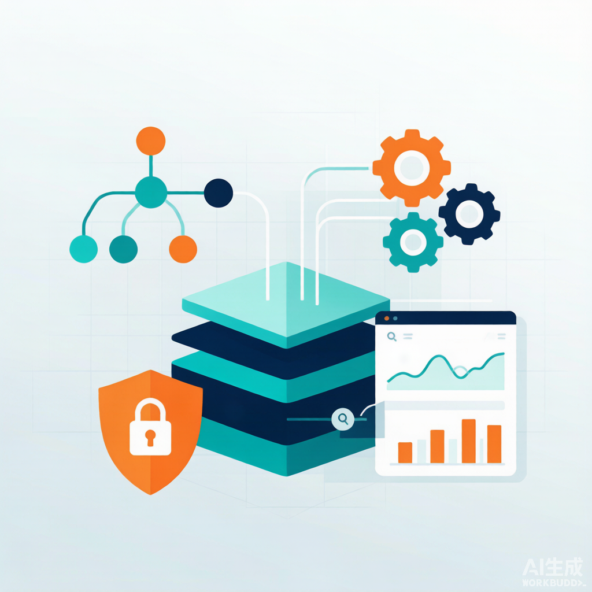

**创建者**: 标叔
**为谁创建**: 把 AI 助手做成能上线、可审计、可观测的"平台"的工程师
**基于**: Geek04 项目 3 · claude_agent_sdk + SubAgents · 2026
**最后更新**: 2026-08-07
**适用场景**: 从单 agent，一路加到子智能体、会话分叉、安全钩子、链路追踪

---

## 阅读指南

| 时间 | 章节 | 目标 |
|------|------|------|
| Day 1 | §01-§03 | 搭起 SubAgent 架构 |
| Day 2 | §04-§07 | 管会话状态、上锁、留痕 |
| Day 3 | §08-§10 | 接通可观测性，平台成型 |

---

## Part 1: 起步

从"一个能干的助手"到"一个能管的平台"。

## §01 从"助手"到"平台"，差了什么

### 01.1 时间线锚点

项目 2 我搭了个会出研报的助手。跑得动。但它有三个硬伤：

第一，它一个 agent 啥都干。财报、新闻、风险全压一个上下文。撑不住。

第二，跑完就忘。下次问，从头来。没法接续。

第三，看不见。它干了啥、调了啥、卡在哪，全是黑盒。出问题没法查。

2026 年我拆 Geek04 项目 3。四个文件夹（08/09/10/11）正好对应四层补丁：

| 文件夹 | 补的硬伤 | 一句话 |
|--------|----------|--------|
| 08 subagent | 单 agent 撑不住 | 拆成主调度+专员 |
| 09 fork | 跑完就忘 | 会话能续、能分叉 |
| 10 hook | 管不住 | 上钩子，拦危险、留审计 |
| 11 opentelemetry | 看不见 | 全链路可观测 |

> **标叔的经验**：助手到平台，是补四个洞
>
> 我以为"平台"是加功能。错。是把单点的脆弱补成体系。**子智能体补容量、会话补记忆、钩子补安全、遥测补可见。**

### 01.2 这本书带你走到哪

读完你能回答：

1. SubAgent 架构怎么搭？主 agent 凭什么只调度不干活？
2. 会话怎么续、怎么分叉？Fork 为什么是试错的利器？
3. Hook 怎么拦危险命令、怎么留审计日志？
4. OpenTelemetry 怎么让 agent 从黑盒变玻璃盒？

认知装好。下一章搭架构。

---

## §02 SubAgent 架构：主调度 + 三个专员

### 02.1 一句话架构

`08 subagent/agent.py`：一个主 agent，带三个 SubAgent。

主 agent 不干活，只调度。三个专员各自带 skill 干活。

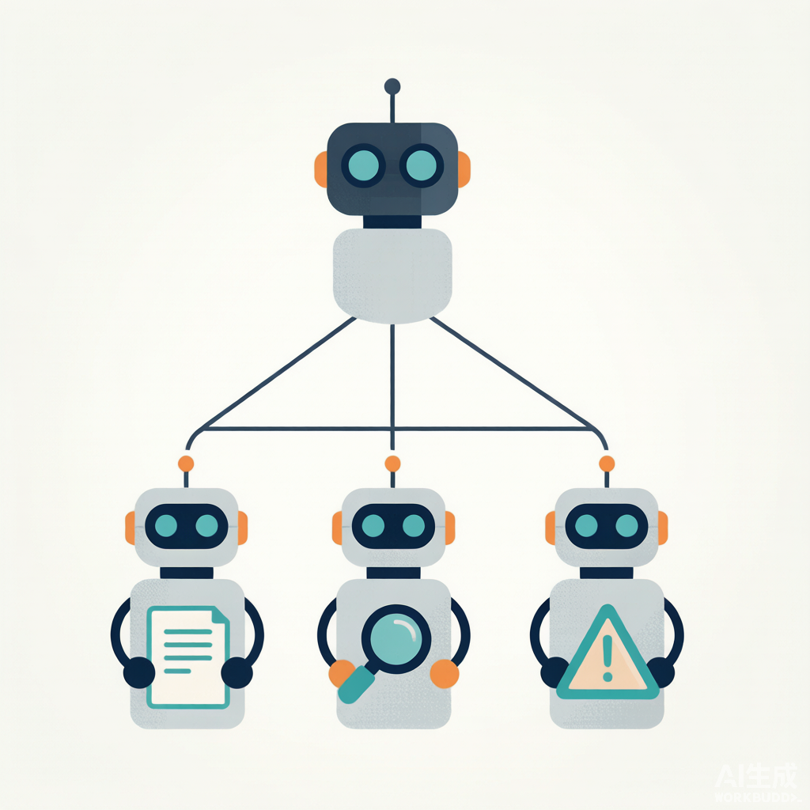

### 02.2 SubAgent 怎么定义

每个 SubAgent 是一个 `AgentDefinition`：

```python
def financial_analyzer_agent() -> AgentDefinition:
    return AgentDefinition(
        description="财报分析助手",
        prompt="你是一个财报分析助手",
        tools=["Read", "Grep", "Glob", "Bash", "Write", "Edit", "mcp__websearch__bochasearch"],
        skills=["financial-report-analyzer"],      # 关键：skill 挂在子 agent 上
        model="MiniMax-M3",
    )
```

三个专员，三个 skill：financial-report-analyzer、industry-news-collector、a-share-risk-alert。各自有 tools、model、prompt。

### 02.3 主 agent 凭什么只调度

关键在 options：

```python
options = ClaudeAgentOptions(
    include_partial_messages=True,
    mcp_servers={"websearch": websearch_server},
    allowed_tools=["Read", "Grep", "Glob", "Agent", "AskUserQuestion",
                   "mcp__websearch__bochasearch"],
    agents=agents_config,                          # 关键：注册子 agent
)
```

注意两点：

第一，**主 agent 没有字段**。注意：它没有 `skills=`。skill 全在子 agent 上。主 agent 想用 skill？没门。只能委派。

第二，**allowed_tools 里有 "Agent"**。这是委派工具。主 agent 用它把活分给子 agent。

再加系统提示补刀：

```python
prompt = """请完成以下三个任务：
1. 请使用 financial-analyzer agent，阅读...燕京啤酒财报.pdf，进行财务分析。
2. 请使用 a-share-risk-alert agent，对燕京啤酒进行风险分析。
3. 请使用 industry-news-collector agent，收集最近啤酒行业新闻。
必须使用子agent完成任务，不能自行调用skills"""
```

"必须使用子agent，不能自行调用skills"。一句话逼主 agent 走委派路线。

> **标叔的经验**：架构靠配置逼出来
>
> 我最早指望提示词让主 agent 别自己干。不可靠。它经常偷懒自己调 skill。后来把 skill 从主 agent 摘掉，它不得不委派。**用配置做约束，比用提示词硬。**

### 02.4 这跟项目 1 的多智能体什么区别

| 维度 | 项目 1 (smolagents) | 项目 3 (SubAgent) |
|------|--------------------|--------------------|
| 委派机制 | managed_agents | Agent 工具 + agents 配置 |
| 子 agent 配置 | 代码里 | AgentDefinition 结构化 |
| 子 agent 独立性 | 弱，共享上下文 | 强，各带 skill/model/tools |
| 适合 | 原型 | 工程化 |
| 标叔的结论 | 灵活 | 可治理 |

架构搭好了。下一章，跑通第一次委派。

---

## §03 第一次委派：让子 agent 干活

### 03.1 你需要什么

- claude_agent_sdk 装好
- 三个 skill 放进 `.claude/skills/`（项目里就在 08 subagent/.claude/skills/）
- 燕京啤酒财报 PDF（在 raw/ 下）

### 03.2 我们最终做成什么

主 agent 收到任务，自己不碰 PDF。它调 Agent 工具，把"读 PDF 做财务分析"这个子任务，丢给 financial-analyzer。

financial-analyzer 收到子任务，用它挂的 financial-report-analyzer skill（里面有 extract_pdf、parse_financial_data、generate_charts、generate_report 脚本），读 PDF、提取数据、画图、出报告。

三个子任务，三个子 agent 并行处理。主 agent 收集结果，汇总。

### 03.3 子 agent 的 skill 里有什么

以 financial-report-analyzer 为例（08 subagent/.claude/skills/）：

```
financial-report-analyzer/scripts/
├── extract_pdf.py            # PDF → 文本
├── parse_financial_data.py   # 文本 → 结构化财务数据
├── generate_charts.py        # 数据 → 图表
└── generate_report.py        # 数据+图 → 报告
```

四个脚本，一条流水线。子 agent 调 Bash 跑它们，跟项目 2 一个套路。

### 03.4 踩坑记录

**坑一：路径写死。** prompt 里 PDF 路径是 `/Users/Admin/workspace/...`，是原作者机器的路径。换环境必改。该用相对路径或参数。

**坑二：子 agent 也要授权。** 子 agent 的 tools 里写了 `Bash`，但主 agent 的 allowed_tools 是给主 agent 的。子 agent 能不能真跑 Bash，取决于子 agent 自己的 tools 字段。这里写了，所以能跑。别漏。

**坑三：原始 PDF 很大。** 燕京啤酒财报 PDF 1.4MB，extracted_text.txt 399KB。子 agent 读这么大的文本，上下文压力大。extract_pdf 的分块很关键。

> **注意**：大文档要分块喂
>
> 别让子 agent 一次性吃 400KB 文本。要么 extract 分块，要么先 parse 成结构化数据再喂。**上下文是子 agent 的命门。**

委派跑通了。下一章，管会话状态。

---

## Part 2: 核心能力

让 agent 跑完能续、能分叉、能上锁、能留痕。

## §04 会话状态：Fresh / Resume / Fork 三态

### 04.1 这一层解决什么

项目 2 跑完就忘。每次问，agent 从零开始，重新拉数据、重新分析。又慢又贵。

项目 3 的 09 fork 给了三种会话模式：

| 模式 | 干什么 | 关键配置 |
|------|--------|----------|
| Fresh | 从头跑一次 | 默认 |
| Resume | 接着上次问 | `resume=session_id` |
| Fork | 复制会话开分支 | `resume=session_id, fork_session=True` |

### 04.2 session_id 是会话的身份证

```python
async def run_fresh(prompt: str) -> str:
    ...
    async with ClaudeSDKClient(options=options) as client:
        await client.query(prompt)
        async for msg in client.receive_response():
            if isinstance(msg, ResultMessage):
                session_id = msg.session_id      # 关键：跑完拿 id
    return session_id
```

Fresh 跑完，从 `ResultMessage` 抠出 session_id。这串 id 是后续 Resume/Fork 的钥匙。

### 04.3 Resume：接着上次聊

```python
async def run_resume(session_id: str, follow_up: str) -> None:
    options = ClaudeAgentOptions(
        resume=session_id,                        # 关键：带 id 续
        allowed_tools=[...],
    )
    async with ClaudeSDKClient(options=options) as client:
        await client.query(follow_up)
```

带 `resume=session_id`。子 agent 状态、历史消息、skills 缓存，全部复用。你问"补充最新一周行业利空"，它不用重读财报，直接在原分析上补。

> **标叔的经验**：Resume 省的不是时间，是 token
>
> 一次完整研报分析可能烧几十万 token。Resume 让你只补增量。**省 token 就是省钱。**

### 04.4 CLI 一把梭

09 fork 写了个 CLI，三种模式一条命令切：

```bash
# Fresh：从头跑
python agent.py

# Resume：接着问
python agent.py --resume <SESSION_ID> "请补充最新一周行业利空"

# Fork：开分支
python agent.py --fork <SESSION_ID> "请用 DCF 模型重做估值"
```

build_agents() 工厂函数让三个模式复用同一套 SubAgent 定义，不用重复写。

会话三态讲清了。下一章，Fork 的妙用。

---

## §05 Fork 的妙用：试错不毁原

### 05.1 Fork 是什么

```python
async def run_fork(session_id: str, alternative: str) -> str:
    options = ClaudeAgentOptions(
        resume=session_id,
        fork_session=True,                # ★ 关键：派生分支
        max_turns=5,
    )
```

`fork_session=True`。它把当前会话**完整复制一份**给新分支。分支里随便试错，原会话纹丝不动。

### 05.2 它解决什么真问题

投研有个高频场景：同一个公司，想试不同的估值逻辑。

- 分支 A：DCF，永续增长率 2.5%
- 分支 B：DCF，永续增长率 1%
- 分支 C：相对估值，参考可比公司

如果用 Resume，每次改假设都覆盖原会话。试到第三个，第一个的结果没了。

Fork 让你保留原会话，每个假设开一个分支。原会话是"主干"，分支是"枝叶"。

### 05.3 max_turns 是保险

Fork 里加了 `max_turns=5`。分支是试错用的，不该长跑。5 轮没收敛就停，防止烧 token。

> **核心建议**：试错分支要设限
>
> Fork 的分支是"实验"。实验就该有预算。max_turns=5 是给试错画的圈。**无限试错等于烧钱。**

### 05.4 三模式的递进关系

```
Fresh → 拿到 session_id
  ├─ Resume(session_id) → 在原会话续问
  └─ Fork(session_id) → 拿到 forked_id
        └─ Resume(forked_id) → 在分支里续问
```

Fork 出来的分支，也是个合法 session_id，能再 Resume。理论上能无限分叉。

> **标叔的经验**：Fork 让 agent 有了"草稿纸"
>
> 以前改假设怕毁掉好结果。有了 Fork，主干不动，分支随便试。**给模型实验的自由，又不毁掉已成的成果。**

Fork 讲清了。下一章，给 agent 上锁。

---

## §06 生命周期 Hook：给 agent 上锁

### 06.1 这一层解决什么

agent 能调 Bash。Bash 能干任何事。万一它写个 `rm -rf /`？

10 hook 给 agent 装了"钩子"——在工具调用前、后、子 agent 启停、会话结束，插你的代码。

### 06.2 六个钩子点

```python
BUILD_HOOKS = lambda: {
    "PreToolUse":           [HookMatcher(hooks=[pre_tool_guard])],
    "PostToolUse":          [HookMatcher(hooks=[audit_logger])],
    "PostToolUseFailure":   [HookMatcher(hooks=[audit_logger])],
    "SubagentStart":        [HookMatcher(hooks=[subagent_tracker])],
    "SubagentStop":         [HookMatcher(hooks=[subagent_tracker])],
    "Stop":                 [HookMatcher(hooks=[session_archiver])],
}
```

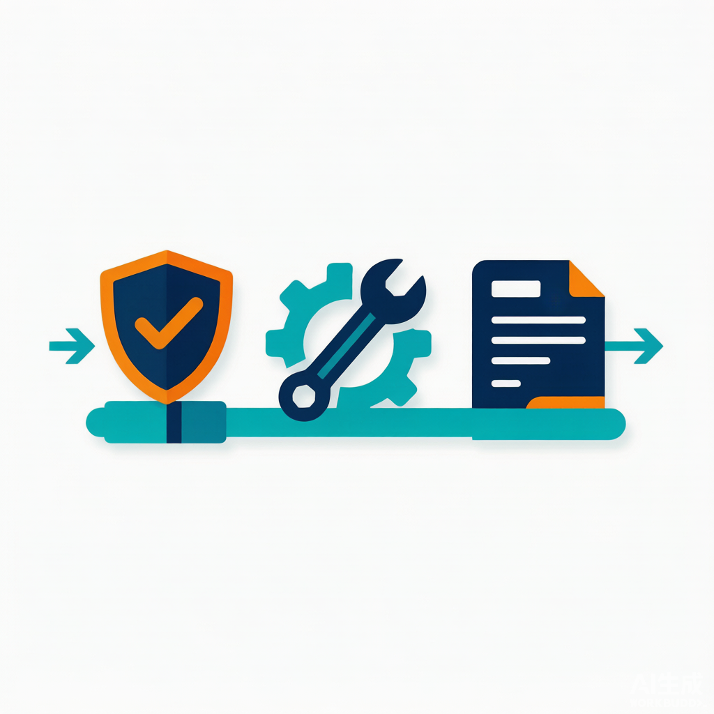

PreToolUse 在工具执行**前**跑。它能 allow、能 deny。这是安全闸门。

PostToolUse 在工具执行**后**跑。它记录结果。这是审计探头。

### 06.3 PreToolUse：三层防线

```python
async def pre_tool_guard(input_data, tool_use_id, context):
    tool_name = input_data.get("tool_name", "")
    tool_input = input_data.get("tool_input", {}) or {}

    # 1. 只读工具自动放行
    if tool_name in {"Read", "Glob", "Grep"}:
        return {"hookSpecificOutput": {
            "hookEventName": "PreToolUse",
            "permissionDecision": "allow", ...}}

    # 2. 写操作保护 .env 与系统目录
    if tool_name in {"Write", "Edit"}:
        file_path = tool_input.get("file_path", "")
        if file_name == ".env" or file_path.startswith(("/etc", "C:\\Windows")):
            return {... "permissionDecision": "deny", ...}

    # 3. Bash 危险命令拦截
    if tool_name == "Bash":
        command = tool_input.get("command", "")
        dangerous = ["rm -rf", "mkfs", ":(){ :|:& };:", "> /dev/sda"]
        if any(d in command for d in dangerous):
            return {... "permissionDecision": "deny", ...}
    return {}
```

三层：

1. **只读放行**。Read/Glob/Grep 不改东西，秒过，省交互。
2. **写保护**。碰 `.env`、`/etc`、`C:\Windows`，deny。
3. **命令拦截**。`rm -rf`、`mkfs`、fork 炸弹、写裸设备，deny。

> **标叔的经验**：防线按"能不能改"分层
>
> 别一刀切都问用户。只读的放行，读体验好；写的查路径，防泄密；执行的查命令，防破坏。**分层才既安全又顺手。**

### 06.4 注意它的局限

dangerous 是字符串匹配。`rm -rf` 能拦，但 `rm  -rf`（多空格）、`rm -fr` 就漏。

这是字符串黑名单的天花板。生产环境要上更稳的——比如命令解析、白名单。

> **注意**：黑名单是底线，不是终点
>
> 这个 guard 能挡住"明显的蠢"。挡不住"精心的坏"。真正安全靠沙箱执行，不靠字符串。**但作为教学样本，它把思路讲透了。**

上锁讲清了。下一章，留痕。

---

## §07 审计日志：每次动作都留痕

### 07.1 PostToolUse 记录一切

```python
async def audit_logger(input_data, tool_use_id, context):
    record = {
        "ts": datetime.now().isoformat(),
        "session_id": input_data.get("session_id"),
        "agent_id": input_data.get("agent_id"),
        "hook": input_data.get("hook_event_name"),
        "tool_name": input_data.get("tool_name"),
        "tool_use_id": tool_use_id,
        "tool_input": input_data.get("tool_input"),
        "tool_output_summary": str(input_data.get("tool_output", ""))[:500],
    }
    with open(AUDIT_LOG, "a", encoding="utf-8") as f:
        f.write(json.dumps(record, ensure_ascii=False) + "\n")
    return {}
```

每次工具调用，写一行 JSONL 进 `audit_log.jsonl`。时间、哪个 session、哪个 agent、调了啥工具、传了啥参数、输出摘要（截 500 字）。

它同时挂在 PostToolUse 和 PostToolUseFailure 上。成功记一笔，失败也记一笔。

### 07.2 为什么用 JSONL

| 格式 | 好处 | 坏处 |
|------|------|------|
| JSON 数组 | 结构清晰 | 要全读完才能解析 |
| JSONL | 增量可读、可流式 | 要逐行 parse |
| 标叔的结论 | 日志用 JSONL | — |

每行独立。写到一半崩了，前面的不丢。这是日志该有的样子。

### 07.3 子 agent 也要追

```python
async def subagent_tracker(input_data, tool_use_id, context):
    event = input_data.get("hook_event_name")     # SubagentStart/Stop
    agent_id = input_data.get("agent_id", "unknown")
    transcript = input_data.get("agent_transcript_path", "")
    print(f"[{event}] agent_id={agent_id} transcript={transcript}")
```

SubagentStart 和 SubagentStop 都挂它。子 agent 何时起、何时停、transcript 在哪，全打印。

> **核心建议**：审计要覆盖子 agent
>
> 主 agent 的审计不够。真正干活的是子 agent。子 agent 的启停和产物路径必须记。**黑盒在子层，审计也要扎到子层。**

### 07.4 会话结束归档

```python
async def session_archiver(input_data, tool_use_id, context):
    session_id = input_data.get("session_id", "unknown")
    print(f"\n[SESSION_END] {session_id} 审计日志已写入 {AUDIT_LOG}")
```

Stop 钩子。会话结束时提示日志已落盘。可扩展成上传到日志中心。

留痕讲清了。下一章，让 agent 可观测。

---

## Part 3: 进阶实战

让 agent 从"能跑"变成"可管"。最后一层：可观测。

## §08 OpenTelemetry：让 agent 可观测

### 08.1 审计日志还不够吗

审计日志记的是"调了啥工具"。但它答不了：这次分析耗时多少？token 烧了多少？哪个子 agent 拖慢了整体？不同分析师/租户的用量怎么分？

这些要靠**遥测**——Traces、Metrics、Logs 三种信号。

### 08.2 一套环境变量接通

11 opentelemetry 的 `build_otel_env()`：

```python
return {
    "CLAUDE_CODE_ENABLE_TELEMETRY": "1",              # 总开关
    "CLAUDE_CODE_ENHANCED_TELEMETRY_BETA": "1",       # Traces 要 beta
    "OTEL_TRACES_EXPORTER": "otlp",
    "OTEL_METRICS_EXPORTER": "otlp",
    "OTEL_LOGS_EXPORTER": "otlp",                     # 三信号都走 OTLP
    "OTEL_EXPORTER_OTLP_PROTOCOL": "http/protobuf",
    "OTEL_EXPORTER_OTLP_ENDPOINT": "...:4318",        # 推给 Collector
    "OTEL_SERVICE_NAME": "yanjing-research-agent",
    "OTEL_RESOURCE_ATTRIBUTES": "service.version=1.0.0,deployment.environment=development",
    "OTEL_METRIC_EXPORT_INTERVAL": "1000",            # 短任务调低间隔
    ...
}
```

关键设计：

- 三种信号（Traces/Metrics/Logs）都 exporter=otlp，统一推给 Collector。
- endpoint 指 Collector 的 4318。
- export_interval=1000ms，因为 agent 任务短，默认长间隔会丢数据。

### 08.3 用户和租户归因

```python
def build_otel_env(service_name, enduser_id="", tenant_id=""):
    attrs = ["service.version=1.0.0", "deployment.environment=development"]
    if enduser_id:
        attrs.append(f"enduser.id={quote(enduser_id)}")
    if tenant_id:
        attrs.append(f"tenant.id={quote(tenant_id)}")
```

CLI 带 `--user` `--tenant`。把谁在用、哪个团队在用，塞进 resource attributes。后面能在 Grafana 按人/按团队分摊成本。

> **标叔的经验**：遥测要带身份
>
> 光有指标不够。得知道是谁产生的。enduser.id 和 tenant.id 是多租户平台的命根子。**没归因的指标，没法计费、没法限流。**

### 08.4 env 传进 options

```python
options = ClaudeAgentOptions(
    ...,
    hooks=BUILD_HOOKS(),
    env=otel_env or build_otel_env(),     # 关键：环境变量注入 agent 进程
)
```

env 注进去，claude_agent_sdk 内部的遥测自动启用。你不用改业务代码。

可观测接通了。下一章，看基建。

---

## §09 四件套基建：Collector + Jaeger + Prometheus + Grafana

### 09.1 一张数据流

```
Agent --(OTLP/HTTP 4318)--> Collector
                                ├─ traces   --> Jaeger    (16686 看)
                                ├─ metrics  --> Prometheus(8889 暴露,9090 看)
                                └─ logs     --> debug
Grafana (3000) 拉 Prometheus + Jaeger，统一看
```

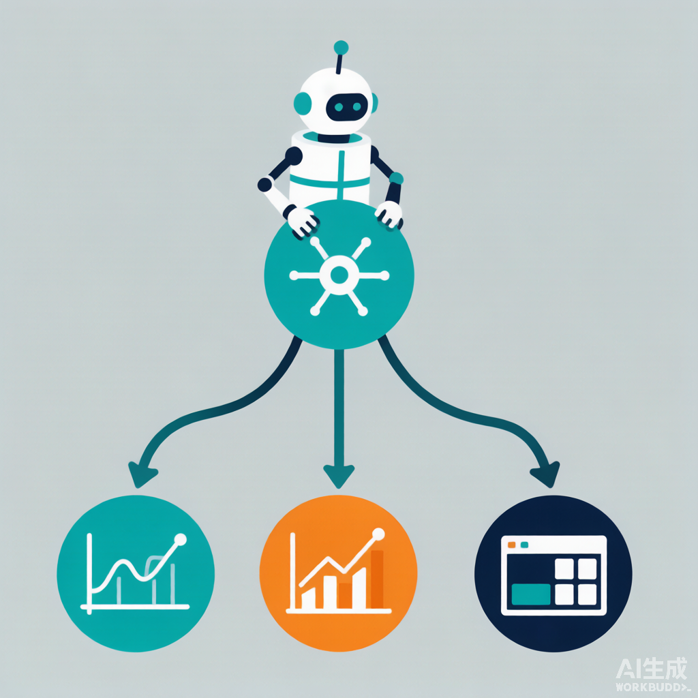

### 09.2 Collector 是枢纽

`otel-collector-config.yaml`：

```yaml
receivers:
  otlp:
    protocols:
      http: { endpoint: "0.0.0.0:4318" }    # 收 Agent 推的数据
      grpc: { endpoint: "0.0.0.0:4317" }

exporters:
  otlp/jaeger: { endpoint: "jaeger:4317" }  # traces 给 Jaeger
  prometheus: { endpoint: "0.0.0.0:8889", namespace: "claude_agent" }  # metrics 暴露
  debug: { verbosity: detailed }

processors:
  batch: {}                                  # 批处理，提效

service:
  pipelines:
    traces:  { receivers: [otlp], processors: [batch], exporters: [otlp/jaeger, debug] }
    metrics: { receivers: [otlp], processors: [batch], exporters: [prometheus, debug] }
    logs:    { receivers: [otlp], exporters: [debug] }
```

Collector 干三件事：收（receiver）、攒（batch processor）、发（exporter）。三路信号三套 pipeline。

### 09.3 四个容器一把起

`docker-compose.yml`：

| 服务 | 端口 | 职责 |
|------|------|------|
| otel-collector | 4318/4317/8889 | 数据枢纽 |
| jaeger | 16686 | Traces 看板 |
| prometheus | 9090 | Metrics 存储 |
| grafana | 3000 | 统一大盘（admin/admin） |

一条 `docker compose up`，整套可观测起好。Grafana 的数据源由 `grafana-datasources.yaml` 自动注入，不用手配。

### 09.4 你能看见什么

- **Jaeger**：一次分析的完整 trace——主 agent 调了几个子 agent、每个子 agent 调了哪些工具、各耗多久。哪慢一眼看到。
- **Prometheus**：token 消耗、工具调用次数、会话时长等指标，能告警。
- **Grafana**：把上面俩拼成大盘，按 user/tenant 分维度看。

> **一句话总结**：
>
> | 信号 | 看什么 | 存哪 | 看哪 |
> |------|--------|------|------|
> | Traces | 调用链、耗时 | Jaeger | 16686 |
> | Metrics | token、次数、时长 | Prometheus | 9090 |
> | Logs | 事件流 | (debug) | Collector 日志 |
> | 统一 | 以上拼一起 | — | Grafana 3000 |

基建讲清了。最后一章，换脑子。

---

## §10 思维转变：从"能跑"到"可管"

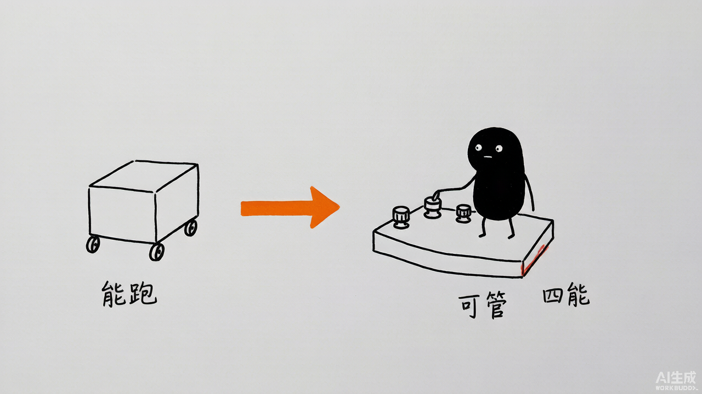

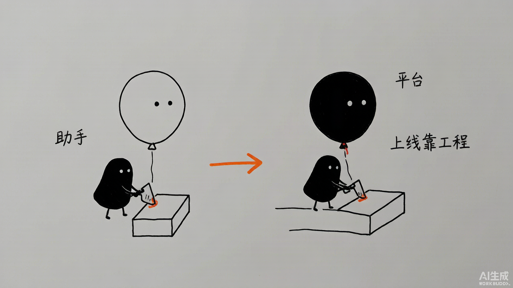

### 10.1 四层补丁的内在逻辑

回看 08-11，四层不是随便加的。它们对应 agent 工程化的四个维度：

| 维度 | 问题 | 解法 |
|------|------|------|
| 容量 | 单 agent 上下文炸 | SubAgent 分工 |
| 记忆 | 跑完就忘 | 会话续/分叉 |
| 安全 | 工具能干坏事 | Hook 上锁留痕 |
| 可见 | 黑盒没法查 | OpenTelemetry |

缺一个，都不是平台。

### 10.2 三个转变

**转变一：从"一个全能"到"一群专职"。**
主 agent 不该啥都会。它该会调度。专业能力下放到子 agent。

**转变二：从"一次性"到"有状态"。**
会话能续、能分叉。agent 才有"记忆"和"实验空间"。

**转变三：从"信任它"到"看着它"。**
Hook 拦危险、留审计，遥测看链路。你不假设它对，你设计让它可查。

### 10.3 平台的本质

平台不是"功能多"。是"可管"。

能拆（SubAgent）、能续（会话）、能锁（Hook）、能看（遥测）。这四能齐了，它才配叫平台。

> **标叔的经验**：助手的尽头是平台
>
> 项目 2 的助手能出研报，惊艳。但没法上线——不可续、不可锁、不可见。项目 3 把这三样补齐。**惊艳靠模型，上线靠工程。**

思维变了。剩下的，是把这四层磨进你自己的业务。

---

## 附录

### A 核心 API 速查

| 来源 | 类/函数 | 作用 |
|------|---------|------|
| claude_agent_sdk | `AgentDefinition(description, prompt, tools, skills, model)` | 定义子 agent |
| claude_agent_sdk | `ClaudeAgentOptions(agents=, hooks=, env=, resume=, fork_session=, max_turns=)` | 配置 |
| claude_agent_sdk | `HookMatcher(hooks=[...])` | 注册钩子 |
| claude_agent_sdk | PreToolUse 返回 `permissionDecision: allow/deny` | 拦/放工具 |
| claude_agent_sdk | `ResultMessage.session_id` | 拿会话 id |
| OTel | `CLAUDE_CODE_ENABLE_TELEMETRY=1` 等 env | 开遥测 |

### B 四个钩子点的触发时机

| 钩子 | 何时触发 | 典型用途 |
|------|----------|----------|
| PreToolUse | 工具执行前 | 拦危险 |
| PostToolUse | 工具成功后 | 审计 |
| PostToolUseFailure | 工具失败后 | 审计 |
| SubagentStart/Stop | 子 agent 启停 | 追踪 |
| Stop | 会话结束 | 归档 |

### C 这本书没讲但你应该继续看的

- PreToolUse 的命令解析升级（替代字符串黑名单）。
- Fork 分支的合并策略（多个估值分支怎么取共识）。
- 遥测指标的具体定义：哪些 metric 值得采。

> ⚠️ 免责声明：本书基于 Geek04 开源代码解读。投达示例仅作技术演示，不构成投资建议。


---

## 附录 C：DeepWiki 官方架构图 / 流程图 / 设计图（深度解读补充）

> 以下内容来自 DeepWiki 对 `xingyunyang01/Geek04` 的自动深度解读（Mermaid 源码），作为本书架构与流程的权威参考补充。在支持 Mermaid 的 Markdown 阅读器（GitHub / Obsidian / VS Code + Mermaid 插件）中会自动渲染为图。

### C.1 Diagram 1: Financial Platform Orchestration (claude_agent_sdk)

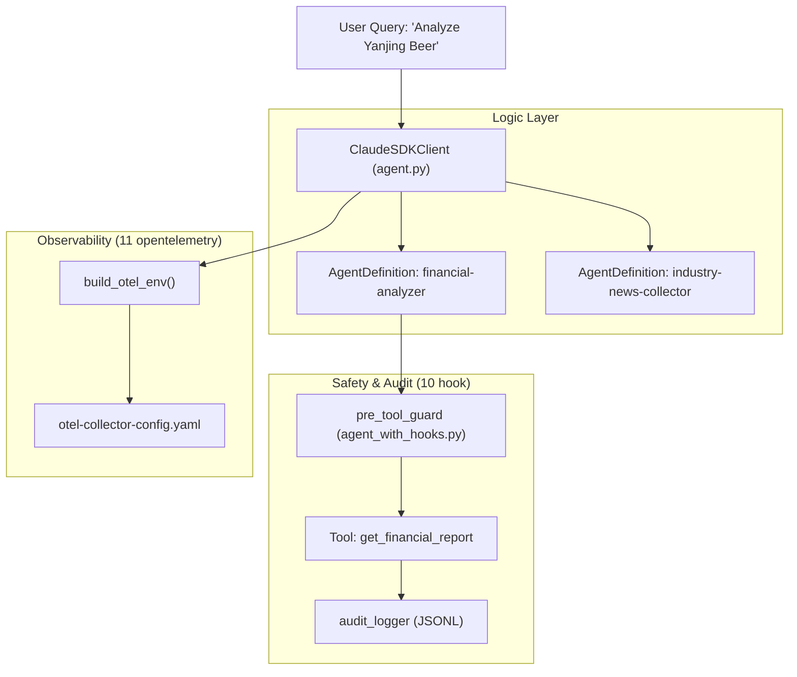
```mermaid
graph TD
    User["User Query: 'Analyze Yanjing Beer'"] --> Orchestrator["ClaudeSDKClient (agent.py)"]
    
    subgraph "Logic Layer"
        Orchestrator --> Sub1["AgentDefinition: financial-analyzer"]
        Orchestrator --> Sub2["AgentDefinition: industry-news-collector"]
    end
    
    subgraph "Safety & Audit (10 hook)"
        Sub1 --> Hook["pre_tool_guard (agent_with_hooks.py)"]
        Hook --> ToolCall["Tool: get_financial_report"]
        ToolCall --> Audit["audit_logger (JSONL)"]
    end
    
    subgraph "Observability (11 opentelemetry)"
        Orchestrator --> OTLP["build_otel_env()"]
        OTLP --> Collector["otel-collector-config.yaml"]
    end
```

### C.2 System Entity Mapping

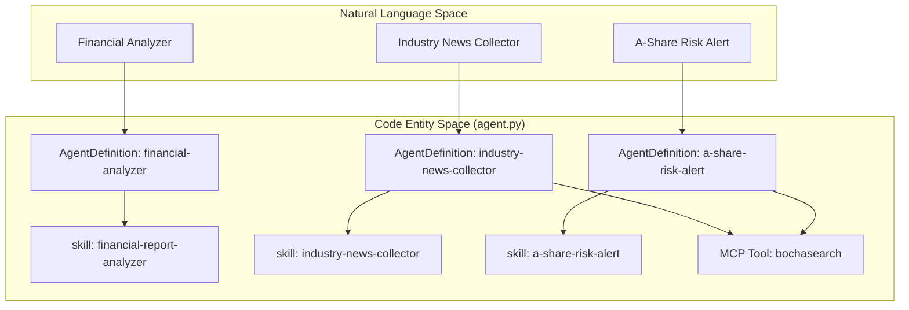
```mermaid
graph TD
    subgraph "Natural Language Space"
        R1["Financial Analyzer"]
        R2["Industry News Collector"]
        R3["A-Share Risk Alert"]
    end

    subgraph "Code Entity Space (agent.py)"
        A1["AgentDefinition: financial-analyzer"]
        A2["AgentDefinition: industry-news-collector"]
        A3["AgentDefinition: a-share-risk-alert"]
        
        S1["skill: financial-report-analyzer"]
        S2["skill: industry-news-collector"]
        S3["skill: a-share-risk-alert"]
        
        T1["MCP Tool: bochasearch"]
    end

    R1 --> A1
    R2 --> A2
    R3 --> A3
    
    A1 --> S1
    A2 --> S2
    A3 --> S3
    
    A2 --> T1
    A3 --> T1
```

### C.3 Governance and Security Hooks

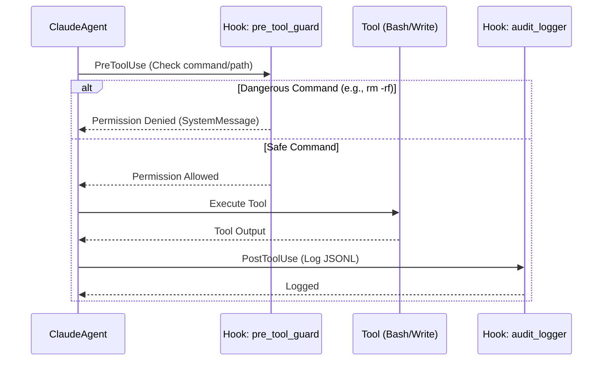
```mermaid
sequenceDiagram
    participant A as ClaudeAgent
    participant H as Hook: pre_tool_guard
    participant T as Tool (Bash/Write)
    participant L as Hook: audit_logger

    A->>H: PreToolUse (Check command/path)
    alt Dangerous Command (e.g., rm -rf)
        H-->>A: Permission Denied (SystemMessage)
    else Safe Command
        H-->>A: Permission Allowed
        A->>T: Execute Tool
        T-->>A: Tool Output
        A->>L: PostToolUse (Log JSONL)
        L-->>A: Logged
    end
```

### C.4 Natural Language to Code Entity Mapping: Sub-Agent Factory

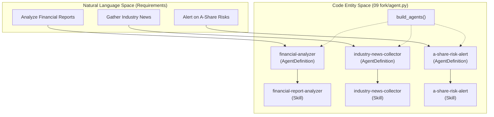
```mermaid
graph TD
    subgraph "Natural Language Space (Requirements)"
        R1["Analyze Financial Reports"]
        R2["Gather Industry News"]
        R3["Alert on A-Share Risks"]
    end

    subgraph "Code Entity Space (09 fork/agent.py)"
        FA["financial-analyzer<br/>(AgentDefinition)"]
        INC["industry-news-collector<br/>(AgentDefinition)"]
        ARA["a-share-risk-alert<br/>(AgentDefinition)"]
        
        SK1["financial-report-analyzer<br/>(Skill)"]
        SK2["industry-news-collector<br/>(Skill)"]
        SK3["a-share-risk-alert<br/>(Skill)"]
        
        BUILD["build_agents()"]
    end

    R1 --> FA
    R2 --> INC
    R3 --> ARA

    BUILD -.-> FA
    BUILD -.-> INC
    BUILD -.-> ARA

    FA --> SK1
    INC --> SK2
    ARA --> SK3
```

### C.5 Data Flow: Search Integration

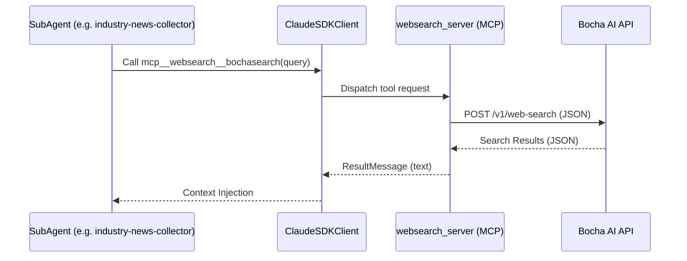
```mermaid
sequenceDiagram
    participant A as SubAgent (e.g. industry-news-collector)
    participant SDK as ClaudeSDKClient
    participant MCP as websearch_server (MCP)
    participant B as Bocha AI API

    A->>SDK: Call mcp__websearch__bochasearch(query)
    SDK->>MCP: Dispatch tool request
    MCP->>B: POST /v1/web-search (JSON)
    B-->>MCP: Search Results (JSON)
    MCP-->>SDK: ResultMessage (text)
    SDK-->>A: Context Injection
```

### C.6 Natural Language to Code Entity Mapping

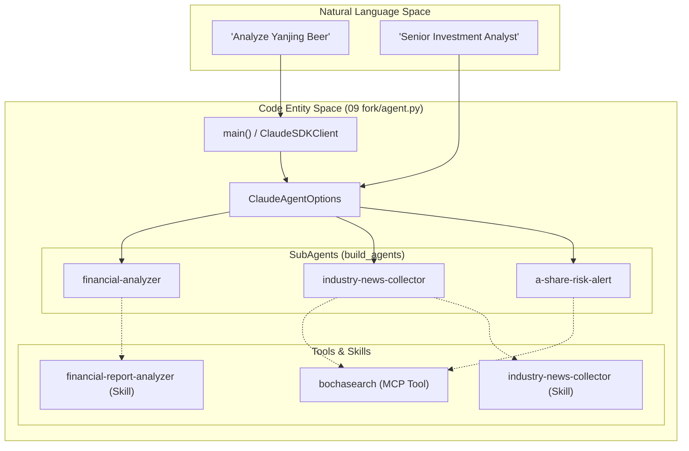
```mermaid
graph TD
    subgraph "Natural Language Space"
        User["'Analyze Yanjing Beer'"]
        Role["'Senior Investment Analyst'"]
    end

    subgraph "Code Entity Space (09 fork/agent.py)"
        Orchestrator["main() / ClaudeSDKClient"]
        Options["ClaudeAgentOptions"]
        
        subgraph "SubAgents (build_agents)"
            FA["financial-analyzer"]
            INC["industry-news-collector"]
            RSA["a-share-risk-alert"]
        end
        
        subgraph "Tools & Skills"
            BS["bochasearch (MCP Tool)"]
            FRAS["financial-report-analyzer (Skill)"]
            INCS["industry-news-collector (Skill)"]
        end
    end

    User --> Orchestrator
    Role --> Options
    Orchestrator --> Options
    Options --> FA
    Options --> INC
    Options --> RSA
    
    FA -.-> FRAS
    INC -.-> BS
    INC -.-> INCS
    RSA -.-> BS
```

### C.7 Data Flow: Session Persistence

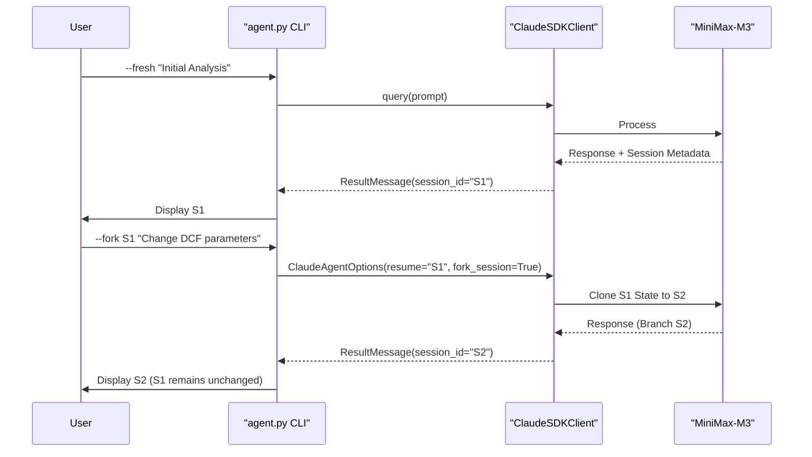
```mermaid
sequenceDiagram
    participant User
    participant CLI as "agent.py CLI"
    participant SDK as "ClaudeSDKClient"
    participant LLM as "MiniMax-M3"

    User->>CLI: --fresh "Initial Analysis"
    CLI->>SDK: query(prompt)
    SDK->>LLM: Process
    LLM-->>SDK: Response + Session Metadata
    SDK-->>CLI: ResultMessage(session_id="S1")
    CLI->>User: Display S1

    User->>CLI: --fork S1 "Change DCF parameters"
    CLI->>SDK: ClaudeAgentOptions(resume="S1", fork_session=True)
    SDK->>LLM: Clone S1 State to S2
    LLM-->>SDK: Response (Branch S2)
    SDK-->>CLI: ResultMessage(session_id="S2")
    CLI->>User: Display S2 (S1 remains unchanged)
```

### C.8 Data Flow and Code Entity Mapping

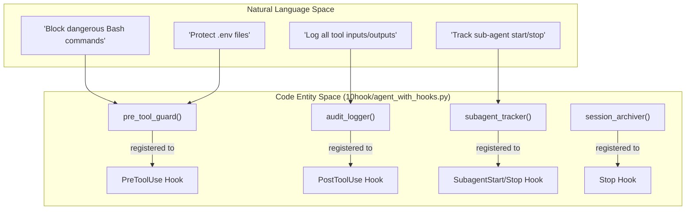
```mermaid
graph TD
    subgraph "Natural Language Space"
        R1["'Block dangerous Bash commands'"]
        R2["'Log all tool inputs/outputs'"]
        R3["'Track sub-agent start/stop'"]
        R4["'Protect .env files'"]
    end

    subgraph "Code Entity Space (10hook/agent_with_hooks.py)"
        H1["pre_tool_guard()"]
        H2["audit_logger()"]
        H3["subagent_tracker()"]
        H4["session_archiver()"]
        
        E1["PreToolUse Hook"]
        E2["PostToolUse Hook"]
        E3["SubagentStart/Stop Hook"]
        E4["Stop Hook"]
    end

    R1 --> H1
    R4 --> H1
    R2 --> H2
    R3 --> H3
    
    H1 -- "registered to" --> E1
    H2 -- "registered to" --> E2
    H3 -- "registered to" --> E3
    H4 -- "registered to" --> E4
```

### C.9 Lifecycle Execution Flow

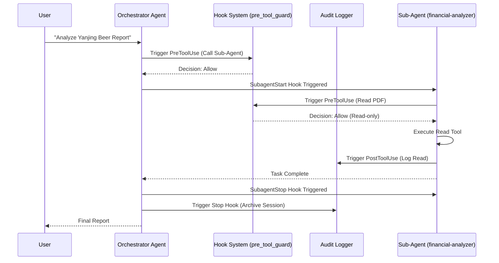
```mermaid
sequenceDiagram
    participant U as User
    participant O as Orchestrator Agent
    participant H as Hook System (pre_tool_guard)
    participant A as Audit Logger
    participant S as Sub-Agent (financial-analyzer)

    U->>O: "Analyze Yanjing Beer Report"
    O->>H: Trigger PreToolUse (Call Sub-Agent)
    H-->>O: Decision: Allow
    O->>S: SubagentStart Hook Triggered
    S->>H: Trigger PreToolUse (Read PDF)
    H-->>S: Decision: Allow (Read-only)
    S->>S: Execute Read Tool
    S->>A: Trigger PostToolUse (Log Read)
    S-->>O: Task Complete
    O->>S: SubagentStop Hook Triggered
    O->>A: Trigger Stop Hook (Archive Session)
    O-->>U: Final Report
```

### C.10 Data Flow Space Bridge

```mermaid
graph TD
    subgraph "Natural Language Space"
        "User Request"
        "Agent Logic"
        "Telemetry Data"
        "Monitoring Dashboard"
    end

    subgraph "Code Entity Space"
        A["build_otel_env()"]
        B["ClaudeAgentOptions"]
        C["ClaudeSDKClient"]
        D["OTLP Collector"]
    end

    "User Request" --> C
    "Agent Logic" --> A
    A -- "Injects Env Vars" --> B
    B -- "Configures" --> C
    C -- "Exports Traces" --> D
    D --> "Monitoring Dashboard"
```

### C.11 System Integration

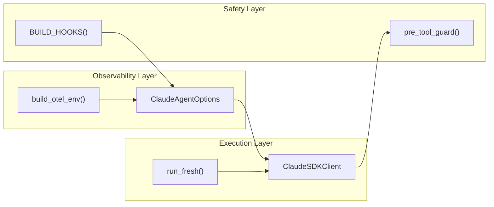
```mermaid
graph LR
    subgraph "Execution Layer"
        main["run_fresh()"]
        client["ClaudeSDKClient"]
    end

    subgraph "Observability Layer"
        otel["build_otel_env()"]
        opts["ClaudeAgentOptions"]
    end

    subgraph "Safety Layer"
        hooks["BUILD_HOOKS()"]
        guard["pre_tool_guard()"]
    end

    otel --> opts
    hooks --> opts
    opts --> client
    main --> client
    client --> guard
```

### C.12 Data Flow Diagram

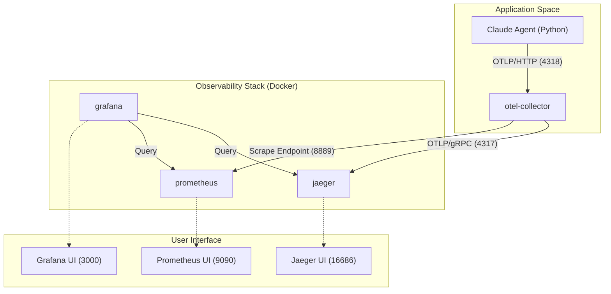
```mermaid
graph TD
    subgraph "Application Space"
        A["Claude Agent (Python)"] -- "OTLP/HTTP (4318)" --> B
    end

    subgraph "Observability Stack (Docker)"
        B["otel-collector"] -- "OTLP/gRPC (4317)" --> C["jaeger"]
        B -- "Scrape Endpoint (8889)" --> D["prometheus"]
        
        E["grafana"] -- "Query" --> C
        E -- "Query" --> D
    end

    subgraph "User Interface"
        F["Jaeger UI (16686)"]
        G["Grafana UI (3000)"]
        H["Prometheus UI (9090)"]
    end

    C -.-> F
    D -.-> H
    E -.-> G
```

### C.13 Code-to-Infrastructure Mapping

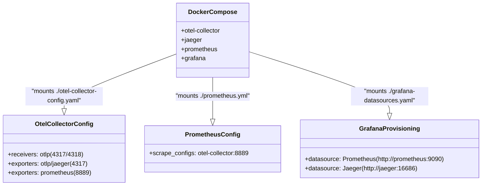
```mermaid
classDiagram
    class DockerCompose {
        +otel-collector
        +jaeger
        +prometheus
        +grafana
    }
    class OtelCollectorConfig {
        +receivers: otlp (4317/4318)
        +exporters: otlp/jaeger (4317)
        +exporters: prometheus (8889)
    }
    class PrometheusConfig {
        +scrape_configs: otel-collector:8889
    }
    class GrafanaProvisioning {
        +datasource: Prometheus (http://prometheus:9090)
        +datasource: Jaeger (http://jaeger:16686)
    }

    DockerCompose --|> OtelCollectorConfig : "mounts ./otel-collector-config.yaml"
    DockerCompose --|> PrometheusConfig : "mounts ./prometheus.yml"
    DockerCompose --|> GrafanaProvisioning : "mounts ./grafana-datasources.yaml"
```

