# LLM-Wiki -最佳实践

# LLM-Wiki: From Zero to Hero

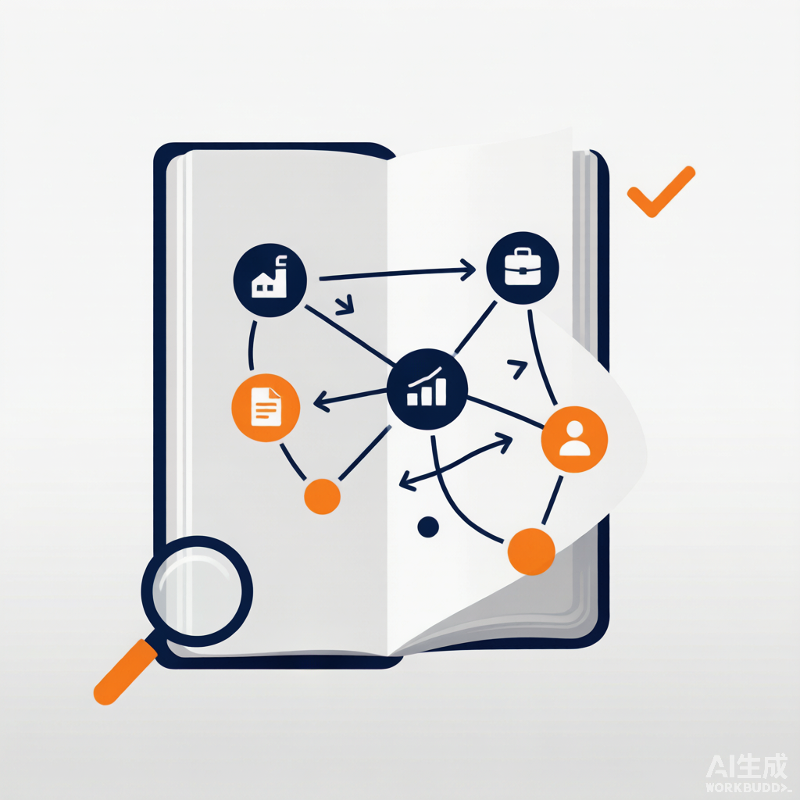

**创建者**: 标叔
**为谁创建**: 想让 LLM 帮自己持续攒投研知识、又不想要"每次重检索"的人
**基于**: Geek04 项目 4 · deepagents + stock-wiki skill · 2026
**最后更新**: 2026-08-07
**适用场景**: 用 LLM 构建并维护一个会自己生长的股票投研知识库

---

## 阅读指南

| 时间 | 章节 | 目标 |
|------|------|------|
| Day 1 | §01-§03 | 跑通 deepagents，理解为什么是 Wiki |
| Day 2 | §04-§07 | 掌握三层架构与三大操作 |
| Day 3 | §08-§10 | 让知识成网、矛盾显形，工具链接通 |

---

## Part 1: 起步

从"问一次检索一次"，走到"知识持续积累"。

## §01 为什么你的投研需要一座"Wiki"，而不是 RAG

### 01.1 时间线锚点

我做投研，最痛的是知识不沉淀。

去年读过一份宁德时代研报。今年再问，模型不记得。RAG 能检索原文，但它不"理解"——每次从零拼答案，前后矛盾。

2026 年我拆 Geek04 项目 4。`stock-wiki` 的 SKILL.md 第一段就把我点醒了：

> 不同于 RAG 每次从零检索，LLM Wiki 让 LLM **持续构建并维护一个结构化的 Markdown 投研 Wiki**。每次导入新资料，LLM 不是简单索引，而是阅读、提取、整合——更新个股档案、修订行业逻辑、标注多空矛盾。**知识编译一次，持续更新，而非每次查询重新推导。**

这一句，是这本书的灵魂。

> **标叔的经验**：RAG 是"图书馆"，Wiki 是"笔记本"
>
> RAG 把原文堆那儿，每次检索片段。它不改原文，不发现矛盾。Wiki 是 LLM 边读边整理的活笔记本。**检索快，但理解浅；编译慢，但能复利。**

### 01.2 它跟前三本书的区别

| 维度 | 项目 1/2/3 | 项目 4 |
|------|-----------|--------|
| 知识形态 | 临时、跑完即弃 | 持久、持续积累 |
| 模型角色 | 执行器 | 知识管理者 |
| 核心产物 | 一次性的报告/分析 | 一座会生长的 Wiki |
| 框架 | claude_agent_sdk / smolagents | deepagents |
| 标叔的结论 | 干活 | 攒认知 |

### 01.3 这本书带你走到哪

读完你能回答：

1. deepagents 框架长什么样？跟 claude_agent_sdk 啥不同？
2. stock-wiki 的三层架构各自干啥？
3. Ingest/Query/Lint 三大操作怎么让知识复利？

认知装好。下一章看框架。

---

## §02 deepagents 框架：模型 + 后端 + skill

### 02.1 最小形态就三行核心

`12-14deepagents/agent.py`，剥到骨架：

```python
from langchain_openai import ChatOpenAI
from deepagents import create_deep_agent
from deepagents.backends import LocalShellBackend

model = ChatOpenAI(
    model_name="MiniMax-M3",
    base_url="https://api.minimaxi.com/v1",
    api_key=os.getenv("MINIMAX_API_KEY"))

backend = LocalShellBackend("./", virtual_mode=True)   # 关键：给 agent 一个本地后端

agent = create_deep_agent(
    model=model,
    backend=backend,
    skills=["./my-project/skills/"])                  # 关键：挂 skill 目录
)
```

三件套：模型、后端、skill。

### 02.2 三个关键点

**第一，模型走 LangChain。** `langchain_openai.ChatOpenAI`。deepagents 是 LangChain 之上的框架。MiniMax 走 OpenAI 兼容协议接进来。

**第二，后端给"手脚"。** `LocalShellBackend("./", virtual_mode=True)`。它给 agent 一个本地 shell 后端——能读写文件、跑命令。`virtual_mode=True` 是虚拟模式，相当于一个半沙箱。这是 deepagents 跟 claude_agent_sdk 最大的不同：**后端是一等公民**。

**第三，skill 是目录。** `skills=["./my-project/skills/"]`。指向一个文件夹，里面每个子目录是一个 skill。deepagents 自动发现。

### 02.3 跟 claude_agent_sdk 的对比

| 维度 | claude_agent_sdk | deepagents |
|------|------------------|------------|
| 模型层 | 自有协议 | LangChain |
| 后端 | 工具内建 | 独立 Backend 类 |
| skill 加载 | skills="all" | skills=[目录] |
| 子智能体 | AgentDefinition | （后端抽象） |
| 生态 | Anthropic 系 | LangChain 系 |
| 标叔的结论 | 工程化强 | 灵活、后端可换 |

> **标叔的经验**：后端可换是关键
>
> deepagents 把"在哪儿执行"抽成 Backend。本地用 LocalShellBackend，要隔离能换 Docker backend。**执行环境跟 agent 逻辑解耦，这点比 claude_agent_sdk 优雅。**

### 02.4 REPL 循环

```python
messages: list[dict] = []
while True:
    user_input = input("You> ").strip()
    if user_input.lower() in {"exit", "quit"}: break
    messages.append({"role": "user", "content": user_input})
    result = agent.invoke({"messages": messages})
    reply = result["messages"][-1]
    messages.append({"role": "assistant", "content": reply.content})
    print(f"Agent> {reply.content}\n")
```

一个标准的多轮对话循环。messages 列表当记忆。`agent.invoke({"messages": messages})` 同步调用，取最后一条回复。

> **核心建议**：多轮记忆自己管
>
   deepagents 不像 claude_agent_sdk 有 session_id。多轮上下文你自己维护 messages 列表。**框架给你能力，记忆你自己负责。**

框架讲清了。下一章，跑通第一次。

---

## §03 跑通第一次对话：deepagents REPL

### 03.1 你需要什么

- Python，装 deepagents、langchain-openai
- 一个 MiniMax（或任意 OpenAI 兼容）API key
- `my-project/skills/stock-wiki/` 就位

### 03.2 我们最终做成什么

启动 `agent.py`，REPL 起来。你输入：

> 创建一个股票投研知识库

agent 调用 stock-wiki skill，读它的 SKILL.md，按"初始化工作流"建出目录结构、index.md、log.md。

你再输入：

> 导入这份宁德时代研报

它按 Ingest 流程：markitdown 转 PDF、建摘要页、更新个股页、更新行业页、更新 index、追加 log。

### 03.3 后端怎么给它"手脚"

deepagents 的 LocalShellBackend 让 agent 能：

- `read_file` / `write_file` / `edit_file`：操作 Wiki 的 Markdown
- `execute_command` / `bash`：跑 markitdown 这类工具

这些是 stock-wiki skill 干活的基础。没有后端，skill 的"建文件、改文件、跑脚本"全是空谈。

### 03.4 踩坑记录

**坑一：路径写死。** stock-wiki SKILL.md 里路径全是 `/Users/Admin/workspace/...`，原作者机器的。换环境必须改。建议改成相对 `./data/...`。

**坑二：PDF 不能直接读。** SKILL.md 反复警告："禁止直接 read_file 任何 PDF"。PDF 是二进制，会被 base64 编码塞回模型，既看不懂又烧 token。必须先 markitdown 转 Markdown。

**坑三：skill 要在目录里。** `skills=["./my-project/skills/"]` 指向目录。stock-wiki 是 `my-project/skills/stock-wiki/`。放错层级，agent 发现不了。

> **注意**：SKILL.md 是 agent 的操作手册
>
> agent 不会"猜"怎么建 Wiki。它读 stock-wiki 的 SKILL.md，照着做。**手册写得越细，行为越可控。这就是 skill 的意义。**

第一次跑通了。下一章，进三层架构。

---

## Part 2: 核心能力

三层架构 + 三大操作，是 stock-wiki 的心脏。

## §04 三层架构：Raw / Wiki / Schema

### 04.1 一张图

```
┌─────────────────────────────────────┐
│ 3. Schema (schema.md)  — 结构约定   │
│   告诉 LLM Wiki 怎么组织、怎么命名   │
└─────────────────────────────────────┘
            ▲ 共同迭代
┌─────────────────────────────────────┐
│ 2. Wiki (data/wiki/)  — LLM 全权管   │
│   个股页 / 行业页 / 宏观页 / 策略页   │
│   index.md 索引 + log.md 操作日志    │
└─────────────────────────────────────┘
            ▲ 读 / 整合 / 更新
┌─────────────────────────────────────┐
│ 1. Raw Sources (data/raw/) — 不可变  │
│   研报PDF / 新闻 / 财报 / 复盘记录    │
└─────────────────────────────────────┘
```

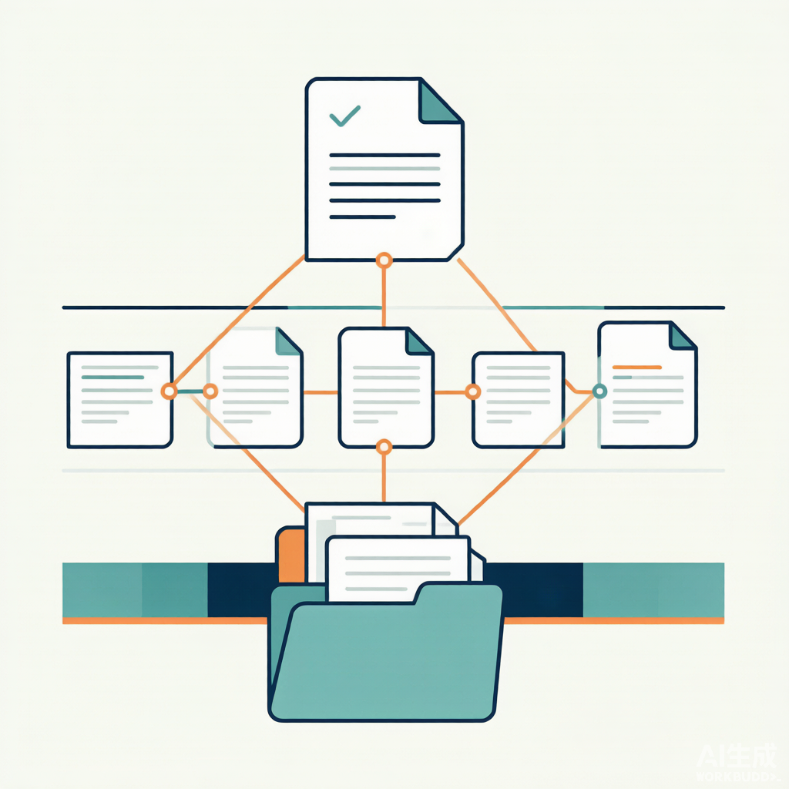

### 04.2 三层各干啥

**第一层，Raw Sources。** 原始资料，只读不改。券商研报 PDF、财经新闻、公司公告、交易复盘。它是投研的"真相来源"。LLM 只能读，不能改。这一层保证可溯。

**第二层，Wiki。** LLM 生成并维护的 Markdown 文件集。个股档案页、行业综述页、宏观概念页、投资策略页、综合分析页。LLM 全权管理：建页面、更新、维护交叉引用、保持逻辑一致。这一层是"理解后的知识"。

**第三层，Schema。** `schema.md` 定义 Wiki 的结构、命名约定、工作流。你跟 LLM 共同迭代它。这一层是"规则的规则"。

### 04.3 两个关键文件

Wiki 层有两个枢纽文件：

- `index.md`：内容总览目录。按类别（个股/行业/宏观/策略）组织，每条含链接 + 核心逻辑一句话摘要。LLM 每次导入更新。查询时 LLM 先读索引再深入。
- `log.md`：投研操作日志。按时间追加，如 `## [2026-04-29] ingest | 某券商-宁德时代深度研报`。

index 是"目录"，log 是"历史"。一个看现状，一个看演化。

> **标叔的经验**：index.md 是查询的入口
>
> 查询时 agent 不去翻所有文件。它先读 index.md，定位到相关页，再深入读。**索引让查询从 O(n) 降到 O(1)。**

### 04.4 为什么 Raw 不可变

Raw 是只读的真相。LLM 在 Wiki 层整合、判断、标注矛盾。但原始数据不动。

好处：万一 LLM 整合错了，你还能回 Raw 查原文。Raw 是 Wiki 的"审计回退点"。

> **核心建议**：原始层和知识层必须分开
>
> 别让 LLM 直接改原始资料。Raw 不可变，是可信的底线。**知识可以错，事实不能被改。**

三层架构讲清了。下一章，Ingest。

---

## §05 Ingest：导入一份研报，编译进知识库

### 05.1 Ingest 是什么

当你说"导入""处理这份研报""添加到知识库"，触发 Ingest。它把一份新资料**编译**进 Wiki。

### 05.2 七步流程

stock-wiki 的 Ingest 流程：

```text
0.【强制前置】markitdown 把 PDF → .md（图片提取到 assets/）
1. 复制原文到 data/raw/（保持不可变）
2. 建摘要页 source-xxx.md（观点/数据/链接）
3. 创建/更新个股页（基本面/核心逻辑/催化剂/估值）
4. 创建/更新行业/宏观页（放进行业背景）
5. 交叉引用（所有页面 [[wikilink]] 互连）
6. 更新 index.md（按类别加条目）
7. 更新 log.md（记录建了啥、改了啥）
```

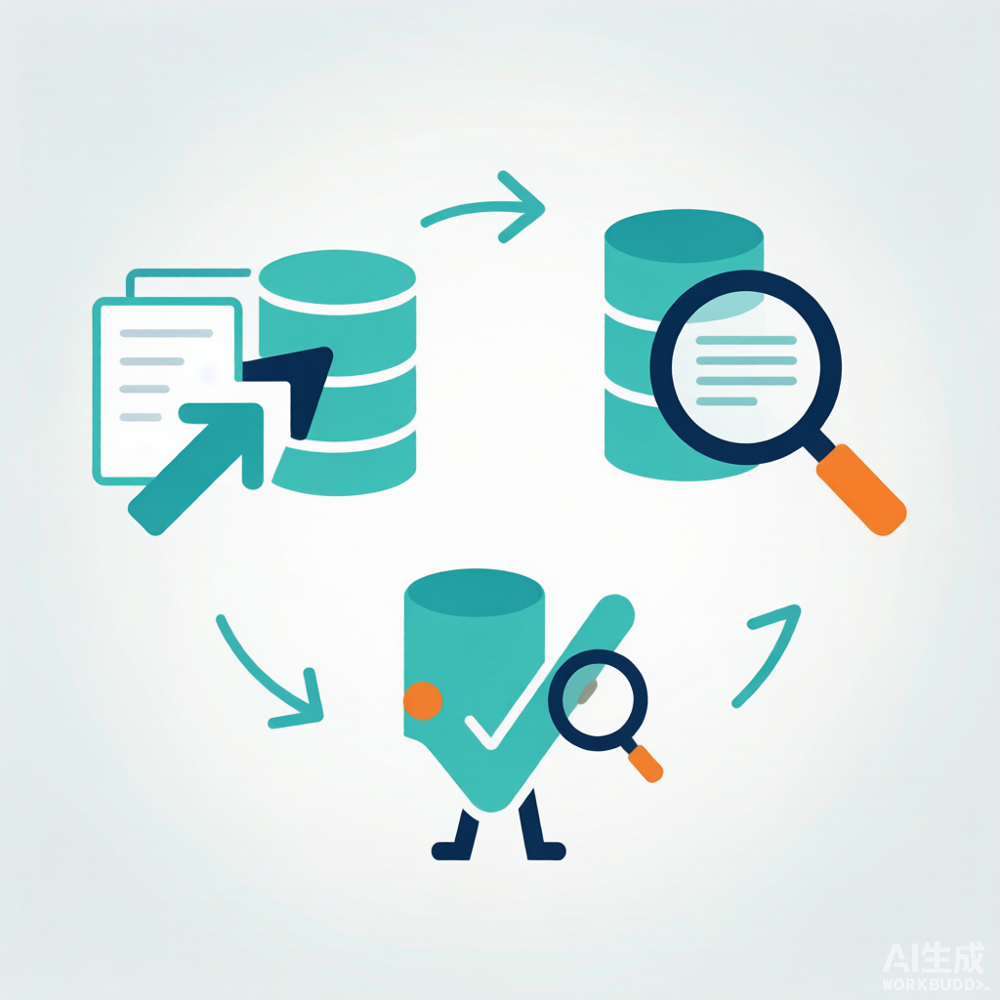

### 05.3 第 0 步是死规矩

SKILL.md 用警告框反复强调：

> ⚠️ **第一步永远是 markitdown 预处理**。**禁止直接 read_file 任何 PDF**。

PDF 是二进制。直接读，deepagents 会 base64 编码塞回模型——OpenAI 兼容模型不支持原生 PDF，还触发 `LC_AUTOGENERATED` 文件名警告。既看不懂又烧 token。

解法：先 `markitdown data/raw/xxx.pdf -o data/raw/xxx.md`。转成 Markdown + 提取图片到 `assets/`。后续只读 .md。

> **标叔的经验**：格式归一化是编译的前提
>
> 不管来的是 PDF、网页、剪藏，第一步都转成 Markdown。统一格式后，LLM 处理逻辑才一致。**异构资料，先归一再理解。**

### 05.4 一次导入触及多少文件

SKILL.md 给了经验数据：一篇 20-30 页研报，通常：

- 新建 2-4 个页面（1 摘要 + 1 个股 + 1-2 行业/概念）
- 更新 2-4 个已有页面
- 总计触及 **5-8 个文件**

所以 Ingest 不是"存个文件"。是"一次导入，全库联动"。

### 05.5 标注逻辑冲突

第 6 步（SKILL.md 的 Ingest 第 6 点）：

> 如果新资料与已有认知矛盾（之前看多，新研报看空），必须在对应页面明确标注冲突点。

不是覆盖旧观点。是并存、标注、留待你判断。这是 Wiki 比 RAG 强的地方——它**记得矛盾**。

> **核心建议**：矛盾要显形，不能被覆盖
>
> LLM 容易用新资料盖掉旧观点。要明确禁止覆盖，要求标注"矛盾"。**投资里矛盾信号本身就是信息。**

Ingest 讲清了。下一章，Query。

---

## §06 Query：问它，它从自己的知识里答

### 06.1 Query 是什么

当提问或要分析时触发。它从 Wiki 里找、综合、回答。

### 06.2 四步流程

```text
1. 读 index.md 定位相关页面
2. 深入阅读相关个股、行业页面
3. 综合回答，附带引用（指向 source 或 wiki 页面）
4. 有价值的结论回写为 Wiki 新页面
```

注意第 4 步。**查询也能产生新知识**。一次好的分析结论，写回 Wiki 成新页面。探索也能复利。

### 06.3 它跟 RAG 检索的区别

| 维度 | RAG | Wiki Query |
|------|-----|------------|
| 来源 | 原文片段 | 已整理的 Wiki 页 |
| 一致性 | 低，片段间可能矛盾 | 高，LLM 已整合 |
| 引用 | 指向原文 | 指向 source + wiki 页 |
| 反哺 | 无 | 结论回写新页面 |
| 标叔的结论 | 快 | 深 |

### 06.4 输出多样

SKILL.md 说输出格式可以多样：Markdown 页面、个股对比表格、SWOT 分析等。

因为它读的是结构化 Wiki，能灵活组织输出。RAG 只能拼原文片段，组织能力弱。

> **标叔的经验**：好的查询要回写
>
   一次查询得出"某交易模式"，别让它蒸发。写回 Wiki 成 strategy-xxx.md。**问一次，攒一条，知识就复利了。**

### 06.5 index.md 是加速器

查询第一步读 index。索引每条含链接 + 一句话核心逻辑摘要。agent 扫一遍索引，就知道该深入哪个页面，不用全库翻。

> **核心建议**：维护好 index，查询快十倍
>
> index.md 的摘要要精炼——一句话点出每页核心逻辑。agent 靠它导航。**索引烂，查询就全库扫描。**

Query 讲清了。下一章，Lint。

---

## §07 Lint：给知识库做体检

### 07.1 Lint 是什么

当你说"检查知识库""维护一下"触发。它给 Wiki 做健康体检。

### 07.2 六项检查

SKILL.md 的 Lint 清单：

1. 页面间内容冲突（A 研报说产能过剩，B 说供不应求）
2. 被新财报/政策取代的过时内容（标 `[已过时]`）
3. 无入站链接的孤立页面
4. 被提及但缺专属页面的重要概念
5. 缺失的交叉引用（个股页没链行业页）
6. 可通过网络搜索填补的数据空白

### 07.3 为什么 Lint 必要

Wiki 会长大。长大就会：

- 观点过时（去年看多，今年基本面变了）
- 产生孤儿页（建了没人引用）
- 出现术语黑洞（提到新概念但没专门页）
- 链接断裂

不 Lint，Wiki 慢慢变垃圾堆。定期体检，尤其财报季后，是 SKILL.md 明确建议的。

> **标叔的经验**：知识库会腐化
>
   不维护的 Wiki，半年后就成"记了但没人信"的废档。Lint 是知识库的杀毒。**建库容易守库难，Lint 就是守。**

### 07.4 Lint 不是删，是标注

注意 Lint 不删内容。它标 `[已过时]`、标冲突、列孤儿。删不删，你定。

这跟 Raw 不可变一脉相承——知识层也倾向"标注而非销毁"，保留演化痕迹。

> **注意**：维护是标注，不是删除
>
   过时内容标出来，不抹掉。它记录了"我们曾经这么想"。**演化痕迹本身有信息量。**

三大操作讲清了。下一章，进阶。

---

## Part 3: 进阶实战

让知识成网、矛盾显形、工具链接通。

## §08 交叉引用与逻辑冲突：知识要成网，矛盾要显形

### 08.1 交叉引用原则

stock-wiki 的交叉引用规则：

- 每个个股页底部有"来源"链接，指回资料摘要页
- 新资料导入时，主动检查已有页面要不要更新
- 摘要页末尾列"相关概念"，形成概念网络
- 跨资料关联明确标注（"与 source-xxx 共同主题：集中度提升"）

用 `[[wikilink]]` 双向链接。这让 Wiki 变成**图**，不是列表。

### 08.2 知识关联的四种发现

导入第二篇起，重点关注：

| 关系 | 例子 |
|------|------|
| 共同主题 | 多篇研报都看出海逻辑 |
| 矛盾观点 | A 说产能过剩，B 说供不应求 |
| 补充关系 | 新资料给已有概念加案例 |
| 逻辑演化 | 从"主题炒作"变"业绩兑现" |

这四种是知识"联网"的线索。LLM 导入时要主动找它们、标出来。

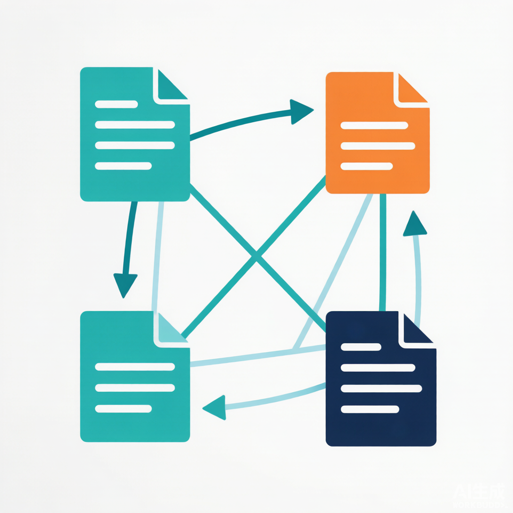

### 08.3 页面命名规范

SKILL.md 定了约定：

| 页面类型 | 命名 | 示例 |
|----------|------|------|
| 资料摘要 | `source-{关键词}.md` | `source-300750-宁德时代2025年报.md` |
| 个股页 | `{代码}-{简称}.md` | `300750-宁德时代.md` |
| 行业页 | `industry-{名}.md` | `industry-动力电池.md` |
| 宏观页 | `macro-{概念}.md` | `macro-美联储加息.md` |
| 策略页 | `strategy-{名}.md` | `strategy-网格交易复盘.md` |

命名规范让 index 能自动归类，链接能稳定指向。

### 08.4 YAML frontmatter

每个页面带 frontmatter：

```yaml
---
tags: [stock, company, 300750]
type: company
ticker: "300750"
sector: "电力设备"
source: "原文标题"
date: 2026-04-29
---
```

配合 Obsidian 的 Dataview 插件，能自动生成动态表格——比如"所有强烈推荐评级的个股"。

> **标叔的经验**：结构化才能批量用
>
   靠 frontmatter + 命名规范，知识库才能从"一堆文件"变"可查询的库"。**散乱的知识用不起来，结构化的才能复利。**

知识成网讲清了。下一章，工具链。

---

## §09 markitdown + Obsidian：工具链让 Wiki 活起来

### 09.1 资料获取的两条路

**微信公众号/财经文章**：用 **Obsidian Web Clipper** 浏览器扩展剪藏成 Markdown，丢进 `data/raw/`。剪藏自带 frontmatter（title、source、author、created、tags）。

**券商研报/财报 PDF**：丢进 `data/raw/` 后，必须先 markitdown：

```bash
./bin/markitdown data/raw/xxx.pdf -o data/raw/xxx.md
```

markitdown 把 PDF 转 Markdown，图片提取到 `data/raw/assets/xxx/`。

### 09.2 为什么要 markitdown

| 维度 | 直接读 PDF | markitdown 转 |
|------|-----------|----------------|
| 可读性 | 差，base64 编码 | 好，纯文本 |
| token 消耗 | 巨大 | 小 |
| 图片 | 丢或乱码 | 提取到 assets |
| 标叔的结论 | 别用 | 必须 |

### 09.3 Obsidian 当浏览 IDE

SKILL.md 推荐 Obsidian 看 Wiki。原因：

- 图谱视图看"个股-行业-宏观"逻辑脉络
- 双向链接 `[[wikilink]]` 原生支持
- Dataview 插件用 frontmatter 出动态表
- 本质就是个 Markdown 文件的 Git 仓库

agent 写 Wiki，你用 Obsidian 看。两者解耦。

### 09.4 整条工具链

```
PDF/网页 → markitdown/Web Clipper → data/raw/*.md
                                          ↓ Ingest
                                    data/wiki/*.md
                                          ↓ Lint
                                      体检/标注
                                          ↓
                                      Obsidian 看
```

> **核心建议**：人机各用趁手的工具
>
   agent 用 markitdown 编译，你用 Obsidian 浏览。别强求一个工具干所有事。**agent 管编译，人管判断。**

工具链讲清了。最后一章，换脑子。

---

## §10 思维转变：从"检索"到"编译"，知识开始复利

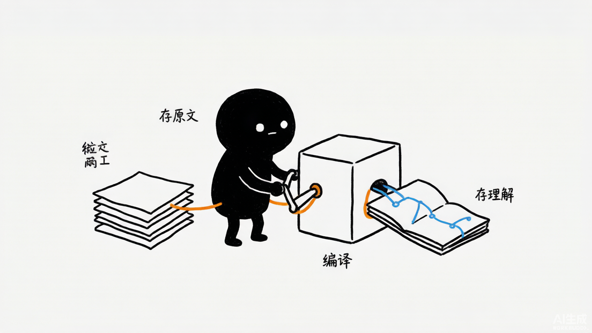

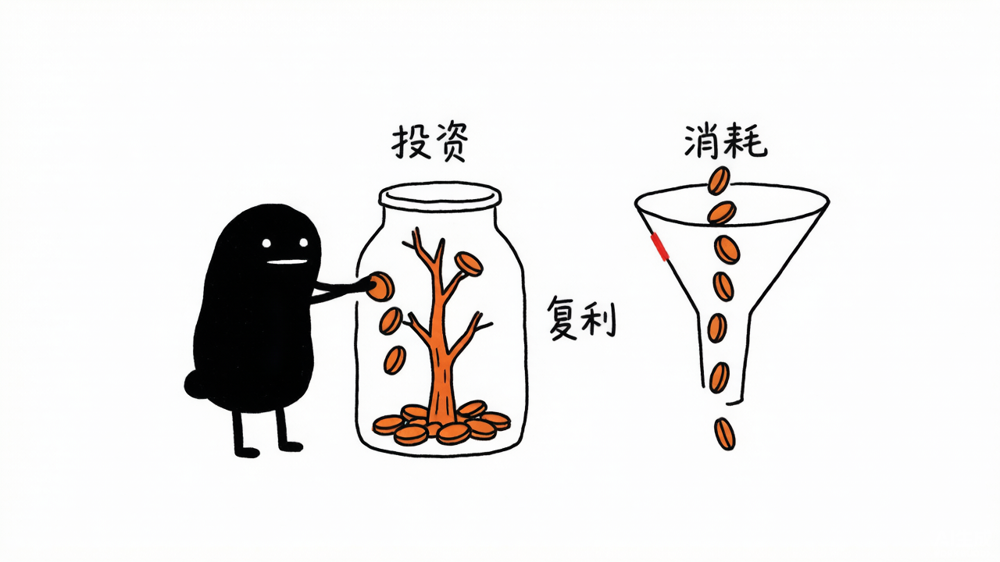

### 10.1 这本书真正的转折

很多人以为"AI + 知识库"就是 RAG。项目 4 戳破了。

RAG 是"检索 + 拼接"。LLM Wiki 是"阅读 + 整合 + 标注矛盾 + 维护网络"。前者是图书馆，后者是会生长的笔记本。

### 10.2 三个转变

**转变一：从"存原文"到"存理解"。**
Raw 存原文，但真正有用的是 Wiki 层——LLM 理解后的结构化知识。

**转变二：从"检索"到"编译"。**
每次查询不是从零检索。是读已编译的 Wiki。知识编译一次，反复用。

**转变三：从"消费"到"复利"。**
查询结论回写新页面。导入触发全库联动。知识越用越多，不是越用越散。

### 10.3 投研 Wiki 的本质

它不是"一个问答机器人"。是"一套会自己生长的认知系统"。

LLM 是管理员。Raw 是真相。Wiki 是认知。Schema 是规则。Ingest 喂、Query 用、Lint 养。

> **标叔的经验**：知识复利是最大的杠杆
>
   我用 RAG 时，每次问答都是一次性消费。换成 LLM Wiki 后，每次导入都让全库更厚。**同样烧 token，RAG 是消耗，Wiki 是投资。**

思维变了。剩下的，是把你自己领域的资料，灌进这座 Wiki。

---

## 附录

### A 核心概念速查

| 概念 | 含义 |
|------|------|
| deepagents | LangChain 上的 agent 框架，模型+后端+skill |
| LocalShellBackend | 本地 shell 后端，给 agent 文件/命令能力 |
| Raw / Wiki / Schema | 原始层 / 知识层 / 规则层 |
| Ingest / Query / Lint | 导入编译 / 查询推演 / 维护体检 |
| index.md / log.md | 索引 / 操作日志 |
| markitdown | PDF → Markdown 转换器 |
| `[[wikilink]]` | 双向链接，让知识成图 |

### B 这本书没讲但你应该继续看的

- deepagents 的其他 Backend（Docker 隔离执行）。
- Wiki 规模变大后的检索增强：纯 index 不够时怎么加向量检索。
- 多人协作 Wiki：多人同时 Ingest 怎么不冲突。

> ⚠️ 免责声明：本书基于 Geek04 开源代码解读。投达示例仅作技术演示，不构成投资建议。


---

## 附录 C：DeepWiki 官方架构图 / 流程图 / 设计图（深度解读补充）

> 以下内容来自 DeepWiki 对 `xingyunyang01/Geek04` 的自动深度解读（Mermaid 源码），作为本书架构与流程的权威参考补充。在支持 Mermaid 的 Markdown 阅读器（GitHub / Obsidian / VS Code + Mermaid 插件）中会自动渲染为图。

### C.1 Logic to Filesystem Mapping

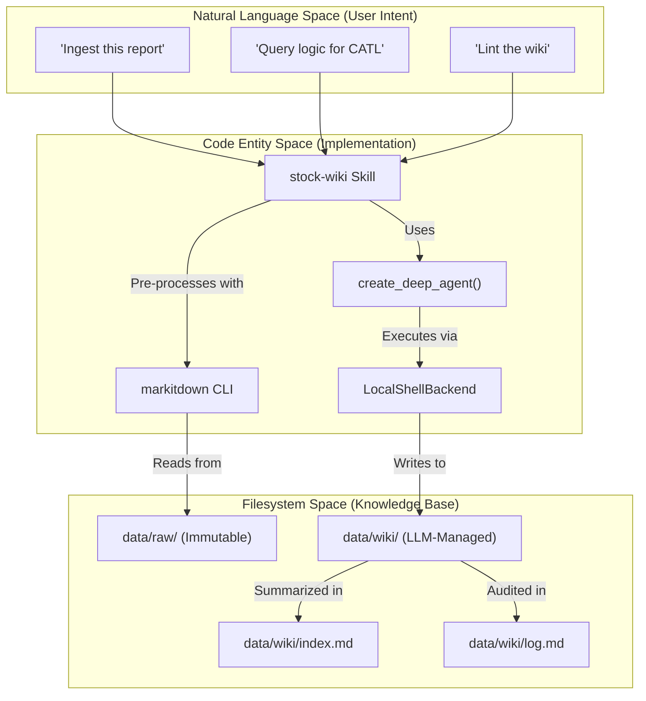

### C.2 Knowledge Lifecycle Workflow

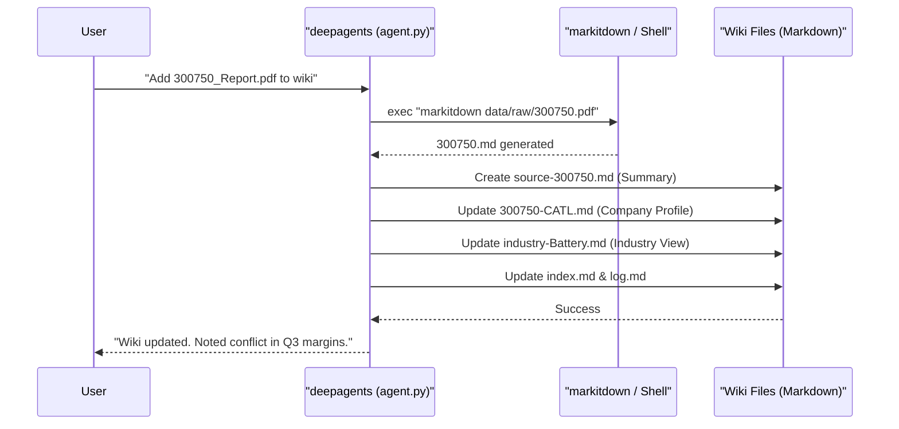

### C.3 Agent Invocation Pipeline

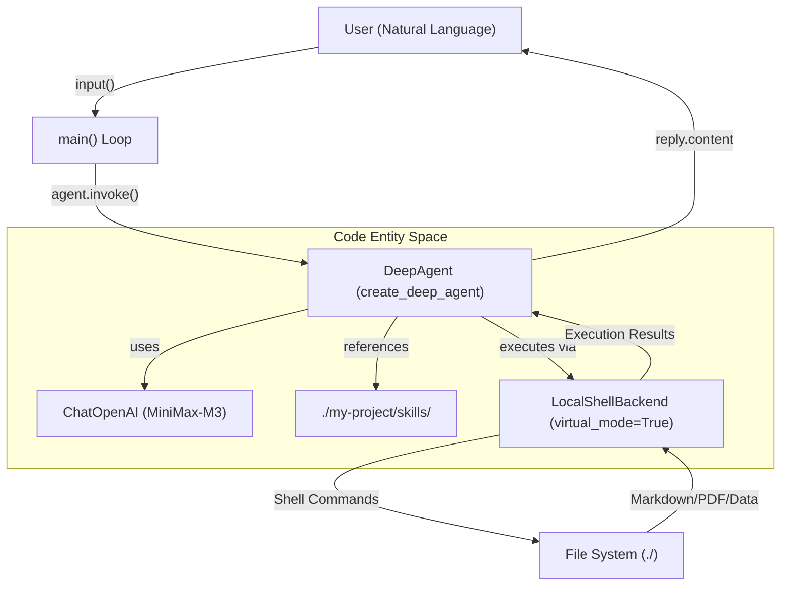

### C.4 REPL Sequence Diagram

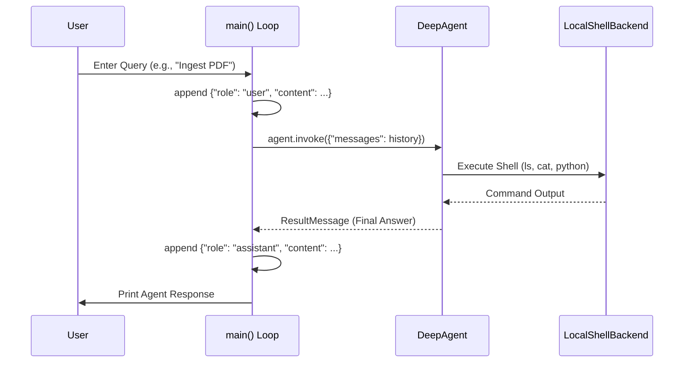

### C.5 System Operation Flow

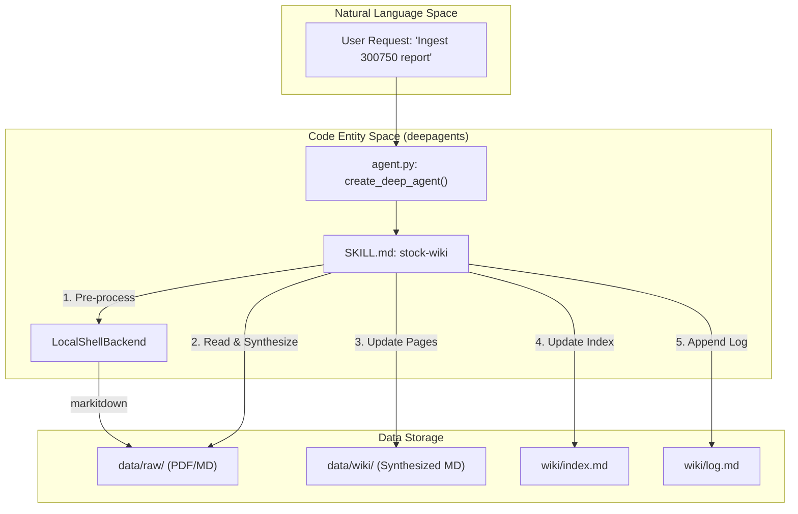

### C.6 Knowledge Synthesis Logic

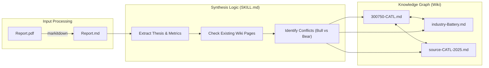

