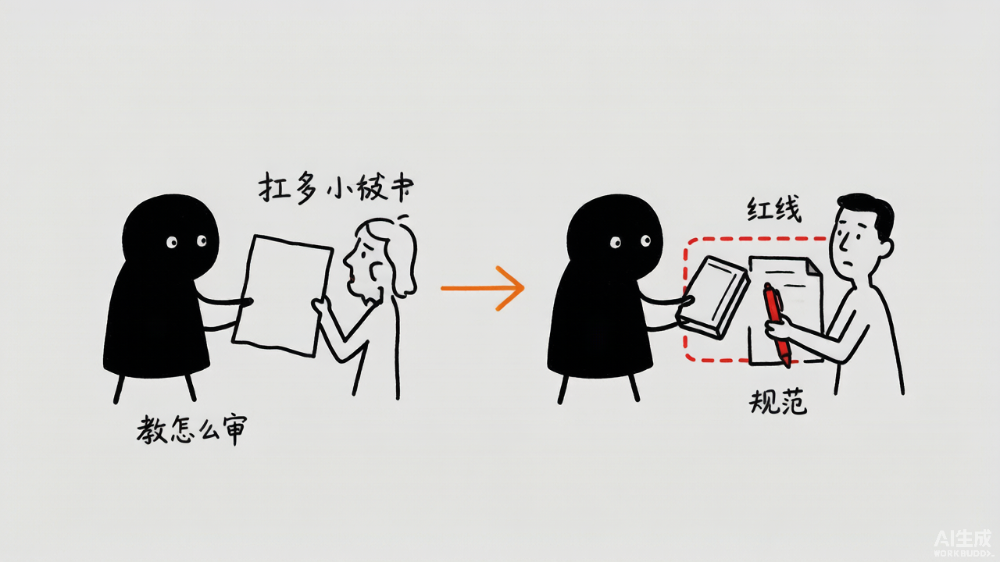
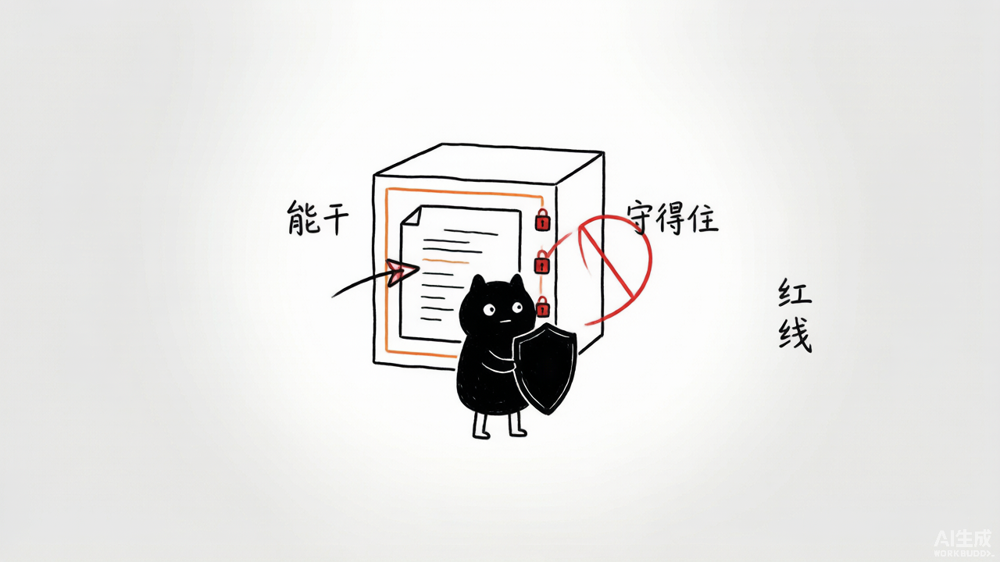
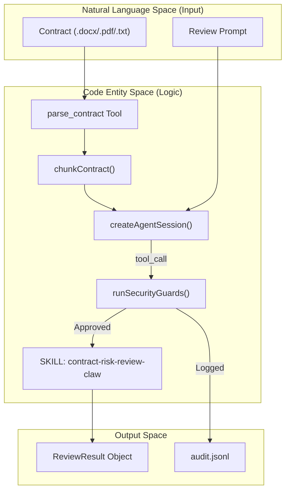
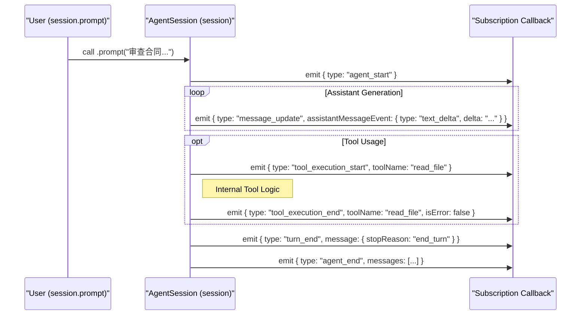
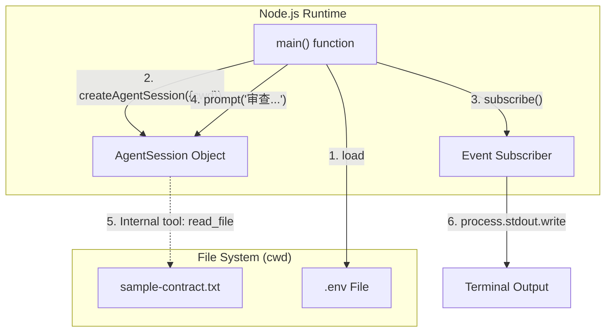
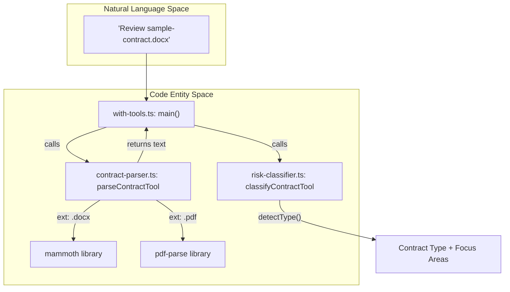
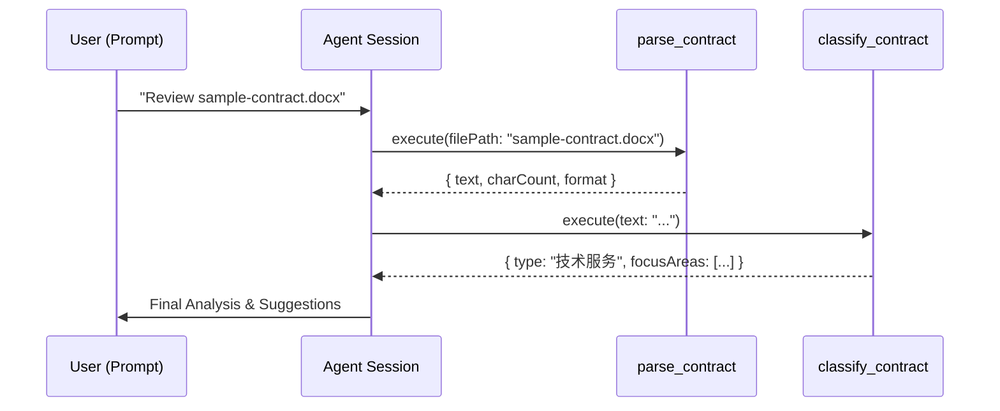
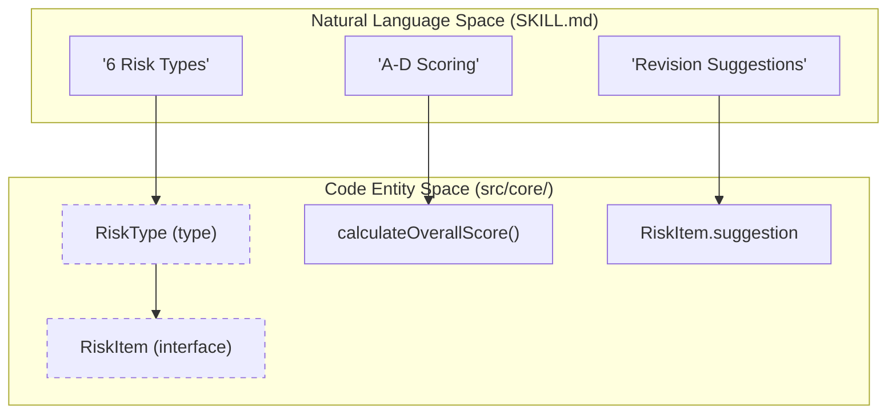
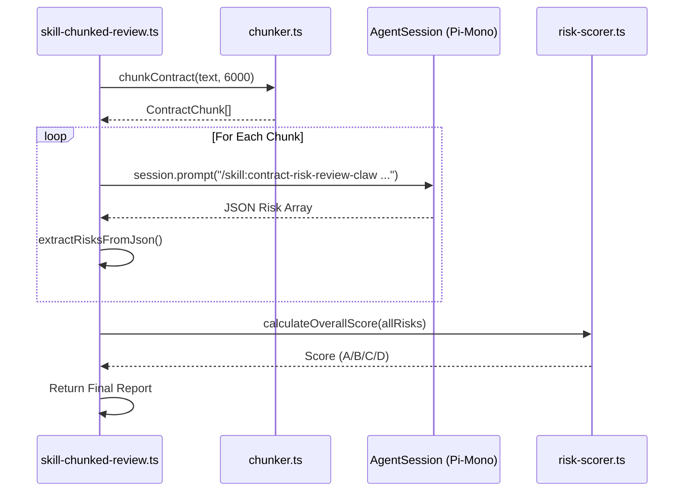
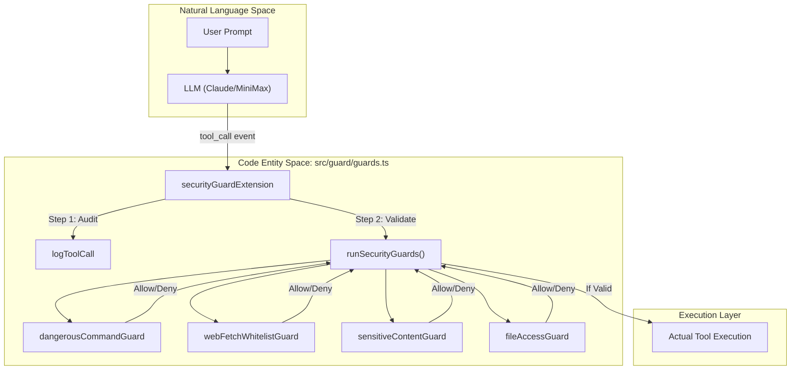

# 合同审查助手-最佳实践

# Contract Review Assistant: From Zero to Hero


**创建者**: 标叔
**为谁创建**: 想用 AI 帮忙审合同、又怕它乱来或看不全的法务/开发同学
**基于**: Geek04 项目 5 · Pi-Mono + Skills · 2026
**最后更新**: 2026-08-07
**适用场景**: 从一个会话，搭到带分块、带 skill、带安全守卫的合同审查系统

---

## 阅读指南

| 时间 | 章节 | 目标 |
|------|------|------|
| Day 1 | §01-§03 | 跑通 Pi-Mono 最小会话 |
| Day 2 | §04-§07 | 加工具、分块、评分、上 skill |
| Day 3 | §08-§10 | 上安全守卫与审计，系统成型 |

---

## Part 1: 起步

从一个能对话的会话，到能审合同。

## §01 为什么合同审查要交给 AI，又不能全交

### 01.1 时间线锚点

我审过合同。最痛的两件事：

第一，长。一份合同几万字，逐条看，眼花。漏一个附件里的"乙方承担所有税费"，就是坑。

第二，重复。技术服务、采购、租赁……每类的高风险点不一样。人审，靠经验。经验不够，看不出门道。

2026 年我拆 Geek04 项目 5。四个文件夹（15-18），正好是"让 AI 帮忙，又不让它乱来"的四级台阶：

| 文件夹 | 加的能力 | 一句话 |
|--------|----------|--------|
| 15 | 最小运行时 | 能对话、能审 |
| 16 | 自定义工具 | 会解析、会分类 |
| 17 | 技能分块审查 | 长合同能审、有标准 |
| 18 | 安全守卫与审计 | 不泄密、能追溯 |

> **标叔的经验**：AI 审合同，管比用重要
>
> AI 看合同比人快。但它会漏、会乱调工具、会把敏感信息带出去。项目 5 的精华不在"让它审"，在"17 分块+18 守卫"这两层管束。**给能力，更要给边界。**

### 01.2 这本书带你走到哪

读完你能回答：

1. Pi-Mono 的会话怎么起、怎么订阅事件？
2. 怎么给 agent 加自定义工具？
3. 长合同怎么分块、怎么评分、怎么用 skill 审？
4. 安全守卫四道闸门怎么拦危险、怎么留审计？

认知装好。下一章，跑通最小会话。

---

## §02 Pi-Mono 最小运行时：一个会话，一次审查

### 02.1 最简形态

`15/src/runtime/minimal.ts`，剥到骨架：

```typescript
import { createAgentSession } from "@earendil-works/pi-coding-agent";
import "dotenv/config";

async function main() {
  const { session } = await createAgentSession({ cwd: process.cwd() });

  session.subscribe((event) => {
    if (event.type === "message_update"
        && event.assistantMessageEvent.type === "text_delta") {
      process.stdout.write(event.assistantMessageEvent.delta);     // 关键：流式输出
    }
    if (event.type === "tool_execution_start") console.log(`\n[Tool Start] ${event.toolName}`);
    if (event.type === "tool_execution_end")   console.log(`[Tool End] ${event.toolName} ${event.isError ? "failed" : "ok"}`);
    if (event.type === "turn_end") { /* 错误处理 */ }
  });

  await session.prompt(
    "请审查当前目录下的 sample-contract.txt，识别不平等条款、违约责任失衡和知识产权陷阱。"
  );
}
main().catch(console.error);
```

就这些。一个能审合同的会话。

### 02.2 三个关键点

**第一，createAgentSession。** 起 会话。`{ cwd }` 指定工作目录。session 是你跟 agent 的通道。

**第二，subscribe 事件流。** Pi-Mono 是事件驱动的。你订阅四类事件：
- `message_update`（text_delta）：模型流式吐字，你边收边打印。
- `tool_execution_start` / `end`：工具开始/结束，带 isError。
- `turn_end`：一轮结束，可查错误。

**第三，session.prompt。** 发一句话给 agent。它自己决定调啥工具、怎么回。

### 02.3 它能审，但很糙

这版 agent 没有自定义工具，没有 skill。它靠内置的 `read` 工具读文件，靠模型自己理解。

短合同能审。长合同？上下文塞不下。特殊格式？docx/pdf 它未必能读好。

> **标叔的经验**：最小形态用来探路
>
> minimal.ts 的价值是"验证模型+框架能跑通"。真审合同要加工具、加 skill。**先跑通骨架，再长肉。**

最小会话跑通了。下一章，指定模型。

---

## §03 显式指定模型：把 MiniMax 接进来

### 03.1 默认模型不够时要显式

`15/src/runtime/explicit-model.ts`：

```typescript
import type { Model } from "@earendil-works/pi-ai";

const minimaxiModel = {
  id: "MiniMax-M3",
  name: "MiniMax-M3",
  api: "openai-responses",
  provider: "openai",
  baseUrl: "https://api.minimaxi.com/v1",
  reasoning: false,
  input: ["text"],
  contextWindow: 128000,
  maxTokens: 8192,
} satisfies Model<"openai-responses">;

const { session, modelFallbackMessage } = await createAgentSession({
  cwd: process.cwd(),
  model: minimaxiModel,              // 关键：显式塞模型
  thinkingLevel: "medium",
});
```

### 03.2 模型配置的五要素

| 字段 | 作用 |
|------|------|
| api | 协议，"openai-responses" 走 OpenAI 兼容 |
| provider + baseUrl | 谁家、哪个端点 |
| contextWindow / maxTokens | 上下文与输出上限 |
| reasoning | 要不要推理模式 |
| thinkingLevel | 思考强度 low/medium/high |

MiniMax 走 OpenAI 兼容协议接进来。说明 Pi-Mono 不绑死某家模型。

### 03.3 modelFallbackMessage 的善意

`createAgentSession` 返回 `{ session, modelFallbackMessage }`。如果模型不可用回退了，`modelFallbackMessage` 会告诉你。

```typescript
console.log("当前模型:", session.model ? `${session.model.provider}/${session.model.id}` : "undefined");
if (modelFallbackMessage) console.log("模型回退提示:", modelFallbackMessage);
```

> **核心建议**：上线前查模型有没有回退
>
> 生产环境模型可能因配额、网络回退到别的。不查，你以为在用 A，其实在用 B，成本和质量都飘。**回退提示是给运维的报警。**

模型接进来了。下一章，加工具。

---

## Part 2: 核心能力

给会话加手脚、加标准、加 skill。

## §04 自定义工具：parse_contract + classify_contract

### 04.1 这一层解决什么

minimal 那版，agent 靠内置 read 读文件。docx/pdf 读不好，也不懂"这是哪类合同"。

16 文件夹加两个自定义工具，把这两件事做稳。

### 04.2 工具怎么定义

Pi-Mono 用 `defineTool` + typebox schema：

```typescript
import { defineTool } from "@earendil-works/pi-coding-agent";
import { Type } from "typebox";

export const parseContractTool = defineTool({
  name: "parse_contract",
  label: "解析合同",
  description: "解析 Word/PDF/文本合同，提取纯文本和基础元数据。",
  parameters: Type.Object({
    filePath: Type.String({ description: "合同文件路径，支持 .docx/.pdf/.txt" }),
  }),
  async execute(_toolCallId, { filePath }) {
    // ... 解析逻辑
  },
});
```

name + description + parameters（typebox）+ execute。跟项目 1 的 smolagents Tool、项目 2 的 @tool 一个套路。框架不同，结构相通。

### 04.3 parse_contract 干什么

按扩展名分流：

```typescript
if (ext === ".docx") {
  const result = await mammoth.extractRawText({ buffer });   // 关键：mammoth 解析 Word
  text = result.value;
} else if (ext === ".pdf") {
  const result = await pdfParse(buffer);                       // 关键：pdf-parse 解析 PDF
  text = result.text;
} else if (ext === ".txt") {
  text = await fs.readFile(filePath, "utf-8");
}
```

返回：格式、字符数、正文（超 10000 字截断预览）。还把完整 text 放进 details，供后续用。

### 04.4 classify_contract 干什么

按关键词判断 8 类合同，每类给审查重点：

```typescript
function getFocusAreas(type: string): string[] {
  const map = {
    技术服务: ["知识产权归属", "交付标准", "验收条款", "违约责任"],
    采购供货: ["付款条件", "交货期限", "质量标准", "退换货条款"],
    股权投资: ["估值调整", "对赌条款", "股东权利", "退出机制"],
    // ... 共 8 类
  };
}
```

技术服务看知识产权，采购看付款，股权看对赌。**先分类，再按类审重点**。这是审查的导航。

### 04.5 挂上去

```typescript
const { session } = await createAgentSession({
  model: minimaxiModel,
  customTools: [parseContractTool, classifyContractTool],
  tools: ["read", "parse_contract", "classify_contract"],     // 关键：工具白名单
});

await session.prompt(
  "请按以下步骤审查 sample-contract.docx\n" +
  "1. 使用 parse_contract 解析合同文件；\n" +
  "2. 使用 classify_contract 对合同进行分类；\n" +
  "3. 基于分类结果，识别该类型合同的高风险条款并给出修改建议。"
);
```

`customTools` 注册，`tools` 白名单放行。prompt 给步骤，引导 agent 用工具。

> **标叔的经验**：分类决定审查方向
>
> 一份合同不分类直接审，agent 一视同仁地看。分了类，它知道技术服务重点盯知识产权。**先定位，再深挖。**

工具加上了。下一章，长合同怎么塞。

---

## §05 合同分块：长合同怎么塞进模型

### 05.1 这一层解决什么

一份合同 6 万字。模型上下文 128k token，看着够。但塞满上下文，模型注意力会散，漏看风险。

17 文件夹的解法：**按条款切分块，逐块审**。

### 05.2 分块器

`17/src/core/chunker.ts`：

```typescript
export function chunkContract(text: string, maxChars = 6000): ContractChunk[] {
  // 按条款边界切：第X章 / N. / 第N条
  const clauses = text.split(/\n(?=第[一二三四五六七八九十]+章|\d+\.\s|第\d+条)/);
  const chunks: string[] = [];
  let current = "";
  for (const clause of clauses) {
    if (current.length + clause.length > maxChars && current.length > 0) {
      chunks.push(current.trim());      // 关键：超 6000 字就切
      current = "";
    }
    current += clause + "\n";
  }
  if (current.trim()) chunks.push(current.trim());
  return chunks.map((content, index) => ({
    index, content, estimatedTokens: Math.ceil(content.length / 2.5),
  }));
}
```

关键设计：

- **按条款切**，不在词中间断。用正则识别"第X章""N.""第N条"做边界。
- **打包到 maxChars=6000**。一个块塞多条条款，到上限就切。
- **估算 token**：长度/2.5（中文约 2.5 字/token）。

> **标叔的经验**：分块要尊重结构
>
> 别按固定字数硬切。按"章/条"切，每块是完整的语义单元。**切在词中间，模型读到残句，必漏。**

### 05.3 为什么是 6000 字

留余量。模型上下文 128k，但一块 6000 字（约 2400 token）能让模型专注，也给 prompt + 输出留空间。

### 05.4 数据结构

`17/src/core/types/contract.ts`：

```typescript
export type RiskLevel = "high" | "medium" | "low";
export type RiskType =
  | "不平等条款" | "违约责任失衡" | "知识产权陷阱"
  | "管辖权不利" | "表述模糊" | "隐藏义务";

export interface RiskItem {
  level: RiskLevel; type: RiskType; clause: string;
  originalText: string; suggestion: string; replacement?: string;
}
```

六类风险，三级严重度，每条带原文、建议、可选替代文本。这是审查的"通用语言"。

分块讲清了。下一章，评分。

---

## §06 风险分级与评分：A/B/C/D 怎么来

### 06.1 评分器

`17/src/core/risk-scorer.ts`：

```typescript
export function calculateOverallScore(risks: RiskItem[]): "A"|"B"|"C"|"D" {
  const high = risks.filter((r) => r.level === "high").length;
  const medium = risks.filter((r) => r.level === "medium").length;
  if (high >= 3 || high + medium >= 8) return "D";
  if (high >= 1 || medium >= 4) return "C";
  if (medium >= 1) return "B";
  return "A";
}
```

### 06.2 评分规则

| 评分 | 条件 | 含义 |
|------|------|------|
| A | 无高无中 | 低风险，可签 |
| B | 有中风险 | 有顾虑，谈完再签 |
| C | 有高风险，或中风险≥4 | 有坑，改了再签 |
| D | 高风险≥3，或高+中≥8 | 高风险，不建议签 |

这个规则把"几处风险"翻译成"能不能签"的决策。不是列清单就完，要给结论。

### 06.3 风险怎么来

风险是上一章 reviewWithSkill 从模型回答里 extract 的。模型对每块合同输出 JSON 风险数组，汇总后喂给评分器。

> **标叔的经验**：评分要给决策，不只给清单
>
> 法务要的不是"有 5 处风险"。是"这份能不能签"。A/B/C/D 直接对应决策。**清单是过程，评分是结论。**

评分讲清了。下一章，skill 驱动。

---

## §07 skill 驱动审查：/skill:contract-risk-review-claw

### 07.1 这一层解决什么

光有工具和分块，agent 还是"自由发挥"。每块怎么审、审哪些点、输出啥格式，不统一。

17 用一个 skill 统一标准。`skill/contract-risk-review-claw-1.0.0/SKILL.md` 定义审查规范。

### 07.2 审查 skill 的六步流程

```text
1. 文本提取 — 解析 PDF/Word/文本
2. 结构解析 — 识别标题/章节/条款/甲乙方/附件
3. 语义风险识别 — 逐条分析，识别 6 类风险
4. 风险分级 — 🔴高 / 🟠中 / 🟡低
5. 生成修订建议 — 风险说明+修改建议+替代文本
6. 输出审查报告 — 风险概览+清单+修订+对比版
```

### 07.3 六类风险

| 风险类型 | 识别要点 | 典型案例 |
|---------|---------|---------|
| 不平等条款 | 权利义务失衡 | "乙方无条件接受甲方单方变更价格" |
| 违约责任失衡 | 一方过重或过轻 | "甲方违约赔1%，乙方赔30%" |
| 知识产权陷阱 | 归属/权限不明 | "成果归甲方，乙方不得使用" |
| 管辖权不利 | 约定对方所在地 | "争议由甲方所在地法院管辖" |
| 表述模糊 | 用词不明确 | "尽快交付""合理费用" |
| 隐藏义务 | 附件/从句额外义务 | 附件"乙方承担所有税费" |

这跟 §04 的 RiskType 一致。skill 定义概念，代码实现类型，两边对齐。

### 07.4 怎么调 skill

`17/src/review/skill-chunked-review.ts`：

```typescript
export async function reviewWithSkill(session, contractText) {
  const chunks = chunkContract(contractText);
  const allRisks: RiskItem[] = [];

  for (const chunk of chunks) {
    const prompt =
      `/skill:contract-risk-review-claw 请使用 JSON 输出模式审查第 ${chunk.index+1}/${chunks.length} 部分。\n` +
      `只返回 JSON 数组，不要 markdown 报告。\n` +      // 关键：约束输出格式
      `每个元素含 level、type、clause、originalText、suggestion。\n` +
      `无风险返回 []。\n\n` + chunk.content;

    await session.prompt(prompt);
    const last = session.messages.at(-1);
    // 关键：从回答里抠 JSON
    const risks = extractRisksFromJson(text);
    allRisks.push(...risks);
  }
  return { score: calculateOverallScore(allRisks), risks: allRisks, summary: ... };
}
```

三个关键：

1. **`/skill:contract-risk-review-claw`** 前缀触发 skill。agent 读 SKILL.md 按规范审。
2. **JSON 输出约束**。要求模型只返 JSON 数组，不要报告。后面好解析。
3. **逐块循环**。分了 N 块，调 N 次，汇总所有风险，再评分。

### 07.5 抠 JSON 的容错

```typescript
function extractRisksFromJson(text: string): RiskItem[] {
  try {
    const match = text.match(/\[[\s\S]*\]/);   // 关键：正则抓第一个 JSON 数组
    if (!match) return [];
    return JSON.parse(match[0]);
  } catch { return []; }
}
```

模型偶尔不听话，输出带 markdown 包裹。用正则抓 `[...]` 部分。抓不到返回空，不让一块解析失败毁了整体。

> **标叔的经验**：skill + JSON 约束 = 可解析
>
> 不约束输出，模型一会儿给报告一会儿给散文，没法聚合。skill 定标准，JSON 定格式，正则做兜底。**三者合力，agent 的输出才能当数据用。**

skill 审查讲清了。下一章，安全守卫。

---

## Part 3: 进阶实战

给审查系统上锁、留痕、能追溯。

## §08 安全守卫：四道闸门拦住危险

### 08.1 这一层解决什么

agent 能调 bash、能联网、能读文件。万一它 `rm -rf /`、把合同传到外网、读你的 .ssh？

18 文件夹加四道守卫，在工具执行前拦。

### 08.2 守卫的抽象

`18/src/guard/guards.ts`：

```typescript
export type GuardResult =
  | { action: "pass" }
  | { action: "block"; reason: string }
  | { action: "rewrite"; input: Record<string, unknown> };   // 关键：还能改写输入

export type GuardRule = (event, ctx) => Promise<GuardResult>;
```

守卫返回三种：放行、阻断（带原因）、改写输入。改写是亮点——不拦死，改成安全的再放。

### 08.3 四道闸门

```typescript
export const ALL_GUARDS: GuardRule[] = [
  dangerousCommandGuard,    // 1. 危险命令
  webFetchWhitelistGuard,   // 2. 联网白名单
  sensitiveContentGuard,    // 3. 敏感信息
  fileAccessGuard,          // 4. 文件访问
];
```


**闸门一：危险命令。**

```typescript
const DANGEROUS_BASH_PATTERNS = [/rm\s+-rf\s+\//, /curl.*\|.*sh/, /sudo\s/, /mkfs/, /dd\s+if=/];
```

拦 rm -rf /、curl|sh、sudo、mkfs、dd。比项目 3 的字符串匹配更进一步——用正则，能挡变体。

**闸门二：联网白名单。**

```typescript
const WEB_FETCH_WHITELIST = ["gov.cn", "court.gov.cn", "gsxt.gov.cn", "tianyancha.com", "qcc.com"];
```

只许访问政府、法院、企查查、天眼查。合同审查需要的法律/企业信息来源。别的域名，block。

**闸门三：敏感信息。**（见下一章 PII 检测）

**闸门四：文件访问。**

```typescript
const FORBIDDEN_PATHS = [".ssh", ".env", ".aws/credentials", ".git/config"];
// 还挡项目目录外
if (!absolute.startsWith(ctx.cwd)) return { action: "block", reason: "禁止访问项目目录外" };
```

.ssh、.env、aws 凭证、git 配置，全挡。还挡越界访问——只能在 cwd 内读。

### 08.4 跟项目 3 的对比

| 维度 | 项目 3 hook | 项目 18 guard |
|------|-------------|----------------|
| 语言 | Python | TypeScript |
| 匹配 | 字符串 | 正则 |
| 联网 | 无白名单 | 有白名单 |
| 文件 | .env+/etc | .ssh/.env/.aws/.git+越界 |
| 输出 | allow/deny | pass/block/**rewrite** |
| 标叔的结论 | 教学范 | 更工程化 |

> **标叔的经验**：白名单比黑名单安全
>
> 联网用白名单——只许访问可信域名。文件用边界——只许在项目内。**黑名单挡已知的坏，白名单只放已知的好。后者安全得多。**

守卫讲清了。下一章，PII 与审计。

---

## §09 PII 检测与审计日志：敏感信息不留痕、不留外

### 09.1 PII 检测器

`18/src/guard/pii-detector.ts`：

```typescript
export const SENSITIVE_PATTERNS = [
  { name: "身份证号", regex: /\d{6}(19|20)\d{2}(0[1-9]|1[0-2])(0[1-9]|[12]\d|3[01])\d{3}[\dXx]/g },
  { name: "手机号",   regex: /1[3-9]\d{9}/g },
  { name: "银行卡号", regex: /\d{16,19}/g },
  { name: "邮箱",     regex: /[\w.+-]+@[\w-]+\.[\w.-]+/g },
];

export function detectByRegex(text: string): string[] { ... }
```

四类敏感信息：身份证、手机、银行卡、邮箱。正则匹配。

### 09.2 怎么用

sensitiveContentGuard 把 input 的 JSON 拿来扫：

```typescript
export const sensitiveContentGuard: GuardRule = async (event, ctx) => {
  const inputText = JSON.stringify(event.input);     // 关键：扫工具入参
  const hits = detectByRegex(inputText);
  if (hits.length === 0) return { action: "pass" };
  ctx.ui?.notify(`正则命中敏感信息: ${hits.join("; ")}`, "warning");
  return { action: "block", reason: `检测到敏感信息: ${hits.join("; ")}` };
};
```

工具要传的参数里含身份证号？拦。防止 agent 把合同里的个人信息带出去。

> **注意**：正则有局限
>
> 银行卡号正则 `\d{16,19}` 会误伤普通长数字。身份证正则相对准。生产要加校验位算法（身份证末位校验、Luhn 校验银行卡）。**正则挡大流，算法挡边角。**

### 09.3 审计日志

`18/src/guard/audit-logger.ts`：

```typescript
export async function logToolCall(event) {
  const entry = {
    timestamp: new Date().toISOString(),
    toolName: event.toolName,
    toolCallId: event.toolCallId,
    args: event.input,
  };
  await fs.appendFile("audit.log", JSON.stringify(entry) + "\n");   // 关键：JSONL 追加
}
```

每次工具调用，写一行 JSONL。跟项目 3 的 audit_logger 一个思路——增量、可流式、崩了不丢。

### 09.4 守卫怎么接进会话

`18/src/extensions/security-guard.ts`：

```typescript
export default function securityGuardExtension(pi: ExtensionAPI) {
  pi.on("tool_call", async (event, ctx) => {
    await logToolCall({ toolName: event.toolName, toolCallId: event.toolCallId, input: event.input });
    return await runSecurityGuards(event, ctx);     // 关键：先记，再守
  });
}
```

这是个 Extension。Pi-Mono 的扩展机制：`pi.on("tool_call", ...)`。每次工具调用，先记审计，再跑守卫。

`18/src/runtime/secured-review.ts` 把它接进会话：

```typescript
const { session } = await createAgentSession({
  model: minimaxiModel,
  thinkingLevel: "medium",
  extensions: [securityGuardExtension],            // 关键：挂扩展
});

session.subscribe(async (event) => {
  if (event.type === "tool_execution_start") {
    const guardResult = await runSecurityGuards(...);
    if (guardResult?.block) console.log(`\n[护栏阻断] ${event.toolName}: ${guardResult.reason}`);
  }
});

const result = await reviewWithSkill(session, text);   // 17 的审查逻辑 + 18 的守卫
```

17 的审查 + 18 的守卫，合一。一份合同审完，所有工具调用有审计、危险被拦、敏感信息不外泄。

> **标叔的经验**：扩展机制是 Pi-Mono 的钩子
>
> `pi.on("tool_call")` 跟项目 3 的 PreToolUse hook 是一回事。框架不同，机制相通。**横切关注点（安全/审计/监控）都该走钩子，不该混进业务。**

PII 与审计讲清了。最后一章，换脑子。

---

## §10 思维转变：AI 审合同，人定红线





### 10.1 四层补丁的内在逻辑

回看 15-18，四层对应合同审查系统的四个维度：

| 维度 | 问题 | 解法 |
|------|------|------|
| 能力 | 不会解析/分类 | 自定义工具 |
| 完整 | 长合同审不全 | 分块+评分 |
| 标准 | 自由发挥不统一 | skill 驱动 |
| 安全 | 能乱来、会泄密 | 守卫+审计 |

缺一层，都不算可靠的审查系统。

### 10.2 三个转变

**转变一：从"让它审"到"教它怎么审"。**
给工具、给分块、给 skill、给评分规则。你的产出从 prompt 变成审查规范。

**转变二：从"信任模型"到"约束模型"。**
四道守卫 + PII 检测 + 审计日志。你不假设它安全，你设计让它不安全都难。

**转变三：从"一份份过"到"标准化流水线"。**
分块循环、JSON 输出、汇总评分。一份 6 万字的合同，自动出 A/B/C/D 评分和风险清单。

### 10.3 合同审查助手的本质

它不是"一个会看合同的 AI"。是"一套审查流水线，配一个守规矩的 agent"。

skill 定标准，分块保完整，评分给结论，守卫守红线。agent 是执行器，红线是你定的。

> **标叔的经验**：法律场景，红线比能力重要
>
> 合同涉及权利义务、敏感信息。AI 漏一条是风险，泄一份是事故。项目 5 花一半篇幅在"守卫+审计"，不是浪费。**法律场景，能干不如守得住。**

思维变了。剩下的，是把这套用到你自己的合同库。

---

## 附录

### A 核心 API 速查

| 来源 | 类/函数 | 作用 |
|------|---------|------|
| pi-coding-agent | `createAgentSession({cwd, model, customTools, tools, thinkingLevel, extensions})` | 起会话 |
| pi-coding-agent | `session.subscribe(event => ...)` | 订阅事件 |
| pi-coding-agent | `session.prompt(...)` / `session.messages.at(-1)` | 发问/读回复 |
| pi-coding-agent | `defineTool({name, parameters, execute})` | 定义工具 |
| pi-coding-agent | `pi.on("tool_call", ...)` Extension | 挂守卫 |
| pi-ai | `Model` (api/provider/baseUrl/contextWindow) | 模型配置 |
| typebox | `Type.Object(...)` | 工具参数 schema |

### B 四道守卫速查

| 守卫 | 拦什么 |
|------|--------|
| dangerousCommandGuard | rm -rf /、curl|sh、sudo、mkfs、dd |
| webFetchWhitelistGuard | 非白名单域名 |
| sensitiveContentGuard | 身份证/手机/银行卡/邮箱 |
| fileAccessGuard | .ssh/.env/.aws/.git + 越界 |

### C 这本书没讲但你应该继续看的

- GuardResult 的 `rewrite`：怎么把危险输入改成安全的再放行。
- skill 的 references（risk-clauses / legal-regulations）：怎么让审查更精准。
- 批量审查：历史合同库怎么扫，出高风险清单。

> ⚠️ 免责声明：本书基于 Geek04 开源代码解读。合同审查示例仅作技术演示，不构成法律意见。法律风险请咨询专业律师。


---

## 附录 C：DeepWiki 官方架构图 / 流程图 / 设计图（深度解读补充）

> 以下内容来自 DeepWiki 对 `xingyunyang01/Geek04` 的自动深度解读（Mermaid 源码），作为本书架构与流程的权威参考补充。在支持 Mermaid 的 Markdown 阅读器（GitHub / Obsidian / VS Code + Mermaid 插件）中会自动渲染为图。

### C.1 System Architecture: Code to Concept Mapping



### C.2 Diagram: Session Event Lifecycle



### C.3 Diagram: Code Execution to File Interaction



### C.4 2. Risk Classifier (`classify_contract`)



### C.5 Analysis Workflow



### C.6 Natural Language to Code Mapping



### C.7 Orchestration Data Flow



### C.8 Guard Pipeline Data Flow



