# 真·AI Agent 小蓝书：人人都能懂的智能体入门

True·AI Agent Field Guide — 从聊天机器人到会办事的 AI 伙伴

**创建者**: （标叔）
**为谁创建**: 想搞懂 AI Agent 的产品经理、运营、管理者、学生，以及不想被时代甩下的普通人
**基于**: Manning《AI Agents in Action》（第 2 版）目录骨架 + 2026 年 7 月一线资料
**最后更新**: 2026-07-08
**适用场景**: 系统入门 AI 智能体。零基础可读，专业者可查最新落地数据。

***

## 序：我为什么要写这本小蓝书

2026 年 3 月。我在一个客户群里看到一句话："我们部门招了个 AI，比实习生好用。"

我当时愣了一下。

AI 不再是"聊天框"了。它开始领工资、跑流程、发邮件、写周报。这玩意儿叫 **AI Agent（智能体）**。

我翻遍市面上的资料。英文的太硬，动不动甩代码。中文的太散，公众号东一篇西一篇。

于是我决定自己写一本。

先给结论：**2026 年，不懂 Agent 的人，会被懂 Agent 的人悄悄甩开。** 不是危言耸听。CB Insights 说，2023 年以来财报会上提"Agent"的次数涨了 10 倍。

这本书不教你写代码。它教你三件事：

第一，Agent 到底是个啥。
第二，它为什么现在才火。
第三，你该怎么用上它。

我按一本英文好书《AI Agents in Action》的目录来写。但每一章都换成了大白话，补上了 2026 年的最新事实。

> **核心建议**：别一口气读完。每天看两章。看完试着让 AI 帮你干一件真事。

***

## Part 1: 起步认知

从"是什么"到"为什么"。读完这部分，你能跟人讲清楚 Agent 和普通聊天的区别。

***

## §01 AI Agent 已经不是聊天机器人了

### 01.1 一个被忽略的事实

2023 年。AutoGPT 一周冲上 GitHub 热榜。

我当时试了。我说"帮我调研竞品"。它自己开浏览器、自己搜、自己写报告。

我第一次感到：AI 不是"回答"，是"办事"。

2024 年 9 月。OpenAI 发布 o1。模型学会"想久一点"。

2025 年 1 月。DeepSeek-R1 用强化学习开源了推理配方。

2025 年。Anthropic 推出 MCP。Letta、Mem0 把"长期记忆"做成产品。

2026 年。大家叫它"多智能体协作元年"。

三年。Agent 从玩具变成了工具。

### 01.2 先给一个定义

> **AI Agent 是一个基于大语言模型的系统。它会推理、会规划、借记忆、调工具、联同伴，自主替你把事办成。**

关键词就两个：**自主**、**执行**。

光会聊天的，那叫 chatbot。能动手办成的，才叫 Agent。

### 01.3 它和聊天机器人差在哪

| 维度 | 聊天机器人 | AI Agent | 标叔的结论      |
| -- | ----- | -------- | ---------- |
| 交互 | 一问一答  | 给目标跑全程   | Agent 省你步骤 |
| 能力 | 只动嘴   | 会调工具     | Agent 能发邮件 |
| 记忆 | 关了就忘  | 长期记得你    | Agent 像老搭档 |
| 纠错 | 靠你判断  | 自己反思重试   | Agent 更省心  |
| 例子 | 早期客服  | 自动排行程写周报 | 一个天上一个地下   |

> **注意**：别被"智能体"三个字吓到。它就是"会自己跑流程的 AI"。没那么玄。

**示意图 1：聊天机器人 vs AI Agent**

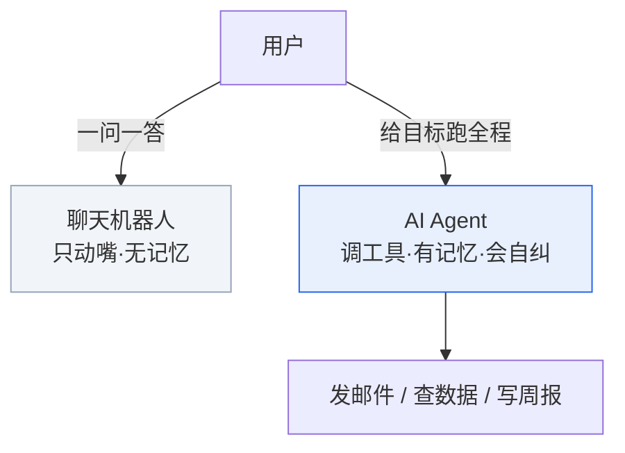

### 01.4 自主性有阶梯

Agent 不是一夜全自主。行业画了条阶梯：

- **L0 辅助**：你写它补全，像输入法。
- **L1 副驾驶**：你下令它出方案，你拍板。
- **L2 受限自治**：护栏内自己跑，关键处问你。
- **L3 半自动**：多步它主导，高风险才问。
- **L4 闭环自治**：几乎不用管，干完汇报。

2025 年我们停在 L1-L2。2026 年往 L3 冲。
**示意图 2：自主性阶梯 L0–L4**

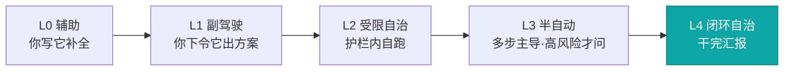

> **核心建议**：现在别追求"全自动"。要"可控自治"。自治是手段，可控才是目的。

§01 讲完"是什么"。下一章讲"靠什么活"——大模型、提示词、智能体，三件不同的事。

***

## §02 大模型、提示词、智能体是三件不同的事

### 02.1 我犯过的最蠢错误

刚接触 Agent 时，我以为"提示词写得好，Agent 就聪明"。

错了。

提示词只是"你怎么跟它说话"。它决定不了一个系统会不会动手。

### 02.2 大模型是大脑

大语言模型（LLM）是 Agent 的"脑"。

它读过几乎整个互联网。你问它，它预测"下一个最可能的词"。

但它不懂"事实"。它懂"模式"。

所以它会**一本正经地胡说**。这叫幻觉（hallucination）。

2024 年 o1、2025 年 DeepSeek-R1 之后，有了"推理模型"。它能在回答前多转几圈脑子（思维链）。数学逻辑稳了。

> **注意**：永远别把 Agent 的回答当真理。涉及钱、法、医、上线，让它给来源、给核对方式。

### 02.3 提示词是嘴

提示词是你跟大脑"下指令"的话。

好的提示词有结构：目标 + 范围 + 标准 + 约束。

差的提示词："优化一下这个项目"。
好的提示词："检查最近 3 篇博客的失效内链，修好，跑校验，别动无关文件"。

后者 Agent 才跑得准。

### 02.4 智能体是"脑 + 手 + 记忆"

Agent = LLM（脑）+ 工具调用（手）+ 循环（心）+ 记忆（本）。

光有脑，是 chatbot。加上手和循环，才是 Agent。

**示意图 3：Agent = 脑 + 手 + 心 + 本（五大能力层）**

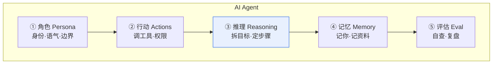

### 02.5 拆成五层看，最清楚

我习惯把 Agent 拆成五层。这套框架来自《AI Agents in Action》，不绑任何厂商。

| 能力层            | 负责啥    | 生活类比  | 标叔的结论  |
| -------------- | ------ | ----- | ------ |
| 角色 Persona     | 身份语气边界 | 岗位说明书 | 先定它是谁  |
| 行动工具 Actions   | 调啥工具   | 员工权限  | 没手办不成事 |
| 推理规划 Reasoning | 拆目标定步骤 | 脑子盘算  | 决定聪不聪明 |
| 知识记忆 Memory    | 记你记资料  | 笔记本   | 越用越懂你  |
| 评估反馈 Eval      | 自查复盘   | 质检会   | 决定靠不靠谱 |

> **经验**：Agent 哪里笨了，别瞎改提示词。先问：五层里哪层缺了？答非所问是角色没设清。老算错是工具没接。老忘事是记忆没建。

§02 讲完"靠什么"。下一章讲"手"——怎么让 Agent 调工具，以及 MCP 这个关键协议。

***

## §03 MCP 把"调工具"变成了插 USB-C

### 03.1 2024 年 11 月 25 日

Anthropic 发了篇文章。标题叫《Introducing the Model Context Protocol》。

这一天，被很多人当成 Agent 工程的转折点。

### 03.2 以前调工具有多乱

你想让 Agent 发邮件。你得为 Gmail 写一套适配。

换 Outlook，再写一套。

换 Claude 模型，又写一套。

一团乱麻。开发者苦不堪言。

### 03.3 Function Calling：Agent 的"伸手"

先说基础。开发者给模型列好"有哪些函数可用"：

```python
# 定义 Agent 能调用的工具
tools = [
  {
    "name": "send_email",      # 发邮件
    "params": {"to": "string", "body": "string"}
  },
  {
    "name": "query_db",        # 查数据库
    "params": {"sql": "string"}
  }
]
# 模型需要时自己选函数并填参数
```

这叫函数调用（Function Calling）。Agent 由此从"动嘴"变"动手"。

### 03.3.1 一个工程细节：让输出"有类型"

模型默认吐自然语言。你让"返回 JSON"，它偶尔漏个逗号就崩。

专业做法叫**类型化输出（Typed Outputs）**：先定义好返回结构（像表格的列），模型只能按列填。解析不再靠"猜文本"，而是读确定字段。

```python
# 类型化输出：先定结构，再让模型填
class EmailResult(BaseModel):
    ok: bool                 # 成功没
    error_code: str | None   # 失败原因
    message_id: str | None   # 发出去的邮件 ID
# 模型按这结构返回，解析零歧义
```

> **经验**：凡是要让另一个程序读 Agent 的产出，就用类型化输出。少一处文本解析，少十个线上 bug。

### 03.4 MCP：AI 世界的 USB-C

MCP（Model Context Protocol，模型上下文协议）定了一套统一标准。

> **一句话**：任何 Agent，都能"插上"任何工具或数据源。即插即用，可替换。

这就是经典的"USB-C 比喻"。

以前电脑接打印机、硬盘、显示器，各用各的口。乱。后来统一成 USB-C，一个口通吃。

MCP 就是 AI 的 USB-C。

**示意图 4：MCP = AI 世界的 USB-C**

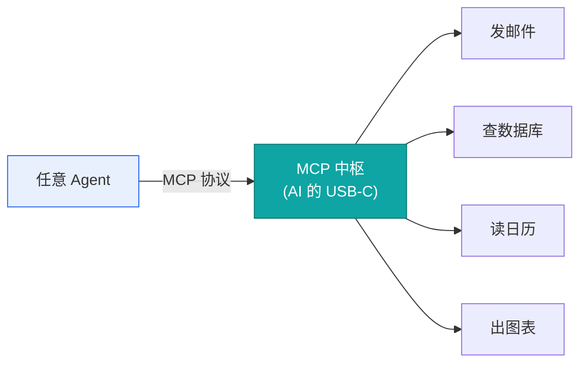

### 03.5 MCP 和 A2A 不是一回事

2026 年还有个协议叫 A2A（Agent2Agent，Google 推）。别混。

| 协议  | 解决啥              | 类比        | 标叔的结论     |
| --- | ---------------- | --------- | --------- |
| MCP | Agent 调工具/数据     | USB-C 接外设 | 接"物"用 MCP |
| A2A | Agent 找 Agent 协作 | 微服务间通信    | 找"人"用 A2A |

两者互补。一个 Agent 团队里，MCP 接工具，A2A 连同伴。

**示意图 5：MCP 接‘物’，A2A 连‘人’**

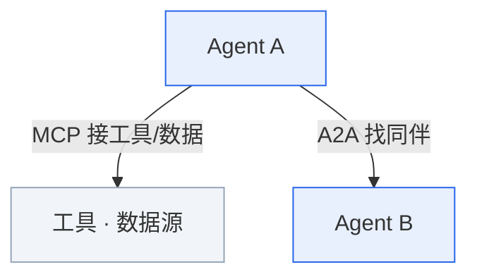

### 03.6 对你意味着什么

以前 Agent 只能聊。现在它能：查你日历、拉销售数据、发邮件、出图表。

而且不用每个功能从零写。插上就行。

> **核心建议**：选 Agent 工具时，看它支不支持 MCP。支持，等于它的"外设生态"是开放的。

§03 讲完"手"。下一章讲"组队"——多智能体系统，2026 年最热的方向。

***

## §04 多智能体不是堆人，是分工

### 04.1 2026 年 7 月的一个数字

腾讯云一篇文提到麦肯锡《2026 企业级 AI 代理经济报告》。

数字很硬：**多智能体协作，任务完成率比单体 Agent 高 4.2 倍。错误恢复能力增强 67%。**

同年，IEEE 发布《自主智能体互操作与伦理治理标准》。

多智能体，从概念变成工程刚需。

### 04.2 为什么一个不够

单体 Agent 干复杂活，会暴露三个毛病：

第一，**认知过载**。一个脑子又想规则、又调工具、又写内容，容易乱。

第二，**单点故障**。它一错，全任务断。

第三，**没有制衡**。它自说自话，难自查。

### 04.3 一个经典团队配置

内容创作的多智能体，常是 5 个角色，职责完全隔离：

| 角色       | 干啥     | 类比   | 标叔的结论  |
| -------- | ------ | ---- | ------ |
| 主编 Agent | 定方向审大纲 | 项目经理 | 必须唯一拍板 |
| 研究 Agent | 找资料标源  | 调研员  | 只管搜不管写 |
| 写作 Agent | 出初稿    | 笔杆子  | 专注产出   |
| 评审 Agent | 挑错挑刺   | 质检   | 和写的分开  |
| 执行 Agent | 排版发布   | 运营   | 最后落地   |

分工清楚，互不越界。一个累垮，别的顶上。

**示意图 6：多智能体团队（5 角色 + 总协调器）**

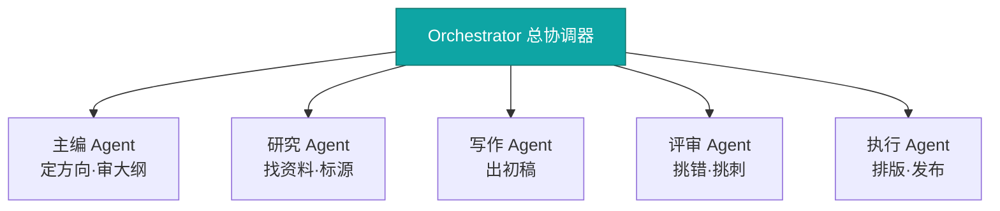

### 04.4 三层治理架构

生产级多智能体，不是堆几个 LLM。它有三层：

- **角色定义层**：每个 Agent 干啥、能用啥工具、输出啥格式。最小权限。
- **协作协议层**：Agent 间怎么通信、怎么路由、冲突怎么解。用结构化消息（JSON），别用自然语言。
- **监督控制层**：一个全局协调器（Orchestrator）。负责任务分解、进度、异常、聚合。

**示意图 7：多智能体三层治理架构**

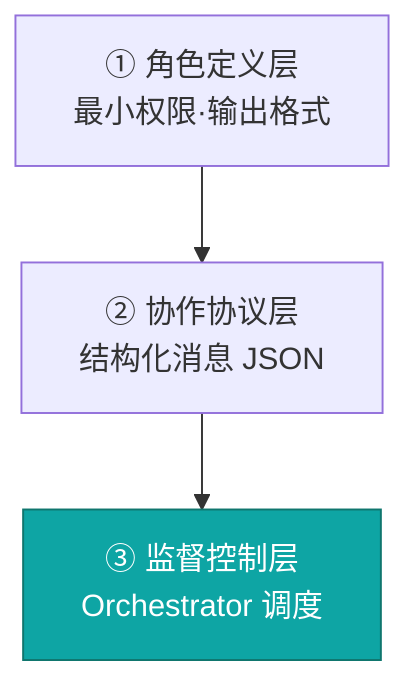

### 04.5 四个反直觉原则

> **经验**：我踩过坑才懂这几条。

第一，**别追求全自主**。留人类"否决权"和"重置权"。

第二，**别让 Agent 自由聊**。用 Schema 定消息格式。牺牲点灵活，换稳定。

第三，**别忽视沉默成本**。Agent 间无效通信也是钱。要监控效率。

第四，**别拿 MAS 当万能药**。简单任务，单体更快。超了认知阈值才上团队。

§04 讲完"组队"。下一章讲"脑子"——推理与规划，决定 Agent 聪不聪明。

***

## §05 推理和规划决定 Agent 聪不聪明

### 05.1 一个最容易被忽视的循环

2022 年。Yao 等人提出 ReAct。

它把"推理"和"行动"拧到一起。至今仍是 Agent 的骨架。

### 05.2 思维链：让它"想出声"

Chain-of-Thought（思维链），简称 CoT。

你问"小明有 3 个苹果……"。模型不在心里憋答案，而是一步步写：

"先算 A，再算 B，所以等于 C。"

推理模型（o1、DeepSeek-R1）把这个玩到极致。想越久，越准。

### 05.3 ReAct：想一步、做一步、看一眼

ReAct = Reason（推理）+ Act（行动）。

循环长这样：

```
思考：我得先查用户航班时间
行动：调用查航班工具
观察：拿到 14:30 的票
思考：再查接机司机
行动：……
```

三步一循环。Agent 能处理会中途变化的真实任务。

> **注意**：ReAct 不是"自主意识"。它是受控的程序循环。别神话它。

**示意图 8：ReAct 循环（想一步·做一步·看一眼）**

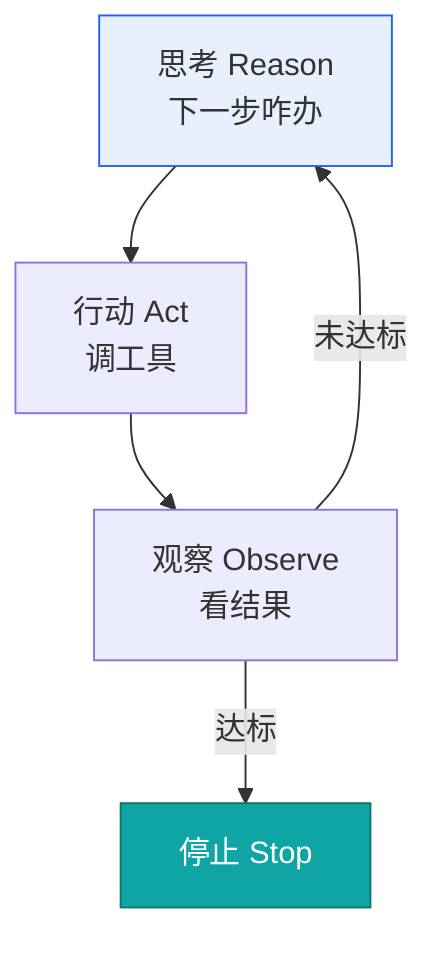

### 05.4 规划：先拆再干

复杂任务，Agent 先当项目经理，把活拆成清单（Plan），再逐步推进。

卡壳了还会**自我反思（Reflexion）**："刚才那步错了，换法子。" Reflexion 是 2023 年 Shinn 等人提出的模式，让 Agent 跑完一遍，自己写"批评意见"，下次带着教训重来。它和 ReAct 是黄金搭档：ReAct 管"动手"，Reflexion 管"复盘学乖"。

还有两种进阶规划法：

- **Tree-of-Thought（思维树）**：多路试探，再选最优，适合分叉多的决策。
- **Sequential Thinking（有序思考）**：把大问题硬拆成一步步小推理链，像做证明题，适合长链条、强依赖的任务。

### 05.5 一个旅行规划的例子

你说："帮我规划 3 天、预算 3000 的成都行。"

Agent 会：

1. 规划出"交通/住宿/景点/美食"四块。
2. 查机票酒店价（行动）。
3. 发现超预算，反思后改住青旅、砍远景点（自我纠正）。
4. 产出可执行的日程表。

全程你只说了那一句话。

| 模式                  | 干啥用        | 标叔的结论      |
| ------------------- | ---------- | ---------- |
| CoT                 | 单步推理、算数    | 模型自己想清楚    |
| ReAct               | 多步带工具      | Agent 标配循环 |
| Plan                | 复杂先拆解      | 大任务先列清单    |
| Reflexion           | 跑完复盘、带教训重来 | 降低幻觉的关键    |
| ToT                 | 多路选优       | 难决策才上      |
| Sequential Thinking | 长链强依赖推理    | 像做证明题      |
| **示意图 9：六种推理规划模式**  | <br />     | <br />     |

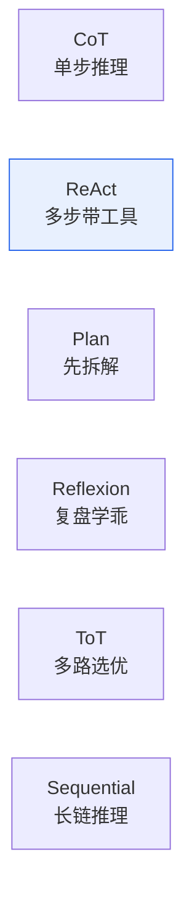

§05 讲完"脑子"。下一章讲"笔记本"——记忆与 RAG，让 Agent 记住你。

***

## §06 记忆和 RAG 让 Agent 记住你

### 06.1 金鱼困境

早期 Agent 像金鱼。对话一关，全忘。

2025-2026 年，"长期记忆"从论文变成产品（Mem0、Letta、Zep）。

### 06.2 记忆分四种

人怎么记，Agent 就怎么记：

| 记忆类型 | 记啥     | 例子        | 标叔的结论  |
| ---- | ------ | --------- | ------ |
| 工作记忆 | 当前在想啥  | 临时便签      | 一轮任务内用 |
| 语义记忆 | 关于你的常识 | 你爱喝美式     | 长期用户画像 |
| 情景记忆 | 发生过的事  | 上次你发过火    | 避免再踩雷  |
| 程序记忆 | 怎么做事   | 报销先 A 后 B | 固化工作流  |

**示意图 10：四种记忆类型**

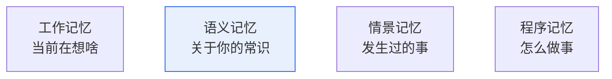

### 06.3 RAG：给 Agent 一本可翻的资料库

光靠模型"脑内知识"不够。它会编。

RAG（检索增强生成）的做法：

你问之前，系统先去你的文档库**检索相关段落**，塞给模型当"参考资料"。

模型基于真材料答，不凭空编。

生产级 Agent 用**多路召回**。不是只搜相似度：

```python
# 多路召回：比单一路更准
def retrieve(query):
    s = vector_search(query, top_k=10)   # 1. 语义相似
    k = keyword_search(query, top_k=10)  # 2. 关键词精确
    g = graph_query(query)               # 3. 知识图谱关系
    t = temporal_search(query, "7d")     # 4. 近期时序
    return rerank([s, k, g, t])          # 5. 融合重排
```

**示意图 11：RAG 多路召回 + 融合重排**

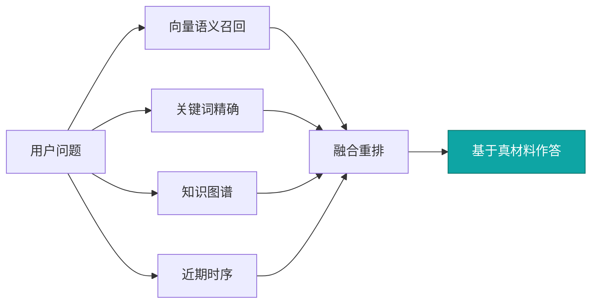

### 06.4 记忆要压缩

长期记忆会爆炸。解法叫**分层摘要**：

- Level 1：原始对话，留 7 天。
- Level 2：每日摘要，留 30 天。
- Level 3：周度总结，留 90 天。
- Level 4：月度洞察，永久留。

每层由"摘要 Agent"生成。留关键的，丢冗余的。

> **核心建议**：想让 Agent 真"懂你"，把你的笔记、邮件历史接给它。它从陌生人变老搭档。

§06 讲完"笔记本"。下一章讲"质检员"——评估与反馈，决定靠不靠谱。

***

## §07 评估与反馈是 Agent 的质检员

### 07.1 2026 年 6 月的一份报告

清华大学清新研究团队，发了《2026 智能体安全研究报告》。

80 页。核心一句：**Agent 安全，已从模型层，转到运行时系统安全。**

### 07.2 怎么知道它干得好不好

行业用基准打分：

| 基准        | 考啥        | 标叔的结论  |
| --------- | --------- | ------ |
| GAIA      | 真实多步问题    | 贴近日常任务 |
| SWE-bench | 修真实代码 bug | 程序员最关心 |
| OSWorld   | 操作真实电脑界面  | 能不能点按钮 |

但测试不是一次性的。好系统有**反馈环**：

跑完自查 → 你打分纠错 → 模型学习改进。

像员工每月复盘。越干越稳。

### 07.3 安全公式

清华给了一个清醒公式：

> **Agent Safety = 身份 + 策略 + 工具 + 日志**

Agent 不是聊天框。它会发邮件、会转账、会改库。

它的安全边界，远大于"只会聊"的模型。

**示意图 12：Agent 安全公式**

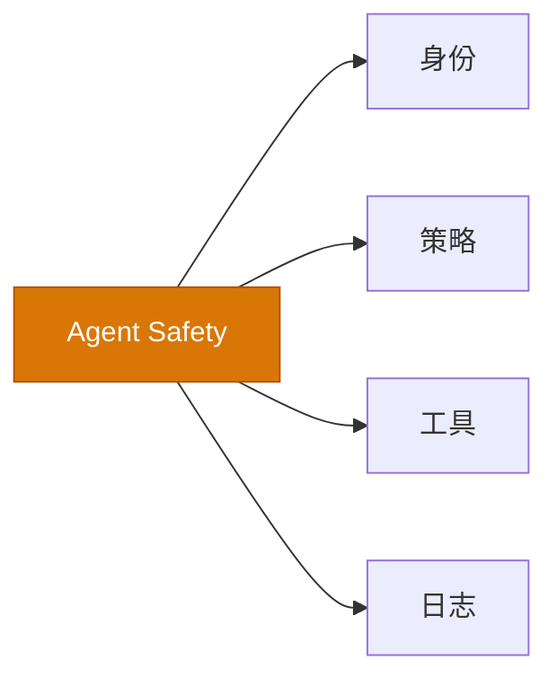

### 07.4 七层安全控制

报告提了七层：

1. **身份层**：独立账号，不长期持你密码。
2. **权限层**：最小权限，短期可撤销。
3. **工具层**：工具打风险标签。
4. **上下文层**：防投毒。
5. **记忆层**：防记忆污染。
6. **沙箱层**：操作隔离。
7. **审计层**：全量日志 + 高风险人工审批。

**示意图 13：七层安全控制栈**

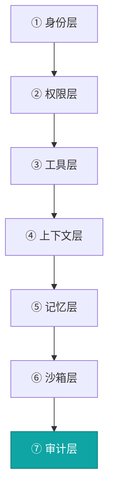

### 07.5 给普通人的三条铁律

> **注意**：这三条，我建议你截图保存。

第一，别把银行密码、主账号给"全权限"Agent。宁可每步问你确认。

第二，动真钱、发真邮件前，设一道"人工审批门"。

第三，高风险动作（转账、删库、外发）必须留日志、可撤销。

| 风险等级 | 例子      | 标叔的建议  |
| ---- | ------- | ------ |
| 低风险  | 写周报、查资料 | 可先落地   |
| 中风险  | 外发通知    | 草稿后确认  |
| 高风险  | 转账、删库   | 人工审批必过 |

§07 讲完"质检"。下一章讲"上线"——从 Demo 到生产，要跨四道坎。

***

## §08 从 Demo 到生产要跨四道坎

### 08.1 一句扎心的话

2026 年 5 月。阿里云一篇文说："Demo 做得挺惊艳，一到生产就翻车。"

我深以为然。

### 08.2 跨越一：从单次对话到长时任务

你的原型在 Notebook 跑得好好的。

一上线，"分析 100 篇财报出报告"，跑 3 分钟超时了。

传统 API 假设几百毫秒返回。Agent 要跑 5-10 分钟。

解法：上 WebSocket 或 SSE，流式推中间结果。会话状态持久化。异步任务队列。

### 08.3 跨越二：从单 Agent 到多 Agent

一个 Agent 啥都干，上下文爆了，准确率暴跌。

拆多个，新问题来了：怎么通信？谁调度？失败咋办？

解法：同团队用 A2A 通信、MCP 接工具。Agent 数 > 5，必须上正式协同框架。

### 08.4 跨越三：从本地跑到弹性伸缩

Demo 你一个人用，GPU 闲着无所谓。

上线 1000 人同时跑，GPU 排到天荒地老。半夜没人用还烧钱。

解法：**Serverless GPU**。按需分配，低谷缩到 0，按调用付费。

某车厂上了函数计算 GPU，算力成本降了约 33%。

### 08.5 跨越四：从"能跑"到"可观测"

客户说"答得不对"。你打开日志，只有一行 `execution completed`。

完全不知道中间发生了啥。

生产级可观测要三件事：

- **链路追踪**：每步都记（谁调了啥、耗时多少）。
- **质量评估**：建 50-100 测试用例，每次更新自动跑。
- **成本监控**：给每次调用加 Token 预算，单任务限最大步数。

**示意图 14：从 Demo 到生产的四道坎**


### 08.6 真实落地数据

谷歌 2026 年报告，调研 3466 位企业决策者：

- **52%** 的生成式 AI 企业，已把 Agent 投产。
- **88%** 的早期采用者，已在至少一个场景拿到正 ROI。
- 加拿大电信 TELUS，5.7 万员工定期用 Agent，每次互动平均省 40 分钟。

| 平台能力       | 自建成本     | 成熟平台       | 标叔的结论  |
| ---------- | -------- | ---------- | ------ |
| 长时+流式      | 改 API 网关 | 原生支持       | 小团队别自建 |
| 多 Agent 协同 | 自建注册中心   | 内置模板       | 直接用好平台 |
| GPU 弹性     | K8s+调度   | Serverless | 按量省钱   |
| 可观测        | 自建追踪     | 控制台可视      | 必须上    |

> **核心建议**：团队不到 20 人，别在基础设施上造轮子。选覆盖这四点的一站式平台。

§08 讲完"上线"。下一章讲"发动机"——Agentic 循环，Agent 真正的内核。

***

## §09 Agentic 循环是 Agent 的发动机

### 09.1 2026 年 7 月 4 日

QubitTool 发了篇《Agent Loop 是什么》。我把核心拆给你。

### 09.2 它不是一次函数

传统 chatbot，像一次函数调用：你问，它答。

Agent Loop，像受控的事件循环：它多轮"观察→推理→行动→反馈"。

模型每轮都基于上一轮反馈，决定下一步。

### 09.3 标准七环节

生产级 Agent Loop，通常七步：

```
1. Goal      明确目标（含范围、标准、约束）
2. Context   构造上下文（注入最相关信息）
3. Reason    推理下一步（直接答/调工具/澄清/停）
4. Act       执行动作（调用工具）
5. Observe   读取反馈（工具结果是证据）
6. Update    更新状态（记步骤、观察、成本）
7. Stop      判断停止（达标/超步/超预算/需审批）
```

**示意图 15：Agentic Loop 七步发动机**

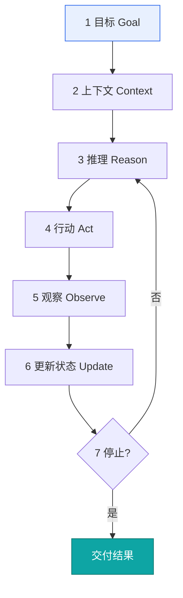

### 09.4 边界比聪明重要

没有停止条件的 Loop，迟早变成本和风险黑洞。

常见停止条件：达标、到最大步数、到成本预算、工具连败、需高风险权限、信息不足。

> **注意**：模型越强，越需要清晰边界。不是换更强模型，是设更紧的边界。

### 09.5 四个典型翻车

| 失败模式   | 表现          | 解法           | 标叔的结论         |
| ------ | ----------- | ------------ | ------------- |
| 目标漂移   | 让修测试，它重构半模块 | 目标写进每轮上下文    | 边界要常驻         |
| 结果不可解析 | 工具返回一大段废话   | 工具输出结构化 JSON | 给 ok/error 字段 |
| 自我验证   | 自己写自己审自己判   | 换独立 Reviewer | 别又当又立         |
| 无成本上限  | 失败工具死循环重试   | 设步数/Token 预算 | 钱会烧穿          |

### 09.6 它不等于自主意识

这点必须说清。

Agent Loop 只是让模型多步执行任务。它能表现"一定的自主性"。

但本质，仍是受目标、上下文、工具、策略约束的运行机制。

别把它想成"活了"。

§09 讲完"发动机"。下一章讲"进化"——认知型 Agent，会监控自己、会学习。

***

## §10 认知型 Agent 会监控自己、会进化

### 10.1 2026 年的"第三次觉醒"

2026 年 5 月。掘金一篇文说 Agent 正经历"第三次觉醒"：

2023 工具调用。2024 Agent 框架。2025 多智能体。

2026，从"工具调用者"变"认知主体"。

### 10.2 认知架构长这样

传统 Agent：接收→理解→选工具→执行→返回。被动。

认知架构：感知→注意→记忆→推理→决策→**反思**→**学习**。主动。

关键在：它有个持续运转的"心智"。

**示意图 16：认知型 Agent 的主动心智循环**

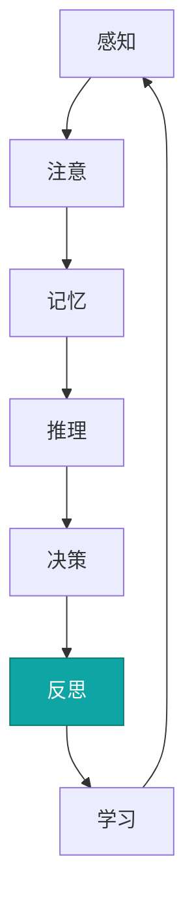

### 10.3 元认知：知道自己不知道

元认知，是"对认知的认知"。

Agent 表现为四件事：

- **置信度估计**：给答案打可靠分。
- **知识边界**：知道自己不懂哪块。
- **错误检测**：发现自个儿推理的漏洞。
- **策略选择**：何时该检索、何时该推理。

```python
# 低置信度就触发检索增强
def answer(query):
    ans = llm.generate(query)
    score = self_check(ans)      # 自评可靠度 0-100
    if score < 50:
        return retrieve_and_regenerate(query)  # 不可靠，去查
    if score < 70:
        return add_disclaimer(ans)             # 中等，加免责
    return ans                                 # 高，直接给
```

**示意图 17：元认知——知道自己不懂**

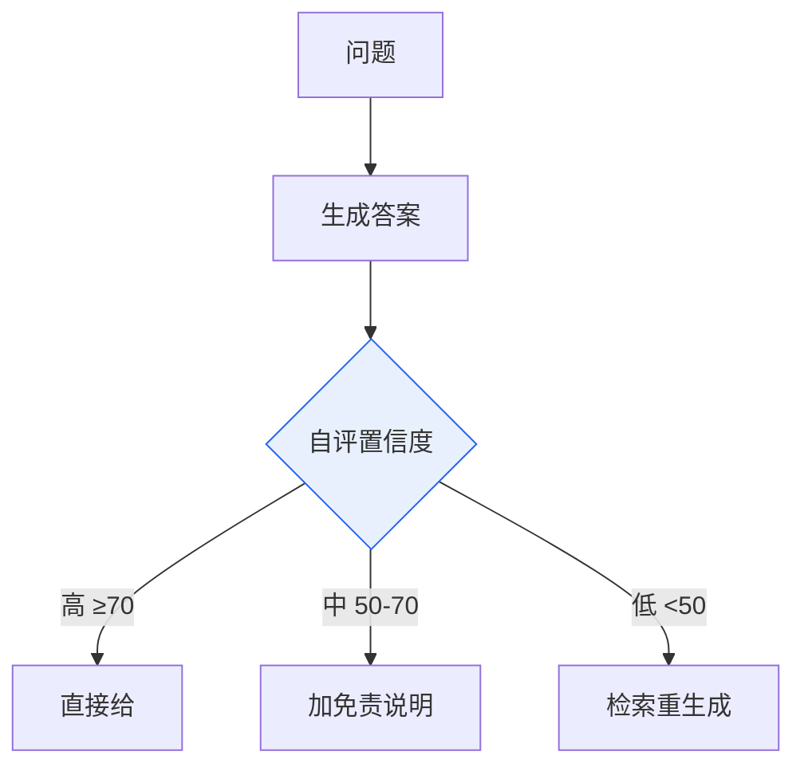

### 10.4 反思：干完复盘

反思（Reflection）是元认知核心。

执行前：计划是啥？预期是啥？
执行中：实际咋样？偏了没？
执行后：哪些对？哪些改？

这让 Agent 从错误里学，越干越对。

### 10.5 价值对齐：给 Agent 装道德罗盘

Agent 越自主，安全越要紧。

Anthropic 提了 Constitutional AI（宪法式 AI）：给 Agent 一列原则。

```
"不执行损害用户数据的操作"
"处理敏感信息要二次确认"
"拒绝非法或不道德请求"
"解释自己的决策过程"
```

每个动作先用原则过一遍。违规就拦下，给替代方案。

### 10.6 它会主动服务

认知 Agent 不止"你问才答"。

谷歌报告举了个例：物流 Agent 下午 3 点标记"配送失败"。

它自动查原因、重约次日最早时段、发 10 美元补偿、短信告知客户。

全程客户没投诉。Agent 主动把事办了。

| 能力 | 传统 Agent | 认知型 Agent | 标叔的结论  |
| -- | -------- | --------- | ------ |
| 响应 | 你问才答     | 主动提醒      | 从被动到主动 |
| 自知 | 无        | 有置信度      | 知道自己不懂 |
| 学习 | 不改       | 反思进化      | 越用越聪明  |
| 安全 | 靠提示词     | 宪法对齐      | 装了道德罗盘 |

§10 讲完"进化"。最后一章，给你能落地的搭建建议。

***

## §11 搭智能体系统的 7 条实战建议

### 11.1 先看谷歌的五大趋势

2026 年 2 月。谷歌发《AI Agent trends 2026》，调研 3466 位决策者。

五个趋势，我翻译成人话：

1. **人人有 Agent**：员工从"下指令"变"表意图"。角色变"智能体团队协调者"。
2. **每工作流有 Agent**：A2A + MCP 打通数据孤岛。
3. **面向客户的 Agent**："礼宾式"服务，接入 CRM、物流，主动解决问题。
4. **管安全的 Agent**：半自主循环，多个安全 Agent 协同分诊响应。
5. **规模化靠人**：技能半衰期缩到 4 年。新角色"智能体协调者"诞生。

### 11.2 谷歌的 AI 学习五支柱

企业要建 AI 就绪团队，五根柱子：

- **明确目标**：定可量的采用目标。
- **获得支持**：高管赞助 + 基层推动 + 技术加速。
- **持续赋能**：游戏化、同行分享、季度奖励。
- **融入工作流**：黑客松、实战挑战日。
- **风险防控**：数据规范、社会工程威胁识别培训。

### 11.3 我的 7 条搭建建议

> **经验**：我按前面十章，压成 7 条。照着做，少走半年弯路。

**第一条：目标写进每轮。** 别只放第一轮。范围、不可做项、验收标准，每轮都喂。

**第二条：工具输出结构化。** 让工具返回 JSON，带 `ok/errorCode/retryable`。别返回自然语言。

**第三条：留完整轨迹。** 记每一步决策、调用、结果、成本。没轨迹，没法调试。

**第四条：设停止条件。** 最大步数、Token 预算、超时、失败停。四样至少给三样。

**第五条：验证要独立。** 写代码归写，审查交给测试或独立 Reviewer Agent。别又当又立。

**第六条：高风险必审批。** 转账、删库、外发，人工门必过。日志全留、可撤销。

**第七条：简单任务别上团队。** 单体能搞定的，别杀鸡用牛刀。超认知阈值才上多智能体。

**示意图 18：搭建智能体系统的 7 条军规**

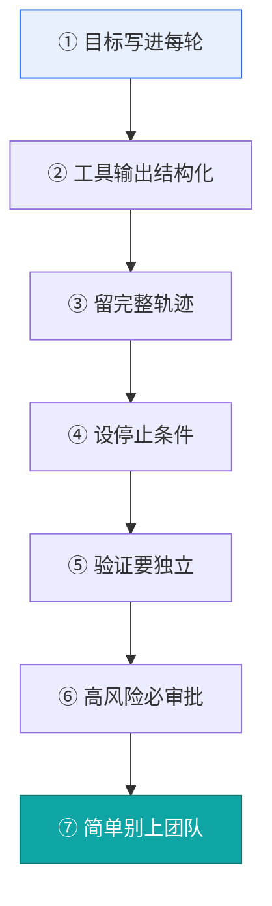

### 11.4 给普通人的上手路径

你不是开发者也没关系。

1. 打开任一 AI 工具（ChatGPT / Claude / 豆包 / 元宝 / DeepSeek）。
2. 输入："我是开咖啡店的小老板，周末想做小红书引流，预算 500。请给方案并列出材料清单。"
3. 感受它怎么从一句话，变一份能落地的计划。
4. 进阶：用 Coze（扣子）/ Dify，零代码接你的日历、邮箱、知识库。

> **核心建议**：第一次别追求复杂。先让 Agent 帮你干一件真事。干成了，你才真正懂它。

***

***

## 进阶篇：Agent 工程深潜（用"六大支柱"重新透视）

入门 11 章让你"懂 Agent"。本篇让你"会造 Agent"。

视角换一下。2026 年 Manus、OpenClaw、Claude Code、LangGraph 天天出新，你追不过来。我建议你改追**底层六大支柱**——产品会过时，支柱不会：

1. **模型机制**：大模型本身怎么算、有什么边界。
2. **Agent Loop**：让 AI 从"能聊"变"能干活"的那个循环。
3. **工具系统**：Function Calling、MCP、Skills，给 Agent 装手脚。
4. **上下文工程**：怎么把对的料，在对的时间，喂给模型（含记忆）。
5. **多智能体**：一个搞不定时，怎么拆、怎么组队。
6. **工程兜底**：评估、安全、容错、部署——决定它能不能上线。

下面七章，对应你给的资料，一章不落。

***

### 进一 认知校准：别追产品，学支柱

#### 01.1 六大支柱：Manus 今天出，OpenClaw 明天出，你学什么

2026 年 5 月，掘金一篇《Agent 六大支柱》说得很直白：当你对 Claude Code 说"帮我把这个 bug 修了"，底层就是 Agent Loop。看懂这个骨架，你会发现 Manus、OpenClaw、CrewAI、LangGraph 形态各异，**底层全在解决同一件事**。

> **核心建议**：别把时间花在"试用每个新玩具"上。把六大支柱练透，新玩具你一天就能看懂。

| 支柱         | 它在解决啥    | 学不会的后果    | 标叔的结论  |
| ---------- | -------- | --------- | ------ |
| 模型机制       | 知道模型能/不能 | 期望错配      | 先懂工具再使 |
| Agent Loop | 自主跑流程    | 只会调 API   | 心脏先搞清  |
| 工具系统       | 动手办成事    | Agent 变嘴炮 | 手脚要装好  |
| 上下文工程      | 喂对的信息    | 越用越傻      | 护城河在这  |
| 多智能体       | 复杂任务分工   | 单体崩盘      | 拆比堆重要  |
| 工程兜底       | 安全可上线    | Demo 翻车   | 决定生死   |

#### 01.2 一个 while 循环：凭什么从"聊天"变"干活"

这是最该刻进脑子的一句话：

> **ChatBot = 一次函数调用。Agent = 一个 while 循环。**

```python
# ChatBot：问一次，答一次，结束
def chatbot(q): return llm(q)

# Agent：给目标，循环到干完
def agent(goal):
    ctx = init(goal)
    while not done(ctx):                 # ← 就多了这个循环
        thought = llm(ctx)               # 想
        action = pick_tool(thought)      # 动手
        result = run(action)             # 看结果
        ctx = update(ctx, result)        # 记下来
    return ctx.answer
```

多出来的不是魔法，是\*\*"想→做→看→记"反复跑\*\*。"能干活"靠的不是模型变聪明，是它有了**不终止、能改、能记**的循环。这就是 §09 讲的 Agentic Loop 的雏形。

#### 01.3 做大模型应用，这些底层机制你躲不掉

表个态：做 Agent 开发，下面几个词你必须真懂，不是背定义。

| 机制       | 人话             | 跟你有什么关系        |
| -------- | -------------- | -------------- |
| Token    | 模型最小计价/计算单位    | 成本、长度、限速都按它算   |
| 上下文窗口    | 模型一次能"看到"的最大字数 | 超了就忘、就崩、就烧钱    |
| 温度/Top-P | 控制"稳"还是"飘"     | 写报告调低，头脑风暴调高   |
| 注意力      | 模型怎么抓重点        | 窗口太长会"丢了中间"    |
| KV Cache | 重复计算的结果缓存      | 省钱提速的关键（进四 04） |

> **注意**：窗口越大≠越聪明。塞太满反而"注意力稀释"，这叫 Context Collapse（进四 04）。

#### 01.4 2026 了，你的架构还停在 LangChain 时代吗

2023 年，LangChain 用"链（Chain）"把步骤串起来，火得不行。但它的问题是：**太重、太隐式、debug 像拆毛线团**。

2025–2026 的共识变了：

- 从"链"到"图"：用显式状态图（LangGraph、小模型自研）表达流转。
- 从"全包"到"Harness"：Claude Code 这类只做"壳"，模型能力交给底座（进六 01）。
- 从"写死"到"协议"：工具接 MCP，Agent 连 A2A/ACP。

> **经验**：新手可以先用框架跑通，但迟早要懂底层。框架是拐杖，不是腿。

***

### 进二 Agent Loop：心脏手术

#### 02.1 你的 Agent 为什么"卡"半天才吐字

你问一句，它三五秒才冒第一个字。不是模型慢，是**流式响应**的工程真相：

模型是**一个 token 一个 token 往外吐**的。首字延迟（TTFT）取决于：系统提示有多长、检索了几轮、工具跑了几秒。后面的字是边生成边推（SSE / WebSocket）。

| 阶段   | 占用时间 | 你能做的              |
| ---- | ---- | ----------------- |
| 拼上下文 | 常最大头 | 压缩系统提示、上缓存（进四 04） |
| 首轮推理 | 中    | 用快模型打初稿           |
| 工具往返 | 看外部  | 设超时、并行调用          |
| 流式输出 | 用户可见 | 已是最优，别优化          |

> **核心建议**：用户觉得"卡"，多半是首包太慢。先砍系统提示和检索轮数，比换模型管用。

#### 02.2 模型 API 挂了怎么办？容错不是加个 try-catch

生产环境，API 一定会挂。新手写：

```python
try:
    r = call_model(prompt)
except:
    r = "出错了"   # ← 这等于把锅甩给用户
```

生产级要做四件事：

1. **重试 + 退避**：失败隔 1s、2s、4s 再试，别瞬间狂轰。
2. **熔断**：某模型连挂，先停用，别拖垮全链路。
3. **降级**：主模型挂，切备用模型（弱一点但活着）。
4. **幂等**：重试不能让"发两次邮件"。

> **经验**：容错的目标不是"不报错"，是"用户无感"。

#### 02.3 死循环、重复犯错、Token 烧穿：三个保险丝

呼应 §09.4 的停止条件，我把它们叫 **Loop 的三道保险丝**：

| 保险丝        | 干什么       | 不装的后果   |
| ---------- | --------- | ------- |
| 步骤上限       | 跑 N 步强制停  | 原地空转一整晚 |
| Token/成本预算 | 超预算即停     | 账单爆炸    |
| 连续失败即停     | 工具连错 K 次停 | 同一个错反复犯 |

```python
for step in range(MAX_STEPS):            # 保险丝① 步骤
    if ctx.cost > BUDGET: break          # 保险丝② 成本
    if ctx.tool_fail_streak >= 3: break  # 保险丝③ 失败
    ...
```

> **注意**：模型越强，越要紧边界。不是换更强模型，是装更牢的保险丝。

***

### 进三 Tool System：给 Agent 装手脚

#### 03.1 Function Calling 与 Structured Output：模型怎么"学会"调函数

呼应 §03.3。补一句底层：模型不是你教它调函数，是**训练时就学会了"输出符合 Schema 的 tool\_use JSON"**。你给工具清单（名字+参数类型），它生成调用；Structured Output（类型化输出，§03.3.1）是把返回也锁死成结构。

两者区别一句话：**Function Calling 管"它想调啥"，Structured Output 管"它返回啥样"**。

#### 03.2 一次工具调用背后，经历了什么（以 Claude Code 为例）

你以为"调个工具"是一瞬间。其实是四步往返：

```text
① 模型输出 tool_use（要调啥、参数）
② Harness 收到，在沙箱里真正执行
③ 执行结果包成 tool_result 返回
④ 模型带着结果进入下一轮推理
```

> **经验**：所谓"Agent 卡"，常卡在 ②③——工具慢、权限弹窗、沙箱起不来。优化工具侧，比优化模型侧见效快。

#### 03.3 工具太多选不准？Deferred Loading 与动态工具集

2026 年 4 月，TianPan 一篇文给了个扎心数据：**工具一多，LLM 选工具的准确率能跌到 13%**。把所有工具 Schema 塞进上下文，既烧钱又选错。

解法三家共认：

- **Deferred Loading（懒加载）**：先只给少数常用工具，用到再加载。
- **动态工具检索**：按用户意图，从几百个工具里检索最相关的 5–10 个塞进去。
- **路由层**：用小模型先做"选工具"这道分类，再交大模型。

| 方案   | 思路   | 标叔的结论    |
| ---- | ---- | -------- |
| 全塞   | 简单但笨 | 工具>20 就崩 |
| 懒加载  | 用到才给 | 大多数场景够   |
| 动态检索 | 按意图挑 | 工具成百上千必上 |

#### 03.4 MCP 的工程真相：协议很好，也有硬伤

§03 把 MCP 吹成 USB-C。补个平衡视角——2026 年 6 月 lonae《MCP 工程实战》从五维扒了硬伤：

| 硬伤    | 表现               | 工程解法                 |
| ----- | ---------------- | -------------------- |
| 传输    | 早期 stdio 难上云、难流式 | 换 Streamable HTTP 传输 |
| 鉴权    | 没有统一 auth 标准     | 网关层补 OAuth           |
| 上下文膨胀 | 工具 Schema 全塞爆窗口  | 懒加载（03.3）            |
| 发现    | 没有原生服务注册         | 中心化 registry         |
| 可观测   | 中间过程黑盒           | 链路追踪补齐               |

> **核心建议**：MCP 是方向，但别神话。接之前先想清：鉴权谁管？流式怎么推？失败了咋办？

#### 03.5 Skills：Agent 时代的知识分发系统

这是 2026 很新的一种形态：**把"某件事的 know-how"打包成可插拔的 Skill**——里面是 prompt、流程、参考文档。Agent 需要时加载，像给人发一本操作手册。

它解决的是：**知识不再写死在系统提示里，而是按需分发**。你给 Agent 装 100 个 Skill，它一次只激活相关的两三个。

> **经验**：Skill 本质是"上下文工程的产物"。它让"知识"从沉重提示，变成轻便、可版本化、可分享的模块。

#### 03.6 你敢让 AI 直接跑 rm -rf 吗？四层防线

呼应 §07 七层安全。落到"执行"这一层，生产级权限要四道：

1. **允许清单**：只允许白名单命令/工具。
2. **沙箱**：在隔离环境跑，炸了不影响宿主。
3. **人工审批**：删库、外发、转账必须人点确认。
4. **审计日志**：做了啥全留痕、可撤销。

> **注意**：永远别给 Agent 一个"全权限 Shell + 你的主账号"。宁可每步问你。

***

### 进四 Context Engineering：真正的护城河（含 Memory）

这一章是 2026 最重要的新认知。**决定 Agent 强不强的，往往不是模型，是你往上下文里塞了什么、怎么塞。**

#### 04.1 全景：五个维度，一张地图

中科算网《上下文工程指南》把上下文从"系统提示"扩成五大类（文本/环境/用户/系统/组织）。落地时，我把它压成**五个工程动作**：

**示意图 19：Context Engineering 五维地图**

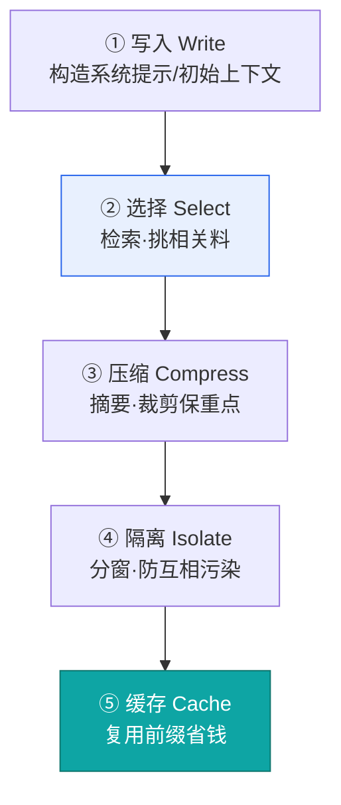

| 维度 | 回答啥问题  | 标叔的结论        |
| -- | ------ | ------------ |
| 写入 | 一开始放啥  | 行为控制系统（04.2） |
| 选择 | 用啥料    | RAG/记忆（04.6） |
| 压缩 | 放不下咋办  | 摘要裁剪（04.3）   |
| 隔离 | 互相干扰咋办 | 分上下文（进五）     |
| 缓存 | 怎么省钱   | 见 04.4       |

#### 04.2 System Prompt 工程化与 Context Rot

从"写一段提示词"升级到"**搭一个行为控制系统**"：系统提示不再是文案，而是角色、边界、输出格式、工具说明、禁忌的集合体，要像代码一样版本管理。

但坑来了——**Context Rot（上下文腐烂）**：系统提示越长，模型越容易"看不见"中间的规则，注意力被稀释。

> **核心建议**：系统提示别写成长篇小说。能外置成 Skill/工具说明的，就别塞进系统提示。

#### 04.3 上下文快爆了？聊聊压缩

呼应 §06.4 的分层摘要。工程上压缩三招：

- **摘要**：旧对话压成要点（保留近期 N 轮原文）。
- **裁剪**：丢掉与本任务无关的早轮。
- **压缩**：用更小模型先提炼再喂大模型。

#### 04.4 Cache 全解与成本控制：别再弄混这几个概念

这是 2026 最容易被混淆的一组。一次讲清：

| 概念               | 它站在哪   | 人话                  |
| ---------------- | ------ | ------------------- |
| KV Cache         | 推理引擎底层 | "这段算过，复用，加速"        |
| Prompt Cache     | 厂商计费层  | "这段我处理过，命中价低至 1/10" |
| Context Collapse | 现象/坑   | "塞太满，反而更笨"          |

崔亮《Prompt Cache》点破关键：**前缀要稳定**。你每轮开头都变，缓存永远不命中。Agent 的 I/O 常是 100:1（读多写少），**Cache-Safe 是客户端工程责任**——把不变的系统提示/工具定义放最前，且别乱插变量。

> **经验**：省成本第一招不是换便宜模型，是**让前缀稳定、复用缓存**。

#### 04.5 深入 Just-In-Time Context：不是越早塞越好

直觉是"把料早早全塞进上下文"。错。**JIT（即时）上下文**主张：用到那一步，才注入那块料。

例子：写代码 Agent，不必一上来把整个代码库塞进去；读到某文件时，才把该文件上下文注入。好处：窗口不爆、相关性强、缓存命中高。

#### 04.6 RAG 全流程与检索优化

呼应 §06.3。补"全流程"：文档 → 切分 → 嵌入 → 建索引 → 检索 → 重排 → 生成。

关键坑：**语义相似 ≠ 任务相关**。检索回来"意思像"的，未必是"该用"的。所以要用 §06.3 的多路召回 + 重排，必要时让模型自己判断相关性。

#### 04.7 LLM 编译知识库：让知识持续积累互联

进阶玩法：别把知识库当静态档案。让 Agent **跑完任务后，自动抽取新知识点、连成图谱、回写库**。知识库越用越聪明，像人做笔记越记越通。

#### 04.8 记忆系统：文件派 vs 数据库派，谁对

| 派别   | 怎么存         | 优点      | 缺点      | 标叔的结论    |
| ---- | ----------- | ------- | ------- | -------- |
| 文件派  | Markdown/文件 | 人可读、好调试 | 检索慢、难规模 | 个人/小项目首选 |
| 数据库派 | 向量/图库       | 快、可海量检索 | 要维护、不直观 | 企业/高并发首选 |

> **经验**：没有标准答案。先看规模与可读性，再选。很多生产系统是"文件做源、库做索引"混合。

#### 04.9 记忆会"坏"：五种失效模式

2026 年 4 月 golangstar 把"记忆覆盖"拆成三种故障；我合上行业经验，补成**五种**：

| 失效       | 表现       | 解法      |
| -------- | -------- | ------- |
| 覆盖丢失     | 新记忆冲掉旧的  | 版本化、不覆盖 |
| 压缩失真     | 摘要丢了关键细节 | 关键字段原样留 |
| 语义漂移     | 记忆被悄悄篡改  | 写时校验+签名 |
| 过时 stale | 记的是旧事实   | 加时间戳+过期 |
| 检索不到     | 存了但找不到   | 多路索引+重排 |

> **注意**：记忆不是"写了就灵"。它和数据库一样，要防脏数据。

***

### 进五 Multi-Agent：一个 Agent 搞不定的事

#### 05.1 拆 Agent 不为"分角色"，为"分上下文"

§04 讲了多智能体团队。补一个更深的视角：你拆多个 Agent，**首要目的不是分工好看，是隔离上下文**。

一个 Agent 塞所有任务，上下文互相污染、越长越傻。拆成多个，每个只装自己那摊，反而都清醒。这跟 04.4 的"隔离"维度一脉相承。

#### 05.2 Agent Swarm：让多个 Agent 像团队一样协作

§04 的团队是**中心化**（一个 Orchestrator 调度）。Swarm 是**去中心化**：Agent 之间自主广播、认领任务，像蜂群。

| 模式    | 调度           | 适用   | 标叔的结论  |
| ----- | ------------ | ---- | ------ |
| 中心化   | Orchestrator | 流程清晰 | 可控、好调试 |
| Swarm | 自主协商         | 开放探索 | 灵活、难控  |

> **经验**：新手先用中心化。Swarm 很酷，但"谁负责"说不清时别上。

***

### 进六 Harness 进阶：编排、观测与部署

#### 06.1 Harness：模型外面那层壳到底是什么

2026 年 5 月，掘金《Harness Engineering》一句话点透：**Claude Code 就是包在 Claude 外面的 agentic harness——它提供工具、上下文管理、执行环境，把语言模型变成能干活的程序员。**

**示意图 20：Agent = Model + Harness**

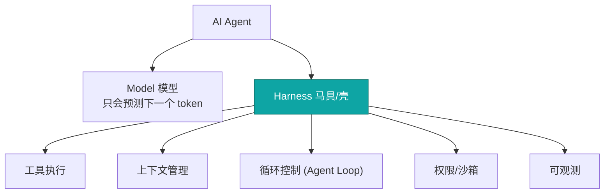

> **核心建议**：模型会越来越强且趋同。决定你产品上限的，是那层把模型"套"好的 Harness。别只盯着换模型。

#### 06.2 Hook 与可观测性：怎么知道 Agent 在干啥

呼应 §08.5。补 **Hook（钩子）**：在"工具调用前/后"插入拦截逻辑。例如：

- pre-tool：调危险命令前弹审批。
- post-tool：每次调用自动写日志、计费。

Hook + 链路追踪，才让你"看得见"Agent。没这层，出事只能猜。

#### 06.3 部署与调度：跑在哪、什么时候跑

呼应 §08。补一句：Agent 不是常驻进程。**调度**决定它何时被唤起（事件触发/定时/人工），**部署**决定跑在云函数还是容器。长任务用异步队列，别占着请求线程。

#### 06.4 ACP：标准化的 Agent 控制接口

协议版图补全（§03.5 讲了 MCP、A2A）：

**示意图 21：三大协议各管一段**

```mermaid
flowchart TD
  A["Agent A"] -->|"MCP 接工具/数据"| T["工具·数据源"]
  A -->|"A2A 找同伴"| B["Agent B"]
  H["宿主/编辑器"] -->|"ACP 控 Agent"| A["Agent A"]
  style A fill:#e8f0fe,stroke:#2563eb
```

- **MCP**：Agent ↔ 工具/数据（USB-C）。
- **A2A**：Agent ↔ Agent（协作）。
- **ACP（Agent Client Protocol）**：宿主/编辑器 ↔ Agent（控制接口），**类比 LSP 当年统一语言服务器**。2025 年 IBM 的 ACP 与 Google 的 A2A 走向合并，生态在收口。

> **经验**：三个协议不打架，各管一段。选型时先问：我要接工具、连同伴、还是被宿主控制？

***

### 进七 回到框架与结课

#### 07.1 LangGraph 实战：用图重新理解 Agent Loop

把 §09 的 Agentic Loop 画成**图**，一眼就懂 LangGraph：

**示意图 22：Agent Loop = 一张状态图**

```mermaid
flowchart TD
  S["START"] --> N1["节点: 推理 Reason"]
  N1 --> N2["节点: 行动 Act"]
  N2 --> N3["节点: 观察 Observe"]
  N3 -->|"未达标"| N1
  N3 -->|"达标"| E["END"]
  style N1 fill:#e8f0fe,stroke:#2563eb
```

- **节点** = 一个步骤（推理/调工具/反思）。
- **边** = 流转条件（达标去哪、失败去哪）。
- **状态** = 全局上下文，在节点间传递。

> **经验**：图比"链"好 debug——哪步卡了，看节点就知道。

#### 07.2 社区框架全景：用六大支柱透视任何框架

不管 LangGraph、CrewAI、AutoGen、OpenClaw……拿六大支柱一照，立刻看出它强在哪、缺在哪：

| 框架        | 强项支柱         | 弱项/注意  |
| --------- | ------------ | ------ |
| LangGraph | Loop/多智能体(图) | 上手陡    |
| CrewAI    | 多智能体角色       | 复杂上下文弱 |
| AutoGen   | 多 Agent 对话   | 可控性需调  |
| OpenClaw  | Harness/工具   | 生态新    |

> **核心建议**：别问"哪个框架最好"。问"我的任务，缺哪根支柱，哪个框架补得上"。

#### 07.3 结课：从 10 行代码到六大支柱

回到 01.2 那段 while 循环——那是 10 行的 Agent。你今天已经走完：

10 行 Loop → 装工具(MCP/Skills) → 喂对上下文(Context Engineering) → 拆多智能体 → 套好 Harness → 上保险丝与可观测 → 投产。

**这就是六大支柱串起来的全程。**

> **最后一句话**：产品会换，支柱不换。把这本的入门 11 章 + 进阶 7 章吃透，2026 之后出的任何新 Agent，你都能一天看明白。

***

### 进八 Agentic AI 六大支柱：一套能落地的架构评审框架

进一讲过「产品会换，支柱不换」。但进一的「六大支柱」（模型机制 / Loop / 工具 / 上下文 / 多智能体 / 工程兜底）是**学习地图**——告诉你该学什么。

这章换一把尺子：**架构评审地图**。当你真要搭一个能上线、能托付的 Agent，拿什么 checklist 照它？2026 年社区（与 Anthropic 长效 Agent / Harness Engineering 同源）沉淀出一套 **Six Essentials of Agentic AI**：Agentic Harness、Unit of Work、Workflows、Memory、Skills、Oversight。

> **核心洞见：模型不是 Agent，系统是。**
> 大多数人一上来死磕模型。但能干活的是那一整套壳：循环、工具、上下文、边界、反馈。模型只是发动机，系统才是车。

这套框架有**两个语境**，都适用同一套六支柱：

- **搭 Agent**：让 AI 自主把活干完（如客服 Agent、数据分析 Agent）。
- **用 Agent 做开发**：把 Agentic AI 当开发工具（如 Claude Code 写代码）。

两件事缺的支柱一模一样。

**示意图 23：六大支柱分层栈**

```mermaid
flowchart TD
  O["Oversight 监督：知道它干得对不对"] --> S["Skills 技能：给它能力"]
  S --> M["Memory 记忆：给它上下文"]
  M --> W["Workflows 工作流：告诉它干什么"]
  W --> U["Unit of Work 工作单元：给它边界"]
  U --> H["Harness 马具：跑起循环"]
  style O fill:#fde68a,stroke:#d97706
  style H fill:#e8f0fe,stroke:#2563eb
```

下面一个一个过。

#### 08.1 Agentic Harness：最被低估的支柱

Harness 是包在模型外的**运行时**：管循环（Plan→Act→Observe→Repeat）、管工具访问与调用、管上下文窗口（缓存+压缩）、管错误恢复与重试。

进二讲了 Loop 心脏，进六讲了 Harness 工程，进四讲了缓存与压缩——**本书记载的全在这根支柱上**。这里补它的「薄弱信号」：

| 薄弱信号         | 说明          | 标叔的结论                 |
| ------------ | ----------- | --------------------- |
| 任务中途丢上下文     | 长任务跑到一半忘了前面 | Harness 没做 compaction |
| 突然撞 token 上限 | 明明没多少活却爆窗   | 上下文管理缺失               |
| 重复调同一工具      | 同样查询打三次     | 缺结果缓存                 |
| 死循环不终止       | 没出口条件       | 缺停止判据                 |

> **经验**：Claude Code 是教科书级 Harness——它管文件/终端/搜索工具、自动压缩上下文、跑 plan-act-observe、还能接 MCP 扩展。想学 Harness，先把它拆一遍。

#### 08.2 Unit of Work：把「聊天」变成「把事办成」

这是书里**之前没单独讲**的一根支柱，也最关键——它区分「聊天机器人」和「能把事办完的系统」。

**工作单元**是给 Agent 一个**有边界、能持久、能收尾**的容器。

**示意图 24：从聊天到工作单元的复杂度光谱**

```mermaid
flowchart LR
  A["聊天会话 起止即对话 上下文临时 活易逝"] --> B["工单/Ticket 跨小时天 状态持久 可恢复可追踪"]
  style A fill:#fee2e2,stroke:#dc2626
  style B fill:#dcfce7,stroke:#16a34a
```

| 维度  | 聊天会话  | 工作单元（Ticket / Job / Task） |
| --- | ----- | ------------------------- |
| 起止  | 随对话结束 | 可跨小时 / 天                  |
| 上下文 | 临时    | 状态持久                      |
| 工作  | 易逝    | 可暂停、可恢复、可追踪、可收尾           |

> **注意**：多数团队从聊天会话起步，但生产系统需要更耐久的容器——项目管理里的工单、队列里的 Job、工作流引擎里的 Task。它给 Agent 一个具体的「做完了」的定义。

**薄弱信号**：Agent 干不了跨会话的活、没法追踪它干了啥、会话一结束活就丢、没有「完成」的概念。

#### 08.3 Workflows & Commands：把最佳实践变成可复现流程

没有工作流，你就指望 LLM 从一个模糊 prompt 里「猜」该干嘛。工作流把团队最佳实践**编码成可复现的自动化**——这是「让 AI 帮个忙」和「跑这个流程」的区别。

**三步模式**：

**示意图 25：Workflow 三步法**

```mermaid
flowchart TD
  T["Trigger 触发 命令/事件/定时"] --> C["Context 注入 相关数据/历史/约束"] --> E["Execute 执行 带目标与边界跑 Loop"]
  style T fill:#e8f0fe,stroke:#2563eb
  style C fill:#e8f0fe,stroke:#2563eb
  style E fill:#e8f0fe,stroke:#2563eb
```

- **Trigger**：命令、事件或定时任务拉起。
- **Context**：工作流先加载相关数据、历史、约束。
- **Execute**：Agentic Loop 在清晰目标与边界下跑。

> **经验**：工作流要可参数化（不同输入）、可组合（一个调另一个）、最好用户也能自建。进六的 Hook、进七的 LangGraph 图，本质都是工作流的不同形态。

**薄弱信号**：每次交互从零开始、同类任务结果不一致、没法标准化常规操作、常规活要写一大段 prompt 才动。

#### 08.4 Memory：会自学、会自治、有边界的记忆

进四讲透了记忆的存储（文件派 vs 数据库派）、五种失效、RAG。这里补生产级记忆的**三个硬指标**：

| 指标                  | 含义                   | 标叔的结论          |
| ------------------- | -------------------- | -------------- |
| Self-Learning 自学    | 从干过的活自动更新，无需人工维护     | 不自学 = 每次从零     |
| Self-Managing 自治    | 自己修剪 / 排序 / 组织，防变成噪声 | 无界记忆 = 噪声      |
| Properly Scoped 有边界 | 不同上下文用不同记忆           | 串味 = 项目 A 污染 B |

**四层作用域**（这是新框架点出的关键分类）：

- **Personal 个人**：单用户偏好与历史。
- **Project 项目**：某件活的专属上下文。
- **Organisation 组织**：团队 / 公司共享知识。
- **Global 全局**：到处用得到的通识。

> **经验**：作用域边界必须强制——否则项目 A 的上下文漏进项目 B，Agent 就开始胡说。进四的「记忆五种失效」里「污染」那条，根因往往就是作用域没划清。

#### 08.5 Skills：可复用、可测试、会进化的能力

进三把 Skills 讲成「Agent 时代的知识分发系统」。这里补它的**工程属性**与**进化闭环**：

**Skills 五属性**：系统级（全组织共享）、版本化（可回滚）、可测试（上线前验）、可组合（技能拼技能）、自改进（用中优化）。

**示意图 26：Skills 持续进化闭环**

```mermaid
flowchart TD
  D["Deploy 上线"] --> O["Observe 观测用法与结果"] --> E["Evaluate 按标准度量"] --> R["Refine 据所学更新"] --> D
  style D fill:#e8f0fe,stroke:#2563eb
  style R fill:#dcfce7,stroke:#16a34a
```

> **类比**：Skills 像包管理器里的包（npm / pip），但在知识层而非代码层——它编码「怎么把 X 干好」，并随用随强。
> **注意**：防 skill bloat——技能太多反而拉低选择质量（呼应进三 TianPan 的「工具过载」：选准率可低至 13%）。

**薄弱信号**：Agent 样样平平、没法沉淀领域专长、改进不被复用、系统用而不强。

#### 08.6 Oversight：让你「敢」把 Agent 放出去

§07 讲了评测与安全，进一讲了反馈闭环。Oversight 是把它们**立为顶层支柱**，并点出它和下面五层是**双向**的。

**三大能力**：

- **Evaluation 评测**：系统判定产出达不达标——不是「跑完没」而是「好不好」。可自动（二遍 LLM 打分、确定性检查、测试套件）可人工（审阅队列、审批闸）。
- **Transparency 透明**：Agent 干了啥、为啥干的完整轨迹（推理、工具调用、用到的上下文、决策）。这不是 debug 日志，是让其他层能改进的审计 trail。
- **Escalation 上报**：Agent 认得出自己不懂，在正确时刻拉人。要点：**不确定时默认上报，而非默认瞎猜。**

**示意图 27：Oversight 的双向反馈电路**

```mermaid
flowchart TD
  OV["Oversight 评测/透明/上报"] -.评测结果改 Skills.-> S["Skills"]
  OV -.轨迹改进 Workflows.-> W["Workflows"]
  OV -.上报暴露 Memory 缺口.-> M["Memory"]
  OV -.质量指标调 Harness.-> H["Harness"]
  OV -.完成质量重定 Done.-> U["Unit of Work"]
  style OV fill:#fde68a,stroke:#d97706
```

> **核心建议**：没有这条电路，§08.4 / §08.5 讲的「自学」「自改进」只是空话—— plumbing 没接上。评测别成瓶颈压垮吞吐；但也别啥都不评，把未知风险全盘接收。

**薄弱信号**：团队说不清 Agent 多久对一次、错误是用户先发现、自改进只停在 PPT、人要么全审（白用 Agent）要么全不审（裸奔）、Agent 从不说「我不确定」。

#### 08.7 怎么用这套框架：评审、新建、选型

**成熟度标尺**（评审每个支柱）：

| 等级             | 含义           |
| -------------- | ------------ |
| Missing 缺失     | 完全没有         |
| Ad hoc 临时      | 有但非正式、不一致、靠手 |
| Defined 已定义    | 刻意设计、接口清晰    |
| Managed 受管     | 有监控、有度量、主动维护 |
| Optimising 自优化 | 带反馈环自我改进     |

> **经验**：不必全到 Optimising 才值钱。但任何支柱落在 **Missing** 都是大洞。先让六项都到 **Defined**——大部分价值在这解锁。

**新建项目起点**：先上 Harness + Unit of Work（地基，两个就能跑出一个有用系统）；重复搭同款上下文时加 Workflows；发现 Agent 在重学已知东西时加 Memory；有领域专长要复用时加 Skills；错的代价（质量 / 信任 / 风险）够大时加 Oversight——实践中多数生产系统都得到这一步。

**评工具 / 平台**：拿六支柱当 checklist。多数工具强在 Harness、弱在其它。差异在它把 Unit of Work / Workflows / Memory / Skills / Oversight 做得如何。

| 用法   | 看什么             | 结论            |
| ---- | --------------- | ------------- |
| 架构评审 | 六支柱成熟度          | 有 Missing 就先补 |
| 新建   | 先 Harness + UoW | 按需往上加         |
| 选型   | 六支柱覆盖度          | 别只看模型         |

#### 08.8 两套「六大支柱」的关系

收个尾，免得你混乱：

- **进一的六大支柱**（模型机制 / Loop / 工具 / 上下文 / 多智能体 / 工程兜底）= **学习地图**：告诉你 2026 该学什么。
- **这章的 Six Essentials**（Harness / Unit of Work / Workflows / Memory / Skills / Oversight）= **架构评审地图**：告诉你上线前照什么查。

两图互补：先按进一学全，再拿这章查生产就绪。

> **最后一句话**：模型会换代，框架不会。把这本的入门 11 章 + 进阶 8 章吃透，你不仅能看懂任何新 Agent，还能一眼评出它「能不能真的上线」。

**知识来源（本章）**：

- **Six Essentials of Agentic AI** 架构评审框架（用户提供补充资料，2026；与 Anthropic 长效 Agent / Harness Engineering 社区同源，核心洞见「模型不是 Agent，系统是」）
- **harness-engineering.ai**《The Complete Guide to Agent Harness: six core components》（2026-03）
- **Anthropic** 长效 AI 智能体设计蓝图：Agent Harness 架构解析（经 agents.ac.cn 解读，2026-03）
- **ai-boost / awesome-harness-engineering**（GitHub，2026-06，Agent Harness 构成性定义）
- 交叉引用：本书 §07、进一 \~ 进七 各章

***

### 进九 循环工程（Loop Engineering）：继提示词、上下文之后的第三门必修课

进一讲「别追产品，学支柱」，进四讲「上下文工程是护城河」，进二/§09 讲「Agentic Loop 是发动机」。这章把这三件事**串成一条线**：2026 年 6 月，AI 编程圈几位大佬几乎同时发声——继提示词工程、上下文工程之后，**循环工程**成了第三门必修课。

> **核心判断：人类的角色，正从每一轮亲自下场的「操作员」，变成设计系统、看系统自己转的「架构师」。**

**示意图 28：三代工程的接力**

```mermaid
flowchart LR
  P["提示词工程 我问什么？ 优化一条指令"] --> C["上下文工程 模型该知道什么？ 优化喂的信息"] --> L["循环工程 工作怎么自主推进？ 优化整个系统"]
  style P fill:#fee2e2,stroke:#dc2626
  style C fill:#fef3c7,stroke:#d97706
  style L fill:#dcfce7,stroke:#16a34a
```

#### 09.1 循环工程到底是什么

一句话定义：**研究如何设计 AI 智能体的工作流——让它从一个触发器出发，围绕一个可验证目标，调用工具与记忆，评估进展，持续迭代，直到满足停止条件。**

三个要点：

- **不是编程专属**。内核是一种看待「重复性、目标导向流程」的方式：系统自己找活、自己干活、自己验活、自己记账、自己决定下一步。运营、研究筛选、客服、内容流水线、个人工作流都用得上。
- **眼下由 AI 编程率先命名**。真正把这套东西构建出来、配齐「原语」的领域是 AI 编程（Claude Code、OpenClaw、Copilot），所以我们从这讲起。
- **它站在 Harness 之上**。循环工程不取代进六的 Harness，而是叠在其上——你不再手动 prompt Agent，转而设计「自动发现、分派、校验、记忆」的自运行系统。

#### 09.2 Addy Osmani 的「循环六积木」

谷歌 Chrome 团队工程负责人 Addy Osmani（addyosmani.com/blog/loop-engineering，2026-06）把像一个样的循环拆成**五大构件 + 第六要素记忆**：

**示意图 29：循环六积木（Addy Osmani 拆法）**

```mermaid
flowchart TD
  A["Automations 自动化 定时触发/自动分诊"] --> W["Worktree 并行隔离 多 Agent 不踩文件"]
  W --> S["Skills 技能 项目知识固化"]
  S --> C["Connectors 连接器 基于 MCP 接外界"]
  C --> SA["Sub-agents 子智能体 干活的/检查的分离"]
  SA --> ST["State 状态/记忆 对话外存活"]
  style ST fill:#fde68a,stroke:#d97706
```

| 积木              | 干什么                       | 标叔的结论                  |
| --------------- | ------------------------- | ---------------------- |
| Automations 自动化 | 按计划自动触发，独立发现+分诊           | 把「单次运行」变「真循环」          |
| Worktree 并行隔离   | 多 Agent 并行不互踩文件           | 像两人不同分支开发              |
| Skills 技能       | 项目知识固化，不用每轮重讲             | 理解变复利（呼应进三）            |
| Connectors 连接器  | 基于 MCP，读 issue/查库/发 Slack | 从「甩代码」到「开好 PR」         |
| Sub-agents 子智能体 | 干活的与检查的分离                 | 自己查自己必瞎（Maker≠Checker） |
| State 状态        | 对话外存活的记忆（md/看板）           | 模型会忘，仓库不会              |

> **经验**：这六块和进八的 Six Essentials 能对上——Automations≈Workflows 触发、Worktree≈并行隔离的 Unit of Work、Skills≈Skills、Connectors≈MCP/工具、Sub-agents≈多智能体、State≈Memory+Unit of Work。两套框架说的是同一件事，只是切角不同。

#### 09.3 一个循环怎么转：五步执行环

剥掉花哨，任何循环都转这五步（也是吴恩达、Osmani 共识）：

**示意图 30：五步执行环**

```mermaid
flowchart TD
  F["1 找活 Find 发现/分诊"] --> A["2 干活 Act Agent 执行"] --> V["3 验活 Verify 独立校验者判"] --> P["4 记账 Persist 状态持久化"] --> D["5 决策 Decide 下一步·重复"]
  D --> F
  style V fill:#fde68a,stroke:#d97706
```

- **找活**：发现/分诊任务，不等人点火。
- **干活**：Agent 完成任务。
- **验活**：**独立的校验者**评判，不是自己给自己打分。
- **记账**：状态持久化在对话之外（文件/看板）。
- **决策**：决定下一步，然后重复。

> **核心原则 Maker ≠ Checker（干活的≠检查的）**：写代码的模型没有立场客观给自己作业打分。让第二个 Agent（常换一个模型）来查，才能揪出第一个「说服自己没问题」的地方。这正好坐实进八 Oversight 的「上报/透明」与 §07 的独立评测。

#### 09.4 吴恩达的三个循环（嵌套）

吴恩达在 The Batch 来信里，给了造 0→1 产品时的三个循环——按时间尺度嵌套，外环套内环：

**示意图 31：吴恩达三环嵌套**

```mermaid
flowchart TD
  L3["外环 外部反馈 数小时~数周 朋友试用/Alpha/A-B 测"] --> L2["中环 开发者反馈 数十分钟~数小时 人审产品·定方向"] --> L1["内环 智能体编程 分钟级 写码·自测·迭代到无 bug"]
  L1 --> L2
  L2 --> L3
  style L1 fill:#dcfce7,stroke:#16a34a
  style L3 fill:#fee2e2,stroke:#dc2626
```

- **内环·智能体编程（分钟级）**：给定规格（+可选 evals），Agent 写码、自测、迭代到无 bug 且合规。吴恩达举例：给女儿做打字 App，Agent 独立干约 1 小时，中途多次自己开浏览器查构建，没找他。
- **中环·开发者反馈（数十分钟\~数小时）**：人审产品、引导 Agent 改进。吴恩达把人的贡献叫\*\*「上下文优势」Context Advantage\*\*——我们远比 AI 懂用户与环境，所以这一步无法被自动化，human-in-the-loop 是刚需。
- **外环·外部反馈（数小时\~数周）**：朋友试用、Alpha、A/B 上生产。数据反哺产品愿景→规格→内环，整个系统转起来。

> **经验**：最慢的那层（外环）往往最重要——它决定「造对的产品」，而非「造出能跑的代码」。随着编程 Agent 提速，工程师开始兼半个产品经理：最难的是塑产品愿景，并在「动手构建」与「拿反馈进化愿景」间平衡。

#### 09.5 Boris Cherny 的五类新角色：人该干什么

Claude Code 之父 Boris Cherny 说「我不再直接 prompt Claude，我在写循环」。他同时提出 AI 时代团队的**五类新角色**：

| 角色             | 干啥     | 谁干      |
| -------------- | ------ | ------- |
| 原型师 Prototyper | 快速试方向  | 人       |
| 构建者 Builder    | 把原型做实  | 人+Agent |
| 清理师 Cleaner    | 修边界/清债 | Agent   |
| 增长师 Grower     | 推上线/获客 | 人       |
| 维护者 Maintainer | 长期运维   | 人+Agent |

> **结论**：人负责**定义方向、把关质量**；循环负责**执行与迭代**。两套观察对上了——这正是 09.1「操作员→架构师」的具体落点。

#### 09.6 落地长什么样：两个真例子

**例子 A：GitHub Issue 自愈闭环**（GitHub Copilot + Actions）

一个需求以 Issue 提出，循环这样转完：

1. **触发**：定时 workflow 自动检测新分配 Issue，启动循环。
2. **意图规范化**：自定义指令+技能+Issue 模板，保证输入天生结构化。
3. **人工闸门后规划**：Plan 模式先出计划，人批之前一行代码不写。
4. **有边界的自主构建**：自动驾驶可连跑多步，但设**连续执行上限**防失控；独立子任务拆给并行子智能体。
5. **持续校验**：CI 门禁（lint/单测/集成/契约）层层把关，技能里写明「每做完一片就地跑检查」。
6. **自动恢复**：CI 挂了、PR 被评论？Agent 当新输入，自动推后续提交。
7. **记忆持久化**：不用单独库——Issue 和 PR 线程本身就是循环的记忆。
8. **完成条件强制执行**：验收清单没勾完，CI 不放行；分支保护让「CI 全绿」成合并硬前提。

**示意图 32：Issue 自愈闭环**

```mermaid
flowchart TD
  T["触发 定时检新 Issue"] --> I["意图规范化+人工闸门"] --> B["有界自主构建+并行子Agent"] --> V["CI 持续校验"] --> R["自动恢复/记忆在 Issue-PR"] --> C["完成条件强制·合并"]
  C -->|新 Issue| T
  style V fill:#fde68a,stroke:#d97706
```

**例子 B：WorldQuant 挖因子循环**（笔者 7 天实验）

把「挖 Alpha 因子」整个交给循环，每小时醒一次：找方向→跑模拟→校验→记笔记→调策略；7 天到期限自动停。

- **找活**：读已提交因子池+上轮笔记，决定这小时挖哪（如「专攻没用过的算子」）。
- **干活**：经 API 连 BRAIN，一小时真跑 20 个模拟、5 个批次。
- **验活（双重）**：平台硬指标（夏普/换手）+ 自相关检查——一个候选夏普 1.71，却因与池内相关性 0.77 超 0.7 红线被拦。**干活与把关不是同一段逻辑。**
- **记账**：每轮写 markdown 笔记（哪些验证、哪些是死胡同+数字），下轮直接读。
- **决策**：基于笔记调策略。第一轮撞三堵墙，各留一条可执行教训；第二轮没在老地方刨土，而是拉全 14 个数据集清单，锁定几乎没碰过的分析师预期数据集（1300+ 字段只用过 2 个）。

> **点睛**：循环工程师的产出**不是某一个因子，而是这个会自己越挖越聪明的系统本身**。一个纯手工研究员「试错—复盘—换赛道」以天/周计，这循环以小时计，且每条死胡同都被记下、不再重踩。

#### 09.7 写在最后：从操作员到架构师

从提示词工程 → 上下文工程 → 循环工程，真正变的是**人类在系统里的位置**：

- 提示词工程：你亲自写每一条指令。
- 上下文工程：你精心喂对信息（进四）。
- 循环工程：你设计系统，然后看它自己转。

> **最后一句话**：循环工程仍年轻，但它正在沉淀一种更普适的心智模型——不只用来写代码，而是用来设计「人与自主智能体之间的一切协作」。把这本入门 11 章 + 进阶 9 章吃透，你下个该问自己的问题就不是「我该怎么 prompt Agent」，而是：**我该给 Agent 写个什么循环？**

**知识来源（本章）**：

- **用户提供公众号文章**《别再给 Agent 写提示词了：三位大佬同时押注「循环工程」》（2026，综合报道）
- **Addy Osmani**《Loop Engineering》（addyosmani.com/blog/loop-engineering，2026-06-07；循环六积木）
- **Andrew Ng**《My 3 Key Loops for Building 0-to-1 Products》（The Batch 来信，2026-06；三环嵌套）
- **Boris Cherny**（Claude Code 之父）「不再 prompt，写循环」+ AI 时代五类新角色（2026）
- 交叉印证（公众号/行业）：51CTO《Loop Engineering 实战指南：Claude Code 之父说"我不再写 Prompt，只写循环"》、kamacoder《Claude Code 作者说"不写Prompt，写Loop"》（2026-06-15）、claudecn《先写刹车再写循环》（2026-07）、掘金/知乎/CSDN 多篇 Loop Engineering 解读

## 附录

### A. 大白话术语表

| 术语                      | 人话解释                                      |
| ----------------------- | ----------------------------------------- |
| AI Agent / 智能体          | 能自主把事办成的 AI，不止会聊                          |
| LLM 大模型                 | Agent 的脑，会预测文字                            |
| 幻觉                      | 模型一本正经编错                                  |
| Function Calling        | Agent 伸手调工具                               |
| MCP                     | 工具接入的 USB-C 标准                            |
| A2A                     | Agent 之间协作的协议                             |
| RAG                     | 先查资料再答，少编                                 |
| ReAct                   | 想-做-看循环，Agent 骨架                          |
| 多智能体 MAS                | 一群 Agent 分工协作                             |
| Agentic Loop            | Agent 的内循环发动机                             |
| 元认知                     | Agent 知道自己懂不懂                             |
| Agentic Commerce        | Agent 在授权内替你花钱                            |
| 六大支柱                    | 模型机制/Loop/工具/上下文/多智能体/工程兜底                |
| Agent Loop              | while 循环：想-做-看反复跑                         |
| Harness（马具）             | 包在模型外的壳：工具/上下文/循环/权限/观测                   |
| Context Engineering     | 系统化地往上下文里"喂对料"                            |
| Context Rot             | 系统提示太长反而被模型忽略                             |
| JIT Context             | 即时上下文：用到才注入，不早塞                           |
| Deferred Loading        | 工具懒加载：用到才给模型                              |
| Skills                  | 把某事的 know-how 打包成可插拔模块                    |
| KV Cache                | 推理底层复用计算结果，加速                             |
| Prompt Cache            | 厂商计费层：命中前缀价格低至 1/10                       |
| Context Collapse        | 上下文塞太满，模型反而更笨                             |
| ACP                     | 宿主↔Agent 的控制接口，类比 LSP                     |
| Agent Swarm             | 去中心化多智能体协作（像蜂群）                           |
| LangGraph               | 用状态图表达 Agent Loop 的框架                     |
| Unit of Work 工作单元       | 给 Agent 边界/持久/可收尾的容器（聊天↔工单）               |
| Workflows 工作流           | 把最佳实践编码成 Trigger→Context→Execute 的可复现流程   |
| Oversight 监督            | 评测+透明+上报，让 Agent 可被托付                     |
| Self-Learning Memory    | 记忆从干过的活自动更新，无需手工维护                        |
| Properly Scoped 有边界     | 记忆按 个人/项目/组织/全局 划作用域                      |
| Escalation 上报           | Agent 不确定时默认拉人，而非瞎猜                       |
| Maturity Scale 成熟度标尺    | Missing→Ad hoc→Defined→Managed→Optimising |
| Loop Engineering 循环工程   | 第三门必修课：设计自主循环，而非写 prompt                  |
| Worktree 并行隔离           | 多 Agent 不同分支开工，互不踩文件                      |
| Sub-agents 子智能体         | 干活的与检查的分离，Maker≠Checker                   |
| Maker≠Checker           | 写代码的不该自己给自己打分                             |
| Context Advantage 上下文优势 | 人比 AI 更懂用户/环境，故 human-in-the-loop 刚需      |
| Automations 自动化         | 定时触发，让循环自己发现/分诊任务                         |

### B. 知识来源（公众号 / 行业，截至 2026-07）

**入门 11 章来源：**

- **CB Insights**《AI Agent 圣经》六大趋势（经 混沌大学公众号解读，2025-10）
- **麦肯锡**《2026 企业级 AI 代理经济报告》（经 腾讯云开发者社区，2026-07）
- **清华大学**清新团队《2026 智能体安全研究报告》（2026-06，经 搜狐/FreeBuf 解读）
- **Anthropic**《Introducing the Model Context Protocol》（2024-11）
- **阿里云开发者**《2026 企业 AI Agent 落地：从 Demo 到生产的四个关键跨越》（2026-05）
- **QubitTool**《Agent Loop 是什么》（2026-07-04）
- **掘金**《AI Agent 的认知架构革命》（2026-05）
- **谷歌**《AI Agent trends 2026》（经 搜狐/九科信息解读，2026-02）
- **机智流 AI Insight**《AI Agent 最新发展论文全面综述（2024-2026）》（2026-05）
- **Manning**《AI Agents in Action, Second Edition》（目录骨架来源）

**进阶篇（工程深潜）新增来源：**

- **掘金**《系统认知 Agent 六大支柱》（2026-05-09，底层骨架视角）
- **kamacoder**《2026 最全 AI Agent 学习路线：六个阶段》（2026-06-16）
- **中科算网·算泥社区**《大模型上下文工程 Context Engineering 指南 2026》（五大类上下文/范式跃迁）
- **斯坦福 ACE** Agentic 上下文工程（生成-反思-策划-执行 闭环，2025）
- **掘金**《从 Claude Code 看 Harness Engineering：2026 年 Agent 工程范式》（2026-05-20）
- **cnblogs**《Agent Client Protocol 全景解析》（2026-03-29，类比 LSP）
- **51CTO**《当 AI Agent 开始互相"打电话"：MCP/A2A/AG-UI/ACP》（2026-07，ACP 与 A2A 合并）
- **lonae**《MCP 工程实战：跑进生产的五维度》（2026-06-11，传输/鉴权/膨胀/发现/可观测）
- **TianPan.co**《工具过载：为什么工具越多大模型越笨》（2026-04-19，选准率低至 13%）
- **walterwang**《工具太多塞不下：Agent 动态工具检索实战》（2026-06-03）
- **崔亮 cuiliang.ai**《Prompt Cache：Agent 成本控制的核心约束》（2026-01-17）
- **人人都是PM**《深入解析 KV Cache，让你的 Agent 更省钱》（2026-07）
- **golangstar**《Agent 的记忆覆盖问题：三种故障模式》（2026-04-02）
- **ai-master.cc**《Agent 记忆系统设计实战：六层持久化与遗忘机制》（2026-06-15）
- **阿里云开发者**《AI Agent 记忆系统：短期到长期技术架构》（2026-02）
- **CSDN**《2026 大模型 Agent 六大核心支柱》（2026-06-21）

**进八（Six Essentials 架构评审框架）新增来源：**

- **Six Essentials of Agentic AI** 架构评审框架（用户提供补充资料，2026；与 Anthropic 长效 Agent / Harness Engineering 社区同源，核心洞见「模型不是 Agent，系统是」）
- **harness-engineering.ai**《The Complete Guide to Agent Harness: six core components》（2026-03）
- **Anthropic** 长效 AI 智能体设计蓝图：Agent Harness 架构解析（经 agents.ac.cn 解读，2026-03）
- **ai-boost / awesome-harness-engineering**（GitHub，2026-06，Agent Harness 构成性定义）

**进九（循环工程 Loop Engineering）新增来源：**

- **用户提供公众号文章**《别再给 Agent 写提示词了：三位大佬同时押注「循环工程」》（2026，综合报道）
- **Addy Osmani**《Loop Engineering》（addyosmani.com/blog/loop-engineering，2026-06-07，循环六积木）
- **Andrew Ng**《My 3 Key Loops for Building 0-to-1 Products》（The Batch 来信，2026-06，三环嵌套）
- **Boris Cherny**（Claude Code 之父）「不再 prompt，写循环」+ AI 时代五类新角色（2026）
- 交叉印证（公众号/行业）：51CTO《Loop Engineering 实战指南》、kamacoder《Claude Code 作者说"不写Prompt，写Loop"》（2026-06-15）、claudecn《先写刹车再写循环》（2026-07）、掘金/知乎/CSDN 多篇 Loop Engineering 解读

### C. 阅读指南

| 时间    | 章节      | 目标                         |
| ----- | ------- | -------------------------- |
| Day 1 | §01-§02 | 搞清 Agent 是啥、靠啥活            |
| Day 2 | §03-§05 | 懂工具、组队、推理                  |
| Day 3 | §06-§08 | 懂记忆、安全、上线                  |
| Day 4 | §09-§11 | 懂内核、认知、搭建                  |
| Day 5 | 进一-进二   | 校准认知、搞懂 Loop 心脏            |
| Day 6 | 进三-进四   | 装手脚、攻上下文护城河                |
| Day 7 | 进五-进七   | 多智能体、Harness、框架与结课         |
| Day 8 | 进八      | 用 Six Essentials 评审框架查生产就绪 |
| Day 9 | 进九      | 循环工程：从写 Prompt 到写循环        |
| 随时    | 附录      | 查术语、查来源                    |

### D. 一页纸总结

> AI Agent = 会想（LLM）+ 会动手（工具/MCP）+ 记得住（记忆/RAG）+ 会规划（ReAct）+ 可托付（评估/安全）的 AI 办事员。
> 2023 元年 → 2024 会推理 → 2025 长记忆长手脚 → 2026 多智能体协作元年。
> 普通人用法：说目标、给工具、设边界。未来：从副驾驶到自主，从单兵到 AI 小队。
> 工程视角（进阶篇）：Agent = 模型 + Harness；强不强看六大支柱（模型/Loop/工具/上下文/多智能体/工程兜底），不在追产品。护城河是 Context Engineering，生死线是工程兜底。

***

*知识更新至 2026 年 7 月。本书为通俗入门读物，技术细节以官方文档与一手论文为准。内容综合自上述公开资料与公众号解读。写作框架参考「标叔-bookwriter」。*

### agent是什么：

<https://waytoagi.feishu.cn/wiki/N1FiwAwOlitdtzktv1scVhiknPf>
<https://mp.weixin.qq.com/s/05Cx3JmimJ6nFpzJshanGQ>
